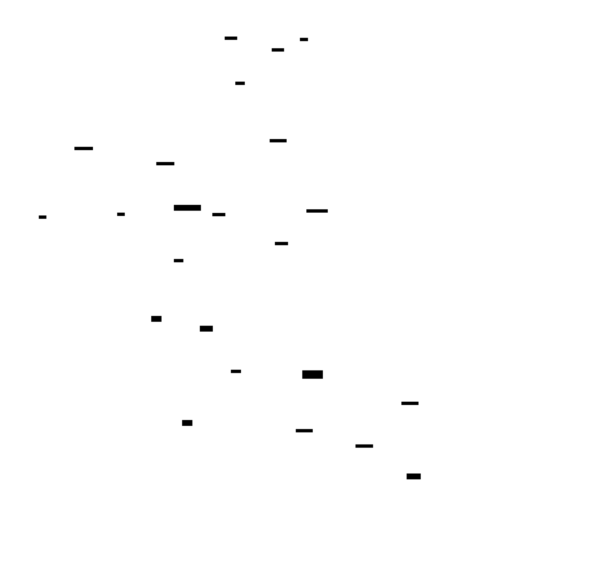

# `/eval-train` — RL Training with Judgment-Based Rewards

## Problem

RL training for LLM agents needs a reward signal. For code tasks (SWE-Bench),
tests pass or fail — the reward is objective. For open-ended tasks (write an RFE,
generate a doc, review code quality), there is no test suite. The output is
subjective — you need a **judge**, not a verifier.

agent-eval-harness provides that judge. `/eval-train` connects it to RL training:
our LLM judges become the reward model (RLAIF), and each eval case becomes a
training environment.

```
Code tasks:       task → agent → tests pass? → reward 0/1
With our judges:  task → agent → LLM judges score quality → reward 0.0-1.0
                                 pairwise: preferred over baseline?
                                 inline checks: structural gates
```

## Ecosystem

Harbor is the **intermediate layer** between the RL training framework and our
judge engine. Three ecosystems use Harbor for rollout generation, and our judges
plug in as the verifier (reward function) in all of them.

### NeMo Gym + Harbor

[NeMo Gym](https://github.com/NVIDIA-NeMo/Gym) is NVIDIA's modular RL
environment framework. It has a built-in
[Harbor agent server](https://github.com/NVIDIA-NeMo/Gym/tree/main/responses_api_agents/harbor_agent)
(`responses_api_agents/harbor_agent`) that wraps Harbor's `Job` API as a NeMo
Gym agent. The architecture:

```
NeMo Gym (rollout orchestration + training)
  → Harbor Agent server (NeMo Gym's harbor_agent)
    → Harbor Job API (creates trial containers)
      → Agent runs in container (claude-code, opencode, custom)
      → Verifier: our judge engine (reward.py → reward.json)   ← we plug in here
    → Returns (trajectory, reward) to NeMo Gym
  → NeMo RL / TRL / Unsloth / VeRL (GRPO / DAPO weight update)
```

Harbor is the agent harness, configured by agent-eval-harness — it manages containers,
the agent zoo, and trajectory capture. NeMo Gym orchestrates rollouts and feeds them
to the training framework. Our judge engine runs inside the trial container as
Harbor's verifier (the `tests/test.sh` → `reward.json` bridge we already built).

NeMo Gym's Harbor agent config (`harbor_agent.yaml`) shows the integration:

```yaml
harbor_agent:
  # Claude Code agent — eval wrapper exists; training wrapper routes through model server
  harbor_agent_name: claude-code
  harbor_environment_import_path: "agent_eval.harbor.kubernetes:KubernetesEnvironment"
  harbor_agent_kwargs:
    collect_rollout_details: true          # captures token IDs for GRPO
    max_turns: 20
  harbor_datasets:
    my_eval:
      local_dataset_path: "path/to/harbor/tasks"   # our generated task packages
```

**What we provide:**
- **Task packages** (from `/eval-dataset`) as `harbor_datasets` entries
- **Verifier** (`reward.py` → `reward.json`) — runs inside each trial container
- **Kubernetes environment** (`kubernetes.py`) — alternative to Singularity for
  OpenShift clusters
- **Judge engine** with LLM judges, pairwise, inline checks — richer reward
  signals than NeMo Gym's built-in verifiers for open-ended tasks

**What NeMo Gym provides:**
- Rollout orchestration (thousands of concurrent environments via Ray)
- Token ID / logprob collection (via `collect_rollout_details`)
- Training framework integration (NeMo RL, TRL, Unsloth, VeRL)
- Model server abstraction (vLLM with multi-endpoint round-robin)

### SkyRL + Harbor

[SkyRL](https://github.com/NovaSky-AI/SkyRL) has its own Harbor
[rollout interface](https://www.harborframework.com/docs/training-workflows/rl)
that uses Harbor's `Job` API directly (not via NeMo Gym). Same pattern — Harbor
is the agent harness, our judges are the verifier:

```
SkyRL (GRPO training)
  → Harbor Job API (rollout generation)
    → Trial containers with our verifier → reward.json
  → SkyRL reads verifier_result.rewards["reward"]
  → Policy gradient update
```

### Harbor native

Harbor's own [RewardKit](https://www.harborframework.com/) supports custom
reward functions. Our `reward.json` bridge is natively compatible — Harbor reads
it without any adapter. Direct `harbor run` without a training framework works
for evaluation and rollout collection.

## Architecture



```
/eval-train --config eval.yaml --base-model Qwen3-8B --iterations 5

┌──────────────────────────────────────────────────────────────┐
│  OpenShift cluster                                           │
│                                                              │
│  ┌────────────────────┐                                      │
│  │  vLLM (KServe)     │  serves current checkpoint           │
│  │  Qwen3-8B          │                                      │
│  └────────┬───────────┘                                      │
│           │ inference API                                    │
│           ▼                                                  │
│  ┌────────────────────────────────────────────────────────┐  │
│  │  NeMo Gym / SkyRL  (rollout orchestration + training)  │  │
│  │                                                        │  │
│  │  For each training step:                               │  │
│  │    NeMo Gym Harbor Agent server                        │  │
│  │    → Harbor Job API → N trial pods in parallel         │  │
│  │    → each trial:                                       │  │
│  │        agent (claude-code/opencode using vLLM)         │  │
│  │        → produces artifacts                            │  │
│  │        verifier (our reward.py → reward.json)          │  │
│  │        → judges score the output                       │  │
│  │    → (trajectory, reward, token_ids) per trial         │  │
│  │    → GRPO / DAPO weight update (NeMo RL / TRL)         │  │
│  │    → new checkpoint → PVC / model registry             │  │
│  └────────────────────────────────────────────────────────┘  │
│                                                              │
│  ┌────────────────────┐                                      │
│  │  Validation pass   │  /eval-run on new checkpoint         │
│  │  (same eval.yaml)  │  mean_reward, regression check       │
│  └────────────────────┘                                      │
└──────────────────────────────────────────────────────────────┘
```

## Reward bridge

`agent_eval/harbor/reward.py` runs our judge engine inside the trial container
as the Harbor verifier. It writes `/logs/verifier/reward.json`:

```json
{
  "reward": 0.875,
  "files_exist": 1.0,
  "rfe_quality": 4.0,
  "revision_quality": 5.0
}
```

This is consumed by all three paths — Harbor reads it natively, SkyRL reads
it via the Harbor rollout interface, and NeMo Gym reads it via Harbor's agent
server. No separate wrapper needed.

Boolean judges (inline checks) gate: any failure → reward 0. Numeric judges
(LLM scores 1-5) normalize to 0-1 and average. The composition policy is
configurable.

## How our pieces plug into NeMo Gym + Harbor

Harbor is the intermediate layer. We provide three things:

```
NeMo Gym harbor_agent.yaml:
  harbor_datasets:
    my_eval:
      local_dataset_path: "..."     ← 1. Our task packages (from /eval-dataset)

  harbor_environment_import_path:   ← 2. Our KubernetesEnvironment (for OpenShift)
    "agent_eval.harbor.kubernetes:KubernetesEnvironment"

  # Inside each trial container:
  tests/test.sh                     ← 3. Our reward bridge (reward.py → reward.json)
```

The same three artifacts we built for `harbor run` work inside NeMo Gym's
Harbor agent with zero additional code. The task packages are self-contained
(instruction + inputs + tool interception + verifier), so NeMo Gym just points
`harbor_datasets` at them.

For token collection (needed for GRPO), NeMo Gym's Harbor agent sets
`collect_rollout_details: true`, which captures `prompt_token_ids`,
`generation_token_ids`, and `logprobs` — handling the gap that SkyRL/Harbor
alone hasn't solved yet.

## What `/eval-train` orchestrates

```
Pseudo-code for the skill's logic

1. Read eval.yaml + training config (base model, iterations, batch size)
2. Generate Harbor task packages from the dataset
3. Deploy base model via KServe (InferenceService CR)
4. Create training Job on OpenShift:
   - NeMo RL / SkyRL / TRL with GPU resources
   - Our judge engine as the verifier (reward bridge or NeMo Gym server)
   - Harbor or NeMo Gym for rollout collection
   - Training config: GRPO/DAPO, learning rate, batch size, rollouts per step
5. Monitor training Job:
   - Report reward curve (mean reward per step)
   - Report training loss
6. On completion:
   - Run /eval-run on the trained checkpoint (validation)
   - Compare to baseline (pairwise, regression thresholds)
   - Report: "mean_reward improved from 0.65 → 0.82 over 5 iterations"
7. Store checkpoint (MLflow model registry or PVC)
```

## Skill vs. model optimization

The two optimization paths are complementary:

```
                    ┌──────────────────────┐
                    │  eval.yaml + dataset │
                    │  + judge engine      │
                    └──────────┬───────────┘
                               │
              ┌────────────────┼────────────────┐
              ▼                                 ▼
     /eval-optimize                       /eval-train
     (skill refinement)                   (model training)
              │                                 │
     LLM reads judge feedback             GRPO / DAPO / DPO
     understands WHY score is low         via NeMo RL / SkyRL / TRL
     edits SKILL.md / prompts             uses reward as signal
              │                                 │
     Works with API models               Works with open models
     (Claude, GPT — can't                (Llama, Qwen, Granite,
      change their weights)               Nemotron — weights you control)
              │                                 │
     Output: better skill                Output: fine-tuned checkpoint
              │                                 │
              └────────────────┬────────────────┘
                               │
                         /eval-run
                    (validate improvement)
```

Both use the same eval.yaml, dataset, and judge engine. The judgment layer is
the through-line.

## What lives where

### In this repo (agent-eval-harness)

| What | Module | Role |
|---|---|---|
| Task packages | `agent_eval/harbor/tasks.py` | Generate Harbor tasks from eval.yaml + dataset |
| Reward bridge | `agent_eval/harbor/reward.py` | Judge engine as Harbor verifier → `reward.json` |
| K8s environment | `agent_eval/harbor/kubernetes.py` | OpenShift trial pods (Python client) |
| Podman environment | `agent_eval/harbor/podman.py` | Local trial containers |
| `harbor_agent.yaml` generator | `agent_eval/harbor/tasks.py` (planned) | Generate NeMo Gym config from eval.yaml |
| Training data generator | `/eval-train --mode generate` (planned) | SFT/DPO datasets from judged rollouts |

### Upstream contributions

| What | Target repo | Status | What's needed |
|---|---|---|---|
| Claude Code NeMo Gym wrapper — **training support** | [NeMo Gym](https://github.com/NVIDIA-NeMo/Gym) `responses_api_agents/claude_code_agent/` | **Eval exists** ([app.py](https://github.com/NVIDIA-NeMo/Gym/tree/main/responses_api_agents/claude_code_agent)); training is the gap | Route LLM calls through NeMo Gym model server (instead of direct Anthropic API), capture token IDs/logprobs for GRPO. Follow the `terminus_2_nemo_gym.py` pattern. |
| OpenCode NeMo Gym wrapper | [NeMo Gym](https://github.com/NVIDIA-NeMo/Gym) `responses_api_agents/` | Not started | Similar to Claude Code wrapper |
| KubernetesEnvironment | [Harbor](https://github.com/laude-institute/harbor) `environments/` | **Built** (`kubernetes.py`), battle-tested on OpenShift | Register in `EnvironmentType` enum + factory |
| PodmanEnvironment | [Harbor](https://github.com/laude-institute/harbor) `environments/` | **Built** (`podman.py`) | Same |

### Exists upstream (no work needed)

| What | Where |
|---|---|
| NeMo Gym Harbor agent server | `NeMo Gym/responses_api_agents/harbor_agent/` |
| NeMo Gym Claude Code agent (eval) | `NeMo Gym/responses_api_agents/claude_code_agent/` |
| SkyRL Harbor rollout interface | SkyRL + Harbor docs |
| Harbor agent zoo (claude-code, opencode, codex, etc.) | Harbor `agents/installed/` |
| NeMo RL GRPO/DAPO training | NeMo RL |
| TRL / Unsloth / VeRL integration | NeMo Gym docs |

## Build status

| Piece | Status |
|---|---|
| Judge → reward.json bridge | **Done** — battle-tested (20-case OpenShift run) |
| Task packages as Harbor tasks | **Done** — self-contained, any agent |
| Harbor rollout generation | **Done** — parallel trials on Podman + Kubernetes |
| `harbor_agent.yaml` generator | **Planned** — derive NeMo Gym config from eval.yaml |
| Claude Code NeMo Gym wrapper (eval) | **Exists upstream** — `claude_code_agent/` in NeMo Gym |
| Claude Code NeMo Gym wrapper (training) | **To contribute** — extend with model server routing + token IDs |
| OpenCode NeMo Gym wrapper | **To contribute** — upstream to NeMo Gym |
| KubernetesEnvironment upstream | **To contribute** — upstream to Harbor |
| Training Job on OpenShift | **To build** — NeMo RL / SkyRL Job manifest |
| vLLM model serving lifecycle | **To build** — KServe InferenceService CR management |
| Training data generator (SFT/DPO) | **Planned** — `/eval-train --mode generate` |
| Training monitoring + reporting | **To build** — reward curve, loss, checkpoint tracking |
| Validation pass (/eval-run) | **Done** — same pipeline, different model endpoint |

## Token collection for GRPO

GRPO needs the actual token IDs from inference to compute policy gradients. This
is handled by the NeMo Gym agent wrapper (not the verifier), which is why the
upstream agent contributions matter:

1. **NeMo Gym path** (recommended) — the agent wrapper routes LLM calls through
   NeMo Gym's model server and sets `collect_rollout_details: true`, which
   captures `prompt_token_ids`, `generation_token_ids`, and `logprobs`. The
   The `terminus_2_nemo_gym.py` wrapper already does this. The Claude Code
   wrapper ([exists for eval](https://github.com/NVIDIA-NeMo/Gym/tree/main/responses_api_agents/claude_code_agent))
   needs extending: currently calls Anthropic API directly; for training it
   must route through the model server (vLLM) instead, following the
   `terminus_2_nemo_gym.py` pattern.
2. **SkyRL path** — token collection is WIP upstream ("working to add flags to
   agents"). Once available, SkyRL reads them from agent metadata.
3. **SFT/DPO** (no token IDs needed) — only `(prompt, response, reward)`
   triples, which our pipeline already produces. Training data generation
   (`/eval-train --mode generate`) covers this without the NeMo Gym wrappers.

## Lighter first step: training data generation

Before the full RL loop, `/eval-train` can generate graded training datasets
that any training pipeline consumes:

```bash
/eval-train --config eval.yaml --model <model> --mode generate \
            --rollouts-per-case 5 --output training-data/

Output:
  training-data/
    sft.jsonl       # prompt + best-rollout response (supervised fine-tuning)
    dpo.jsonl       # prompt + preferred + rejected (from pairwise, for DPO)
    rewards.csv     # (case, rollout, reward) for custom pipelines
    rollouts/       # raw (trajectory, reward.json) per rollout
```

This decouples data generation (our value — judgment-graded rollouts) from
training infrastructure, and doesn't require the NeMo Gym agent wrappers. The
user plugs the dataset into NeMo RL, SkyRL, TRL, Unsloth, or their own pipeline.

## References

- [NeMo Gym](https://github.com/NVIDIA-NeMo/Gym) — modular RL environments
  with [Harbor integration](https://github.com/NVIDIA-NeMo/Gym/tree/main/responses_api_agents/harbor_agent)
  and [34 verifiers](https://algoroxyolo.github.io/blog/2026/nemo-gym-architecture/)
  including 13 LLM-as-judge
- [NeMo RL](https://github.com/nvidia-nemo/rl) — scalable GRPO/DAPO/DPO
  training (trained Nemotron-3)
- [SkyRL](https://github.com/NovaSky-AI/SkyRL) — modular RL with
  [Harbor rollout interface](https://www.harborframework.com/docs/training-workflows/rl)
- [Harbor RL Training Workflows](https://www.harborframework.com/docs/training-workflows/rl)
- [SkyRL-Agent paper](https://arxiv.org/abs/2511.16108) — efficient multi-turn
  RL training
- [NeMo Gym + TRL integration](https://huggingface.co/docs/trl/en/nemo_gym)
- [NeMo Gym architecture deep-dive](https://algoroxyolo.github.io/blog/2026/nemo-gym-architecture/)
- [EvalHub](https://eval-hub.github.io/)
