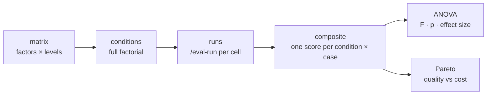

# Analysis of variance (ANOVA)

When you compare agent configurations — different models, thinking-effort levels,
prompts, or tools — the scores always differ a little. **Analysis of variance**
(ANOVA) is how the harness decides whether a difference is a real effect of the
configuration or just the run-to-run noise every LLM produces. You declare the
knobs you want to vary, the harness runs every combination, and ANOVA tests
whether the between-configuration variation is larger than the within-configuration
noise.

This concept underpins [`/eval-anova`](../guides/eval-anova.md). The scores it
runs on come from your [judges](judges.md), collapsed into one number per case
via the [reward composite](reward-api.md).

!!! note "When this applies"
    You only need ANOVA when you're comparing configurations. If you're scoring a
    single skill or model, [`/eval-run`](../guides/eval-run.md) and its report are
    all you need — skip this page.

## Where ANOVA fits

## Factorial design: factors, levels, conditions, replications

- **Factor** — a knob you vary in the experiment (model, effort, prompt, a tool
  toggle). Factors are the keys under `matrix.factors`.
- **Level** — one discrete value of a factor. Levels must be a **non-empty YAML
  list**; a bare scalar is rejected, because `itertools.product` would otherwise
  iterate the string character-by-character and silently build a garbage design.
- **Condition** — one combination of levels, i.e. one cell of the grid. Each gets
  a stable `condition_id` (the first 12 hex of a SHA-256 over its sorted levels).
- **Full factorial** — every combination of every factor's levels (the Cartesian
  product). Testing the *full* grid is what lets ANOVA separate each factor's
  effect (and their interactions) instead of confounding them.
- **Replication** — running the *same* condition on the *same* case more than
  once. Averaging replications shrinks the per-cell stochastic noise. It must be
  an integer ≥ 1.

**Total work = conditions × cases × replications.** A `2 × 2` grid over 5 cases
with 3 replications is 60 runs.

## The metric it runs on: the composite

ANOVA needs exactly one number per (condition, case). That number is the
**composite score** in `[0, 1]`, computed by
[`compose_reward`](https://github.com/opendatahub-io/agent-eval-harness/blob/main/agent_eval/harbor/reward.py)
— the same function the [reward API](reward-api.md) uses. It honors an
`eval.yaml` [`reward:`](../reference/config/reward.md) block if present.

**Numeric judges are normalized** from their own declared `score_range`
`[lo, hi]` via `(v − lo) / (hi − lo)`, clamped to `[0, 1]` (default range
`[1, 5]`) — on either path, so a `reward:` block changes how the normalized
values are combined, not what they are (its `raw` judges and an un-normalized
single `judge` are clamped to `[0, 1]` instead). With no block the default
composition averages them, and:

- **Boolean gates fire first.** Any `false` boolean judge → `0.0` immediately.
- **There is no "non-gate" boolean.** The default path has no pass-fraction
  multiplier: a `true` contributes nothing to the average, a `false` zeros the
  composite. (`agent_eval/anova/composite.py::composite_score` does apply such a
  modifier, but nothing on this path calls it.)
- **A case where nothing scored because a judge errored** — including a value
  rejected by its `score_range` — composites to `0.0`, not `1.0`, which moves
  the cell means ANOVA runs on.

!!! note "A `bool` is an `int` in Python"
    Booleans are a subclass of `int`, so the code deliberately excludes them from
    the numeric average — otherwise a `True` would count as the number `1` in the
    mean. This is why gates and numeric scores are handled on separate paths.

## Repeated-measures vs mixed-effects vs one-way

The harness picks the ANOVA variant automatically from the **effective factors** —
those with at least two observed levels (see
[`agent_eval/anova/stats/anova.py`](https://github.com/opendatahub-io/agent-eval-harness/blob/main/agent_eval/anova/stats/anova.py)):

| Variant | Chosen when | What it does |
| --- | --- | --- |
| **Repeated-measures** (pingouin `rm_anova`) | exactly one effective factor | Blocks on `case_id` so per-case difficulty is removed from the noise term. The standard agent-eval setup. |
| **Mixed-effects** (statsmodels `mixedlm`) | two or more effective factors | Factors + interactions as fixed effects, `case_id` as a random effect; a p-value per factor plus AIC/BIC. |
| **One-way** (scipy `f_oneway`) | cases are **not** reused | Rarely appropriate — the auto-selector never picks it for the reuse-the-cases design. |

**F** is the ratio of between-condition variance to within-condition variance;
**p** is the probability of an F that large if the configuration had no effect.
A result is *significant* when `p < alpha` (default `alpha = 0.05`).

!!! tip "Greenhouse–Geisser correction"
    Repeated-measures ANOVA assumes *sphericity* (equal variances of the
    differences between conditions), which agent evals usually violate. When
    pingouin reports a GG-corrected p-value (`p-GG-corr`), the harness prefers it
    over the uncorrected one (surfaced as `p_uncorrected`).

The analysis also guards against degenerate inputs: no-variance responses
(ceiling effects), non-finite or negative F, and single-level factors are dropped;
if no factor has ≥2 levels or there are fewer than 2 conditions, **the ANOVA is
skipped with a note** — expected for a fully-gated or near-binary composite, not a
bug. Only cases present under *every* condition are analyzed
(`_restrict_to_common_cases`); excluded cases are recorded, and replications are
averaged to one observation per condition × case before the test.

## Cost vs quality: the Pareto frontier

Significance tells you a difference is real; it doesn't tell you it's worth
paying for. The **Pareto frontier**
([`agent_eval/anova/stats/pareto.py`](https://github.com/opendatahub-io/agent-eval-harness/blob/main/agent_eval/anova/stats/pareto.py))
puts every condition on two axes:

- **X — mean USD cost** per condition (lower is better).
- **Y — mean composite** score (higher is better).

A condition is **dominated** if another condition is at least as cheap *and* at
least as good, and strictly better on one axis. The **frontier** is the set of
non-dominated conditions — the ones where you can't improve quality without
paying more, or cut cost without losing quality. The frontier is only computed
when *every* condition has a real cost recorded; otherwise all conditions are
returned unranked.

## Limitations to state plainly

- **Screening, not proof.** A sweep tells you which differences look real on this
  case set; it isn't a causal or generalizable claim.
- **Low power at small N.** Agent evals often run few cases; small samples make it
  hard to detect anything but large effects. More cases/replications help, at
  multiplicative cost.
- **Gated or binary composites break the F-test.** If nearly every score is `0.0`
  or `1.0`, there's no variance to analyze — hence the skip-with-a-note guard.
  Fix the scoring before trusting a result.
- **Sphericity is usually violated** — prefer the GG-corrected p-value.
- **Only common cases are analyzed.** Check the excluded-conditions list in
  `anova.json` before drawing conclusions.
- **Significance ≠ importance.** A tiny, real difference can be statistically
  significant yet practically irrelevant — read the effect size and the Pareto
  frontier alongside the p-value.

## See also

- [**/eval-anova guide**](../guides/eval-anova.md) — run a matrix sweep end to end
- [**Judges & scoring**](judges.md) — the signals that feed the composite
- [**The Reward API**](reward-api.md) — how judges collapse into one `[0, 1]` score
- [**Cookbook: Comparing runs with ANOVA**](../cookbook/anova.md) — a worked recipe

