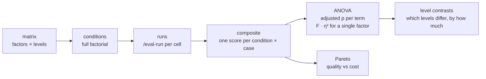

# Analysis of variance (ANOVA)

When you compare agent configurations — different models, thinking-effort levels,
prompts, or tools — the scores always differ a little. **Analysis of variance**
(ANOVA) is how the harness decides whether a difference is a real effect of the
configuration or just the run-to-run noise every LLM produces. You declare the
knobs you want to vary, the harness runs every combination, and ANOVA tests
whether the between-configuration variation is larger than the within-configuration
noise.

This concept underpins [`/eval-anova`](../guides/eval-anova.md). The scores it
runs on come from your [judges](judges.md), collapsed into one number per case
via the [reward composite](reward-api.md).

!!! note "When this applies"
    You only need ANOVA when you're comparing configurations. If you're scoring a
    single skill or model, [`/eval-run`](../guides/eval-run.md) and its report are
    all you need — skip this page.

## Where ANOVA fits

```mermaid
flowchart LR
    M[matrix<br/>factors × levels] --> C[conditions<br/>full factorial]
    C --> R[runs<br/>/eval-run per cell]
    R --> S[composite<br/>one score per condition × case]
    S --> A[ANOVA<br/>adjusted p per term<br/>F · η² for a single factor]
    A --> K[level contrasts<br/>which levels differ, by how much]
    S --> P[Pareto<br/>quality vs cost]
```

The omnibus ANOVA answers *"does this factor matter at all?"*; the level
contrasts that follow it answer *"which levels differ, and by how much?"*; the
Pareto frontier answers *"is the better one worth its cost?"*. Read them in that
order — [When is a difference real?](#when-is-a-difference-real) walks through it.

## Factorial design: factors, levels, conditions, replications

- **Factor** — a knob you vary in the experiment (model, effort, prompt, a tool
  toggle). Factors are the keys under `matrix.factors`.
- **Level** — one discrete value of a factor. Levels must be a **non-empty YAML
  list**; a bare scalar is rejected, because `itertools.product` would otherwise
  iterate the string character-by-character and silently build a garbage design.
- **Condition** — one combination of levels, i.e. one cell of the grid. Each gets
  a stable `condition_id` (the first 12 hex of a SHA-256 over its sorted levels).
- **Full factorial** — every combination of every factor's levels (the Cartesian
  product). Testing the *full* grid is what lets ANOVA separate each factor's
  effect (and their interactions) instead of confounding them.
- **Replication** — running the *same* condition on the *same* case more than
  once. Averaging replications shrinks the per-cell stochastic noise. It must be
  an integer ≥ 1.

**Total work = conditions × cases × replications.** A `2 × 2` grid over 5 cases
with 3 replications is 60 runs.

## The metric it runs on: the composite

ANOVA needs exactly one number per (condition, case). That number is the
**composite score** in `[0, 1]`, computed by
[`compose_reward`](https://github.com/opendatahub-io/agent-eval-harness/blob/main/agent_eval/harbor/reward.py)
— the same function the [reward API](reward-api.md) uses. It honors an
`eval.yaml` [`reward:`](../reference/config/reward.md) block if present.

**Numeric judges are normalized** from their own declared `score_range`
`[lo, hi]` via `(v − lo) / (hi − lo)`, clamped to `[0, 1]` (a judge declaring
none falls back to `reward.score_range`, else `[1, 5]` — see
[Precedence](../reference/config/reward.md#precedence)) — on either path, so a
`reward:` block changes how the normalized values are combined, not what they
are (its `raw` judges and an un-normalized single `judge` are clamped to
`[0, 1]` instead). With no block the default composition averages them, and:

- **Boolean gates fire first.** Any `false` boolean judge → `0.0` immediately.
- **There is no "non-gate" boolean.** The default path has no pass-fraction
  multiplier: a `true` contributes nothing to the average, a `false` zeros the
  composite. (`agent_eval/anova/composite.py::composite_score` does apply such a
  modifier, but nothing on this path calls it.)
- **A case where nothing scored because a judge errored** — including a value
  rejected by its `score_range` — composites to `0.0`, not `1.0`, which moves
  the cell means ANOVA runs on.

!!! note "A `bool` is an `int` in Python"
    Booleans are a subclass of `int`, so the code deliberately excludes them from
    the numeric average — otherwise a `True` would count as the number `1` in the
    mean. This is why gates and numeric scores are handled on separate paths.

## Repeated-measures vs mixed-effects vs one-way

The harness picks the ANOVA variant automatically from the **effective factors** —
those with at least two observed levels (see
[`agent_eval/anova/stats/anova.py`](https://github.com/opendatahub-io/agent-eval-harness/blob/main/agent_eval/anova/stats/anova.py)):

| Variant | Chosen when | What it does |
| --- | --- | --- |
| **Repeated-measures** (pingouin `rm_anova`) | exactly one effective factor | Blocks on `case_id` so per-case difficulty is removed from the noise term. The standard agent-eval setup. |
| **Mixed-effects** (statsmodels `mixedlm`) | two or more effective factors | Factors + interactions as fixed effects, `case_id` as a random effect; one joint Wald test per term (see below) plus AIC/BIC. |
| **One-way** (scipy `f_oneway`) | cases are **not** reused | Rarely appropriate — the auto-selector never picks it for the reuse-the-cases design. |

In the single-factor variants, **F** is the ratio of between-condition variance
to within-condition variance and **p** is the probability of an F that large if
the configuration had no effect; the effect size **η²** (pingouin's `ng2`,
surfaced in `anova.details`) says how much of the variance the factor explains.
The multi-factor mixed model reports **no overall F**: it gives one Wald
p-value per model term instead (next section), so `anova.json` carries scalar
`f_statistic` / `p_value` / `p_adjusted` fields for a single factor and
per-term `p_values` / `p_adjusted` dicts for several. Either way a result is
*significant* when the **adjusted** p is below `alpha` (default `0.05`).

## Per-term Wald tests and multiplicity correction

In the mixed-effects model, a factor with *L* levels is encoded as *L − 1*
dummy coefficients. Each **model term** — every main effect *and* every
interaction — gets one **joint Wald test** over all of its coefficients: the
omnibus question "does this factor matter at all?", not the per-dummy question
"does this level differ from the reference?". (Taking the minimum of the dummy
p-values instead — what the harness did before — is anti-conservative for
factors with more than two levels and is not an omnibus test.)

Testing several terms from one model is a *family* of tests, so their p-values
are corrected for multiple comparisons before any significance call:

- **Holm** (`holm`, the default) — step-down control of the family-wise error
  rate.
- **Benjamini–Hochberg** (`bh`; the statsmodels spelling `fdr_bh` is accepted
  as an alias) — false-discovery-rate control; less conservative, appropriate
  when screening many tests.
- **none** — no correction; significance is judged on raw p-values.

`anova.json` always reports **both** the raw (`p_values`) and adjusted
(`p_adjusted`) values per term, plus `correction` and `family_size`.
`significant` is computed on the adjusted p (on raw when the correction is
`none`). The family counts only real tests: a term whose test is degenerate
(no finite p — e.g. a zero-variance response) is reported as `null`, listed in
`excluded_terms` with a `note`, and never inflates the other terms' adjusted
values — a p-value is never fabricated for a degenerate design. Configure the
method with `matrix.analysis.correction` or the `--correction` flag; precedence
is `--correction` > `matrix.analysis.correction` > `holm`.

The single-factor variants are a family of one, so they carry the same schema
fields (`p_adjusted` equal to `p_value`, `family_size: 1`) purely for
consistency — the correction method makes no difference to them.

!!! question "Choosing a correction: Holm vs BH vs none"
    - **Holm** when the family is a *confirmatory* handful of terms — a
      model × effort grid is three tests (two main effects, one interaction)
      and you intend to act on whichever comes out significant. Holm keeps
      the chance of *any* false positive across them at `alpha`.
    - **BH** when you are *screening* many tests and will follow up the hits
      rather than ship on them — a wide grid with several interactions, or a
      long list of levels. It controls the *fraction* of false discoveries
      instead, so it keeps more power. This is why the
      [per-judge screening](#per-judge-screening-opt-in) below always uses BH.
    - **none** only for exploration, or for a single-factor design — where
      the family is one test and every method returns the same p anyway.

    Re-analysis is free: `--analyze-only --correction bh` recomputes
    `anova.json` from the existing runs without re-executing anything. Both
    reports name the method next to every adjusted value, so a switch is never
    silent.

## Level contrasts (post-hoc)

The omnibus test only says *"this factor matters"*; the **level contrasts** in
`anova.json` (top-level `contrasts.<factor>` blocks) say *which* levels differ
and by how much — e.g. "opus vs sonnet: estimate +0.06, adjusted p = .02". For
every factor with at least two levels, every pair of levels is compared:

- **Estimate** — the composite-scale difference `a − b`, with its standard
  error (`se`). In the mixed model these come from the *already fitted* model
  (no refitting): level-vs-reference is a single fixed-effect coefficient,
  level A vs level B the coefficient difference. Single-factor designs use
  pingouin's paired tests across cases, with the observed paired mean
  differences as estimates.
- **The configured correction, within the factor** — the same
  `matrix.analysis.correction` / `--correction` method the term family uses
  (Holm by default, `bh`, or `none`) is applied to the contrasts too; the
  family is the contrasts *within that factor* (the block's `family` string
  spells it out, with `family_size` counting the real tests), never pooled
  across factors. Raw p-values stay visible alongside the adjusted ones, and
  `significant` is judged on the adjusted value.
- **Reference-cell contrasts when interactions are present** — with
  interactions in the mixed model, a coefficient difference is the level
  contrast *at the other factors' reference levels*, not a marginal mean. The
  block's `contrast_type` field says which kind you are looking at
  (`paired` for the single-factor tests, `marginal` for a mixed model without
  interactions, `reference-cell` with them) and its `note` restates it in
  words, rather than pretending otherwise.
- **No gating, no fabrication** — contrasts are computed regardless of the
  omnibus result; each block carries the factor's `omnibus_p_adjusted` for
  context. A degenerate pair (no finite p — e.g. zero-variance paired
  differences under perfect separation, which would otherwise print as a
  fabricated `p = 0.0`) keeps its estimate but gets `p_adjusted: null`,
  `significant: false`, and a `reason`; a block that could compute no pair at
  all carries a block-level `reason` instead.

Both reports render an A-vs-B table per factor when contrasts exist: the
`/eval-compare` statistics section titles it **Pairwise level contrasts
(post-hoc)**, the eval-anova deep report **Pairwise contrasts (post-hoc)**.
(These contrasts are unrelated to the reserved `pairwise` *judge* that
`/eval-run --baseline` adds — that one compares two runs' outputs case by case.)

!!! tip "Greenhouse–Geisser correction"
    Repeated-measures ANOVA assumes *sphericity* (equal variances of the
    differences between conditions), which agent evals usually violate. When
    pingouin reports a GG-corrected p-value (`p-GG-corr`), the harness prefers it
    over the uncorrected one (surfaced as `p_uncorrected`).

The analysis also guards against degenerate inputs: no-variance responses
(ceiling effects), non-finite or negative F, and single-level factors are dropped;
if no factor has ≥2 levels or there are fewer than 2 conditions, **the ANOVA is
skipped with a note** — expected for a fully-gated or near-binary composite, not a
bug. Only cases present under *every* condition are analyzed
(`_restrict_to_common_cases`); the rest are listed under the top-level
`excluded_cases` key (mirrored as `design.excluded_cases` when non-empty), and
replications are averaged to one observation per condition × case before the
test.

## Per-judge screening (opt-in)

The composite collapses every judge into one number — which answers "did the
configuration matter overall?" but not "*which* judge moved?". With
`matrix.analysis.per_judge: true` or `--per-judge` (either one enables it; the
flag cannot switch a config-enabled screen off), the harness additionally runs
the **same** single/multi-factor ANOVA once per judge, over that judge's own
per-case values: numeric judges as-is, boolean judges coerced to 0/1 so a
pass/fail judge is analyzable as a rate. Verdicts of the reserved `pairwise`
judge and error/None samples produce no observation (never an invented 0).

Mechanically this is a fan-out — one model fit per judge — so it multiplies
the number of tests (judges × terms), and they are corrected as **one
Benjamini–Hochberg family** across all (judge, term) p-values. This is where
FDR genuinely earns its keep: per-judge effects are a screening question
("which judges look affected, at a controlled false discovery rate?"), not a
confirmatory one. **The composite ANOVA is not part of this family** — it keeps
its own (Holm by default) correction and remains the headline result; treat a
significant per-judge row as a lead to investigate, not a finding to report on
its own.

The same honesty rules apply per judge: each judge's design is restricted to
the cases it actually scored under *every* condition, and a judge with a
degenerate design — constant values, fewer than two conditions, fewer than two
fully-crossed cases, or a failed fit — is listed under `per_judge.excluded`
with an explicit reason and contributes nothing to the family (`family_size`
counts only real tests). Raw p-values stay visible next to the adjusted ones
in `anova.json` and in both reports.

It is off by default: every judge adds model fits and report rows, and a
routinely-scanned per-judge table invites cherry-picking the one significant
row. Turn it on when the composite says "significant" and you need to know
where to look.

## Cost vs quality: the Pareto frontier

Significance tells you a difference is real; it doesn't tell you it's worth
paying for. The **Pareto frontier**
([`agent_eval/anova/stats/pareto.py`](https://github.com/opendatahub-io/agent-eval-harness/blob/main/agent_eval/anova/stats/pareto.py))
puts every condition on two axes:

- **X — mean USD cost** per condition (lower is better).
- **Y — mean composite** score (higher is better).

A condition is **dominated** if another condition is at least as cheap *and* at
least as good, and strictly better on one axis. The **frontier** is the set of
non-dominated conditions — the ones where you can't improve quality without
paying more, or cut cost without losing quality. The frontier is only computed
when *every* condition has a real cost recorded; otherwise all conditions are
returned unranked.

## When is a difference real?

A sweep hands you several numbers; this is the order to read them in, and the
question each one settles. The same sequence is what the `/eval-compare`
report's **Statistical Significance** section lays out top to bottom.

1. **The adjusted omnibus p — does the factor matter at all?** Find the term
   in the per-term table (`anova.p_adjusted`, a scalar for a single factor or a
   dict keyed by term — `model`, `context`, `model:context` — for several).
   The verdict (`significant`) is on the adjusted value under the named
   `correction`; the deep report's headline badge shows that number as
   **adj. p**. If an interaction term is significant, read the main effects
   through it — "context helps" may really mean "context helps *this* model".
   A `null` p is a degenerate term, not evidence either way.
2. **The contrasts — which levels, and by how much?** Open
   `contrasts.<factor>.pairs` (the **Pairwise level contrasts (post-hoc)**
   table). The `estimate` is `a − b` on the composite scale, so `+0.31` means
   the first level scored 0.31 higher out of 1. Trust the pair's own adjusted
   p and `significant`, not the omnibus; check `contrast_type` — a
   `reference-cell` contrast only speaks for the other factors' reference
   levels.
3. **The effect size — is it big enough to matter?** For a single factor,
   η² (`ng2`) buckets as small (< 0.06), medium (< 0.14), large (≥ 0.14). For
   a mixed model, read the magnitude off the contrast estimate and the
   per-condition means (`condition_summaries`). A real but tiny difference is
   not a reason to switch.
4. **Cost — is it worth paying for?** The **Cost / quality Pareto frontier**
   table lists the non-dominated conditions. A significantly better condition
   that is *not* on the frontier is being beaten on cost by something nearly
   as good. This is the evidence behind the report's **Best Value** badge.
5. **N — how much should you believe it?** `design.n_cases` ×
   `design.replications` is your sample; `excluded_cases` is what fell out of
   it. A non-significant result at four cases and one replication is "not
   enough data", not "no difference" — the report's **Highly Variable** badge
   is the descriptive version of the same warning. Add replications, or
   cases, before concluding.

Only when steps 1–2 say *real*, step 3 says *material*, and step 4 says
*affordable* does a difference deserve a recommendation. The
[cookbook](../cookbook/anova.md#reading-the-offline-example) walks this
sequence over a committed `anova.json`.

## Limitations to state plainly

- **Screening, not proof.** A sweep tells you which differences look real on this
  case set; it isn't a causal or generalizable claim.
- **Low power at small N.** Agent evals often run few cases; small samples make it
  hard to detect anything but large effects. More cases/replications help, at
  multiplicative cost.
- **Gated or binary composites break the F-test.** If nearly every score is `0.0`
  or `1.0`, there's no variance to analyze — hence the skip-with-a-note guard.
  Fix the scoring before trusting a result.
- **Sphericity is usually violated** — prefer the GG-corrected p-value.
- **Only common cases are analyzed.** Check the top-level `excluded_cases`
  list in `anova.json` (and `per_judge.excluded` when screening) before drawing
  conclusions — nothing lists excluded *conditions*; a condition that produced
  no scored run simply never enters the design.
- **Significance ≠ importance.** A tiny, real difference can be statistically
  significant yet practically irrelevant — read the effect size, the contrast
  estimate, and the Pareto frontier alongside the p-value.
- **Non-significance ≠ equivalence.** A sweep that fails to reject "no
  difference" has not shown the conditions are interchangeable — it has shown
  this sample could not tell them apart.

## See also

- [**/eval-anova guide**](../guides/eval-anova.md) — run a matrix sweep end to end
- [**Judges & scoring**](judges.md) — the signals that feed the composite
- [**The Reward API**](reward-api.md) — how judges collapse into one `[0, 1]` score
- [**Cookbook: Comparing runs with ANOVA**](../cookbook/anova.md) — a worked recipe

