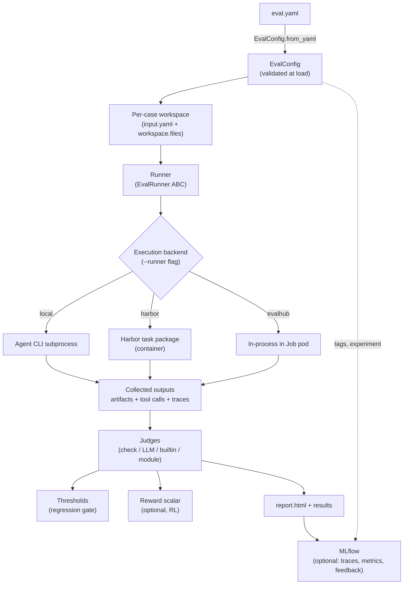

# Architecture overview

The harness turns a single `eval.yaml` into a scored HTML report (and optional
MLflow run). This page follows the data as it flows through the moving parts, then
tours the `agent_eval` Python package so you know where each concept lives.

## The data flow

Everything downstream is driven by one config file. `eval.yaml` is parsed into an
[`EvalConfig`](../reference/python-api.md) and strictly validated at load time, a
[runner](runners.md) invokes the target on an [execution backend](backends.md),
the produced artifacts are collected, [judges](judges.md) score them, and the
results become a report plus optional MLflow tracking.



### Stage by stage

| Stage | What happens | Where it lives |
| --- | --- | --- |
| **Config** | `eval.yaml` → `EvalConfig`; mutually-exclusive keys, enums, and reward formulas fail at load | `agent_eval/config.py` |
| **Prepare** | Isolated workspace per case; `input.yaml` staged, `dataset.workspace.files` copied in, `execution.env` injected | `skills/eval-run/scripts/workspace.py` |
| **Execute** | Runner invokes the skill or prompt headlessly, one call per case (`mode: case`) or one call for all cases (`mode: batch`) | `agent_eval/agent/`, `skills/eval-run/scripts/execute.py` |
| **Collect** | Gather `outputs[].path` artifacts and `outputs[].tool` calls; map them back to cases (via `batch_pattern` in batch mode) | `skills/eval-run/scripts/collect.py` |
| **Score** | Run each judge over the per-case `outputs` record; pairwise/regression as configured | `skills/eval-run/scripts/score.py` |
| **Report** | Per-judge pass rates / means, per-case detail, diffs, cost & token metrics | `skills/eval-run/scripts/report.py` |
| **Track** | Optional: sync dataset, log run params/metrics/artifacts, attach trace feedback | `agent_eval/mlflow/`, `skills/eval-mlflow/` |

!!! tip "Describe *what*, not *where*"
    `eval.yaml` describes **what** to evaluate. The **execution backend** is always
    the `--runner` CLI flag — never a config key — so the identical file runs Local,
    on [Harbor](backends.md), or on [EvalHub](../guides/evalhub.md) unchanged.

## What gets executed vs. how

The harness keeps two dimensions orthogonal — **how many invocations**
(`execution.mode`) and **what to execute** (`execution.skill` or `execution.prompt`,
mutually exclusive). See [the execution model](execution-model.md) for the full grid.

=== "Skill mode"

    ```yaml
    execution:
      mode: case              # one invocation per case
      skill: my-skill         # /my-skill with resolved args
      arguments: "{{ input.prompt }}"
    ```

=== "Prompt mode"

    ```yaml
    execution:
      mode: case
      prompt: "{{ input.prompt }}"   # no skill wrapper
    ```

!!! note "Argument templating"
    `arguments` (and `prompt`) support two auto-detected placeholder styles resolved
    against each case's `input.yaml`: Jinja2 (`{{ input.field }}`, `StrictUndefined`)
    and braces (`{field}` required, `{field?}` optional). See
    `resolve_arguments` in `agent_eval/config.py`.

## The `agent_eval` package

The skills under `skills/` are thin orchestration around the reusable `agent_eval`
Python package. The package is where the harness logic actually lives.

```text
agent_eval/
├── config.py          # eval.yaml → EvalConfig (+ strict validation)
├── state.py           # shared key-value state persistence
├── agent/             # runners: the EvalRunner abstraction
│   ├── base.py        #   EvalRunner ABC + RunResult
│   ├── claude_code.py #   Claude Code CLI runner (claude --print)
│   ├── cli_runner.py  #   opaque CLI runner (command templates)
│   └── stream_capture.py  # stream-json → events, timestamps, usage, hooks
├── harbor/            # containerized execution (task packages, reward bridge,
│                      #   Podman + Kubernetes environments, results parsing)
├── evalhub/           # in-process adapter for the EvalHub platform
├── tools/             # interception.py — PreToolUse interception generation
├── judges/            # builtin judges (auto-discovered by category)
├── prompts/           # builtin generation prompts (synthetic datasets)
├── mlflow/            # experiment setup, dataset sync, trace builder, feedback
└── cli/               # claude-trace standalone tracing CLI
```

Key handoffs between package and skills:

- **`EvalConfig`** is the contract every layer reads. `resolve_skill()` and
  `is_prompt_mode()` decide skill vs. prompt; `eval_name()` derives the run/experiment
  identifier; `resolve_path()` resolves `dataset.path` relative to the config file.
- **`EvalRunner` + `RunResult`** (`agent/base.py`) is the runtime-agnostic seam. The
  `runner.type` discriminator (`claude-code`, `cli`, …) selects the implementation;
  new agent runtimes plug in here. See [Runners](runners.md).
- **`harbor/` and `evalhub/`** are alternative execution substrates behind the same
  config. Harbor emits self-contained container task packages (with the judge engine
  bundled as `reward.json`); EvalHub runs the eval in-process inside a Job pod. See
  [Execution backends](backends.md).

!!! warning "Schema fields are documentation, not a parser spec"
    `dataset.schema` and `outputs[].schema` are natural-language descriptions read by
    LLM agents and judges. The scripts move file *paths* around — there are no
    hardcoded field names, and nothing parses the schema text into a struct.

## The outputs record judges see

Collection produces one `outputs` dict per case, and that is the sole input each judge
receives. It carries collected artifacts (keyed per `outputs[].schema`/`types`),
captured `tool` calls, the `traces` you enabled (`stdout`, `stderr`, `events`,
`metrics`), and the case's `annotations.yaml` under `outputs["annotations"]`. LLM
judges additionally get `{{ conversation }}` and `{{ tool_trace }}` template variables.
See [Judges & scoring](judges.md).

## Where to go next

<div class="grid cards" markdown>

- [**The execution model**](execution-model.md) — the case/batch × skill/prompt grid
- [**Runners**](runners.md) — the `EvalRunner` abstraction and `runner.type`
- [**Execution backends**](backends.md) — Local, Harbor, EvalHub from one config
- [**Datasets & case provenance**](datasets.md) — case anatomy and the three strategies
- [**Judges & scoring**](judges.md) — the four judge types and the outputs record
- [**Regression thresholds**](thresholds.md) — how a run is gated
- [**The Reward API**](reward-api.md) — collapsing judges into an RL scalar
- [**Tool interception**](tool-interception.md) — the PreToolUse hook
- [**Lifecycle hooks**](lifecycle-hooks.md) — before/after all/each pipeline hooks
- [**MLflow tracing**](tracing.md) — hierarchical traces from stream-json
- [**The HTML report**](report.md) — what the generated report shows
- [**The eval.yaml schema**](../reference/eval-yaml.md) — every config key

</div>
