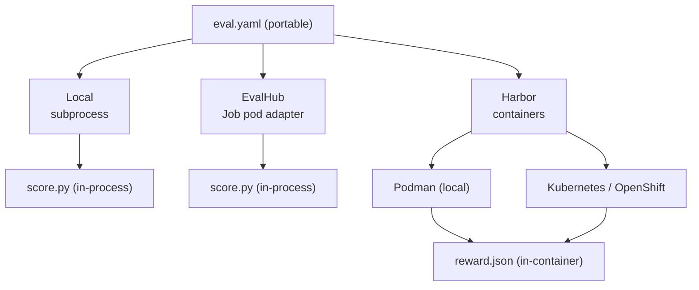

# Execution backends

One `eval.yaml` describes **what** to evaluate; a CLI flag chooses **where** it
runs. The same config runs unchanged across three execution backends — Local,
Harbor, and EvalHub — because the execution substrate is never a config key.

!!! tip "The config is portable by design"
    `eval.yaml` owns the agent type, dataset, judges, thresholds, models, and
    MLflow settings. It does **not** own the runner, the container substrate, the
    image, or credentials. Pick the backend at invocation time.

## The three backends

| Backend | Where cases run | Judging | Invocation |
| --- | --- | --- | --- |
| **Local** | Subprocess on your machine (no containers) | In-process (`score.py`) | `/eval-run` or `agent-eval run --config eval.yaml` |
| **Harbor** | Containers via Podman (local) or Kubernetes/OpenShift | In-container reward bridge (`reward.json`) | `/eval-run --runner harbor` or `harbor run` |
| **EvalHub** | In-process inside a platform-created Job pod | In-process (`score.py`) | Platform-triggered |



!!! warning "The `--runner` flag selects the *backend*, not the agent"
    This name is genuinely confusing. There are two distinct concepts:

    - **`runner.type`** *(in `eval.yaml`)* — the **agent runtime**: `claude-code`,
      `cli`, or `responses-api`. See [Runners](runners.md).
    - **`--runner`** *(CLI flag on `/eval-run`)* — the **execution backend**:
      local (default) or `harbor`.

    So `/eval-run --runner harbor` runs your configured `runner.type` agent
    *inside Harbor containers*. The two settings are orthogonal.

## What each layer owns

The backend is only the execution substrate. Task definition, judgment, and
reporting live in the harness regardless of where cases execute.

| Layer | Owns | Does **not** own |
| --- | --- | --- |
| `eval.yaml` | Agent type, dataset, judges, thresholds, models, MLflow | Backend, environment, image, credentials |
| Task packages | Per-case instruction, inputs, tool interception, verifier | Agent install, environment lifecycle |
| agent-eval-harness | Execution (local + EvalHub), task generation, judgment, reporting, regression | Container substrate, agent zoo |
| Harbor | Containerized trial orchestration, agent zoo, concurrency, trajectory | Judgment, reporting, regression detection |
| Environments (`podman.py`, `kubernetes.py`) | Container/pod lifecycle, exec, file transfer, credentials | Agent behavior, grading |
| EvalHub | Job governance, scheduling, MLflow persistence, OCI export | Execution, judgment |

## How judging stays portable

Judges are defined once in `eval.yaml` and produce the same aggregated shape
regardless of backend. What differs is only *where* the judge engine runs.

=== "Local & EvalHub (in-process)"

    Both call the judge engine directly, in the same process that ran the cases.
    The scoring module (`skills/eval-run/scripts/score.py`) is loaded and its
    `load_judges` / `score_cases` functions produce the per-case and aggregated
    results.

    ```python
    # agent_eval/evalhub/adapter.py — in-process scoring
    judges = mod.load_judges(eval_config)
    result = mod.score_cases(judges, case_dirs, eval_config)
    return result.get("aggregated", {})
    ```

=== "Harbor (in-container reward bridge)"

    Each Harbor task carries the judge engine as its verifier (`reward.py` →
    `reward.json`). Judging happens **in-container**, one reward per case. The
    `--runner harbor` orchestration does **not** re-run judges — it aggregates the
    verifier output into the *same* `summary.yaml` shape the local scorer writes,
    so `report.py`, regression detection, and the MLflow logger consume Harbor
    runs unchanged.

    ```text
    <case-id>/
      task.toml            # image ref + timeouts
      instruction.md       # resolved command + input context
      tests/
        test.sh            # verifier: runs reward.py → reward.json
        eval.yaml          # bundled judges config
      environment/         # input.yaml, tool handlers, hooks
    ```

!!! note "Pairwise is always suite-level"
    Pairwise A/B comparison runs on top of a run dir, not per case — including on
    the Harbor path. It is a separate step over two run directories, never part of
    the in-container verifier.

## Choosing a backend

<div class="grid cards" markdown>

-   :material-laptop: **Local**

    ---

    Fastest inner loop for authoring and iterating. No containers, no cluster.
    The default for `/eval-run`.

    [:octicons-arrow-right-24: eval-run guide](../guides/eval-run.md)

-   :material-ship-wheel: **Harbor**

    ---

    Sandboxed, containerized isolation and the agent zoo (claude-code, opencode,
    codex, …) via Podman or Kubernetes/OpenShift.

    [:octicons-arrow-right-24: Harbor guide](../guides/harbor.md)

-   :material-server-network: **EvalHub**

    ---

    Platform-triggered runs where the adapter executes in-process inside an
    EvalHub Job pod — no sub-pods, no Harbor.

    [:octicons-arrow-right-24: EvalHub guide](../guides/evalhub.md)

</div>

## Related

- [Runners](runners.md) — the `runner.type` agent runtimes (`claude-code`, `cli`, `responses-api`)
- [Architecture](architecture.md) — how the pieces fit together
- [Container images](../reference/container-images.md) — the base and provider images
- [Judges](judges.md) — the judge engine that stays portable across backends
