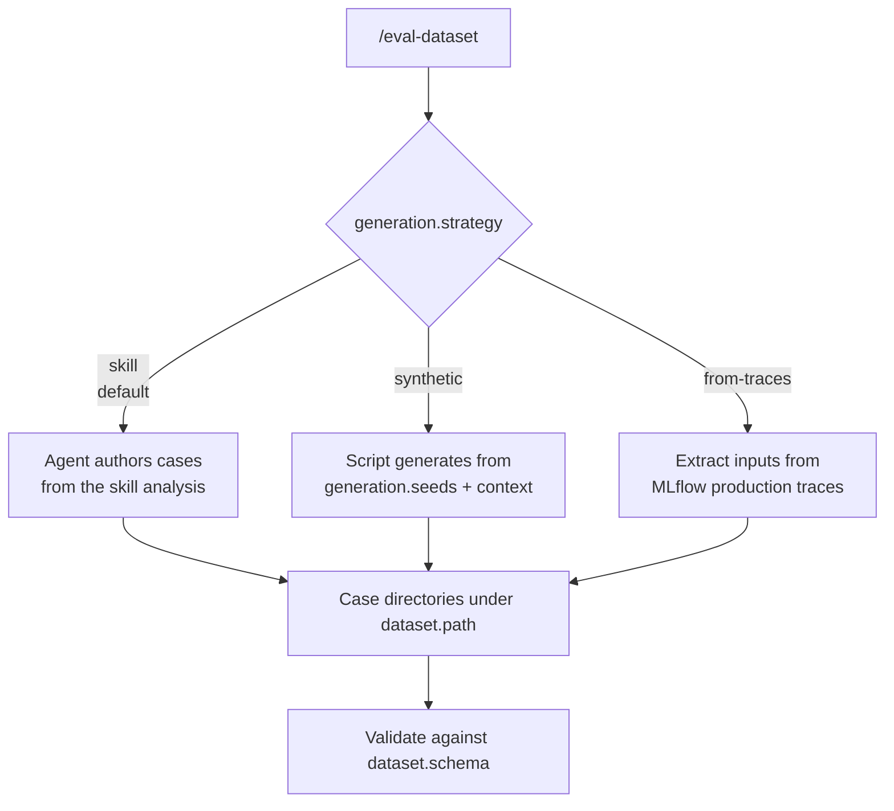

# Datasets & case provenance

A **dataset** is a directory of test cases. Each case is its own subdirectory whose
files describe one input scenario. `/eval-run` reads the dataset, provisions a
workspace per case, executes the agent, and scores what comes out. This page covers
the anatomy of a case, how `dataset.path`/`schema` and `workspace.files` control what
the agent sees, and the three ways cases come into existence.

## Case anatomy

A case directory contains one or more files. Only `input.yaml` is universal; the rest
are optional and only matter when your config uses the feature that reads them.

```text
eval/dataset/cases/
├── case-001-simple/
│   └── input.yaml            # what the agent sees (required)
├── case-002-duplicate/
│   ├── input.yaml
│   ├── annotations.yaml      # metadata for judges (not shown to the agent)
│   └── answers.yaml          # guidance for AskUserQuestion interception
└── case-003-with-companion/
    ├── input.yaml
    └── strategy.md           # companion file the skill reads at runtime
```

| File | Read by | Purpose |
| --- | --- | --- |
| `input.yaml` | The agent under test | The case input. In `case` mode, every `{field}` in `execution.arguments` is resolved from here. |
| `annotations.yaml` | Judges (as `outputs["annotations"]`) | Expected-outcome metadata and tags. **Never shown to the agent** — it is judge-side ground truth. |
| `answers.yaml` | The AskUserQuestion handler (`models.hook`) | Per-case guidance telling the LLM answerer how to resolve clarifying questions. |
| companion files | The skill, from disk at runtime | Extra inputs (`strategy.md`, `adr.md`, …) the skill reads by relative path. |
| reference / gold files | Judges | Optional gold output to compare against. Leave out unless you're confident it's correct. |

!!! warning "`input.yaml` vs `annotations.yaml`"
    Keep them separate on purpose. `input.yaml` is the agent's view of the world;
    `annotations.yaml` is the judge's answer key. Putting expected outcomes in
    `input.yaml` leaks the answer to the agent.

### input.yaml

The only hard requirement. Its fields must satisfy your `dataset.schema` and cover
every placeholder in `execution.arguments`. For example, `arguments: "{prompt}"`
requires an `input.yaml` with a `prompt` field.

```yaml title="input.yaml"
prompt: "Add rate limiting to the public API gateway."
priority: high
```

!!! warning "External-state placeholders"
    Schema fields marked `[EXTERNAL: System]` reference real resources (a Jira
    project, a GitHub repo) that must exist at run time. Generated cases use
    `TODO_<SYSTEM>_<FIELD>` values (e.g. `project_key: "TODO_JIRA_PROJECT_KEY"`).
    **Replace them with real values before running**, or the skill queries nothing
    and fails silently.

### annotations.yaml

Judges receive the parsed contents as `outputs["annotations"]`. Use it for
outcome-aware `check` snippets and for `if` conditions that skip a judge per case.

```yaml title="annotations.yaml"
dedup_is_duplicate: true       # judges compare expected vs. actual outcome
category: navigation           # stamped automatically by synthetic generation
tags: [dedup, high-overlap]
```

!!! tip "Conditional judges need both branches"
    A judge with `if: "annotations.get('dedup_is_duplicate')"` only runs when that
    field is truthy. If every case shares the same value, the judge either always
    runs or never runs — both are coverage gaps. Author cases that exercise each
    branch. See [judges](judges.md).

### answers.yaml

When `inputs.tools` intercepts `AskUserQuestion`, the handler answers using
`models.hook`, reading `input.yaml` and `answers.yaml` for context. Add
`answers.yaml` only when the correct answer depends on the scenario.

```yaml title="answers.yaml"
dedup_is_duplicate: true
dedup_guidance: >
  This RFE is a rephrased version of an existing one about model signature
  verification. If asked whether existing RFEs cover this need, the answer is yes.
```

If omitted, the handler still calls the LLM using `input.yaml` and the handler
prompt, falling back to the first option only if the LLM call fails. See
[tool interception](tool-interception.md).

## Pointing the config at a dataset

The `dataset` block has three keys: `path`, `schema`, and `workspace.files`.

```yaml title="eval.yaml"
dataset:
  path: eval/dataset/cases       # relative (to eval.yaml) or absolute
  schema: |
    Each case has input.yaml with a 'prompt' field and an optional
    'priority'. Cases needing a design doc also include strategy.md.
  workspace:
    files:
      - input.yaml
      - strategy.md
```

!!! note "`schema` is documentation, not a parser"
    `dataset.schema` (like `outputs[].schema`) is natural-language guidance for the
    LLM agents and judges. Scripts operate on file *paths* — there are no hardcoded
    or parsed field names. Describe the case structure plainly and the generation and
    scoring agents interpret it.

### workspace.files

`workspace.files` is a **whitelist** of relative paths inside each case directory to
copy into the agent's isolated workspace. File entries copy the single file;
directory entries copy recursively. Anything not listed stays behind.

!!! warning "Keep the answer key out of the workspace"
    Because `annotations.yaml` is the judge's ground truth, do **not** list it in
    `workspace.files` — that would hand the agent the expected outcome. List only
    the files the agent legitimately needs (`input.yaml` and any companion files).
    When `workspace.files` is empty the harness copies case files per its default
    provisioning; use the whitelist when you need precise control.

See the [dataset config reference](../reference/config/dataset.md) for the full field
list.

## Case provenance: the three strategies

`/eval-dataset` sources cases according to `generation.strategy`. Provenance lives in
the config, **not a CLI flag** — there is no `--strategy`. Whether a run creates a
fresh starter set or augments an existing one is derived from the current dataset
state (empty/thin → fresh; populated → gap-fillers).



| Strategy | Source of cases | `--count` | Extra config |
| --- | --- | --- | --- |
| `skill` *(default)* | Agent authors from the skill analysis (eval.md + judges) | Yes (default 5) | none |
| `synthetic` | Script generates from `generation.seeds` + `context` | Ignored — counts come from each seed's `count` | `generation.seeds`, `generation.context` |
| `from-traces` | Extracted from real MLflow production traces | Yes | MLflow must be configured |

!!! note "Load-time validation"
    `generation.seeds` are valid **only** with `strategy: synthetic`; using them with
    any other strategy fails at load. `synthetic` with an empty `seeds` list also
    fails. An absent `generation` block normalizes to `strategy: skill`.

=== "skill (default)"

    The agent designs a coverage-oriented set from the skill analysis: a simple
    case, a complex one, an edge case, plus one per judge-driven requirement. No
    `generation` block is required.

    ```yaml
    # no generation block needed — strategy defaults to "skill"
    ```

    ```bash
    /eval-dataset --count 8
    ```

=== "synthetic"

    A script synthesizes cases from **seeds**. Each seed names a `category`, a
    `count`, and exactly one prompt discriminator — `builtin`, `prompt_file`, or
    inline `prompt` (mirroring judges). `context` is repository knowledge injected
    into every prompt.

    ```yaml
    generation:
      strategy: synthetic
      context:
        documentation_structure: { entry_point: CLAUDE.md, areas: [...] }
        constraints: [...]
      seeds:
        - category: navigation
          builtin: docs/navigation          # from agent_eval/prompts/
          count: 10
        - category: internal-apis
          prompt_file: ./eval/prompts/internal-api.md   # relative to eval.yaml
          count: 8
        - category: adhoc
          prompt: |                          # inline, no separate file
            Generate a case where the agent must reject a request that
            violates a documented constraint.
          count: 3
    ```

    ```bash
    /eval-dataset            # --count is ignored; resize via seed counts
    ```

    Resize a synthetic dataset by editing seed `count` values, not with `--count`.
    See [builtin prompts](../reference/builtin-prompts.md) and the
    [generation reference](../reference/config/generation.md).

=== "from-traces"

    Real inputs are extracted from MLflow traces, then shaped into case directories
    matching `dataset.schema`. Requires MLflow to be configured; if no traces are
    found the skill falls back to `skill` authoring.

    ```yaml
    generation:
      strategy: from-traces
    ```

    ```bash
    /eval-dataset --count 10
    ```

### annotations.category is derived, never declared

For `synthetic` generation, each seed's `category` is stamped onto every case it
produces as `annotations.category`. The dataset's category list therefore *emerges*
from the cases — you never maintain a separate list. Judges can branch on it with
`if: "annotations.get('category') == 'navigation'"`.

## Where to go next

<div class="grid cards" markdown>

-   :material-database-plus: **Generate a dataset**

    ---

    The `/eval-dataset` workflow: bootstrap, augment, or extract from traces.

    [:octicons-arrow-right-24: eval-dataset guide](../guides/eval-dataset.md)

-   :material-cog: **generation config**

    ---

    Every field of the `generation` block, with validation rules.

    [:octicons-arrow-right-24: generation reference](../reference/config/generation.md)

-   :material-gavel: **Judges read annotations**

    ---

    How judges consume `outputs["annotations"]` and skip via `if`.

    [:octicons-arrow-right-24: Judges](judges.md)

-   :material-file-tree: **dataset config**

    ---

    `path`, `schema`, and `workspace.files` in full.

    [:octicons-arrow-right-24: dataset reference](../reference/config/dataset.md)

</div>
