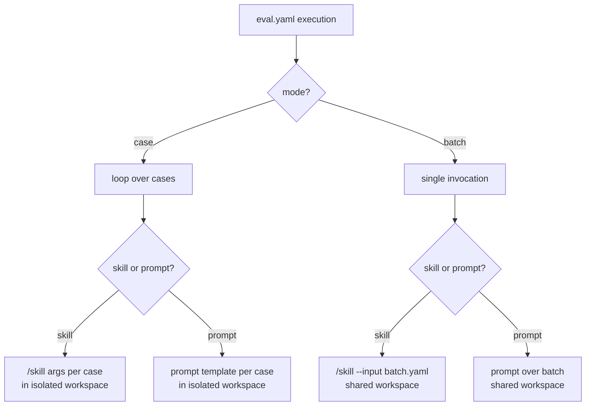

# The execution model

The harness separates **how many invocations** to make from **what to invoke**.
Those are two independent axes — `execution.mode` (`case` vs `batch`) and what you
put in the `execution` block (`skill` vs `prompt`) — and every combination is valid.

## The 2×2

`execution.mode` decides invocation count; `execution.skill`/`execution.prompt`
(mutually exclusive) decides what runs.

| | `execution.skill` (skill mode) | `execution.prompt` (prompt mode) |
| --- | --- | --- |
| **`mode: case`** (default) | One `/skill …` call per case, args resolved per case | One prompt per case, template resolved per case |
| **`mode: batch`** | One `/skill --input batch.yaml` call for *all* cases | One prompt for all cases (uncommon) |

!!! note "Two orthogonal choices"
    Mode and skill/prompt are independent. `skill` and `prompt` are the ones that
    are mutually exclusive — setting both fails at config load. See
    [skill vs prompt](../guides/skill-vs-prompt.md) for choosing between them and
    [config/execution](../reference/config/execution.md) for the full field list.



## Case mode — isolated workspaces

In `case` mode the harness loops over every case directory under `dataset.path`
and gives each its own throwaway workspace under
`/tmp/agent-eval/<run-id>/cases/<case-id>/`. Each workspace gets:

- the case's `input.yaml` (and `answers.yaml`, plus any `dataset.workspace.files`),
- symlinks to project resources (`scripts`, `skills`, `.context`, `CLAUDE.md`, …),
- freshly-generated output directories from the `outputs` block,
- a per-workspace `.claude/settings.json` (permissions, hooks, injected env),
- an initialized git repo so [lifecycle hooks](lifecycle-hooks.md) and `collect`
  can diff for in-place edits.

Because workspaces are separate, cases can run concurrently — see
[parallelism](#guardrails-per-invocation) below.

!!! tip "Prompt mode against the real repo"
    Set `runner.workspace_mode: repo` (prompt mode only) to run the agent **in the
    repository itself** instead of an isolated copy — the agent navigates your real
    `docs/`, `pkg/`, etc., while all I/O still goes to the case workspace. The
    harness write-protects the repo (deny rules on `Write`/`Edit`/mutating `git`)
    and verifies with `git status` that nothing changed. This mode forces
    sequential execution.

## Batch mode — one shared workspace

In `batch` mode the harness builds a single `batch.yaml` containing every case's
input content (list inputs are flattened into one flat list), plus a
`case_order.yaml` recording which entries belong to which case. The skill is
invoked once and is expected to loop internally:

```yaml title="eval.yaml"
execution:
  mode: batch
  skill: rfe.speedrun
  arguments: "--input batch.yaml --headless"
```

!!! warning "`dataset.workspace.files` is per-case"
    Batch mode uses one shared workspace, so `dataset.workspace.files` is ignored
    (with a warning). If cases need distinct provisioned files, use `mode: case`.
    Mapping batch output files back to cases is done with
    [`outputs[].batch_pattern`](../reference/config/outputs.md).

## Arguments templating

`execution.arguments` (skill mode) and `execution.prompt` (prompt mode) are
templates resolved against each case's `input.yaml`. Two placeholder styles are
**auto-detected** — the presence of `{{` or `{%` switches to Jinja2:

=== "Jinja2 (`{{ … }}`)"

    Rendered with the case data bound to `input`, using **`StrictUndefined`** — a
    missing field raises an error rather than rendering empty. For genuinely
    optional fields, be explicit:

    ```yaml
    execution:
      arguments: >-
        --priority {{ input.priority }}
        {{ input.get('label', '') }}
        "{{ input.prompt }}"
    ```

    Use `{{ input.get('x', '') }}` or the `| default('')` filter for optional fields.

=== "Brace (`{field}`)"

    Simple regex substitution: `{field}` is **required** (errors if absent),
    `{field?}` is **optional** (omitted if absent):

    ```yaml
    execution:
      arguments: '--priority {priority} {label?} "{prompt}"'
    ```

!!! warning "Don't mix the two styles"
    A single `{{` anywhere in the template routes the *entire* string through
    Jinja2, so bare `{field}` braces in the same template won't be substituted.
    Pick one style per template.

### The `{prompt}`-from-batch special case

In batch mode, a literal `{prompt}` in `arguments` is a special case: before the
skill runs, the harness reads the **first** entry of `batch.yaml` and substitutes
its `prompt` value. This lets a batch skill receive a representative prompt in its
argument line while still consuming the full `batch.yaml` file itself.

## Guardrails (per-invocation)

Three guardrails bound each invocation. In `case` mode "per-invocation" means
**per case**; in `batch` mode it means the single batch run.

| Config key | CLI override | Default | Meaning |
| --- | --- | --- | --- |
| `execution.timeout` | `--timeout` | `3600` (s) | Subprocess wall-clock timeout |
| `execution.max_budget_usd` | `--max-budget` | `100.0` | Cost cap per invocation |
| `execution.parallelism` | `--parallelism` | `1` (sequential) | Concurrent cases (case mode only) |

Precedence is **CLI flag → config → built-in default**, resolved with explicit
`None` checks so a deliberate `0` is preserved (e.g. `--timeout 0` or
`max_budget_usd: 0` are honored, not replaced by the default).

!!! note "Parallelism specifics"
    Parallelism only applies in `case` mode and is capped at the number of cases
    (`min(parallelism, len(cases))`). `runner.workspace_mode: repo` (in-repo)
    forces `parallelism=1` — all cases share one repo root, so concurrent writes
    would corrupt state.

## Environment injection

`execution.env` injects environment variables into each workspace's
`.claude/settings.json` `env` block, making them available to both the skill and
its [hooks](lifecycle-hooks.md). Values beginning with `$` are resolved from the
caller's environment; missing vars are silently omitted; literal values pass
through unchanged.

```yaml title="eval.yaml"
execution:
  env:
    JIRA_TOKEN: $JIRA_TOKEN        # resolved from the caller's environment
    JIRA_BASE_URL: https://issues.example.com   # literal passthrough
```

!!! tip "`execution.env` vs `runner.env`"
    `execution.env` lands in the *workspace* settings (visible to the skill and
    hooks). [`runner.env`](../reference/config/runner.md) instead adds variables
    to the runner subprocess itself. Both accept `$VAR` references.

## See also

<div class="grid cards" markdown>

- [**execution reference**](../reference/config/execution.md) — every field, enum, and default
- [**skill vs prompt**](../guides/skill-vs-prompt.md) — choosing what to invoke
- [**Runners**](runners.md) — the agent runtime behind an invocation
- [**Datasets**](datasets.md) — how cases and `input.yaml` are structured
- [**Lifecycle hooks**](lifecycle-hooks.md) — before/after all/each phases

</div>
