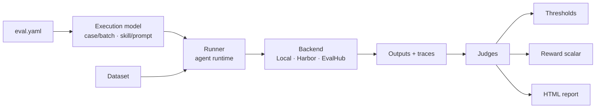

# Concepts

The harness turns a single `eval.yaml` into a scored, traced evaluation run. These
pages explain the moving parts behind that — how a config becomes an execution, how
outputs get scored, and how the same file runs unchanged across backends.

!!! tip "New here?"
    If you just want to run something, start with [your first eval](../get-started/first-eval.md)
    and come back when you hit a concept you want to understand in depth.

## The shape of a run

## In this section

- [**Architecture overview**](architecture.md) — The moving parts: config, runner, backend, judges, MLflow.
- [**The execution model**](execution-model.md) — `case`/`batch` × `skill`/`prompt`: how many invocations, and what to run.
- [**Runners**](runners.md) — The `EvalRunner` abstraction: `claude-code`, `cli`, `responses-api`.
- [**Execution backends**](backends.md) — One `eval.yaml`, three execution paths: Local, Harbor, EvalHub.
- [**Datasets & provenance**](datasets.md) — Case anatomy and the `skill` / `synthetic` / `from-traces` strategies.
- [**Judges & scoring**](judges.md) — The four judge types and the `outputs` record they see.
- [**Pairwise & sampling**](pairwise-and-sampling.md) — A/B run comparison and statistical judge stability.
- [**Regression thresholds**](thresholds.md) — How `min_mean` / `min_pass_rate` / `min_win_rate` gate a run.
- [**The Reward API**](reward-api.md) — Collapsing judges into a single `[0, 1]` scalar for GRPO.
- [**Tool interception**](tool-interception.md) — The `PreToolUse` hook and 3-tier AskUserQuestion answering.
- [**Lifecycle hooks**](lifecycle-hooks.md) — `before`/`after` `all`/`each` pipeline hooks (distinct from tool interception).
- [**MLflow tracing**](tracing.md) — Building hierarchical traces from stream-json.
- [**The HTML report**](report.md) — The generated report and its rendering features.

!!! note "Where things are documented"
    Concepts explain *how* and *why*. For the exhaustive list of keys and their valid
    values, see the [eval.yaml reference](../reference/eval-yaml.md).
