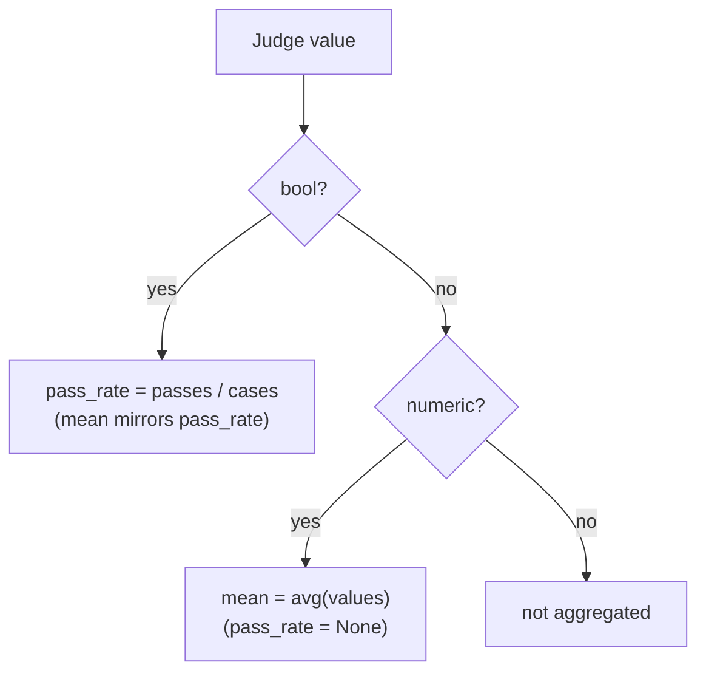

# Judges & scoring

A **judge** turns a case's collected outputs into a score. Each case is loaded into a
single `outputs` record, then every judge in `judges:` runs against it. Judges are
deterministic (Python) or stochastic (LLM), boolean or numeric — and the harness
aggregates them into per-judge pass rates and means for the report and
[thresholds](thresholds.md).

## The four judge types

The type is **inferred from which field you set** — there is no `type:` key. When more
than one could apply, the harness resolves in this priority order (see
[`load_judges`](https://github.com/opendatahub-io/agent-eval-harness/blob/main/skills/eval-run/scripts/score.py)):

| Priority | Type | Field(s) set | Runs | Value |
| --- | --- | --- | --- | --- |
| 1 | **builtin** | `builtin` | Registered judge from `agent_eval/judges/` | Python judge: whatever it returns · LLM judge (`.md`): boolean |
| 2 | **inline check** | `check` | A Python snippet, in-process | `(bool \| number, rationale)` |
| 3 | **LLM** | `prompt` / `prompt_file` / `llm_rubric` | An Anthropic model call | numeric `1–5` (default) or boolean |
| 4 | **external code** | `module` + `function` | An imported Python callable | whatever it returns |

!!! warning "`builtin` is mutually exclusive"
    Setting `builtin` alongside `check`, `prompt`, `prompt_file`, `module`, or
    `function` raises a load-time error. The other types are distinguished purely by
    which field is present, so don't set more than one.

=== "builtin"

    ```yaml
    judges:
      - name: budget_check
        builtin: cost_budget          # or "category/name", e.g. docs/consulted_docs
        arguments:
          max_cost_usd: 5.0
    ```

    Builtins ship with the harness and need no inline code. Reference them by flat
    name or `category/name`. See [builtin judges](../reference/builtin-judges.md).

=== "inline check"

    ```yaml
    judges:
      - name: has_content
        check: |
          content = outputs["main_content"]
          if len(content.strip()) < 100:
              return False, f"Output too short ({len(content.strip())} chars)"
          return True, f"Output has {len(content.strip())} chars"
    ```

    The snippet is compiled into a function receiving `outputs` and `arguments`. Return
    a `(value, rationale)` tuple — `value` may be a `bool` or a number.

=== "LLM"

    ```yaml
    judges:
      - name: output_quality
        prompt: |
          Compare the generated output against the reference. Consider
          completeness, clarity, accuracy. Score 1-5 where 5 is excellent.
    ```

    `prompt` is a full Jinja2 template; `prompt_file` loads one from disk;
    `llm_rubric` is sugar for a one-line criterion (it auto-appends
    `{{ conversation }}` if you don't). Priority when several are set:
    `llm_rubric` > `prompt` > `prompt_file`.

=== "external code"

    ```yaml
    judges:
      - name: schema_valid
        module: eval.judges.schema_checks
        function: check_schema
    ```

    Imports `function` from `module` (resolved against the project root) and calls it
    with `outputs=` (plus any `arguments` as kwargs). Use for validation too complex
    for an inline `check`.

## What judges receive: the `outputs` record

Every judge is called with a single `outputs` dict, assembled per case by
`load_case_record`. It reads *all* files from your configured output dirs — no schema
parsing, so key names come straight from disk. Commonly available keys:

| Key | Contents |
| --- | --- |
| `files` | `{relative_path: text}` for every artifact file (binary files become a `{_binary, path, name}` marker) |
| `<dir>_content` / `<dir>_file` | First file's text / path for each `outputs[].path` dir (e.g. `artifacts_content`) |
| `tool_calls` | Captured tool calls for each `outputs[].tool` pattern (`{name, input}`) |
| `annotations` | Parsed `annotations.yaml` from the case's dataset dir |
| `inputs` | Formatted `input.yaml` fields |
| `conversation` | Root-level assistant text extracted from events |
| `events` | Parsed structured event stream (when `traces.events`) |
| `modified_files` | In-place file edits collected during the run |
| `exit_code`, `duration_s`, `token_usage`, `cost_usd`, `num_turns` | Execution metrics (when `traces.metrics`) |
| `stdout`, `stderr` | Logs (when `traces.stdout` / `traces.stderr`) |
| `hook_outputs` | Values emitted by `before_each` hooks |

!!! tip "LLM judge template variables"
    Inside a `prompt`/`prompt_file`/`llm_rubric` template you also get convenience
    variables rendered from the record: `{{ outputs }}` (formatted file listing),
    `{{ conversation }}`, `{{ tool_trace }}` (chronological tool calls),
    `{{ inputs }}`, `{{ annotations }}`, `{{ evidence }}` (verifiable tool-call
    summary), and `{{ arguments }}`. Use `{{ tool_trace }}` to judge *behaviour*
    (navigation, tool usage) and `{{ conversation }}` to judge the *response*.

## Boolean vs numeric values

A judge's value is either a boolean (pass/fail) or a number (a score). This drives both
how the LLM is prompted and how results aggregate.



For **LLM judges** the shape is set by `feedback_type`:

| `feedback_type` | Tool the judge is forced to call | Value |
| --- | --- | --- |
| *(omitted)* | `submit_score` | integer `1–5` (numeric) |
| `bool` | `submit_evaluation` | `passed` (boolean) |

Builtin `.md` LLM judges are always boolean. Inline `check` and external judges decide
their own return type — the aggregator infers boolean vs numeric from the values it
actually sees across cases.

!!! note "Numeric range and the report"
    `score_range: [min, max]` sets the scale used to colour report cells (and available
    to any consumer that normalizes the value). If omitted, LLM judges default to
    `[1, 5]` and other numeric judges to `[0, 1]`. This is independent of
    `reward.score_range` — see the [reward API](reward-api.md).

## Aggregation: `pass_rate` vs `mean`

For each judge the harness collects the values across all scored cases and computes:

- **Boolean judges** → `pass_rate` = fraction of `True` values (and `mean` mirrors it).
- **Numeric judges** → `mean` = average of the values (`pass_rate` is `None`).

These feed regression [thresholds](thresholds.md): `min_pass_rate` gates boolean
judges, `min_mean` gates numeric ones (and `min_win_rate` gates the
[pairwise](pairwise-and-sampling.md) judge). Cases skipped by a condition, or that
errored, contribute no value and are excluded from both aggregates.

## Judge arguments

`arguments:` is a mapping that parameterizes a judge, passed differently per type:

- **Python judges** (builtin-python, `check`, external) — spread as `**kwargs` into the
  function.
- **LLM judges** — exposed as `{{ arguments }}` in the template.

```yaml
judges:
  - name: budget_check
    builtin: cost_budget
    arguments:
      max_cost_usd: 5.0        # → cost_budget(outputs, max_cost_usd=5.0)
```

## Conditional judges (`if:`)

`if:` skips a judge for cases where its Python expression is false. The expression is
evaluated with `annotations` and `outputs` in scope (no builtins). Skipped cases are
recorded as skipped and **excluded from `pass_rate`/`mean`** — they don't count as
failures.

```yaml
judges:
  - name: output_quality
    if: "not annotations.get('skip_quality', False)"
    prompt: "Score the output 1-5 for completeness, clarity, and accuracy."
```

!!! note "Annotations come from the dataset"
    `annotations` is the per-case `annotations.yaml` in the dataset directory. See
    [datasets](datasets.md) for how cases carry metadata.

## Judge model resolution

LLM and pairwise judges resolve their model with this precedence (first non-empty wins):

```text
per-judge  model:   →   models.judge   →   EVAL_JUDGE_MODEL env
```

If none resolves, an LLM judge fails loudly at load rather than defaulting silently.

```yaml
models:
  judge: claude-opus-4-6      # default for all LLM/pairwise judges

judges:
  - name: strict_review
    prompt: "..."
    model: claude-sonnet-4-6  # overrides models.judge for this judge only
```

!!! tip "Sampling stochastic judges"
    Only LLM judges are stochastic. Set `samples: N` (or `--samples N` on the CLI) to
    run a judge N times per case and reduce — median for numeric, majority vote for
    boolean — surfacing stability in the report. See
    [pairwise & sampling](pairwise-and-sampling.md).

## See also

<div class="grid cards" markdown>

- [**judges config reference**](../reference/config/judges.md) — every field, exhaustively
- [**builtin judges**](../reference/builtin-judges.md) — the shipped library
- [**thresholds**](thresholds.md) — turn scores into regression gates
- [**pairwise & sampling**](pairwise-and-sampling.md) — A/B comparison and repeated judging
- [**reward API**](reward-api.md) — collapse judges into one RL scalar

</div>
