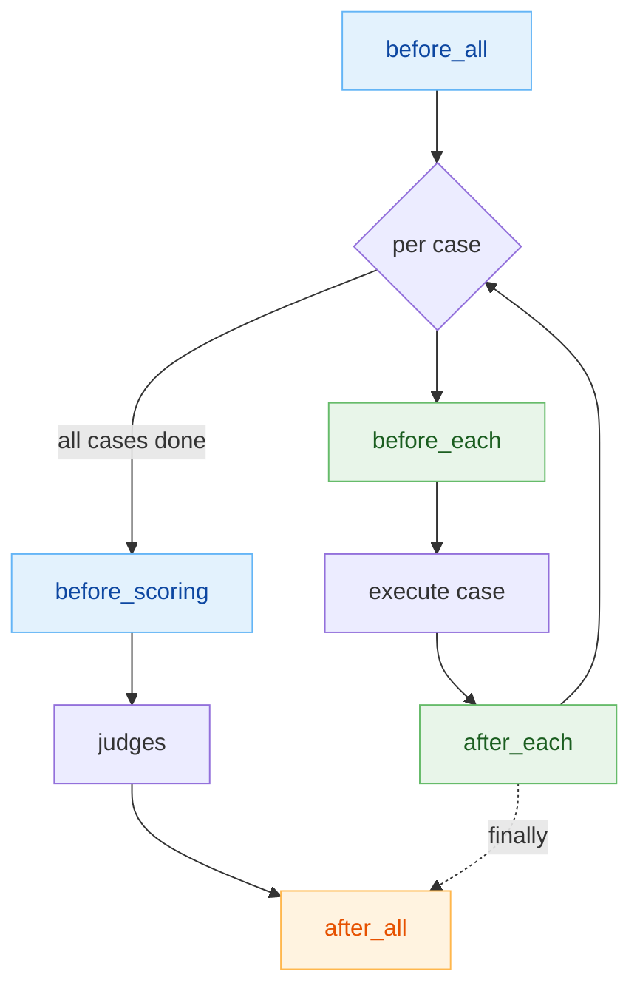

# Lifecycle hooks

Lifecycle hooks are user-defined **shell commands** that run at fixed points in the
eval pipeline — to provision fixtures, seed a database, mint a token, snapshot state,
or clean up. They are configured under the top-level `hooks:` key in `eval.yaml`.

!!! warning "Two different things are called 'hooks'"
    This page is about **pipeline lifecycle hooks** (`hooks:` in `eval.yaml`) — shell
    commands the harness runs around execution and scoring. They are **not** the same
    as the Claude Code `PreToolUse` **tool-interception hook**, which intercepts the
    agent's tool calls *during* a run to answer questions or stub external systems.
    That mechanism is configured under `inputs.tools:` and covered in
    [tool interception](tool-interception.md). If you're trying to fake a Jira API or
    auto-answer an `AskUserQuestion`, you want tool interception, not this page.

## The five phases

| Phase | Runs | Working directory | Guaranteed? |
| --- | --- | --- | --- |
| `before_all` | Once, before any case/batch executes | project root | No — a failure aborts the run |
| `before_each` | Before every case (case/prompt mode only) | case workspace | No — a failure aborts that case |
| `after_each` | After every case (case/prompt mode only) | case workspace | **Yes** — `finally`, even on error |
| `before_scoring` | Once, before judges run (in `score.py`) | project root | No — a failure aborts scoring |
| `after_all` | Once, after all cases complete | project root | **Yes** — `finally`, even on error |



!!! note "try/finally guarantees"
    `after_each` and `after_all` are executed from a `finally` block, so they run even
    if `before_each`, the agent, or the skill under test raises. Internally they use
    `run_hooks_safe`, which forces `on_failure: continue` — a cleanup hook can fail
    without masking the original error or aborting the rest of the run. The "before"
    phases use the strict `run_hooks`, which raises on failure when `on_failure: fail`.

## Configuration

Each phase is a list of hook entries. Only `command` is required.

```yaml title="eval.yaml"
hooks:
  before_all:
    - command: "python scripts/seed_db.py"
      description: "Seed the shared test database"
      timeout: 300           # seconds; positive integer, default 120
  before_each:
    - command: "./scripts/mint-token.sh"
      condition: "test -n \"$JIRA_HOST\""   # bash; run only when exit 0
  after_each:
    - command: "./scripts/reset-fixtures.sh"
      on_failure: continue   # never abort on cleanup failure
  before_scoring:
    - command: "python scripts/precompute_metrics.py"
  after_all:
    - command: "python scripts/teardown.py"
```

### Hook entry fields

| Field | Type | Default | Meaning |
| --- | --- | --- | --- |
| `command` | string | `""` | Shell command, run via `bash -c` |
| `timeout` | int (>0) | `120` | Wall-clock seconds; on timeout the process group is `SIGTERM`ed then `SIGKILL`ed and the hook counts as failed |
| `description` | string | `""` | Label shown in logs (falls back to the first 60 chars of `command`) |
| `on_failure` | `fail` \| `continue` | `fail` | `fail` aborts the phase; `continue` logs and proceeds. Both are validated at config load |
| `condition` | string | `""` | Bash guard (30 s timeout). Exit `0` → run the hook; anything else → `SKIP` |

Hooks in a phase run **sequentially** in list order.

## Environment variables

Every hook receives the caller's environment plus harness-injected variables:

| Variable | Scope | Value |
| --- | --- | --- |
| `AGENT_EVAL_WORKSPACE` | all | Workspace root |
| `AGENT_EVAL_RUN_ID` | all | Run identifier |
| `AGENT_EVAL_CONFIG` | all | Absolute path to `eval.yaml` |
| `AGENT_EVAL_PROJECT_ROOT` | all | Project root (the harness `cwd`) |
| `AGENT_EVAL_MODEL` | all | Skill/agent model for the run |
| `CASE_ID` | per-case | Current case id |
| `CASE_WORKSPACE` | per-case | Absolute path to the case workspace |
| `CASE_SOURCE_DIR` | per-case | Case source dir under `dataset.path` |
| `CASE_INPUT` | per-case | Absolute path to the case `input.yaml` |

The four `CASE_*` variables are only set for `before_each` / `after_each`.

## Hook outputs → runners and judges

A hook can hand data back to the harness by writing a `.hook-outputs.yaml` (or
`.hook-outputs.json`) file **in its working directory**. The harness reads it, then
deletes it. Two keys are recognized:

=== "env → the agent under test"

    Values under `env:` are merged into the environment of the skill/agent invocation
    (`extra_env`). A `before_all` hook sets globals; a `before_each` hook sets per-case
    values that **override** the globals for that case.

    ```bash title="scripts/mint-token.sh"
    TOKEN=$(curl -s "$JIRA_HOST/token")
    cat > "$CASE_WORKSPACE/.hook-outputs.yaml" <<EOF
    env:
      JIRA_TOKEN: "$TOKEN"
    EOF
    ```

=== "data → judges"

    Values under `data:` are persisted to `hook_outputs.yaml` in the run output and
    surfaced to judges as `outputs["hook_outputs"]`, so a check or LLM judge can score
    against values a hook computed.

    ```python title="a check judge"
    def check(outputs):
        expected = outputs["hook_outputs"].get("expected_count")
        actual = len(outputs.get("items", []))
        return actual == expected, f"{actual} vs {expected}"
    ```

## Gotchas

!!! warning "Per-case hooks are ignored in batch mode"
    `before_each` and `after_each` only fire in **case** (and prompt) mode, where the
    harness loops over cases. In `execution.mode: batch` there is a single invocation,
    so per-case hooks make no sense — configuring them raises a warning at config load:

    ```text
    hooks.before_each, after_each ignored in batch mode
    (per-case hooks only run in case/prompt mode)
    ```

    Use `before_all` / `after_all` for batch setup and teardown.

!!! warning "In-repo mode skips per-case hooks too"
    When cases run in-repo (agent executes in the repository root rather than an
    isolated workspace), `before_each` / `after_each` are **not** run. `before_all`,
    `before_scoring`, and `after_all` still fire.

!!! note "Where the logs go"
    Each hook writes a log file to `<run-dir>/hooks/`, named
    `<phase>[.<case_id>].<index>.log`. The console shows a one-line status per hook
    (`OK`, `FAIL (exit N)`, `TIMEOUT (Ns)`, or `SKIP (condition)`).

## Related

<div class="grid cards" markdown>

- :material-hook: **Tool interception** — the *other* hook, for faking tool calls mid-run: [tool interception](tool-interception.md)
- :material-book-open-variant: **Full field reference** — every `hooks:` key: [hooks config](../reference/config/hooks.md)
- :material-play-circle: **Where they fire** — the run pipeline: [/eval-run](../guides/eval-run.md)
- :material-gavel: **Consume hook data** — scoring with `outputs["hook_outputs"]`: [judges](judges.md)

</div>
