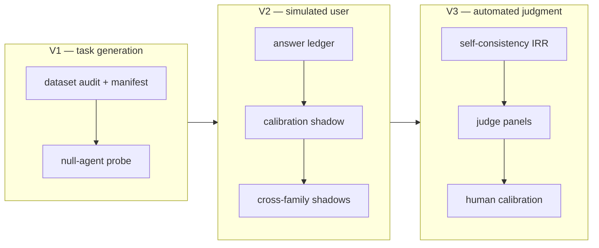

# Measurement validity

An eval score is a **measurement**, and a measurement can be wrong in ways a
green report never shows: the tasks may not test what you think (a do-nothing
agent can pass them), the simulated user answering your skill's questions may
distort every trajectory, and an LLM judge can be confidently inconsistent.
This page is the map of the harness's measurement-validity surfaces — what each
one measures, what it deliberately does *not* claim, and how to turn them on.

The framework follows *"Measurement Without Validity: The Compounding
Reliability Problem in Agentic AI Evaluation"* (William Caban,
[arXiv 2608.00794](https://arxiv.org/abs/2608.00794)). Every surface is
**opt-in**: an `eval.yaml` that enables none of them behaves exactly as before.

## The three-layer model

The paper's central claim: the total validity of an agentic eval pipeline is
bounded **multiplicatively** across three layers —

```text
V_total ≤ V1 (task generation) × V2 (simulated user) × V3 (automated judgment)
```

Validity failures multiply, they don't add: 70% validity per layer caps the
pipeline near 34%. Two things follow. First, the weakest layer dominates —
polishing judge prompts is wasted while the dataset is contaminated. Second,
downstream agreement can't rescue an upstream distortion: judges agreeing
perfectly on trajectories shaped by a miscalibrated simulator are agreeing on
the distortion (the paper's Sec 5.3 trap).

!!! warning "V_total is a conceptual frame, not a formula"
    The harness **never computes a numeric V_total**. The bound is a way of
    reasoning (per the paper's own Sec 10.4 caveat): correlated failures — for
    example the same provider family at several layers (Appendix B.4) — push
    real pipelines below it. The report states the frame and **names the
    unmeasured layers** instead of multiplying guesses.

## How the harness maps onto it



### V1 — are the tasks measuring anything?

- **[Dataset audit](../guides/eval-dataset.md)** — a deterministic scan of the
  whole dataset (reference resolution, answer-key contamination,
  near-duplicates, category/difficulty composition, conditional-judge branch
  coverage) written to `dataset_audit.yaml` at the dataset root, alongside a
  persisted generation `manifest.yaml` (generator model, prompt hashes,
  per-case provenance).
- **[Null-agent probe](../guides/eval-dataset.md#null-agent-solvability-probe)**
  — run the suite with a do-nothing agent; any case the judges award anyway is
  non-discriminative. The statistic is labeled *"null-pass rate (joint
  task/judge non-discriminativeness, upper-bounds 1−V1)"* — under LLM judges it
  is a joint task/judge probe, not a pure task figure. Gate dataset revisions
  in CI with `--fail-on-null-pass`.

### V2 — is the simulated user measured?

Headless runs answer `AskUserQuestion` through the
[tool-interception hook](tool-interception.md) — an LLM standing in for your
user. Unmeasured, it is invisible in the results.

- **[Answer-provenance ledger](tool-interception.md#the-answer-provenance-ledger-hook_answersjsonl)**
  — every answered question is recorded to `hook_answers.jsonl` with the tier
  that produced it (`override`/`llm`/`fallback`/`disabled`). The
  [`simulator_provenance`](../reference/builtin-judges.md#processsimulator_provenance)
  builtin judge fails any case that ran on fallback, disabled, or unrecorded
  answers.
- **[Calibration shadow](../reference/config/inputs-tools.md)**
  (`inputs.tools[].calibration: true`) — on every question a human-authored
  override answers, the LLM tier is *also* run **held out** (`answers.yaml`
  stripped) and only logged — turning each human override into a
  simulator-vs-human calibration pair at near-zero cost. Aggregated into
  `summary['simulator']`, stratified by override provenance: agent-authored
  pairs are labeled *LLM-vs-LLM consistency (not human calibration)*.
- **[Cross-family shadow simulators](../reference/config/models.md#hook_shadow)**
  (`models.hook_shadow`) — up to two extra models answer every intercepted
  question (logged, never injected), making simulator-choice sensitivity
  observable as a `cross_simulator` all-agree rate with family composition.
- **Gates** — the reserved
  [`thresholds.simulator`](../reference/config/thresholds.md#the-reserved-simulator-key)
  key: `max_fallback_rate`, `min_gold_agreement` (human-provenance pairs
  only), `min_cross_simulator_agreement`.

### V3 — how reliable are the judges?

- **Self-consistency IRR** — for a judge run with `samples > 1`, scoring
  computes a chance-corrected coefficient over the case × sample matrix
  (metric auto-selected by the paper's Figure-1 decision tree, rationale
  string included), written as `stability.irr` with a bootstrap CI. This is
  the **single-judge self-consistency alpha (an upper bound on inter-rater
  reliability)** — a self-consistent judge can still be biased. Gate with
  [`min_alpha`](../reference/config/thresholds.md#min_alpha-the-reliability-gate),
  or tag the judge `consequence: exploratory|safety|gating` to inject the
  paper's tier defaults (0.67/0.70/0.80 — only 0.67 is literature-backed).
- **[Judge panels](../reference/config/judges.md#judge-panels-cross-family-ensembles)**
  — `judges[].model` as a list fans the judge out across models; the
  cases × models matrix yields a true inter-judge alpha, with the panel's
  family composition reported so within-family agreement is never sold as
  cross-family robustness. Gate with `min_panel_alpha`.
- **[Human calibration](../guides/eval-review.md#calibration-anchor-your-judges-to-a-human)**
  — `/eval-review --calibrate` elicits your verdicts before revealing the
  judge's; `score.py calibration` joins them into per-judge `human_agreement`
  (criterion validity vs a **single human reviewer** — an anchor, not a rater
  pool). Gate with `min_human_agreement`.
- **[Instrument clarity](../reference/config/judges.md#instrument-clarity-diagnostic)**
  — `score.py clarity` has several rater models re-rate a case subsample with
  the judge's own rubric (Sec 10.2): does the rubric even admit consistent
  application? A property of the instrument, not rater validity — diagnostic
  only, never a CI gate.

The report renders all of this in a dedicated
[Validity & Reliability section](../get-started/reading-the-report.md#validity-reliability),
and [`/eval-mlflow`](../guides/eval-mlflow.md) routes per-judge IRR metrics and
`validity/*` tags to the tracking server.

## The honest-labeling stance

Numbers about measurement quality are the easiest place to oversell, so the
harness holds a few invariants everywhere they render:

- **Upper bound, said out loud.** Self-consistency alpha is always labeled an
  *upper bound on inter-rater reliability* — it never becomes "the IRR".
- **Uncorrected means uncorrected.** Raw percent-agreement surfaces (the
  `stable` flag, `swap_consistency`, small-n agreement tables) are labeled
  uncorrected; they are never dressed up as coefficients.
- **No strength-of-agreement adjectives.** A coefficient is a number against a
  declared threshold, not a verbal grade — the conventional adjective scales
  are convention, not evidence.
- **Unmeasured layers are named, never imputed.** No calibration data means
  *"uncalibrated simulator"* in the report — not a default value.
- **Degenerate honesty.** All-identical ratings make a coefficient 0/0; that
  passes gates as `perfect_agreement` rather than failing a mature suite on a
  degenerate denominator — and a configured-but-unavailable metric is a loud
  regression, never a silent skip.
- **Restrained precision** (Appendix B.5) — summary means render at two
  decimals; more digits would claim precision the sample size cannot back.
- Low alpha or low human agreement is a **construct-development signal**
  (Sec 11.3): sharpen the rubric or the task, don't lower the bar —
  [`/eval-optimize`](../guides/eval-optimize.md) consumes exactly this signal.

## The full stack in one config

```yaml title="eval.yaml (validity surfaces highlighted)"
models:
  judge: claude-opus-4-6
  hook: claude-haiku-4-5
  hook_shadow: [gemini-2.5-flash]      # V2: simulator-choice sensitivity

inputs:
  tools:
    - match: Questions asked to the user via AskUserQuestion.
      prompt: Answer from the case context in input.yaml.
      calibration: true                # V2: held-out shadow vs human overrides

judges:
  - name: simulator_provenance
    builtin: simulator_provenance      # V2: no unrecorded/fallback answers
  - name: output_quality
    feedback_type: int
    score_range: [1, 5]
    samples: 3                         # V3: sampling matrix for stability.irr
    consequence: safety                # V3: injects min_alpha 0.70
    prompt: "Score the output 1-5 for completeness, clarity, and accuracy."
  - name: task_quality
    model: [claude-opus-4-6, gemini-2.5-pro]   # V3: cross-family panel
    score_range: [1, 5]
    prompt: "Score the output 1-5."

thresholds:
  simulator_provenance: { min_pass_rate: 1.0 }
  output_quality:       { min_mean: 3.5, min_human_agreement: 0.6 }
  task_quality:         { min_panel_alpha: 0.67 }
  simulator:                           # reserved key — gates summary['simulator']
    max_fallback_rate: 0.0
    min_gold_agreement: 0.8
    min_cross_simulator_agreement: 0.9
```

Plus, outside the config: audit the dataset (and null-probe it) per revision
with [`/eval-dataset`](../guides/eval-dataset.md), and calibrate judges against
yourself with [`/eval-review --calibrate`](../guides/eval-review.md) followed
by `score.py calibration`.

!!! note "Execution paths"
    The reliability and simulator gates evaluate on the **local scoring path**;
    Harbor/EvalHub aggregations carry no per-sample or ledger data, so those
    gates are skipped or stripped there with a notice — see the
    [CI guide](../guides/ci.md#reliability-and-validity-gates) for where each
    gate binds.

## See also

<div class="grid cards" markdown>

- [**Glossary: validity & reliability terms**](../reference/glossary.md#measurement-validity-reliability) — stability vs `stability.irr` vs panel vs `human_agreement` vs the two calibrations
- [**thresholds reference**](../reference/config/thresholds.md) — every gate key and its three-state semantics
- [**Reading the report**](../get-started/reading-the-report.md#validity-reliability) — the Validity & Reliability section rendered
- [**CI integration**](../guides/ci.md#reliability-and-validity-gates) — worked gating examples

</div>
