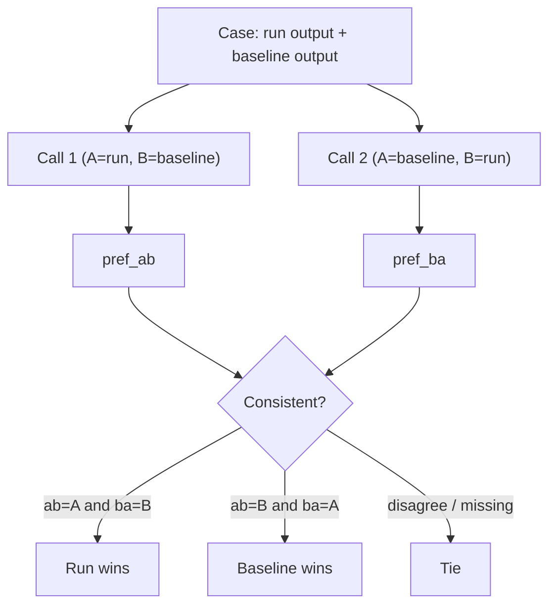

# Pairwise & judge sampling

Two ways to squeeze more signal out of stochastic LLM judges: **pairwise comparison**
decides which of two runs is better (instead of scoring each in isolation), and **judge
sampling** runs a judge N times per case and reduces the spread to one stable value.
Both are implemented in
[`skills/eval-run/scripts/score.py`](https://github.com/opendatahub-io/agent-eval-harness/blob/main/skills/eval-run/scripts/score.py).

## Pairwise comparison

Pairwise mode compares a run against a **baseline** run, case by case, using an LLM judge
that sees both outputs blind. It answers "is B better than A?" — often a sharper question
than "score A" and "score B" separately.

You trigger it by passing a baseline to `/eval-run`, which runs the `pairwise` subcommand:

```bash
# via /eval-run
/eval-run --model opus --baseline <baseline-run-id>

# the underlying call
python3 ${CLAUDE_SKILL_DIR}/scripts/score.py pairwise \
  --run-id <run-id> --baseline <baseline-run-id> --config eval.yaml
```

Here **A is the run under test** (`--run-id`) and **B is the baseline** (`--baseline`).

### The position-swap protocol

LLMs have position bias — they favor whichever output appears first. To cancel it, every
case is judged **twice with the slots swapped**, and a side only "wins" if it wins in
*both* orderings.



The verdict rule (from `PairwiseResult.winner`):

| `pref_ab` | `pref_ba` | Verdict |
| --- | --- | --- |
| `A` | `B` | **A** (run under test) wins |
| `B` | `A` | **B** (baseline) wins |
| anything inconsistent | | **tie** |
| judge errored / either preference missing | | **error** |

!!! note "Position bias collapses to a tie"
    A side must be preferred *regardless of where it was shown*. If the judge just picks
    the first slot both times (`pref_ab = A`, `pref_ba = A`), the outputs disagree across
    orderings and the case is scored a tie — not a spurious win.

Both calls render the **full artifact set** per side (every collected file, not just the
first one) via `_format_outputs_for_pairwise`, so the judge can weigh every output a case
produced.

### Naming convention & judge selection

A judge named exactly `pairwise` is treated specially:

- **`load_judges` skips it** — a judge called `pairwise` is *excluded* from normal
  per-case scoring, so it never shows up as a regular column. Reserve the name for the
  comparison judge.
- The `pairwise` subcommand picks its judge in this order:
    1. `--judge <name>` if given,
    2. otherwise the **first judge that defines `prompt` or `prompt_file`**.

The comparison **model** resolves as: `--model` → the chosen judge's `model:` →
`models.judge` → `EVAL_JUDGE_MODEL`. With none set, the command errors out.

### The default comparison prompt

If neither `--prompt-file` nor the selected judge supplies a prompt, the built-in prompt
[`skills/eval-run/prompts/comparison-judge.md`](https://github.com/opendatahub-io/agent-eval-harness/blob/main/skills/eval-run/prompts/comparison-judge.md)
is used. It instructs a blind evaluator to compare across four dimensions and be decisive
about ties:

| Dimension | Question |
| --- | --- |
| Completeness | Does the output fully address all requirements? |
| Quality | Is it well-structured, clear, and professional? |
| Accuracy | Is it factually correct and internally consistent? |
| Relevance | Does it stay focused on what was asked? |

The judge call forces a `submit_comparison` tool with two fields — `preferred`
(`A` / `B` / `tie`) and `reasoning` — so the verdict comes back in known fields instead
of free-form text. Anything a custom prompt wants weighed is folded into `reasoning`; the
harness stays prompt-agnostic and only needs `preferred` to tally results.

### Results

`compare_runs` tallies wins/ties/errors and writes them to the run's `summary.yaml`
under the `pairwise` key:

```yaml
pairwise:
  run_a: <run-id>        # the run under test
  run_b: <baseline-id>   # the baseline
  cases_compared: 12
  wins_a: 7              # run beat baseline
  wins_b: 2              # baseline beat run
  ties: 3
  errors: 0
  per_case:
    - { case_id: case-001, winner: A, reasoning: "..." }
```

!!! tip "Gate on a pairwise win rate"
    A [threshold](thresholds.md) with `min_win_rate` regresses when the run doesn't beat
    its baseline often enough. See [thresholds](thresholds.md) for the valid keys.

## Judge sampling

LLM judges are stochastic — the same output can score 4 one call and 3 the next. Setting
`samples: N` on a judge runs it N times per case and reduces the results to a single value,
recording the spread so you can tell signal from noise.

```yaml title="eval.yaml"
judges:
  - name: output_quality
    prompt: "Score the output 1-5 for completeness and accuracy."
    samples: 5          # run 5×/case, reduce to a stable score
```

### How samples reduce

Reduction depends on the value type (`_aggregate_samples`):

| Value type | Reduction | Notes |
| --- | --- | --- |
| Numeric (score) | `statistics.median_low` | Returns an **actually observed** score, not an interpolated average |
| Boolean (pass/fail) | **Strict majority** (`passes * 2 > n`) | **Ties resolve to fail** — 1-of-2 or 2-of-4 passes = fail |

The kept `rationale` is taken from a sample that matches the reduced value, so the shown
reasoning always agrees with the final score.

### The stability block

Every sampled result carries a `stability` block. A result is **`stable` only when every
sample agreed *and* none errored**:

```yaml
per_case:
  case-001:
    output_quality:
      value: 4
      rationale: "..."
      stability:
        samples: 5
        min: 3
        max: 4
        mean: 3.8
        values: [4, 3, 4, 4, 4]
        stable: false      # spread > 0 → not stable
```

When a result is **not** stable, a `sample_rationales` list is added recording each
sample's value, rationale, and any error. Across cases, the aggregated summary reports how
many cases were stable:

```yaml
judges:
  output_quality:
    mean: 3.9
    stability: { samples: 5, stable_cases: 8, total_cases: 12 }
```

The console echoes the same, e.g. `output_quality: mean=3.90  [8/12 stable over 5 samples]`.

### The `--samples` override

`--samples N` overrides every judge's per-judge `samples:` at once:

```bash
python3 ${CLAUDE_SKILL_DIR}/scripts/score.py judges \
  --run-id <run-id> --config eval.yaml --samples 5
```

!!! warning "Sampling only applies to LLM judges"
    `--samples` and `samples:` affect **stochastic (LLM) judges only**. Deterministic
    judges — inline `check`, external `module`/`function`, and Python `builtin` judges —
    are forced to `samples=1` and always run once; the CLI override never touches them.
    Configuring `samples: N` on a deterministic judge is ignored with a warning at load.

### Sampling a pairwise comparison

The `pairwise` subcommand accepts `--samples N` too (or reads it from the selected judge's
`samples:`). It runs the whole comparison N times; the **first run is primary** (its
per-case reasoning is what the report renders), and a `stability` block records per-case
verdict agreement — which cases gave the same verdict every run, which flipped, the
majority verdict for flipped cases, and an overall `agreement_rate`.

```bash
python3 ${CLAUDE_SKILL_DIR}/scripts/score.py pairwise \
  --run-id <run-id> --baseline <baseline-id> --config eval.yaml --samples 3
```

## See also

<div class="grid cards" markdown>

- [**Judges**](judges.md) — the four judge types and how they score a case
- [**Thresholds**](thresholds.md) — `min_win_rate`, `min_mean`, `min_pass_rate` gates
- [**judges reference**](../reference/config/judges.md) — every judge field, including `samples`
- [**The report**](report.md) — where stability and pairwise verdicts are rendered

</div>
