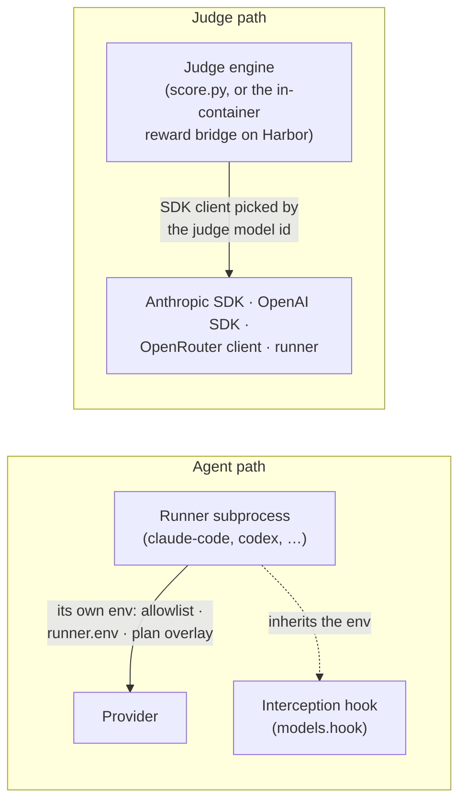

# Model providers

A model id on a role — `models.skill`, `models.subagent`, `models.hook`,
`models.judge`, a per-judge `model:`, or the `--model` / `--subagent-model` flags —
names a model **and**, through an optional scheme, the provider that serves it. This
page is the provider-neutral mental model: what an id means on each role, the three
families a provider belongs to, which role accepts which scheme, who actually makes
the call, how credentials reach that caller on each execution backend, and what the
cost fields mean afterwards.

It is the third leg of the distinction the [glossary](../reference/glossary.md)
opens with: the **runner** is the agent runtime inside the box, the **execution
backend** is the box, and the **provider** is who serves the model's tokens — and
how the caller gets pointed at it.

!!! note "What this page is not"
    The OpenRouter narrative — direct transport, enforcement levels, routing
    lifecycle, secrets per backend — is the [OpenRouter guide](../guides/openrouter.md);
    the `openrouter` block and its validation rules are the
    [`models.providers` reference](../reference/config/providers.md). Neither is
    restated here.

## What a model id is

The grammar is `[<provider>:/]<id>`. The scheme is lower-cased and leading slashes
on the id are stripped, so `openai:/gpt-4o` and `openai://gpt-4o` are the same id; a
bare id has no scheme. On the agent roles an `openrouter:/` id must be
`<author>/<slug>`, exactly one slash; the judge path only requires a slash. On the
agent roles the id may also carry a bracket suffix (`[1m]`) and `:variant`s
(`:exacto`); both ride on the id sent to the provider, and neither is part of an
OpenRouter routing key.

What a **bare id** means depends on who makes the call:

| Where | A bare id is… |
| --- | --- |
| Agent roles (`skill`, `subagent`, `hook`) | Whatever the runner is configured for. With `claude-code` that is an Anthropic model reached through Claude Code's own setup — a direct API key, Vertex, or an operator gateway on `ANTHROPIC_BASE_URL`. The harness forwards the credentials it allows and never routes the request. |
| Judge roles | Classified by a heuristic: an id starting with `anthropic/`, containing `claude`, or starting with `opus`, `sonnet` or `haiku` goes to the Anthropic SDK; **any other bare id** goes to the OpenAI SDK (and `OPENAI_BASE_URL`). A runner-managed id such as Cursor's `gpt-5.4-medium` must be written `runner:/<id>` to grade through the runner. |

Each role resolves its id along a fixed chain — CLI flag, then config, then
inheritance or environment. The [`models` reference](../reference/config/models.md#the-four-roles)
has the chains in detail; in short:

| Role | Resolution |
| --- | --- |
| `skill` | `--model` → `models.skill` (required) |
| `subagent` | `--subagent-model` → `models.subagent` → the skill model |
| `hook` | `models.hook` → under an OpenRouter plan `models.providers.openrouter.background_model`, else the skill model → the built-in `claude-haiku-4-5-20251001` |
| LLM judge | per-judge `model:` → `models.judge` → `EVAL_JUDGE_MODEL` |
| pairwise judge | `score.py --model` → the pairwise judge's `model:` → `models.judge` → `EVAL_JUDGE_MODEL` |
| `agent:` judge | the same chain as an LLM judge; any scheme is stripped and the bare id goes to the judge's runner |
| synthetic generation | `/eval-dataset` passes `models.judge` (default `claude-opus-4-6`) as `generate_synthetic.py --model` |

## Three provider families

=== "Anthropic, through the runner"

    A bare (or `anthropic:/`) id on an agent role. The harness does not route it:
    Claude Code picks the direct API, Vertex or an operator gateway from its own
    environment, and the local runner forwards only an exact-name allowlist of that
    environment — `ANTHROPIC_API_KEY`, `ANTHROPIC_AUTH_TOKEN`, `ANTHROPIC_BASE_URL`,
    the Vertex switches and the Google credential locations (see
    [the allowlist](runners.md#the-environment-allowlist)). Judges on this family
    use the Anthropic SDK: Vertex when `ANTHROPIC_VERTEX_PROJECT_ID` is set
    (`CLOUD_ML_REGION`, an optional token, `ANTHROPIC_VERTEX_BASE_URL`), else
    `ANTHROPIC_API_KEY`, else `ANTHROPIC_AUTH_TOKEN` — the last two honouring
    `ANTHROPIC_BASE_URL`. There is no `models.providers` block for this family.
    Cost is what Claude Code reports: `runner:reported` on `api.anthropic.com` or
    Vertex, `runner:estimate` behind any other `ANTHROPIC_BASE_URL` host.

=== "OpenRouter, through a harness-managed plan"

    `openrouter:/<author>/<slug>[:variant]` on `models.skill` activates a **plan**:
    the harness reads the inference key from the environment, derives one env block
    (`ANTHROPIC_BASE_URL`, the key as `ANTHROPIC_AUTH_TOKEN`, blanked Vertex and
    Bedrock switches, the model aliases) and delivers it to the agent the way each
    backend allows. Claude Code then talks to OpenRouter directly, and the plan owns
    those keys on every `env:` surface. This is the only family with a
    `models.providers` block, and the block is optional: the defaults plus
    `OPENROUTER_API_KEY` are enough, and the block adds provider pins, a run budget
    and the enforcement level. An `openrouter:/` **judge** needs no plan — it has its
    own client, keyed by `api_key_env` alone. Cost is a provider-priced truth source
    or `null` — the runner's figure only when `--allow-estimate` is passed, labelled
    `runner:estimate`. Transport, enforcement levels and the routing lifecycle: the
    [guide](../guides/openrouter.md); the block: the
    [reference](../reference/config/providers.md).

=== "OpenAI and OpenAI-compatible"

    `openai:/<id>` — or any bare id the judge classifier does not recognise as
    Claude — grades through the OpenAI SDK with `OPENAI_API_KEY` and
    `OPENAI_BASE_URL`, so an OpenAI-compatible gateway or a local server is one
    variable away (a base URL without a key gets a placeholder key). The `codex` and
    `responses-api` runners read the same `OPENAI_*` variables for the agent. There is
    no `models.providers` kind for this family: `kind: openai-compatible` is refused
    at load with a pointer to `openai:/` plus `OPENAI_BASE_URL`, and an agent-side
    Anthropic-compatible gateway stays a plain `execution.env` matter.

Alongside the three families sit **runner-managed ids**: the `cursor` runner's model
is whatever the Cursor account serves (`CURSOR_API_KEY`), the `cli` runner substitutes
`{model}` into an opaque command, and a `runner:/<id>` judge grades through whichever
runner is configured. The harness passes those ids through and reads back what the
runner reports.

## Which role accepts which provider

| Role | bare id | `anthropic:/` | `openai:/` | `openrouter:/` | `runner:/` |
| --- | --- | --- | --- | --- | --- |
| `skill` | yes — the runner's own provider | yes[^1] | no | yes — activates the plan; `runner.type: claude-code` only | no |
| `subagent`, `hook` | yes | yes[^1] | no | yes — **required** while the skill is `openrouter:/` | no |
| LLM and pairwise judges | yes — Claude → Anthropic SDK, anything else → OpenAI SDK | yes | yes | yes — dedicated client; `provider_options` allowed | yes |
| `agent:` judge | yes | stripped to the bare id | stripped to the bare id | **no** | stripped to the bare id |
| synthetic generation | yes — Claude → Anthropic SDK, anything else → the runner | yes | **no** | **no** | yes |

[^1]: Accepted by validation, but the scheme is stripped only under a plan — see [Limitations](#limitations).

The rules behind the cells, each enforced at config load:

- **One provider kind across the agent roles.** While `models.skill` is `openrouter:/`,
  `subagent` and `hook` must be `openrouter:/` too (or unset, to inherit): their
  requests, and the hook's, go through the same environment and a Claude slug would
  404 there.
- **`openrouter:/` on the skill needs `runner.type: claude-code`**, per-step runners
  included. `cursor` has no base-URL knob; `codex`, `cli` and `responses-api` have no
  OpenRouter transport.
- **Bare-id footgun.** With the `openrouter` block declared but no plan active, a
  bare agent id that has a routing entry or is not an Anthropic id is rejected —
  write `openrouter:/<id>` or drop the pins.
- **An `agent:` judge cannot be `openrouter:/`**: it runs through the runner, which has
  no OpenRouter transport for judges.
- **`provider_options`** (`routing`, `fallbacks`, `max_tokens`) is valid only on a
  judge whose static model is `openrouter:/`.

The validation messages are listed under
[`models.providers` → Validation](../reference/config/providers.md#validation) and
[judges → Model providers](../reference/config/judges.md#model-providers-judge-backend).

## Agent path and judge path

Two different processes call a model, and they are pointed at a provider in two
different ways.

**Agent path.** The runner's subprocess calls the model, and its environment is the
runner's doing: `claude-code` forwards an exact-name allowlist plus `runner.env` in
the process env and injects `execution.env` through the workspace `settings.json`
env block — under an OpenRouter plan the per-run settings overlay wins over all of
them; `codex` and `cursor` forward their own short allowlists; `cli` inherits the
whole environment plus `execution.env`. The tool-interception hook is a child of
that process and inherits its environment — which is why a hook must share the
skill's provider kind under a plan, and why an unset hook then follows the plan's
`background_model` or the skill model rather than the Claude default.

**Judge path.** The judge engine calls the model, and the backend is chosen by the
**judge model id**, never by the runner: a Claude id or `anthropic:/` → the Anthropic
SDK; `openai:/` or another bare id → the OpenAI SDK; `openrouter:/` → a dedicated
OpenRouter client; `runner:/` and `agent:` judges → the configured runner. The full
table, with the `tool_choice` rule and what each backend returns, is at
[judges → Model providers (judge backend)](../reference/config/judges.md#model-providers-judge-backend).

**Where the judge engine runs** decides where judge credentials must exist. On the
Local and EvalHub backends it is in-process — `score.py` in the harness process or in
the Job pod, with that process's own environment — so a Claude judge works there. On
Harbor it is the in-container reward bridge: a judge grades **inside the trial
container** and its key has to be forwarded there. Under an OpenRouter plan that
container carries no Anthropic credentials (Podman strips them; on Kubernetes the
plan's `ANTHROPIC_API_KEY=""` and blanked Vertex entries are explicit pod env and win
over the credentials Secret), so an LLM judge on Harbor under a plan must be
`openrouter:/` or `openai:/` (or deterministic). See
[Execution backends → How judging stays portable](backends.md#how-judging-stays-portable).

## Credentials by backend

Provider keys are environment-only: they are never authored in `eval.yaml`, and
`OPENROUTER_API_KEY` / `OPENROUTER_MANAGEMENT_KEY` are rejected on every `env:`
surface. The one exception is the `responses-api` runner, whose `runner.settings.api_key`
is an authored secret — prefer `OPENAI_API_KEY`. How a key then reaches the **agent**
depends on the runner and the execution backend:

| Agent runs as | Anthropic direct or gateway | Vertex | Bedrock | OpenRouter (plan) | OpenAI |
| --- | --- | --- | --- | --- | --- |
| Local `claude-code` | `ANTHROPIC_API_KEY`, `ANTHROPIC_AUTH_TOKEN`, `ANTHROPIC_BASE_URL` from the host (allowlist) | `CLAUDE_CODE_USE_VERTEX`, `ANTHROPIC_VERTEX_PROJECT_ID`, `CLOUD_ML_REGION`, `GOOGLE_CLOUD_PROJECT`, `GOOGLE_APPLICATION_CREDENTIALS`, `CLOUDSDK_CONFIG`, `CLOUDSDK_AUTH_CREDENTIAL_FILE_OVERRIDE`, `CLAUDE_CODE_SKIP_VERTEX_AUTH`, `ANTHROPIC_VERTEX_BASE_URL` (allowlist; `HOME` is shared, so credentials on disk stay reachable) | **not on the allowlist** — set `CLAUDE_CODE_USE_BEDROCK` and the `AWS_*` variables in `runner.env` | `OPENROUTER_API_KEY` read by the harness, delivered as `ANTHROPIC_AUTH_TOKEN` in a 0600 `.eval-overlay.json`; the managed keys are stripped from the process env | — |
| Local `codex` | not forwarded (opt in via `runner.env`) | not forwarded | not forwarded | not supported | `OPENAI_API_KEY`, `OPENAI_BASE_URL`, `OPENAI_ORG_ID`, `OPENAI_ORGANIZATION`, `OPENAI_PROJECT`, `OPENAI_MODEL`, `CODEX_HOME`, `CODEX_API_KEY` (allowlist) |
| Local `cursor` | — | — | — | not supported (no base-URL knob) | — ; the Cursor account decides: `CURSOR_API_KEY`, `CURSOR_API_ENDPOINT`, `CURSOR_AGENT_BIN` |
| Local `responses-api` | — | — | — | not supported | `runner.settings.base_url`, `api_key`, `default_model`, else `OPENAI_BASE_URL`, `OPENAI_API_KEY`, `OPENAI_MODEL` |
| Local `cli` | the whole environment — the runner inherits `os.environ` plus `execution.env` (`runner.env` is not applied by this runner) | same | same | not supported | same |
| Harbor Podman | forwarded from the host when set | forwarded (`CLAUDE_CODE_USE_VERTEX`, project, region) plus a read-only mount of `AGENT_EVAL_PODMAN_GCP_CREDENTIALS_FILE` | forwarded (`CLAUDE_CODE_USE_BEDROCK`, `AWS_REGION`, `AWS_ACCESS_KEY_ID`, `AWS_SECRET_ACCESS_KEY`, `AWS_SESSION_TOKEN`, `AWS_BEARER_TOKEN_BEDROCK`) | the plan env as value-free `--agent-env` carriers; while the plan is active the Anthropic credentials, the Vertex variables and the Bedrock switches (`CLAUDE_CODE_USE_BEDROCK`, `AWS_REGION`, `AWS_BEARER_TOKEN_BEDROCK`) are **not** forwarded — `AWS_ACCESS_KEY_ID`, `AWS_SECRET_ACCESS_KEY`, `AWS_SESSION_TOKEN` and the `OPENAI_*` variables still are — the GCP mount is skipped, and `OPENROUTER_API_KEY` itself enters the container only for an in-container `openrouter:/` judge | `OPENAI_API_KEY`, `OPENAI_BASE_URL`, `OPENAI_MODEL` forwarded |
| Harbor Kubernetes / OpenShift | the credentials Secret (`AGENT_EVAL_K8S_CREDENTIALS_SECRET`, `envFrom`); only `ANTHROPIC_MODEL` and `ANTHROPIC_BASE_URL` come from the host | a mounted Secret (`AGENT_EVAL_K8S_GCP_CREDENTIALS_SECRET`, skipped under a plan) or a service account (`AGENT_EVAL_K8S_SERVICE_ACCOUNT`), **plus** `CLAUDE_CODE_USE_VERTEX=1`, `ANTHROPIC_VERTEX_PROJECT_ID` and `CLOUD_ML_REGION` in the credentials Secret — nothing but `ANTHROPIC_MODEL` and `ANTHROPIC_BASE_URL` is inherited from the host | the credentials Secret | `ANTHROPIC_AUTH_TOKEN` via `secretKeyRef` — from the credentials Secret at `audit`, from a per-run Secret at `key-guardrail`; the plan's non-secret env goes into the pod spec and wins over `envFrom` | the credentials Secret |
| EvalHub | the Job pod's own environment, populated by the EvalHub server | same | same | the plan is built in the pod when the JobSpec `model.name` is `openrouter:/…`; the pod env must hold `OPENROUTER_API_KEY` (and the management key at `key-guardrail`) | same |

**Judge** credentials follow the judge model and must exist where the judge engine
runs — the harness process or Job pod on Local and EvalHub, the trial container on
Harbor:

| Judge model | What the judge engine reads |
| --- | --- |
| Claude id, `anthropic:/` | `ANTHROPIC_VERTEX_PROJECT_ID` (with `CLOUD_ML_REGION`, default `us-east5`, an optional access token and `ANTHROPIC_VERTEX_BASE_URL`), else `ANTHROPIC_API_KEY`, else `ANTHROPIC_AUTH_TOKEN` — the last two with `ANTHROPIC_BASE_URL`. No Bedrock client. **Not usable on Harbor under an OpenRouter plan**: the trial container carries none of these (Podman strips them; on Kubernetes the plan's blank entries win over the credentials Secret) — grade with `openrouter:/` or `openai:/` there. |
| `openai:/`, any other bare id | `OPENAI_API_KEY` and/or `OPENAI_BASE_URL` (at least one); on Harbor, forwarded by Podman plan or not, or read from the credentials Secret on Kubernetes |
| `openrouter:/` | the block's `api_key_env` (default `OPENROUTER_API_KEY`) — never `OPENAI_API_KEY`. On Harbor **under a plan** it reaches the container only when an `openrouter:/` judge is configured (forwarded by Podman, left unmasked from the credentials Secret on Kubernetes); without a plan Podman forwards it whenever it is set on the host and the credentials Secret exposes it unmasked on Kubernetes |
| `runner:/`, `agent:` judge | whatever the configured runner forwards (the agent rows above) |

The OpenRouter-specific placement, with the host variables each enforcement level
needs, is tabulated at
[`models.providers` → Where the key goes](../reference/config/providers.md#where-the-key-goes-per-backend)
and narrated in the [guide](../guides/openrouter.md#secrets); the Kubernetes Secret
recipes are in [Running on Harbor](../guides/harbor.md#credentials-from-the-cluster-never-copied-from-the-host);
every variable is listed on the [environment variables](../reference/environment-variables.md)
page.

## Cost provenance across providers

`run_result.cost_usd` is the agent's spend, and `cost_source` says where the number
came from, in `<origin>:<method>` form. The provider family decides which values can
appear:

| Family or runner | `cost_source` | What `cost_usd` is |
| --- | --- | --- |
| Anthropic through Claude Code (`api.anthropic.com` or Vertex) | `runner:reported` | Claude Code's billed total |
| Anthropic through an operator gateway (any other `ANTHROPIC_BASE_URL` host) | `runner:estimate` | Claude Code's figure, priced at Anthropic rates — an estimate |
| OpenRouter plan | `openrouter:generation` (priced generation rows, coverage ≥ 80 %), else `openrouter:key-usage` (the key's usage delta), else `unavailable` with `cost_usd: null`; `runner:estimate` only with `--allow-estimate` | billed spend; the CLI's figure is kept as `cost_usd_estimate`, and `cost_confidence` (`high`, `medium`, `low`) qualifies the result |
| `codex` | *none written* — read as `runner:reported` downstream | a harness-side estimate from the `litellm` pricing table |
| `cursor`, `cli`, `responses-api` | *none written* | what the runner reports: the Cursor CLI's figure, the `cli` runner's `metrics.json`, `null` for `responses-api` |

Judge spend never enters `run_result.cost_usd`. Each LLM judge call yields a usage
record whose own `cost_source` uses a different, hyphenated vocabulary:
`provider-inline` when the provider priced the reply (OpenRouter), `runner-estimate`
for a runner-backed or agent judge, `none` when only tokens are known (Anthropic and
OpenAI SDK judges). They aggregate into `summary.yaml` → `judge_usage`, and
`total_cost_usd` / `total_cost_source` (`complete`, `agent-only`, `judge-only`, `none`)
combine agent and judge spend without ever summing a `null`. Field by field:
[runs directory → cost provenance](../reference/runs-directory.md#cost-provenance).

**In the report.** The **Cost Provenance** panel renders when the run-level
`run_result.json` carries a `cost_source` — a batch-mode `claude-code` run and every
provider-plan run on any backend; in case mode without a plan the label lives only
per case and the report shows no panel. The **Judge Cost** row appears when
`judge_usage` was recorded, the **Total Cost** row whenever `total_cost_source` is
not `none` (`n/a (agent-only)` when only the agent spend is numeric). Rows, banners
and conditions: [The HTML report → Cost provenance and routing audit](report.md#cost-provenance-and-routing-audit).

**Comparing across families.** `/eval-compare` pools every run it groups and
footnotes the cost table when the runs in a group differ in cost class, routing or
enforcement, or carry audit findings; `/eval-anova` skips a run whose routing audit
is degraded or whose enforcement level differs from its condition's first run, and
only warns on mixed cost sources. The rules and footnotes:
[Compare models and runs → Mixed providers and cost sources](../guides/eval-compare.md#mixed-providers-and-cost-sources)
and [Analyze variance → Rules at a glance](../guides/eval-anova.md#rules-at-a-glance).

## Limitations

Provider-neutral gaps, consolidated. The OpenRouter-specific ones — no in-flight
harness-side gate at `audit`, no cooldown or provider widening, the Kubernetes per-run
Secret — are in the [guide's limitations](../guides/openrouter.md#limitations).

- **No Bedrock on the local runner or for judges.** The `claude-code` allowlist is an
  exact-name set without `CLAUDE_CODE_USE_BEDROCK` or any `AWS_*` variable, and no
  Bedrock judge client exists. Bedrock reaches the agent through `runner.env` locally,
  through Podman's forwarding, or through the Kubernetes credentials Secret.
- **Synthetic generation is Claude or runner only.** `generate_synthetic.py` rejects
  `openai:/` and `openrouter:/` models outright; a Claude id (bare or `anthropic:/`)
  generates through the Anthropic SDK, a `runner:/<model>` id or any other bare id
  through the configured runner.
- **`/eval-setup` is not provider-aware.** Its auth check knows `ANTHROPIC_API_KEY` and
  `ANTHROPIC_VERTEX_PROJECT_ID` only.
- **`anthropic:/` on an agent role is normalised only under a plan.** Validation accepts
  it, but without a plan the URI reaches `claude --model` (and
  `CLAUDE_CODE_SUBAGENT_MODEL`) verbatim. Write bare ids on agent roles unless the
  model is `openrouter:/`
  ([#242](https://github.com/opendatahub-io/agent-eval-harness/issues/242)).
- **The hook model follows the config roles, not the CLI.** `--model openrouter:/…` over
  an Anthropic `models.skill` with no `models.hook` leaves the hook on the Claude
  default inside the OpenRouter environment; switch the skill model in a
  [profile](../reference/config/extends.md) or set `models.hook`
  ([#241](https://github.com/opendatahub-io/agent-eval-harness/issues/241)).
- **One provider kind.** `models.providers` accepts the `openrouter` block only;
  `kind: openai-compatible` is refused. OpenAI-compatible endpoints are `openai:/`
  judges with `OPENAI_BASE_URL`, or the `codex` and `responses-api` runners.
- **The OpenRouter transport is `claude-code`-only**, and an `agent:` judge cannot be
  `openrouter:/`.
- **`codex` writes no `cost_source`.** Its `litellm` estimate is read as
  `runner:reported` by `/eval-compare` and `/eval-anova`.

## Vocabulary

The same words carry several meanings across the docs. On this page they mean:

| Word | Here | Elsewhere it also means |
| --- | --- | --- |
| **provider** | the service that serves a model's tokens, named by the URI scheme (`anthropic`, `openai`, `openrouter`, `runner`) | one of OpenRouter's **upstream providers** ("pinned providers", "providers served"); the **EvalHub provider image** that registers the harness with the platform; a cloud (Vertex, Bedrock) |
| **provider URI** | `<provider>:/<id>` on a role | — |
| **plan**, **managed keys** | the env block the harness derives for an `openrouter:/` skill model, and the keys it owns on every `env:` surface | — |
| **transport** | the path the agent's requests take under a plan: Claude Code straight to OpenRouter (`provider.transport: direct`) | the OpenAI SDK path an `openrouter:/` judge shares with `openai:/` |
| **backend** | the SDK or runner a judge grades through — the **judge backend** | the **execution backend**: Local, Harbor, EvalHub (`--runner`) |
| **runner** | `runner.type`, the agent runtime | `--runner`, the execution backend; `runner:/`, a judge scheme; `runner:reported` and `runner:estimate`, cost origins |
| **enforcement level** | how OpenRouter pins and the run budget are enforced, `audit` or `key-guardrail` — OpenRouter only; the Anthropic family has none | — |
| **routing audit** | the post-run join of served providers against the declared pins | — |
| **cost source** | `run_result.cost_source`, `<origin>:<method>` | the hyphenated per-call `cost_source` inside `judge_usage` |

Each term has a one-line entry in the [glossary](../reference/glossary.md#model-providers).

## See also

- [**Running on OpenRouter**](../guides/openrouter.md) — the narrative: transport, enforcement levels, lifecycle, secrets
- [**`models.providers`**](../reference/config/providers.md) — the `openrouter` block, validation, profiles, where the key goes
- [**`models`**](../reference/config/models.md) — the four roles and their precedence chains
- [**judges → Model providers**](../reference/config/judges.md#model-providers-judge-backend) — the judge backend table and OpenRouter judges
- [**Environment variables**](../reference/environment-variables.md) — every credential variable per backend
- [**Runs directory → cost provenance**](../reference/runs-directory.md#cost-provenance) — the `run_result.json` and `summary.yaml` fields
- [**Runners**](runners.md) — the agent runtimes and their allowlists
- [**Execution backends**](backends.md) — Local, Harbor, EvalHub and where judging runs

