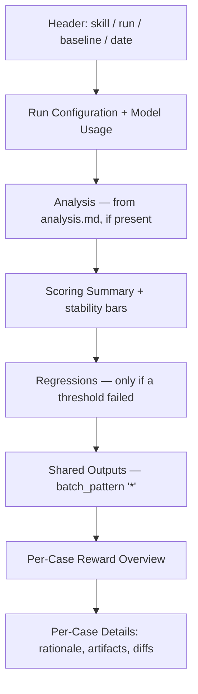

# The HTML report

Every `/eval-run` writes a single self-contained `report.html` to the run
directory. It has no external assets — CSS, JavaScript, and every image are
inlined (images as base64 data URIs) — so you can email it, drop it in a PR,
or open it offline and everything still works.

!!! abstract "Where it lives"
    `eval/runs/<eval-name>/<run-id>/report.html`. See the
    [runs directory](../reference/runs-directory.md) for the full layout.

This page covers the report's internals. For a first-time walkthrough of *what
to look at*, see [reading the report](../get-started/reading-the-report.md).

## How it's generated

The report is rendered by `skills/eval-run/scripts/report.py` from artifacts
`/eval-run` already produced — `summary.yaml`, `run_result.json`, the collected
`cases/` tree, and optionally `analysis.md` and `review.yaml`. You rarely call
it directly, but you can regenerate a report (e.g. to add a baseline) without
re-running the eval:

```bash
python3 skills/eval-run/scripts/report.py \
  --run-id <id> \
  --config eval.yaml \
  --baseline <prior-run-id> \   # optional A/B comparison
  --open                        # optional: open in the browser
```

| Flag | Effect |
| --- | --- |
| `--run-id` | Run to render (required). A single path segment — no `/`. |
| `--config` | Path to `eval.yaml` (required). |
| `--baseline` | Prior run ID; adds deltas, a pairwise row, and per-case diffs. |
| `--open` | Open the finished report in your default browser. |

## Structure

Sections render top-to-bottom in this order; empty sections are omitted.



| Section | Source | Notes |
| --- | --- | --- |
| Run Configuration | `run_result.json` | Model, effort, agent, duration, cost, turns, exit code, plus a **Model Usage** table (per-model tokens, cache hit rate, cost/turn, cost/Mtok). |
| Analysis | `analysis.md` | The agent's recommendation, rendered as markdown in a highlighted callout. Optional YAML frontmatter (`agent`, `model`, `date`) drives the subtitle. |
| Scoring Summary | `summary.yaml` + `thresholds` | One row per judge: type, metric (`pass_rate` or `mean`), value, threshold, PASS/FAIL/SKIP/ERROR. Pairwise gets its own row. |
| Regressions | thresholds | Only appears when a judge is below its [threshold](../concepts/thresholds.md). |
| Per-Case Reward Overview | `summary.yaml` + `reward` | Compact matrix of the [reward](../concepts/reward-api.md) and every judge score per case. |
| Per-Case Details | `cases/` tree | Judge rationales, inputs, rendered output artifacts, and baseline diffs — one collapsible card per case. |

## Scoring summary and per-case rationale

The **Scoring Summary** aggregates each judge across all cases (boolean judges →
`pass_rate`, numeric judges → `mean`) and marks status against its threshold.

**Per-Case Details** expands each case into a judge table with the full
`rationale`. Rationales are rendered as [markdown](#markdown-rendering), so
lists, tables, `code`, and **emphasis** from the judge come through formatted.

!!! tip "Tabbed rationales for sampled judges"
    When a judge ran with `--samples N > 1`, each sample's rationale is shown in
    its own tab (`#1`, `#2`, …), labelled with that sample's score. This lets
    you see *why* a wobbly judge disagreed with itself, not just that it did.
    See [pairwise and sampling](../concepts/pairwise-and-sampling.md).

## Visual artifact rendering

Files collected under your `outputs` paths are rendered inline by type, not just
dumped as text. Visual artifacts sort to the top of each case's **Output files**.

| Artifact | Rendered as | How |
| --- | --- | --- |
| `.png` `.jpg` `.jpeg` `.gif` `.webp` `.svg` | Inline image | base64 data URI |
| `.d2` | SVG | `d2 --bundle --layout elk` |
| `.drawio` | SVG | draw.io CLI (`-x -f svg`); `draw.io.app` on macOS, `drawio` elsewhere |
| graph JSON (`outputs[].types: graph`) | SVG | converted to D2, then rendered via ELK |
| metrics JSON (`outputs[].types: metrics`) | Two-column table | parsed key/value |
| `.html` | Sandboxed `<iframe>` | inlined via `srcdoc`, auto-sized |
| anything else | `<pre>` text (truncated to 200 lines) | — |

Diagrams (D2 and drawio) are laid out with the **ELK** engine for stable,
deterministic positioning, and the rendered diagram is followed by a collapsible
**Source** block with the original text.

!!! warning "Diagram rendering needs external CLIs"
    D2 rendering requires the `d2` binary; drawio rendering requires the draw.io
    desktop app / `drawio` CLI. If the tool is missing (or a render fails), the
    report **falls back to showing the source file as plain text** — no error,
    just no picture. If a pre-rendered sibling exists (e.g. `diagram.drawio.png`),
    that image is shown and the source render is skipped to avoid duplication.

## Image comparison modes

When a case has a **gold standard** to compare against, generated images and
diagrams render inside a tabbed comparison widget instead of standalone. The
gold standard comes from the dataset case's `annotations.yaml` via a
`gold_diagram` key — the report either loads a pre-rendered image or renders the
gold source (D2/drawio) to SVG. With `--baseline`, the same widget compares the
current run against the baseline run in the **Baseline diff** section.

=== "Side by side"

    Two panels next to each other (the default tab). Best for spotting
    structural differences at a glance.

=== "Swipe"

    Both images stacked with a draggable divider (a `clip-path` slider) that
    wipes between them — good for pixel-level alignment.

=== "Onion"

    The generated image overlaid on the reference with an opacity slider
    (0–100%) — good for detecting subtle drift.

The two sides are labelled by context: **Generated** vs **Gold Standard** for a
dataset reference, or **Current** vs **Baseline** in an A/B run.

## The reward table

**Per-Case Reward Overview** is a matrix: one row per case, a **Reward** column,
then every judge grouped into three colour-coded bands:

| Band | Judges | Cell values |
| --- | --- | --- |
| **Gate Judges** | inline `check` judges | binary `PASS` / `FAIL` |
| **LLM Judges** | `prompt`/`prompt_file` and LLM builtins | scored, coloured by position in `score_range` |
| **Other** | Python builtins, external `module` judges | scores (default `0–1`) |

The **Reward** value is computed with the same `compose_reward` logic the
harness trains on, so the number shown matches your configured
[`reward:`](../concepts/reward-api.md) section (single-judge / weighted /
formula). Numeric cells are green/amber/red by where the score falls in the
judge's `score_range`; a bottom **Average** row summarises scored cases.

!!! note "Only meaningful with a reward config"
    Without a `reward:` block the table still renders using the default
    resolution (boolean gates × averaged normalised numerics). Define
    `reward:` to make the column reflect real training behaviour.

## The sampling-stability view

When judges or the pairwise comparison were sampled multiple times, the report
visualises how much the verdict wobbled.

- **Scoring Summary / pairwise row** — a small proportion bar showing
  `stable / total` cases and the sample count (e.g. `4/5 · 3×`). Green = cases
  that agreed across all samples, amber = cases that flipped.
- **Per-Case Details** — a monospace ASCII histogram of the sampled values on
  the judge's scale (`1…5` for numeric, `F…P` for boolean, `A…B` for pairwise),
  with the median/winning bucket highlighted. A perfectly stable judge shows a
  single bar. Hover to see the raw samples.

## Markdown rendering

`analysis.md` and every judge rationale pass through a built-in markdown
renderer supporting headers, ordered/unordered lists, tables, fenced code,
bold/italic/inline code, and links. A few behaviours worth knowing:

- **Links are XSS-hardened** — only `http`, `https`, `mailto`, and relative
  targets survive; anything else (e.g. `javascript:`) is stripped to plain text.
  All content is HTML-escaped first.
- **Literal escapes are normalised** — judges that emit `\n`/`\t` as literal
  characters in JSON rationales get them converted to real line breaks.
- **Status keywords become pills** — inside markdown tables, `PASS`, `FAIL`,
  `SKIP`, `FIXED`, `REGRESSION` are auto-styled as coloured badges.

## Dark mode

The report ships light and dark themes driven by a `data-theme` attribute on
`<html>`. On load it reads a saved preference from `localStorage`
(`eval-report-theme`), falling back to the OS `prefers-color-scheme`. A toggle
button (top-right) flips and persists the choice. Printing forces a light,
shadow-free layout so hard copies stay legible.

## See also

<div class="grid cards" markdown>

- [**Reading the report**](../get-started/reading-the-report.md) — a guided tour for first-timers
- [**Judges**](../concepts/judges.md) — where the scores and rationales come from
- [**Pairwise & sampling**](../concepts/pairwise-and-sampling.md) — A/B comparison and stability
- [**Reward API**](../concepts/reward-api.md) — how the reward column is composed
- [**Thresholds**](../concepts/thresholds.md) — what drives PASS/FAIL and the Regressions section
- [**Tracing**](../concepts/tracing.md) — the execution data behind Model Usage

</div>
