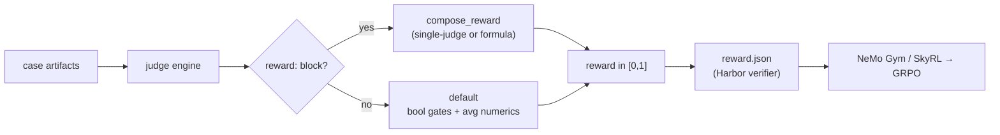

# The Reward API

The reward API collapses a case's per-judge results into a single scalar in
`[0, 1]` — a reward signal for RL training (RLAIF). Your [judges](judges.md)
become the reward model: LLM rubric scores, inline structural checks, and
pairwise preferences fold into one number that an RL framework can optimize.

!!! note "Optional — training only"
    The `reward:` block is only needed when you feed rewards to a training loop.
    The normal [`/eval-run` report](report.md) path never requires it. If you're
    only evaluating a skill, you can ignore this page.

## Where reward fits



The composition logic lives in
[`agent_eval/harbor/reward.py`](https://github.com/opendatahub-io/agent-eval-harness/blob/main/agent_eval/harbor/reward.py);
the config schema is [`RewardConfig`](https://github.com/opendatahub-io/agent-eval-harness/blob/main/agent_eval/config.py).

## Two ways to produce a reward

`reward.judge` and `reward.formula`/`weights` are **mutually exclusive** — the
config fails to load if you combine them.

=== "Single-judge mode"

    One judge's value *is* the reward. Ideal when a judge already emits a
    calibrated `[0, 1]` signal (e.g. a learned reward model).

    ```yaml title="eval.yaml"
    reward:
      judge: my_reward_model   # name of a judge defined above
      normalize: false         # default: clamp the value to [0,1] as-is
      # gate: false            # default is false in judge mode
    ```

    | `normalize` | Behavior |
    | --- | --- |
    | `false` *(default)* | Use the value directly, clamped to `[0, 1]`. |
    | `true` | Map the value from `score_range` to `[0, 1]` first. |

    A missing or skipped judge (value `None`) scores `0.0`.

=== "Formula mode"

    Compose from multiple judges. `formula` selects the sub-mode.

    ```yaml title="eval.yaml — weighted sum"
    reward:
      formula: weighted
      weights:
        quality: 0.7
        efficiency: 0.3
      score_range: [1, 5]      # numeric judge range, normalized to [0, 1]
      raw: [efficiency]        # already [0, 1] — skip normalization
      gate: true
    ```

    ```yaml title="eval.yaml — Python expression"
    reward:
      formula: "0.6 * quality + 0.4 * efficiency"
      score_range: [1, 5]
      raw: [efficiency]
      gate: false
    ```

    `weighted` computes a weight-normalized sum (`Σ wᵢ·vᵢ / Σ wᵢ`). An
    `<expression>` is evaluated with each judge name bound to its normalized
    value. Both results are clamped to `[0, 1]`.

## Field reference

| Field | Type | Default | Notes |
| --- | --- | --- | --- |
| `judge` | str | — | Single-judge mode. Cannot combine with `formula`/`weights`/`raw`. Validated against defined judges at load. |
| `normalize` | bool | `false` | Judge mode only. Map value from `score_range` instead of clamping as-is. |
| `formula` | str | `"weighted"` | `"weighted"` or a Python expression over judge names. |
| `weights` | map | `{}` | Judge → weight. Values must be numeric and non-negative. Used by `weighted` only. |
| `score_range` | `[lo, hi]` | `[1, 5]` | Range used to normalize numeric judge values. Must be increasing. |
| `raw` | list | `[]` | Judge names already in `[0, 1]` — excluded from `score_range` normalization. |
| `gate` | bool | `true` (formula) / `false` (judge) | Any boolean judge returning `false` zeros the reward. |

!!! tip "`score_range` on the judge vs. on the reward"
    A judge's own `score_range` only drives report cell coloring. Reward
    normalization uses **`reward.score_range`** independently — set both when a
    rubric isn't on the default `[1, 5]`.

## Value normalization

Each judge value is turned into a `[0, 1]` float before composition:

| Judge value | Reward contribution |
| --- | --- |
| boolean `true` / `false` | `1.0` / `0.0` |
| numeric, name in `raw` | clamped to `[0, 1]` as-is |
| numeric, otherwise | `(v - lo) / (hi - lo)`, clamped, using `score_range` |
| `None` (missing/skipped) | ignored (or `0.0` in single-judge mode) |

## Gate semantics and the double-gating gotcha

When `gate: true`, the harness scans **every** boolean judge — not just the ones
your formula references — and returns `0.0` if any of them is `false`. This is a
hard structural gate: it fires before the formula runs.

!!! warning "Double-gating"
    If your expression already uses a boolean as its own gate, leave `gate`
    off. For example:

    ```yaml
    reward:
      formula: "passed * quality"   # `passed` gates `quality` inside the expr
      gate: false                   # otherwise `passed=false` zeros twice — redundant,
                                    # and any *other* false boolean would zero it too
    ```

    `gate` defaults to `true` in formula mode and `false` in single-judge mode —
    override it deliberately.

## Resolution order

1. **`reward:` section present** — use it. `judge` mode if `judge` is set,
   otherwise the `formula`/`weights` composition.
2. **No `reward:` block (the default)** — boolean judges gate (any `false` →
   `0.0`); numeric judges are normalized (`score_min`/`score_max` default
   `1.0`/`5.0`) and averaged. If nothing failed and there are no numeric
   judges, the reward is `1.0`.

```python title="default composition (compose_reward)"
# boolean judges gate, numeric judges normalized to [0,1] and averaged
if not gate_ok:
    reward = 0.0
elif normalized_scores:
    reward = sum(normalized_scores) / len(normalized_scores)
else:
    reward = 1.0
```

## Formula safety

Expressions are **not** run through `eval` on raw source. They are parsed to an
AST, validated against an allow-list, then compiled — so a typo or unsafe
construct fails loudly at **config load**, not silently as `0.0` on every case.

| Rule | Detail |
| --- | --- |
| Allowed calls | `min`, `max`, `abs`, `round`, `sum`, `len`, `mean` |
| Allowed ops | `+` `-` `*` `/` `//` `%`, comparisons, boolean/ternary, list/tuple |
| Exponent `**` | **Rejected** — cheap path to a CPU/memory blow-up |
| String/bytes constants | Rejected (numeric arithmetic only) |
| Constant magnitude | Must be ≤ `1e6` |
| Formula size | ≤ 200 AST nodes |
| Last line | Must be an expression (the return value), not an assignment |

Multi-line formulas are allowed; earlier lines may be assignments, and the last
line is the result. Runtime failures (undefined judge name, divide-by-zero)
degrade to reward `0.0` with a warning rather than crashing the run.

## The reward.json Harbor bridge

For containerized runs, [`reward.py`](https://github.com/opendatahub-io/agent-eval-harness/blob/main/agent_eval/harbor/reward.py)
runs the **same** judge engine (`load_judges` + `score_cases` from
`skills/eval-run/scripts/score.py`) inside the trial container as
[Harbor](../guides/harbor.md)'s verifier. Grading is identical whether run
locally or in a Harbor trial.

```bash
python3 -m agent_eval.harbor.reward \
    --config eval.yaml \
    --case-dir . \
    --out-dir /logs/verifier
```

It writes three files into the output dir (`/logs/verifier` by default):

| File | Contents |
| --- | --- |
| `reward.json` | Flat `{reward, <judge>: <num>, ...}` — Harbor reads this |
| `reward.txt` | The scalar reward (Harbor's fallback) |
| `judges.json` | Full per-judge detail (value + rationale) sidecar |

```json title="reward.json"
{
  "reward": 0.875,
  "files_exist": 1.0,
  "rfe_quality": 4.0,
  "revision_quality": 5.0
}
```

!!! note "Suite-level scoring stays above Harbor"
    Pairwise comparison and regression [thresholds](thresholds.md) need ≥2 runs
    or the full set, so they are computed by the suite layer — not inside the
    per-case reward bridge.

## The RL connection: NeMo Gym / SkyRL / GRPO

Harbor is the intermediate layer between the RL training framework and the judge
engine. The task packages from [`/eval-dataset`](../guides/eval-dataset.md) plus
the reward bridge plug in as the verifier (reward function) in all three
ecosystems:

- **NeMo Gym** wraps Harbor's Job API as an RL agent; `reward.json` is read via
  its Harbor agent server.
- **SkyRL** reads `verifier_result.rewards["reward"]` via the Harbor rollout
  interface.
- **Harbor native** reads `reward.json` directly — no adapter.

The reward feeds a GRPO / DAPO policy update (via NeMo RL / TRL / etc.).

!!! info "Done vs. planned"
    | Piece | Status |
    | --- | --- |
    | Judge → `reward.json` bridge | **Done** (battle-tested on OpenShift) |
    | Task packages as Harbor tasks | **Done** |
    | Harbor rollout generation (Podman + K8s) | **Done** |
    | Validation pass (`/eval-run` on a checkpoint) | **Done** |
    | `harbor_agent.yaml` generator | **Planned** |
    | Claude Code NeMo Gym training wrapper (token IDs for GRPO) | **To contribute** |
    | Training Job + vLLM serving on OpenShift | **To build** |

    See [`docs/eval-train-harbor-nemo-skyrl.md`](https://github.com/opendatahub-io/agent-eval-harness/blob/main/docs/eval-train-harbor-nemo-skyrl.md)
    for the full architecture and the `/eval-train` design.

## See also

<div class="grid cards" markdown>

- [**reward reference**](../reference/config/reward.md) — every field, validation rules
- [**judges**](judges.md) — the signals that feed the reward
- [**thresholds**](thresholds.md) — suite-level regression gates
- [**Harbor**](../guides/harbor.md) — containerized execution and the verifier
- [**RL cookbook**](../cookbook/reward-rl.md) — a worked reward-for-training recipe

</div>
