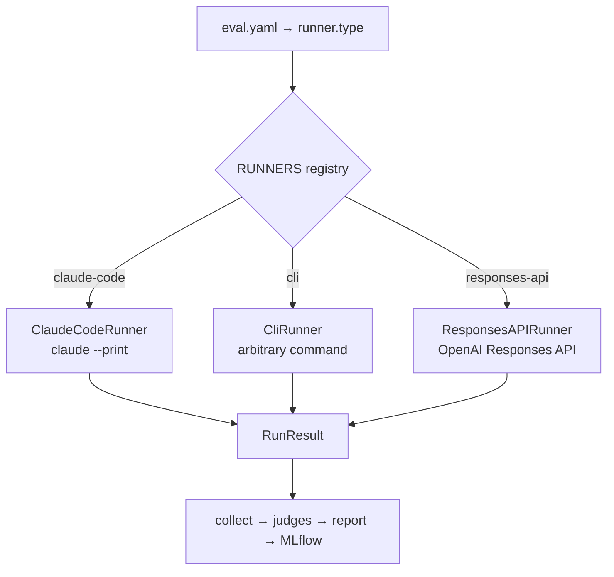

# Runners (agent runtimes)

A **runner** is the *agent runtime* that actually executes a case — the CLI, API, or
process that turns a skill invocation or prompt into work. It is selected in
`eval.yaml` with `runner.type`, and every runner returns the same normalized
`RunResult` so the rest of the harness (collection, scoring, reporting, MLflow) is
runtime-agnostic.

!!! important "Runner ≠ backend"
    A **runner** is *what agent runtime* runs a case (`claude-code`, `cli`,
    `responses-api`) — chosen in `eval.yaml` via `runner.type`. A **backend** is
    *where* the eval runs (Local, [Harbor](../guides/harbor.md),
    [EvalHub](../guides/evalhub.md)) — always chosen by a **CLI flag** (`--runner`),
    never in the config. The same `eval.yaml` runs unchanged across all three
    backends. See [Execution backends](backends.md) for that axis.



## The registry

`runner.type` is a discriminator resolved against a registry in
[`agent_eval/agent/__init__.py`](https://github.com/opendatahub-io/agent-eval-harness/blob/main/agent_eval/agent/__init__.py).

| `runner.type` | Class | Runtime | Notes |
| --- | --- | --- | --- |
| `claude-code` | `ClaudeCodeRunner` | Claude Code CLI (`claude --print`) | **Default.** Full-fidelity: stream-json traces, budget cap, tool interception, subagent capture, permission-denial detection |
| `cli` | `CliRunner` | Any command you provide | Opaque: harness only sees exit code, stdout/stderr, and an optional `metrics.json` |
| `responses-api` | `ResponsesAPIRunner` | OpenAI Responses API (Shell tool + Skills API) | Apples-to-apples cross-runtime comparison; needs `pip install agent-eval-harness[openai]` |

The default is `claude-code`, so `runner:` can be omitted entirely.

## The contract: `EvalRunner` and `RunResult`

Every runner subclasses the `EvalRunner` ABC
([`agent_eval/agent/base.py`](https://github.com/opendatahub-io/agent-eval-harness/blob/main/agent_eval/agent/base.py))
and implements three members:

| Member | Purpose |
| --- | --- |
| `from_config(config, *, log_prefix=None, **overrides)` | Classmethod factory; each subclass pulls the config fields it needs. CLI overrides (resolved models, effort, permissions) take precedence. |
| `name` | Short identifier (`"claude-code"`, `"cli"`, `"responses-api"`). |
| `execute(target, args, workspace, model, ...)` | Run one case in a pre-staged workspace and return a `RunResult`. |

`execute()` takes a uniform signature. The two most important arguments encode
[skill vs prompt mode](../guides/skill-vs-prompt.md):

- **`target`** — the skill name (e.g. `"rfe.review"`) in case/batch mode, or `None`
  in prompt mode. All runners build the prompt as `/{target} {args}` when `target` is
  set, and pass `args` verbatim as the prompt when it is `None`.
- **`args`** — resolved skill arguments, or the raw prompt text in prompt mode.

Other arguments: `workspace` (staged case dir), `model`, `settings_path`,
`system_prompt` (each runner maps this to its runtime — `--append-system-prompt` for
Claude Code, a `developer` message for the Responses API), `max_budget_usd`,
`timeout_s`, and `extra_env` (merged *after* `execution.env`, so hook-produced env
overrides static config).

!!! note "`run_skill()` is deprecated"
    The ABC still exposes `run_skill(skill_name=...)`, which forwards to
    `execute(target=skill_name, ...)` with a `DeprecationWarning`. Call `execute()`.

Whatever the runtime, results are normalized into one `RunResult` dataclass:

| Field | Type | Meaning |
| --- | --- | --- |
| `exit_code` | `int` | `0` = success; `-1` = timeout or harness-level failure |
| `stdout` / `stderr` | `str` | Captured output |
| `duration_s` | `float` | Wall-clock seconds |
| `token_usage` | `dict` | `{"input": N, "output": N}` |
| `cost_usd` | `float` | API spend |
| `num_turns` | `int` | Assistant turns (incl. subagents where captured) |
| `resolved_model` | `str` | Full model ID observed at runtime |
| `models_used` | `list` | All distinct models observed |
| `per_model_usage` / `per_model_turns` | `dict` | Per-model token/cost and turn breakdowns |
| `permission_denials` | `list` | `[{tool_name, tool_use_id, tool_input}]` |
| `raw_output` | `dict` | Runner-specific parsed output |

Fields a runtime can't provide stay `None` — reports and MLflow simply omit them.

## `claude-code` (default)

`ClaudeCodeRunner`
([`claude_code.py`](https://github.com/opendatahub-io/agent-eval-harness/blob/main/agent_eval/agent/claude_code.py))
shells out to the Claude Code CLI in non-interactive mode. The invocation is roughly:

```bash
claude --print \
  --model "$MODEL" \
  --output-format stream-json \   # 'json' when no live logging
  --max-budget-usd "$BUDGET" \
  --verbose \                      # only with live logging
  --effort high \                  # only if runner.effort set
  --plugin-dir <dir> \             # per runner.plugin_dirs entry
  --append-system-prompt "..." \   # if system_prompt set
  --settings <path>                # permissions/hooks/env
# the prompt (/skill args, or raw prompt) is piped on stdin
```

The runner reads the stream line by line, injecting timestamps and printing live
progress (skill invocations, tool calls, permission denials, final cost). A watchdog
thread kills the process at the deadline. From the stream it extracts usage, cost,
turn counts, resolved model(s), and the structured `permission_denials` array from
the `result` event.

**Highlights specific to this runner:**

- **Budget** is enforced server-side via `--max-budget-usd`.
- **Permissions** — simple string patterns become `--allowed-tools` /
  `--disallowed-tools`; path-based rules are compiled into a temporary
  `.eval-permissions.json` merged with the workspace settings. See
  [permissions](../reference/config/permissions.md).
- **Subagents** — session persistence stays on so `SubagentStop` hooks can copy
  subagent transcripts; the session dir under `~/.claude/projects/` is cleaned up
  post-run.
- Full [tool interception](tool-interception.md), [lifecycle hooks](lifecycle-hooks.md),
  and [stream-json tracing](tracing.md) all require this runner.

### The environment allowlist

Unlike the opaque CLI runner, the Claude Code runner does **not** inherit your full
environment — it executes agent-generated tool calls, so it forwards only an
allowlist of keys (`_SAFE_ENV_KEYS`): `PATH`, `HOME`, `USER`, `SHELL`, `LANG`,
`ANTHROPIC_*` (API key / auth token / base URL / Vertex + default model overrides),
`CLAUDE_CODE_*`, Google Cloud credentials, `MLFLOW_TRACKING_URI` /
`MLFLOW_EXPERIMENT_NAME`, and `AGENT_EVAL_RUNS_DIR`.

!!! warning "Forwarding extra env vars"
    To pass anything *not* on the allowlist (e.g. a `JIRA_TOKEN` the skill needs), add
    it under `runner.env` or `execution.env`. Values starting with `$` are resolved
    from the caller's environment (`JIRA_TOKEN: $JIRA_TOKEN`). See
    [environment variables](../reference/environment-variables.md).

## `cli` (opaque CLI runner)

`CliRunner`
([`cli_runner.py`](https://github.com/opendatahub-io/agent-eval-harness/blob/main/agent_eval/agent/cli_runner.py))
delegates to an arbitrary `runner.command` — any string (shell-parsed) or list of
args. This is how you evaluate non-Claude runtimes (OpenCode, Codex, a bespoke
harness). The full contract lives in
[`docs/opaque-cli-runner-contract.md`](https://github.com/opendatahub-io/agent-eval-harness/blob/main/docs/opaque-cli-runner-contract.md);
see also the [OpenCode cookbook](../cookbook/cross-runner-opencode.md).

```yaml title="eval.yaml"
runner:
  type: cli
  command: "my-runner run {agent} --model {model} --out {output_dir}"
```

### Placeholders

The command template is resolved before execution (string values are `shlex.quote`d):

| Placeholder | Value |
| --- | --- |
| `{agent}` | Skill name (case/batch) or empty (prompt mode) |
| `{workspace}` | Absolute case-workspace path |
| `{output_dir}` | Absolute `{workspace}/output` (pre-created) |
| `{model}` | Model id (`--model` / `models.skill`) |
| `{subagent_model}` | `models.subagent` (empty if unset) |
| `{timeout}` | Timeout in seconds |
| `{max_budget_usd}` | Budget cap (**advisory — not enforced**) |
| `{effort}` | `runner.effort` (empty if unset) |
| `{system_prompt}` | `runner.system_prompt` (empty if unset) |
| `{args}` | Resolved skill arguments |
| `{field}` | Any field from the case's `input.yaml` (never overrides a builtin) |

### What the command must do

| Requirement | Why |
| --- | --- |
| Exit `0` on success, non-zero on failure | Exit code drives pass/fail in scoring |
| Write artifacts to `{output_dir}` (or declared `outputs[*].path`) | `collect.py` scans these for judges |
| Finish before `{timeout}` seconds | Harness SIGKILLs the process group at the deadline (records exit `-1`) |

### `metrics.json` — the only way to report cost

Because the process is opaque, token/cost data must be written by the command to
`{output_dir}/metrics.json`. Without it, `token_usage`, `cost_usd`, and `num_turns`
report as `None` and cost tables in the report are empty. All fields are optional:

```json title="{output_dir}/metrics.json"
{
  "token_usage": {"input": 1500, "output": 800},
  "cost_usd": 0.03,
  "num_turns": 4,
  "model": "claude-sonnet-4-20250514",
  "models_used": ["claude-sonnet-4-20250514", "claude-haiku-4-5-20251001"],
  "per_model_usage": {
    "claude-sonnet-4-20250514": {"input": 1200, "output": 600, "cost_usd": 0.025}
  },
  "per_model_turns": {"claude-sonnet-4-20250514": 3}
}
```

!!! warning "Claude-Code-only features don't apply"
    Budget enforcement, tool interception / AskUserQuestion answering, stream-json
    tracing, subagent transcript capture, permission-denial detection, and real-time
    progress logging all require the `claude-code` runner. The opaque runner inherits
    your **full** `os.environ` (commands come from the eval author, not untrusted
    input); `runner.env` adds keys on top with `$VAR` resolution.

## `responses-api`

`ResponsesAPIRunner`
([`responses_api.py`](https://github.com/opendatahub-io/agent-eval-harness/blob/main/agent_eval/agent/responses_api.py))
runs the *same* harness skills via the OpenAI Responses API — Shell tool plus the
Skills API — in hosted containers, for apples-to-apples comparison against
`claude-code` (same skill, same cases, different runtime). Per case it:

1. uploads the skill directory → `skill_id` (cached process-wide across cases),
2. creates an isolated container, uploads the workspace files,
3. executes via `POST /v1/responses` with the `shell` tool bound to the container,
4. downloads new/modified files back into the workspace,
5. deletes the container.

Configure it under `runner.settings`:

```yaml title="eval.yaml"
runner:
  type: responses-api
  settings:
    base_url: "..."          # or OPENAI_BASE_URL
    api_key: "..."           # or OPENAI_API_KEY
    default_model: "..."     # or OPENAI_MODEL, or --model
    memory_limit_mb: 512     # snapped to nearest tier (1g/4g/16g/64g)
    network_policy: { ... }  # optional container network policy
```

!!! note "Not wired"
    `settings_path` and `max_budget_usd` are accepted for ABC compatibility but the
    Responses API exposes no equivalent knobs, so they have no effect here.

## Choosing a runner

=== "Test a Claude Code skill"

    Use the default. You get budget caps, tool interception, and full tracing for free.

    ```yaml
    # runner: block can be omitted entirely
    ```

=== "Evaluate a different agent runtime"

    Wrap it in a command with the opaque CLI runner and emit `metrics.json` for cost.

    ```yaml
    runner:
      type: cli
      command: "opencode run {agent} --model {model}"
    ```

=== "Compare Claude vs OpenAI on the same skill"

    Run once with `claude-code`, once with `responses-api`, and diff the reports.

    ```yaml
    runner:
      type: responses-api
      settings: { default_model: gpt-5 }
    ```

## Adding a runner

Runners are pluggable — the harness only ever talks to the ABC:

1. Subclass `EvalRunner` and implement `from_config()`, `name`, and `execute()`,
   returning a normalized `RunResult`.
2. Register it in the `RUNNERS` dict in `agent_eval/agent/__init__.py` under a new
   `runner.type` key.
3. Populate as many `RunResult` fields as your runtime can; leave the rest `None`.

Once registered, that `runner.type` works across the Local and
[EvalHub](../guides/evalhub.md) backends (which dispatch through `RUNNERS`
directly). [Harbor](../guides/harbor.md) instead maps `runner.type` to a Harbor
agent name, so a new opaque runtime is reached there via Harbor's own agent, not this
registry.

## See also

<div class="grid cards" markdown>

- [**Execution backends**](backends.md) — Local vs Harbor vs EvalHub (the `--runner` flag)
- [**runner (config reference)**](../reference/config/runner.md) — every `runner.*` key
- [**Skill vs prompt mode**](../guides/skill-vs-prompt.md) — what `target`/`args` encode
- [**Cross-runner: OpenCode**](../cookbook/cross-runner-opencode.md) — an opaque CLI runner end to end

</div>
