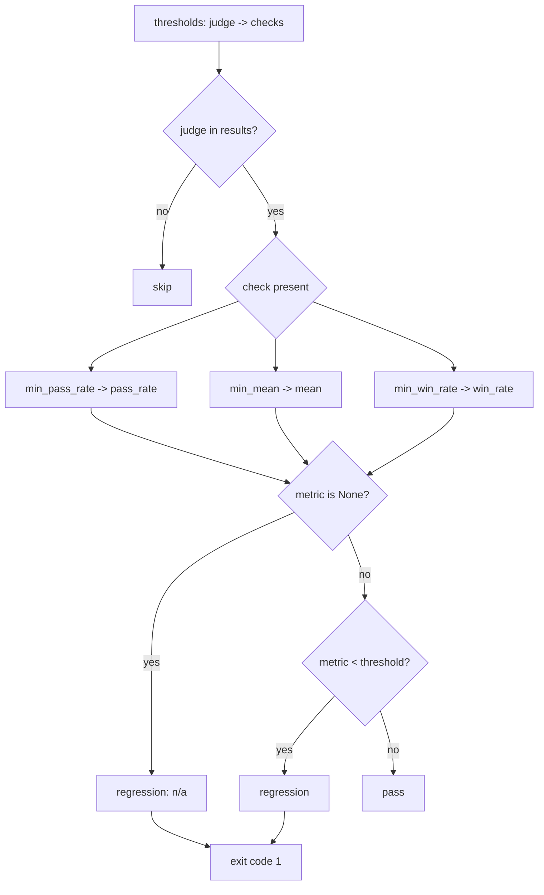

# Regression thresholds

Thresholds turn judge scores into a **pass/fail gate**. After scoring, the harness
compares each judge's aggregate against the minimums you declare in `eval.yaml` and
**exits non-zero** if any is missed — so a regression fails a CI job instead of quietly
landing in a report.

```yaml title="eval.yaml"
thresholds:
  has_content:    { min_pass_rate: 1.0 }   # boolean judge
  output_quality: { min_mean: 3.5 }        # numeric (1–5) judge
  pairwise:       { min_win_rate: 0.6 }     # pairwise comparison
```

Each key under `thresholds` is a **judge name**; each value is a dict of one or more
threshold checks.

## The three threshold keys

Every threshold is a *minimum*: the run passes when the metric is `>=` the value. Which
key you use must match the **value type the judge produces**.

| Key | Judge type | Metric compared | Value range |
| --- | --- | --- | --- |
| `min_pass_rate` | Boolean (`return True/False`, `feedback_type: bool`) | Fraction of cases that passed | `0.0`–`1.0` |
| `min_mean` | Numeric (score `1`–`5`) | Mean score across cases | matches the score scale |
| `min_win_rate` | [Pairwise](pairwise-and-sampling.md) | Win rate vs. a baseline run | `0.0`–`1.0` |

!!! note "How aggregates are derived"
    The harness aggregates each judge across all cases before checking thresholds:

    - **Boolean judges** get a `pass_rate` (fraction of `True`), and `mean` is set to the
      same value. So `min_mean` *also* works on a boolean judge — `0.9` means "90% passed".
    - **Numeric judges** get a `mean`; their `pass_rate` is always `None`.
    - `win_rate` is populated only for a pairwise judge, and only when a baseline
      comparison actually ran.

## Match the key to the judge's value type

This is the most common misconfiguration. A `min_pass_rate` on a numeric judge, or a
`min_mean` on a judge that was skipped for every case, has **no metric to compare** — and
that is *not* silently ignored.

!!! warning "A missing metric is reported AS a regression"
    When a configured threshold's metric is `None` (the judge was skipped for all cases,
    or the key targets the wrong judge type), the harness records it as a regression with
    an `n/a` value rather than skipping it. The rationale: a threshold you asked for but
    that can never evaluate is a mistake worth surfacing, not hiding.

    ```text
    REGRESSIONS: 1 detected
      [output_quality] pass_rate: >= 0.9 -> n/a
    ```

    The detail explains why, e.g. *"pass_rate unavailable — judge skipped for all cases
    or not a boolean judge"*. Fix it by switching to `min_mean` for the numeric judge (or
    by ensuring the judge isn't `if`-skipped for every case).

!!! tip "Unknown keys and unknown judges are silently ignored"
    Thresholds are stored as-is at config load — there is no key-name validation. A typo
    like `min_pass` (instead of `min_pass_rate`) simply does nothing, and a threshold
    naming a judge that doesn't exist in the results is skipped. Only the three keys above
    are honored.

## How detection works



You can define several checks for one judge; each is evaluated independently and any
failure counts.

## Exit-code gating

Thresholds are enforced in two places, both of which `exit(1)` on any regression:

=== "During a run"

    `/eval-run` (which calls `score.py judges`) checks thresholds at the end of scoring:

    ```text
      REGRESSIONS: 1 detected
        [output_quality] mean: >= 3.5 -> 3.1
    ```

    A non-zero exit fails the surrounding CI step. See the [CI guide](../guides/ci.md).

=== "As a standalone check"

    Re-check a completed run's saved `summary.yaml` without re-scoring:

    ```bash
    python3 skills/eval-run/scripts/score.py regression \
      --run-id <id> --config eval.yaml
    ```

    Prints `REGRESSIONS: 0` and exits `0` when clean, or lists each regression and exits
    `1` otherwise.

## Optional baseline comparison

Pass a prior run to also flag **relative degradation**, independent of the absolute
minimums above:

```bash
python3 skills/eval-run/scripts/score.py regression \
  --run-id <id> --baseline <prior-id> --config eval.yaml
```

For each judge present in both runs, the current `mean` and `pass_rate` are compared to
the baseline's. A drop of **more than 0.5** (absolute) is reported as a
`<metric>_vs_baseline` regression:

```text
  [output_quality] mean_vs_baseline: 4.2 -> 3.4   Degraded vs baseline
```

!!! note "0.5 is a fixed absolute delta"
    The baseline tolerance is hard-coded, not configurable per judge. It catches a real
    slide (a full half-point on a 1–5 mean, or 50 percentage points on a rate) while
    absorbing normal judge noise. Use `min_mean` / `min_pass_rate` for the absolute floor
    and the baseline for drift detection.

## See also

<div class="grid cards" markdown>

- [**thresholds reference**](../reference/config/thresholds.md) — every field and its schema
- [**Judges**](judges.md) — the value types thresholds gate on
- [**Pairwise & sampling**](pairwise-and-sampling.md) — where `win_rate` comes from
- [**CI integration**](../guides/ci.md) — turning exit codes into build gates
- [**Reward API**](reward-api.md) — collapsing judges into a single RL scalar instead

</div>
