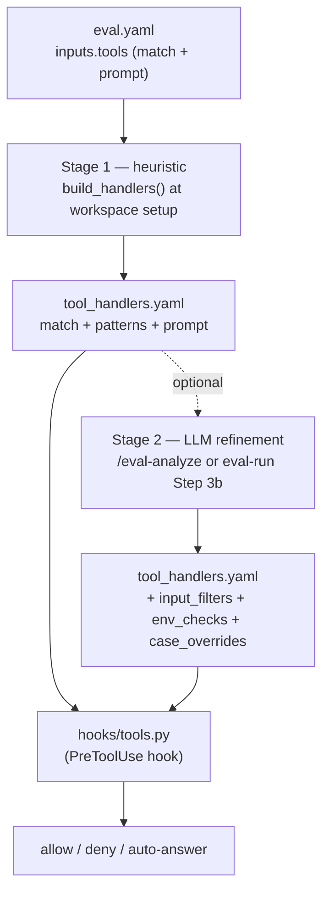

# Tool interception

Headless eval runs have no human at the keyboard, yet skills still ask questions
(`AskUserQuestion`) and reach out to external services (Jira, Slack, MCP servers).
Tool interception wires a **`PreToolUse` hook** into every workspace so those calls
are auto-answered, gated, or denied deterministically — described in natural language
in `eval.yaml`, resolved into concrete rules before the run.

!!! abstract "The moving parts"
    You write `inputs.tools` (two natural-language fields). The harness generates
    `tool_handlers.yaml` (patterns + runtime checks), a `.claude/settings.json`
    `PreToolUse` block, and copies the interceptor script `hooks/tools.py` into the
    workspace. At runtime the hook reads `tool_handlers.yaml` and decides.

## What you author

`inputs.tools` is a list of handlers. Each handler has just three keys, all optional
except that you need `match`:

| Field | Purpose |
| --- | --- |
| `match` | Natural language: *what* to intercept (tool names, scripts, APIs). |
| `prompt` | Natural language: *how* to handle it. Also passed to the LLM answerer as context for `AskUserQuestion`. |
| `prompt_file` | Path to an external file with the same instruction (used if `prompt` is empty). |

```yaml title="eval.yaml"
inputs:
  tools:
    - match: "Questions asked to the user via AskUserQuestion."
      prompt: |
        Answer based on the test case context in input.yaml and answers.yaml.
        Default: pick the first option or answer "yes" for confirmations.

    - match: "Any Jira interaction via MCP tools or scripts calling the Jira API."
      prompt: "Only allow if JIRA_SERVER points to a test instance or emulator."
```

See the full field reference in [inputs.tools](../reference/config/inputs-tools.md).

## Two-stage resolution

The natural-language `match`/`prompt` are turned into an executable
`tool_handlers.yaml` in two stages. The first is a cheap heuristic that always runs;
the second is an optional LLM refinement.



=== "Stage 1 — heuristic (always)"

    `agent_eval/tools/interception.py` scans the `match` text for known tool names
    and `mcp__*` patterns and writes `patterns` into `tool_handlers.yaml`. It is a
    keyword match, not an interpretation of intent:

    - Known tools it recognizes: `AskUserQuestion`, `Bash`, `Read`, `Write`, `Edit`,
      `Glob`, `Grep`, `Agent`, `Skill`.
    - Any `mcp__…` token in the text becomes a pattern (glob `*` suffix allowed).
    - If nothing matches but the text mentions "script" or "api", it falls back to
      `Bash`; otherwise the pattern is the catch-all `"*"`.

=== "Stage 2 — LLM refinement (optional)"

    An LLM reads the `prompt` and adds the concrete runtime checks —
    `input_filters`, `env_checks`, `case_overrides`. This happens either in
    `/eval-analyze` (writing a resolved `tool_handlers.yaml` alongside `eval.yaml`)
    or in `/eval-run` **Step 3b** against the workspace copy. If a pre-resolved file
    exists, `generate_interception()` uses it as-is and skips the heuristic.

!!! tip "Resolve Bash and service gates before you rely on them"
    The heuristic only fills in `patterns`. Gating by command content or environment
    (`input_filters`, `env_checks`) requires Stage 2. Without it a `Bash` handler is
    treated as misconfigured and skipped (see below).

## The generated `tool_handlers.yaml`

```yaml title="tool_handlers.yaml"
handlers:
  - match: "Questions asked to the user via AskUserQuestion."
    patterns: ["AskUserQuestion"]
    prompt: |
      Answer based on the test case context in input.yaml and answers.yaml.

  - match: "Any Jira interaction via MCP tools or scripts."
    patterns: ["Bash", "mcp__atlassian__*"]
    input_filters: ["jira", "JIRA_SERVER", "jira-python"]   # Stage 2
    env_checks:                                             # Stage 2
      JIRA_SERVER:
        must_contain: ["localhost", "emulator", "127.0.0.1", "test"]
    prompt: "Only allow if JIRA_SERVER points to a test instance."

# LLM model for AskUserQuestion answering (from models.hook)
hook_model: claude-haiku-4-5-20251001

# Optional exact-match answers, checked before the LLM tier
case_overrides:
  "What priority should this have?": "Normal"
```

| Field | Set by | Used by | Purpose |
| --- | --- | --- | --- |
| `match` | Stage 1 (from eval.yaml) | LLM in Stage 2 | Description of what to intercept. |
| `patterns` | Stage 1 (heuristic) | `tools.py` | Tool-name patterns, exact or `prefix*` glob. |
| `input_filters` | Stage 2 | `tools.py` | Regex list matched against Bash command text (case-insensitive). |
| `env_checks` | Stage 2 | `tools.py` | Per-var `must_contain` substring gate; **all** must pass to allow. |
| `prompt` / `prompt_file` | Stage 1 (from eval.yaml) | LLM in Stage 2, `tools.py` | Handling instruction + `AskUserQuestion` context. |
| `hook_model` | Stage 1 (from `models.hook`) | `tools.py` | Model for LLM answering. Defaults to `claude-haiku-4-5-20251001`. |
| `case_overrides` | Stage 2 (optional) | `tools.py` | Exact question→answer map, checked before the LLM. |

## How the hook decides at runtime

`hooks/tools.py` runs for every intercepted tool call, reads `tool_handlers.yaml`,
finds the first matching handler, and acts by tool type. Unmatched tools pass through
(`exit 0`).

### AskUserQuestion — 3-tier answering

For each question the hook resolves an answer in order:

1. **Exact match** — the question text is looked up in `case_overrides`.
2. **LLM call** — if no override and options exist, `hook_model` is called with the
   question, options, the handler `prompt`, and the case context read from
   `input.yaml` + `answers.yaml` in the working directory. The reply must resolve to
   one of the option labels (with a lenient fuzzy fallback).
3. **Fallback** — the first option's label, or `"yes"`.

It then returns `permissionDecision: "allow"` with `updatedInput.answers` filled in.

!!! warning "PII / secrets warning"
    Tier 2 sends the case files (`input.yaml` and `answers.yaml`) to the LLM API as
    context. **Do not put secrets, credentials, or PII in these files.** If a case
    needs deterministic, offline answers, use `case_overrides` (tier 1) instead —
    it never leaves the process.

### Bash and MCP service gating

Handlers that match a service (Bash scripts, `mcp__*` tools) gate on environment and
command content rather than answering:

- **MCP tools** (e.g. `mcp__atlassian__*`) match by pattern. With `env_checks` they
  allow only when every var passes; without `env_checks`, a matched handler
  **denies by default** (matched but no check defined).
- **Bash** requires *both* `Bash` in `patterns` *and* the command matching at least
  one `input_filters` regex — so `ls -la` slips through while a `jira` command is
  gated. If it matches and `env_checks` are present, the same env validation applies.

!!! danger "A Bash handler with no `input_filters` is a footgun"
    Without filters, `Bash` in `patterns` would match *every* Bash command and the
    hook's default-deny would block the entire skill. To prevent that, such a handler
    is treated as misconfigured: the hook logs a stderr warning and **skips** it
    (pass-through). Resolve `input_filters` in Stage 2 before depending on it.

Denials return `permissionDecision: "deny"` with a human-readable `reason` that
surfaces in the trace.

## One generator, local and Harbor alike

`generate_interception()` in `agent_eval/tools/interception.py` produces the same
three artifacts for both execution paths, so a run behaves identically whether it's
local or containerized:

```python
generate_interception(target_dir, config, hooks_command, resolved_handlers_path)
# writes: hooks/tools.py, tool_handlers.yaml, .claude/settings.json (PreToolUse)
```

- **Local** — `skills/eval-run/scripts/workspace.py` writes into each case workspace;
  the hook command points at `hooks/tools.py`.
- **Harbor** — `agent_eval/harbor/tasks.py` writes into the task's `environment/`
  directory so the containerized agent gets the identical interceptor. See the
  [Harbor guide](../guides/harbor.md).

The generator also carries your [`permissions`](../reference/config/permissions.md)
allow/deny rules (compiling path-based rules into valid Claude Code patterns) and
injects `execution.env` into `.claude/settings.json`.

## How judges see intercepted calls

Interception is orthogonal to scoring, but the two connect through `outputs`. When an
`outputs` entry has a `tool:` field, `score.py` extracts the matching tool calls from
the stream-json events into `outputs["tool_calls"]`, so a [judge](judges.md) can
assert on them:

```yaml
judges:
  - name: jira_created
    check: |
      calls = outputs.get("tool_calls", [])
      jira = [c for c in calls if "create_issue" in c.get("name", "")]
      if not jira:
          return False, "No Jira issue created"
      return True, f"Created: {jira[0]['input'].get('title', '?')}"
```

## Related

<div class="grid cards" markdown>

- [**inputs.tools reference**](../reference/config/inputs-tools.md) — the config fields in full
- [**Lifecycle hooks**](lifecycle-hooks.md) — shell hooks around the run
- [**Permissions**](../reference/config/permissions.md) — allow/deny patterns for headless runs
- [**Judges**](judges.md) — asserting on captured `tool_calls`

</div>
