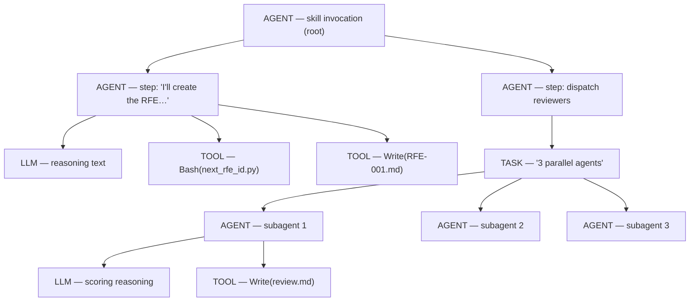

# MLflow tracing

The harness turns Claude Code's raw `stream-json` output into rich, **hierarchical MLflow traces** — an agent/tool/subagent span tree with timing, cost, and token usage. The same builder powers the eval pipeline and the standalone `claude-trace` CLI, so eval traces and production traces are structurally identical and directly comparable in the MLflow UI.

!!! info "Two independent tracing paths"
    This page is mostly about the **stream-json path** the harness builds post-hoc. Claude Code also has a separate **native OTel/OTLP path** that emits spans live over the wire. They are distinct — see [Native OTel/OTLP](#native-otelotlp-a-separate-path) at the end.

## MLflow is opt-in

Tracking is enabled **by the presence of the `mlflow:` block** in `eval.yaml` — not by the top-level `name:`. Omit the block entirely and no experiment is created and nothing is pushed (this avoids accidentally polluting a shared tracking server).

```yaml title="eval.yaml"
mlflow:
  experiment: my-skill-eval        # defaults to the eval's `name:` if omitted
  tracking_uri: http://mlflow:5000 # optional; see precedence below
  tags:                            # optional; applied to every logged run
    team: platform
```

| Field | Purpose | Default |
| --- | --- | --- |
| `experiment` | Experiment name | The eval's top-level `name:` (only when the block is present) |
| `tracking_uri` | MLflow server URI | Falls back to `$MLFLOW_TRACKING_URI`, then localhost |
| `tags` | Tags applied to every run logged for this eval | `{}` |

### Tracking URI precedence

`resolve_tracking_uri()` (`agent_eval/mlflow/experiment.py`) resolves the server in a fixed order:

```text
mlflow.tracking_uri  (eval.yaml)
        ↓  if unset
MLFLOW_TRACKING_URI  (environment)
        ↓  if unset
http://127.0.0.1:5000  (local default)
```

!!! tip "See it in the reference"
    Full field docs live in the [mlflow config reference](../reference/config/mlflow.md), and `MLFLOW_TRACKING_URI` / `MLFLOW_EXPERIMENT_NAME` in [environment variables](../reference/environment-variables.md).

## What gets captured: `traces.*`

The `traces:` block toggles **which raw execution data** the runner captures per case. These files are what judges read and what the trace builder consumes.

```yaml title="eval.yaml"
traces:
  stdout: true    # capture stdout.log (the stream-json event log)
  stderr: true    # capture stderr.log
  events: true    # parse JSONL into events.json
  metrics: true   # capture run_result.json (exit code, tokens, cost, model)
```

| Toggle | Captures | Default |
| --- | --- | --- |
| `stdout` | `stdout.log` — the full `stream-json` event log | `true` |
| `stderr` | `stderr.log` | `true` |
| `events` | `events.json` — parsed JSONL events | `true` |
| `metrics` | `run_result.json` — exit code, duration, tokens, cost, model, per-model usage | `true` |

!!! warning "The trace builder needs the raw stream-json"
    Hierarchical traces are reconstructed from `stdout.log`. If `stdout` capture is off (or the log is missing), `build_trace()` returns `None` and no trace is pushed. See the [traces config reference](../reference/config/traces.md).

## Post-hoc hierarchical trace building

Rather than instrumenting the agent live, the harness reads the completed `stream-json` log and reconstructs the span tree after the run — `build_trace()` in [`agent_eval/mlflow/trace_builder.py`](https://github.com/opendatahub-io/agent-eval-harness/blob/main/agent_eval/mlflow/trace_builder.py). This yields one consolidated trace per invocation, even when the skill spawns background agents.

### Span types

| Span type | Represents |
| --- | --- |
| `AGENT` | The root skill invocation, each reasoning **step**, and each subagent |
| `LLM` | A reasoning/text segment emitted by the model (main agent or subagent) |
| `TOOL` | A single tool call (`Bash`, `Read`, `Write`, `Edit`, `Skill`, `Glob`, …) |
| `TASK` | A group wrapping a **parallel batch** — named `N parallel agents` or `N parallel calls` |

Segments are grouped into **steps** (one LLM output + the tools it triggered). Tool calls before the first LLM text land in a `Setup` step. Background-agent status updates (e.g. `RFE-014 created. 1/20 complete…`) are merged into the dispatch step rather than creating spurious steps.



### How the structure is derived

- **Parallel batches** — consecutive `tool_use` blocks with no intervening `tool_result` are one batch. A `tool_result` appearing mid-batch forces a boundary. Batches of length > 1 get a wrapping `TASK` span.
- **Subagent nesting** — children come from two sources: inline events carrying a `parent_tool_use_id` (foreground subagents), and per-subagent `.jsonl` transcripts captured by a **`SubagentStop` hook** into `<run-dir>/subagents/` (background agents). The builder only reads those saved copies — never a path pulled from stream content — and verifies the resolved path stays under the subagent dir (guards against CWE-22/CWE-73 path traversal).
- **Background-agent timing** — a background `Agent` returns an immediate "async launched" `tool_result`, so its true end time is taken from the matching `task_notification` (`status: completed`) event instead.
- **Timestamps** — the runner injects wall-clock timestamps onto assistant events (`claude --print` doesn't emit them) and a synthetic user event for the prompt (it isn't recorded either).

!!! warning "Why not the native MLflow Stop hook?"
    Claude Code ships a `Stop`-hook autologger (`mlflow autolog claude`). The harness deliberately avoids it during evals: the Stop hook fires once **per session**, so a skill using background agents produces N+1 fragmented traces instead of one. During eval runs the harness injects **env vars only** (via `inject_tracing_env()`) and builds the consolidated trace post-hoc.

## Cost and token conventions

The builder follows MLflow's Anthropic / claude_code conventions so the MLflow **Usage** and **Cost Over Time** dashboards render correctly.

=== "Cost distribution"

    Per-model cost is **distributed evenly across that model's `LLM` spans** via `mlflow.llm.cost`. The root `AGENT` span deliberately carries **no** cost attribute — setting it there would double-count against the summed span costs. The trace total is set separately as `mlflow.trace.cost` (with a per-model breakdown when `per_model_usage` is present).

    !!! note "Model-name normalization"
        `per_model_usage` keys may use `@` (`claude-sonnet-4-5@20250929`) while span attributes use `-` (`claude-sonnet-4-5-20250929`). The builder matches both forms when assigning per-span cost.

=== "Token usage"

    `mlflow.trace.tokenUsage` splits tokens into distinct lines so cached vs. fresh input show separately:

    | Key | Meaning |
    | --- | --- |
    | `input_tokens` | Fresh (non-cached) input |
    | `output_tokens` | Output |
    | `total_tokens` | `input_tokens + output_tokens` (**cache excluded**) |
    | `cache_read_input_tokens` | Cache reads (optional) |
    | `cache_creation_input_tokens` | Cache writes (optional) |

    Cost stays separate from token counts (via `mlflow.llm.cost` / `mlflow.trace.cost`), which is why cache tokens — usually the bulk of the volume — don't inflate the cost math.

## The `claude-trace` CLI

`claude-trace` ([`agent_eval/cli/trace_run.py`](https://github.com/opendatahub-io/agent-eval-harness/blob/main/agent_eval/cli/trace_run.py)) is a **drop-in replacement for `claude --print`** that captures the stream-json, saves artifacts, and pushes the same hierarchical trace — outside the eval pipeline (CI, cron, ad-hoc runs). It uses the exact `build_trace()` the eval pipeline does, so production and eval traces line up.

```bash
# Pipe the prompt (same as claude --print)
echo "/rfe.speedrun --input batch.yaml --headless" | claude-trace --model opus

# Prompt as an argument
claude-trace --model opus -p "/rfe.create 'GPU autoscaling'"
```

It forces `--print --output-format stream-json --verbose`, passes every other flag through to `claude`, and injects a `SubagentStop` hook to capture subagent transcripts.

| Flag | Effect |
| --- | --- |
| `-p "<prompt>"` | Prompt as argument (alternative to stdin) |
| `--experiment <name>` | Experiment name (overrides `$MLFLOW_EXPERIMENT_NAME`) |
| `--trace-dir <path>` | Where to save logs (default: `tmp/trace-runs/<timestamp>`) |
| `--no-mlflow` | Capture logs but skip the MLflow push |
| *all others* | Passed through to `claude --print` (`--model`, `--max-budget-usd`, …) |

Each run writes `stdout.log`, `run_result.json`, and `subagents/*.jsonl` to the trace dir. With `--no-mlflow` you can capture offline and push later once a server is reachable.

## Native OTel/OTLP: a separate path

Independent of the stream-json builder, Claude Code can emit **OpenTelemetry spans live** to an OTLP endpoint (MLflow exposes `/v1/traces`). This is the path the batch-agent CI pipelines use — no post-hoc reconstruction, spans are exported during the run and forwarded to MLflow after the job.

Enable it with Claude Code's own env vars:

| Variable | Value | Purpose |
| --- | --- | --- |
| `OTEL_TRACES_EXPORTER` | `otlp` | Enable span export |
| `CLAUDE_CODE_ENHANCED_TELEMETRY_BETA` | `1` | Rich span hierarchy (tool nesting, subagent spans) |
| `OTEL_LOG_USER_PROMPTS` | `1` | Include user prompt text |
| `OTEL_LOG_TOOL_DETAILS` | `1` | Include tool input parameters |
| `OTEL_LOG_TOOL_CONTENT` | `1` | Include tool output/results |

The native hierarchy uses Claude Code's own span names (`claude_code.interaction`, `claude_code.llm_request`, `claude_code.tool`, `claude_code.hook`), and W3C trace context (`TRACEPARENT` / `TRACESTATE`) propagates into subagents so a whole invocation shares one trace ID.

!!! note "Which path should I use?"
    The **stream-json path** (`claude-trace` / `/eval-mlflow`) is the harness default — it produces the consolidated, comparable traces the eval report and dashboards expect. The **native OTLP path** is for live telemetry in existing CI pipelines that already export OTel. They are not combined; pick one per pipeline.
