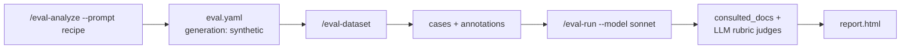

# Agentic documentation testing

A complete, worked recipe for evaluating whether AI agents can navigate and
correctly use a repository's **agentic documentation** (`CLAUDE.md`,
`AGENTS.md`, `ai-docs/`, …). This is the deep-dive companion to the
[agentic-docs quickstart](../get-started/agentic-docs.md): it walks the full
7-step analysis methodology, the repo-type taxonomy, the `generation: synthetic`
block, the `consulted_docs` + LLM rubric judge pairing, and the
`workspace_mode: repo` + answer-key `permissions.deny` guard — end to end.

!!! abstract "What this recipe produces"
    A **prompt-mode** `eval.yaml` (no skill under test) with a
    `generation: synthetic` block, an LLM-authored dataset of documentation
    questions, and a scored report that shows whether agents found and read the
    right docs — rather than answering from training memory.

## When to reach for it

Prompt mode with `workspace_mode: repo` tests a *capability* — "can an agent
operate from my docs alone?" — not a skill's output. It answers:

| Capability | Question it answers | Builtin seed |
| --- | --- | --- |
| **Doc navigation** | Can the agent find the right file for a question? | `docs/navigation` |
| **Pattern application** | Can it create content following documented patterns? | `docs/authoring` |
| **Constraint compliance** | Does it reject approaches the docs forbid? | `docs/anti-pattern` |
| **API usage** | Can it explain an API/component with correct examples? | `docs/component-usage` |
| **Architecture** | Can it explain how components interact? | `docs/architecture` |

The five seeds map one-to-one to the builtin generation prompts under
[`agent_eval/prompts/docs/`](https://github.com/opendatahub-io/agent-eval-harness/blob/main/agent_eval/prompts/docs/).
See the [builtin prompts reference](../reference/builtin-prompts.md).

## The end-to-end flow



```bash
# 1. Analyze the docs → prompt-mode eval.yaml
/eval-analyze --prompt examples/openshift-agentic-docs.md

# 2. Generate synthetic cases from seeds + context
/eval-dataset

# 3. Run the agent against the docs
/eval-run --model sonnet

# 4. Read the scored report
open eval/runs/<run-id>/report.html
```

## The 7-step analysis methodology

`/eval-analyze --prompt` runs a recipe prompt that drives the agent through a
fixed sequence. The bundled OpenShift recipe lives at
[`examples/openshift-agentic-docs.md`](https://github.com/opendatahub-io/agent-eval-harness/blob/main/examples/openshift-agentic-docs.md);
copy it and swap the terminology to target another domain (see
[`examples/README.md`](https://github.com/opendatahub-io/agent-eval-harness/blob/main/examples/README.md)
and the [custom analysis recipe](custom-analysis-recipe.md) cookbook).

| Step | What analysis does | Feeds into |
| --- | --- | --- |
| **1. Discover doc structure** | Find the entry point (`CLAUDE.md`/`AGENTS.md`), enumerate doc areas, sample 3-5 docs per area | Step 3 |
| **2. Classify repo type** | Label the repo A / B / C (below) | test focus + seeds |
| **3. Extract generation context** | Capture `documentation_structure`, `constraints`, `apis`, `components` from *actual* paths | `generation.context` |
| **4. Pick generation seeds** | Choose builtin `docs/*` prompts + counts per type | `generation.seeds` |
| **5. Write dataset schema** | Describe what each case's `input.yaml`/`annotations.yaml` holds | `dataset.schema` |
| **6. Select judges** | Pair mechanical `consulted_docs` with semantic LLM judges | `judges` |
| **7. Emit eval.yaml** | Assemble prompt-mode config + `workspace_mode: repo` + `permissions.deny` | the config |

!!! tip "Use actual paths, not placeholders"
    Every field name, file pattern, and directory path in the generated config
    must come from *reading real files* in Step 1. The recipe explicitly forbids
    invented placeholders — the discovery commands (`find`, `grep`) exist to
    ground the config in the repo's real structure.

### Step 1 — discovery commands

The recipe starts from concrete shell probes; these are the ones it runs:

```bash
# 1.1 Entry point at the repo root
find . -maxdepth 1 \( -name "CLAUDE.md" -o -name "AGENTS.md" \)

# 1.2 Documentation areas
find . -type d \( -name "ai-docs" -o -name "docs" -o -name "guidelines" \) | head -10
find ai-docs -name "*.md" | head -30
```

## Step 2 — the repo-type taxonomy

Classification decides both the **test focus** and which **seeds** get
generated:

=== "Type A — Enhancement/Design"

    RFCs, ADRs, enhancement proposals. Focuses on *process* and has explicit
    *constraints* ("must use X", "avoid Y"). Example: `openshift/enhancements`.

    - **Test focus**: process adherence, pattern application, constraint enforcement
    - **Typical seeds**: `navigation`, `authoring`, `anti-pattern`

=== "Type B — Component/Code"

    Component docs: APIs, CRDs, libraries with usage *examples* (YAML/code
    snippets). Example: `openshift/machine-config-operator`, operator repos.

    - **Test focus**: API usage, example accuracy, architecture understanding
    - **Typical seeds**: `navigation`, `component-usage`, `architecture`

=== "Type C — General Docs"

    Pure documentation — no code or proposals. Focuses on *information
    retrieval* through hierarchy and search. Example: standalone docs sites.

    - **Test focus**: navigation, search, information accuracy
    - **Typical seeds**: `navigation`

## Step 3-4 — the `generation: synthetic` block

Prompt-mode configs source cases from **synthetic generation**: an LLM authors
cases from repository knowledge (`context`, from Step 3) using builtin
generation prompts (`seeds`, from Step 4). The `context` is injected into
*every* generation prompt.

```yaml title="eval.yaml (generation block, Type A)"
generation:
  strategy: synthetic
  context:                       # Step 3 — repository knowledge
    documentation_structure:
      entry_point: CLAUDE.md
      areas:
        - path: ai-docs/workflows/
          topics: [enhancement-process, testing-workflow]
        - path: ai-docs/practices/
          topics: [api-evolution, security, testing]
    constraints:                 # 3.2 — for Type A
      - rule: "New APIs must start with v1alpha1"
        documentation: ai-docs/practices/development/api-evolution.md
        wrong_approach: "Starting with v1 API for stability"
  seeds:                         # Step 4
    - category: navigation
      builtin: docs/navigation
      count: 2
    - category: authoring
      builtin: docs/authoring
      count: 1
    - category: anti-pattern
      builtin: docs/anti-pattern
      count: 3                   # one per major constraint
```

For a **Type B** repo, capture `apis`/`components` in `context` and swap in the
`component-usage` seed instead:

```yaml
context:
  apis:
    - name: MachineConfig
      documentation: ai-docs/domain/machineconfig.md
      example_type: yaml
    - name: KubeletConfig
      documentation: ai-docs/domain/kubeletconfig.md
      example_type: yaml
seeds:
  - category: navigation
    builtin: docs/navigation
    count: 2
  - category: component-usage
    builtin: docs/component-usage
    count: 3                     # one per major API
```

!!! note "`category` is derived, never declared"
    Each seed's `category` is stamped onto every generated case as
    `annotations.category`. The category list comes *from* the cases — you never
    maintain a separate list. `seeds` and `context` apply only to the
    `synthetic` strategy. See the
    [generation reference](../reference/config/generation.md).

List what builtin prompts are available before choosing seeds:

```bash
python3 skills/eval-dataset/scripts/list_prompts.py
```

## Step 5-7 — the prompt-mode config

The rest of the config is what makes this **prompt mode** rather than skill
mode, plus the two guards that make in-repo navigation testable and honest.

```yaml title="eval.yaml (execution + runner + dataset)"
execution:
  mode: case
  prompt: "{{ input.prompt }}"   # prompt mode — no skill wrapper

runner:
  type: claude-code
  workspace_mode: repo           # required — see below
  effort: medium

models:
  skill: claude-sonnet-4-5       # the agent under test (or pass --model)
  judge: claude-opus-4-6         # LLM rubric judges
  subagent: claude-sonnet-4-5    # prompt-mode reads are usually delegated

dataset:
  path: eval/dataset/cases       # generation is its own block; dataset keeps path + schema
  schema: |
    Each case contains:
    - input.yaml with a 'prompt' field (the user's question)
    - annotations.yaml with 'category', 'expected_files' (doc paths for the
      consulted_docs judge), and 'expected_mentions' (keywords)
```

### `workspace_mode: repo` — the navigation prerequisite

Documentation navigation only works if the agent can see the whole repository
tree at its real paths. The default isolated workspace provides only `input.yaml`
plus symlinks to root-level files, so it cannot exercise `ai-docs/` navigation.

!!! warning "Set `workspace_mode: repo` for agentic-docs evals"
    Omit it for isolated capability tests; set it whenever the test depends on
    the agent walking the real directory tree. See the
    [runner reference](../reference/config/runner.md).

### The answer-key `permissions.deny` guard

Once the whole repo is visible, so is the **answer key** — `eval.yaml`,
`eval.md`, and the generated cases under `eval/` all contain the expected files
and correct answers. Without a guard, an agent could simply read
`annotations.yaml` instead of navigating the docs. Block those paths:

```yaml title="eval.yaml (permissions)"
permissions:
  deny:
    - "Read(eval/**)"      # the dataset (input + annotations) and runs
    - "Read(eval.yaml)"    # judges, seeds, expected_files
    - "Read(eval.md)"      # the human-readable eval description
    - "Read(tmp/**)"       # scratch that may leak intermediate state
```

!!! danger "The guard only matters with `workspace_mode: repo`"
    In the default isolated workspace the answer key isn't present, so the deny
    rules are effectively a no-op there. They are *load-bearing* precisely when
    `workspace_mode: repo` exposes the repo. See the
    [permissions reference](../reference/config/permissions.md).

## Step 6 — the judge pairing

The signature pattern is a **mechanical** check paired with a **semantic** one.

The mechanical judge is the builtin `consulted_docs`
([source](https://github.com/opendatahub-io/agent-eval-harness/blob/main/agent_eval/judges/process/consulted_docs.py)).
It extracts `Read` (and optionally `Grep`) tool calls from the trace and checks
coverage against each case's `annotations.expected_files`:

```yaml title="eval.yaml (judges)"
judges:
  - name: docs_consultation
    builtin: consulted_docs
    description: Verifies the agent read the expected documentation files
    arguments:
      min_coverage: 0.8           # fraction of expected_files that must be read
      include_grep: true          # count Grep calls as file reads
      include_subagents: true     # prompt mode delegates reads to Explore subagents
      preloaded_files:            # files Claude Code auto-loads into context
        - CLAUDE.md
        - AGENTS.md
    if: "annotations.get('category') == 'navigation'"

  - name: navigation_success
    prompt: |
      Expected files: {{ annotations.expected_files }}
      Did the agent find and read the correct docs, or answer from memory?
      Tool usage trace:
      {{ tool_trace }}
      Agent's response:
      {{ conversation }}
    if: "annotations.get('category') == 'navigation'"

  - name: rejects_wrong_approach
    prompt: |
      The user requested an approach the docs forbid.
      Did the agent reject it and cite the correct guidance?
      Response: {{ conversation }}
    if: "annotations.get('category') == 'anti-pattern'"
```

`consulted_docs` arguments:

| Argument | Default | Effect |
| --- | --- | --- |
| `min_coverage` | `0.8` | Fraction of `expected_files` that must be read to pass |
| `match` | `suffix` | Path match strategy: `suffix`, `exact`, or `basename` |
| `include_subagents` | `true` | Count reads from Explore/subagent events (prompt mode delegates most reads) |
| `include_grep` | `true` | Count `Grep` tool calls as having consulted the file |
| `preloaded_files` | `[]` | Files auto-loaded into context (e.g. `CLAUDE.md`) — count as consulted without a `Read` |

!!! tip "Why pair mechanical + semantic"
    `consulted_docs` proves the agent *touched* the right files; the LLM rubric
    judge proves it actually *navigated* rather than answering from training
    memory. Both reference the standard field `annotations.expected_files` — not
    `expected_paths` or other variants.

!!! note "`if:` scoping vs `check:` code"
    In a judge's `if:` condition, `annotations` is implicit —
    `annotations.get('category') == 'navigation'`. Inside a `check:` code block
    you must instead use `outputs.get("annotations", {})`. See the
    [judges reference](../reference/config/judges.md) and
    [judges concept](../concepts/judges.md).

## The generated dataset

`/eval-dataset` reads the `generation` block, has the LLM author cases per seed,
and stamps `annotations.category` on each:

```text
eval/dataset/cases/
├── case-001-navigation/
│   ├── input.yaml          # { prompt: "How do I create an enhancement proposal?" }
│   └── annotations.yaml    # { category: navigation, expected_files: [...], expected_mentions: [...] }
└── case-002-anti-pattern/
    ├── input.yaml
    └── annotations.yaml    # { category: anti-pattern, expected_rejection: true, ... }
```

## Regression thresholds

Gate the run on per-judge minimums so a docs regression fails CI:

```yaml title="eval.yaml (thresholds)"
thresholds:
  docs_consultation:  { min_pass_rate: 0.9 }
  navigation_success: { min_mean: 3.5 }
```

See the [thresholds reference](../reference/config/thresholds.md).

## Where to go next

<div class="grid cards" markdown>

-   :material-rocket-launch: **Quickstart version**

    ---

    The condensed analyze → dataset → run → report walkthrough.

    [:octicons-arrow-right-24: Agentic-docs quickstart](../get-started/agentic-docs.md)

-   :material-file-edit: **Adapt to your domain**

    ---

    Write your own `/eval-analyze --prompt` recipe for a non-OpenShift domain.

    [:octicons-arrow-right-24: Custom analysis recipe](custom-analysis-recipe.md)

-   :material-database-cog: **Synthetic generation**

    ---

    How seeds, context, and builtin prompts drive `/eval-dataset`.

    [:octicons-arrow-right-24: generation](../reference/config/generation.md) ·
    [builtin prompts](../reference/builtin-prompts.md)

-   :material-gavel: **Go deeper on judges**

    ---

    Author `check`, `module`, and LLM judges beyond the builtins.

    [:octicons-arrow-right-24: Custom judges](custom-judges.md) ·
    [builtin judges](../reference/builtin-judges.md)

</div>
