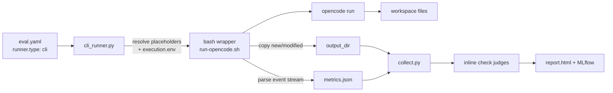

# Cross-runner: OpenCode via the CLI runner

The same `eval.yaml` pipeline — dataset, judges, thresholds, MLflow, reports — works
with **any** agent CLI, not just Claude Code. This recipe wraps
[OpenCode](https://github.com/sst/opencode) with the opaque **CLI runner**
(`runner.type: cli`): a command template with placeholders, `execution.env` variable
injection, a `metrics.json` for cost reporting, and inline `check` judges that verify the
agent's output.

!!! abstract "What you'll build"
    A smoke test that asks OpenCode to create a file, copies new/modified files into the
    harness output dir, extracts token/cost metrics from OpenCode's JSON event stream, and
    scores the result with two inline judges.

## How the CLI runner fits

Unlike `runner.type: claude-code`, the CLI runner treats the agent as a black box: the
harness resolves placeholders, runs your command, and reads back files, stdout/stderr,
exit code, and `metrics.json`. Everything Claude-Code-specific (stream-json tracing, tool
interception, subagent capture, budget enforcement) is off — see the
[gotchas](#what-doesnt-carry-over) below.



## The config

```yaml title="eval.yaml"
name: opencode-smoke
description: Smoke test for OpenCode CLI agent — creates a file and verifies content

execution:
  mode: case
  skill: opencode-smoke
  arguments: "{prompt}"
  timeout: 120
  max_budget_usd: 1.0
  env:
    GOOGLE_CLOUD_PROJECT: "$GOOGLE_CLOUD_PROJECT"
    VERTEX_LOCATION: us-east5
    EVAL_PROJECT_ROOT: "$PWD"
    OPENCODE_ENABLE_TELEMETRY: "1"
    OPENCODE_OTLP_ENDPOINT: "$OPENCODE_OTLP_ENDPOINT"
    OPENCODE_OTLP_PROTOCOL: http/json
    OPENCODE_OTLP_HEADERS: "$OPENCODE_OTLP_HEADERS"
    OTEL_BSP_SCHEDULE_DELAY: "100"

runner:
  type: cli
  command:
    - bash
    - -c
    - exec "$EVAL_PROJECT_ROOT/eval/opencode-smoke/scripts/run-opencode.sh" "$@"
    - --
    - "{args}"
    - "{workspace}"
    - "{output_dir}"
    - "{model}"

models:
  skill: google-vertex/claude-haiku-4-5@20251001

mlflow:
  experiment: opencode-smoke
  tracking_uri: https://mlflow.example.com
  tags:
    test_type: smoke
    agent: opencode

dataset:
  path: cases
  schema: |
    Each case directory contains:
    - input.yaml: prompt (the task for opencode to execute)
    - annotations.yaml: expected_file, expected_content (used by judges)

outputs:
  - path: output
    schema: Files created by opencode during execution

traces:
  stdout: true
  stderr: true
  events: false
  metrics: true

judges:
  - name: exit_success
    description: OpenCode exited successfully
    check: |
      ec = outputs.get("exit_code", -1)
      if ec == 0:
        return True, "Exit code 0"
      return False, f"Exit code {ec}"

  - name: file_created
    description: Expected file exists with correct content
    check: |
      ann = outputs.get("annotations", {})
      expected_file = ann.get("expected_file", "")
      expected_content = ann.get("expected_content", "")
      if not expected_file:
        return False, "No expected_file in annotations"
      files = outputs.get("files", {})
      for path, content in files.items():
        if expected_file in path and isinstance(content, str):
          if expected_content and expected_content in content:
            return True, f"Found {expected_file} with expected content"
          elif not expected_content:
            return True, f"Found {expected_file}"
          else:
            return False, f"Found {expected_file} but content mismatch: {content[:200]}"
      return False, f"File {expected_file} not found in outputs: {list(files.keys())[:10]}"

thresholds:
  exit_success:
    min_pass_rate: 1.0
  file_created:
    min_pass_rate: 1.0
```

!!! warning "Sanitize before committing"
    The values above are generic placeholders. Point `mlflow.tracking_uri` at your own
    server (`https://mlflow.example.com`), set your own `GOOGLE_CLOUD_PROJECT`, and never
    commit real endpoints, project IDs, or credentials.

## The command template

`runner.command` is a list — argv, not a shell string — and the harness substitutes
placeholders before running it. Here it invokes `bash -c` with an `exec` wrapper so the
positional args (`"$@"`) are forwarded to the script after `--`:

| Position | Placeholder | Becomes |
| --- | --- | --- |
| `{args}` | Resolved `execution.arguments` (`{prompt}` filled from `input.yaml`) | the task prompt |
| `{workspace}` | Absolute path to the per-case workspace | cwd for OpenCode |
| `{output_dir}` | `{workspace}/output`, pre-created by the runner | where artifacts land |
| `{model}` | `--model` flag or `models.skill` | `google-vertex/claude-haiku-4-5@…` |

!!! tip "Full placeholder list"
    `{subagent_model}`, `{timeout}`, `{max_budget_usd}`, `{effort}`, `{system_prompt}`,
    `{agent}`, and any `{field}` from `input.yaml` are also available. See the
    [opaque CLI runner contract](https://github.com/opendatahub-io/agent-eval-harness/blob/main/docs/opaque-cli-runner-contract.md)
    and [runner reference](../reference/config/runner.md).

## The wrapper script

The wrapper is where the cross-runner glue lives. It must satisfy the runner contract:
exit `0`/non-zero, write artifacts to `{output_dir}`, finish before `{timeout}`, and — to
get cost data — write `{output_dir}/metrics.json`.

```bash title="scripts/run-opencode.sh"
#!/usr/bin/env bash
# Usage: run-opencode.sh <prompt> <workspace> <output_dir> [model]
set -euo pipefail

PROMPT="$1"; WORKSPACE="$2"; OUTPUT_DIR="$3"
MODEL="${4:-google-vertex/claude-haiku-4-5@20251001}"

OPENCODE="${OPENCODE_BIN:-$(command -v opencode 2>/dev/null || echo "$HOME/.opencode/bin/opencode")}"
mkdir -p "$WORKSPACE" "$OUTPUT_DIR"
cd "$WORKSPACE"

# 1. Snapshot files (checksums) to detect new + modified files
PRE=$(mktemp); POST=$(mktemp); EVENTS=$(mktemp)
trap 'rm -f "$PRE" "$POST" "$EVENTS"' EXIT
find . -maxdepth 3 -type f -not -path './.git/*' -not -path './output/*' \
  -exec md5sum {} + 2>/dev/null | sort > "$PRE" || true

# 2. Run opencode, capturing its JSON event stream (also streamed to stdout)
set +e
"$OPENCODE" run "$PROMPT" --format json --dir "$WORKSPACE" --model "$MODEL" --auto \
  2>&1 | tee "$EVENTS"
EXIT_CODE=${PIPESTATUS[0]}
set -e

# 3. Copy new/modified files into output_dir
find . -maxdepth 3 -type f -not -path './.git/*' -not -path './output/*' \
  -exec md5sum {} + 2>/dev/null | sort > "$POST" || true
comm -13 "$PRE" "$POST" | awk '{print $2}' | while IFS= read -r f; do
  mkdir -p "$OUTPUT_DIR/$(dirname "$f")"; cp "$f" "$OUTPUT_DIR/$f" 2>/dev/null || true
done

# 4. Extract token/cost metrics from step_finish events → metrics.json
#    (see the full script for the python one-liner)

exit $EXIT_CODE
```

!!! note "Full script"
    The excerpt trims the metrics-extraction step. See the complete version at
    [`eval/opencode-smoke/scripts/run-opencode.sh`](https://github.com/opendatahub-io/agent-eval-harness/blob/main/eval/opencode-smoke/scripts/run-opencode.sh).

### metrics.json is how cost reporting works

For an opaque CLI runner, `metrics.json` is the **only** channel for token/cost data — the
harness can't observe the agent's usage otherwise. The wrapper sums OpenCode's
`step_finish` events into the contract's schema:

```json title="output/metrics.json"
{
  "token_usage": {"input": 1500, "output": 800, "cache_read": 0, "cache_write": 0},
  "cost_usd": 0.0031,
  "num_turns": 4,
  "model": "google-vertex/claude-haiku-4-5@20251001"
}
```

| Field | Feeds |
| --- | --- |
| `token_usage` | Report token breakdown, MLflow metrics, cost-per-turn |
| `cost_usd` | Report cost column, MLflow run metric, regression comparison |
| `num_turns` | Turn count and cost-per-turn ratio |
| `model` | Report model column, `resolved_model` in the result |

!!! warning "No metrics.json → empty cost tables"
    If the wrapper doesn't write `metrics.json`, `token_usage`, `cost_usd`, and
    `num_turns` all report as `None` and cost tables in the report are blank.

## Environment injection

`execution.env` forwards variables into the wrapper's process. Values using `$VAR` syntax
are resolved from the **caller's** environment at run time; literal values pass through
verbatim.

| Pattern | Example | Resolves to |
| --- | --- | --- |
| `"$VAR"` | `GOOGLE_CLOUD_PROJECT: "$GOOGLE_CLOUD_PROJECT"` | The caller's `$GOOGLE_CLOUD_PROJECT` |
| `"$PWD"` | `EVAL_PROJECT_ROOT: "$PWD"` | Absolute project root (used in `runner.command`) |
| literal | `VERTEX_LOCATION: us-east5` | The string `us-east5` |

!!! note "The CLI runner inherits the full environment"
    Unlike the Claude Code runner (which filters env to a safe allowlist), the opaque CLI
    runner inherits the caller's full `os.environ` — commands are authored by you, not by
    an untrusted agent. `execution.env` layers on top. `runner.env` has **no effect** for
    the CLI runner since the full env is already inherited.

## Inline check judges

Because there's no stream-json to mine, judging leans on files and exit code. Inline
`check` judges are Python snippets that receive an `outputs` dict and return
`(passed: bool, rationale: str)`:

- `exit_success` reads `outputs["exit_code"]` (populated because `traces.metrics: true`).
- `file_created` reads `outputs["files"]` (artifacts collected from `output/`) and
  `outputs["annotations"]` (from each case's `annotations.yaml`) to confirm the expected
  file exists with the expected content.

| `outputs` key | Where it comes from |
| --- | --- |
| `files` | Files collected from `outputs[*].path` dirs |
| `annotations` | The case's `annotations.yaml` (not runner-produced) |
| `exit_code`, `duration_s` | `run_result.json` (needs `traces.metrics`) |
| `token_usage`, `cost_usd`, `num_turns` | `metrics.json` written by the wrapper |
| `stdout`, `stderr` | Captured logs (need `traces.stdout` / `traces.stderr`) |

See [judges](../concepts/judges.md) and the [judges reference](../reference/config/judges.md)
for the other three judge types.

## Run it

```bash
/eval-run --model google-vertex/claude-haiku-4-5@20251001
```

The report, MLflow logging, `--baseline` pairwise comparison, and
[thresholds](../concepts/thresholds.md) all work exactly as they do for Claude Code — the
runner is the only thing that changed.

## What doesn't carry over

The opaque CLI runner is a black box, so Claude-Code-specific features are unavailable:

| Feature | Why it's off |
| --- | --- |
| Budget enforcement | The harness can't throttle an opaque process; `{max_budget_usd}` is advisory only |
| [Tool interception](../concepts/tool-interception.md) / AskUserQuestion answering | Requires Claude Code `PreToolUse` hooks |
| Stream-json [trace building](../concepts/tracing.md) | Requires `--output-format stream-json` |
| Subagent transcript capture | Requires the `SubagentStop` hook |
| Permission-denial detection & real-time progress | Require stream-json events |

## See also

<div class="grid cards" markdown>

- [**Runners**](../concepts/runners.md) — the runner abstraction and each `type`
- [**runner reference**](../reference/config/runner.md) — `type`, `command`, and all knobs
- [**execution reference**](../reference/config/execution.md) — `env`, `timeout`, `max_budget_usd`
- [**Skill eval (case mode)**](skill-case.md) — the same pipeline with Claude Code

</div>
