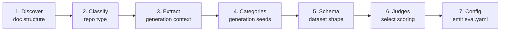

# Writing your own analysis recipe

An **analysis recipe** is the prompt you feed to `/eval-analyze --prompt` in [prompt
mode](../guides/skill-vs-prompt.md). It teaches the agent how to read a repository's
agentic documentation and emit a synthetic-generation `eval.yaml`. This page shows how to
fork the shipped [`examples/openshift-agentic-docs.md`](https://github.com/opendatahub-io/agent-eval-harness/blob/main/examples/openshift-agentic-docs.md)
recipe for a new domain — what to change, and what to leave alone.

!!! abstract "When you need this"
    Fork a recipe when your domain has specialized terminology agents must learn, or when
    test categories should reflect domain-specific capabilities. If your docs look like
    OpenShift/K8s operators, use the example as-is — see the [agentic-docs
    cookbook](agentic-docs.md).

## The 7-step methodology (keep this)

Every recipe walks the agent through the same pipeline. **Do not restructure it** — the
downstream skills (`/eval-dataset`, `/eval-run`) and the [generation
config](../reference/config/generation.md) assume these outputs.



| Step | Produces | Lands in eval.yaml as |
| --- | --- | --- |
| 1. Discover | Entry point + doc areas | *(analysis only)* |
| 2. Classify | Repository type (A/B/C) | *(drives seed choice)* |
| 3. Extract context | `documentation_structure`, `constraints`, `apis`, `components` | `generation.context` |
| 4. Categories | Generation seeds (one per category) | `generation.seeds` |
| 5. Schema | Per-case field description | `dataset.schema` |
| 6. Judges | Mechanical + semantic checks | `judges` |
| 7. Config | The complete file | *(everything)* |

## What to customize vs. keep

=== "Customize (domain-specific)"

    | Recipe element | OpenShift example | Swap for your domain |
    | --- | --- | --- |
    | Repository-type examples (Step 2) | "Operator repos", `machine-config-operator` | "Service repos", "Plugin repos", your project names |
    | Domain topics (Step 3.1) | `operator-patterns`, `status-conditions`, `webhooks` | Your ecosystem's patterns |
    | API terminology (Step 3.3) | CRDs — `MachineConfig`, `KubeletConfig` | Your data models / schemas |
    | Example types (Step 3.3 / 5) | `yaml` (K8s convention) | `json`, `protobuf`, `code`, … |
    | `grep` probes (Step 3.2) | `"must use"`, `"anti-pattern"` | Terms your docs actually use |

=== "Keep (methodology)"

    - The **7-step discover → classify → extract → categories → schema → judges → config** flow.
    - Steps 1–7 **structure and order** — later steps consume earlier outputs.
    - The three **repository types** (A enhancement/design, B component/code, C general docs) and their test-focus mapping.
    - Pointers to `list_prompts.py`, `list_builtins.py`, and `eval-yaml-template.md`.
    - `execution.prompt` + `runner.workspace_mode: repo` + answer-key `deny` rules for doc-navigation evals.

!!! warning "`workspace_mode: repo` is not optional for doc evals"
    Documentation navigation tests need the full directory tree at real paths. The default
    isolated workspace only exposes `input.yaml` plus symlinks to root-level files, so it
    can't test in-repo navigation. Keep `runner.workspace_mode: repo` and the answer-key
    `deny` rules (`eval/`, `eval.yaml`, `eval.md`, `tmp/`) from the example.

## Referencing builtin prompts

Recipes don't hardcode generation seeds — they point the agent at the builtin prompt
registry. Your recipe should keep this call in **Step 4** so the agent lists what's
available before proposing seeds:

```bash
python3 ${CLAUDE_SKILL_DIR}/../eval-dataset/scripts/list_prompts.py
```

It prints each builtin prompt name with its one-line purpose:

```text
docs/anti-pattern            Verify agents reject approaches that violate constraints
docs/architecture            Verify agents can explain system design and component interactions
docs/authoring               Verify agents can create content following patterns and templates
docs/component-usage         Verify agents can explain how to use APIs/components with correct examples
docs/navigation              Verify agents can find and navigate to relevant agentic documentation
```

Reference a builtin by its name via the `builtin:` discriminator inside each seed. Each
seed sets a `category`, a `count`, and exactly one of `builtin:` / `prompt_file:` /
`prompt:`:

```yaml
generation:
  strategy: synthetic
  seeds:
    - category: navigation
      builtin: docs/navigation
      count: 2
    - category: component-usage
      builtin: docs/component-usage
      count: 3   # one per major API
```

!!! tip "Domain prompt not covered by a builtin?"
    Point a seed at a project file with `prompt_file:` (a path in your repo) or embed the
    text inline with `prompt:`. See the [generation
    reference](../reference/config/generation.md) and
    [builtin prompts](../reference/builtin-prompts.md) for the full list and field rules.

## Wiring seeds to judges

The seed `category` is stamped onto each generated case as `annotations.category`. Your
Step 6 judges gate on it with an `if:` condition so category-specific checks only run on
matching cases:

```yaml
judges:
  - name: docs_consultation
    builtin: consulted_docs          # mechanical: did the agent read the right docs?
    arguments:
      include_grep: true
      preloaded_files: [CLAUDE.md, AGENTS.md]

  - name: navigation_success         # semantic: did it navigate vs. answer from memory?
    prompt: |
      Expected files: {{ annotations.expected_files }}
      Did the agent find and read the correct docs?
    if: "annotations.get('category') == 'navigation'"
```

!!! note "Field-name discipline"
    Both the mechanical and semantic judges reference `annotations.expected_files` — the
    standard field name for expected doc paths. Keep this consistent between your Step 5
    schema and Step 6 judges. In YAML `if:` conditions `annotations` is implicit; inside a
    `check:` code block you must use `outputs.get("annotations", {})`. See
    [judges](../reference/config/judges.md).

## Save and run it

Store your recipe in the project (e.g. `eval/` or `examples/`) and pass its path:

```bash
/eval-analyze --prompt eval/my-domain-docs.md   # generates eval.yaml
/eval-dataset                                    # generates cases from seeds
/eval-run --model sonnet                         # tests the agent against your docs
```

## Where to go next

<div class="grid cards" markdown>

- [**Agentic-docs eval**](agentic-docs.md) — run the OpenShift recipe end to end
- [**generation config**](../reference/config/generation.md) — strategy, context, seeds
- [**builtin prompts**](../reference/builtin-prompts.md) — the full `docs/*` registry
- [**/eval-analyze guide**](../guides/eval-analyze.md) — how analysis produces eval.yaml

</div>
