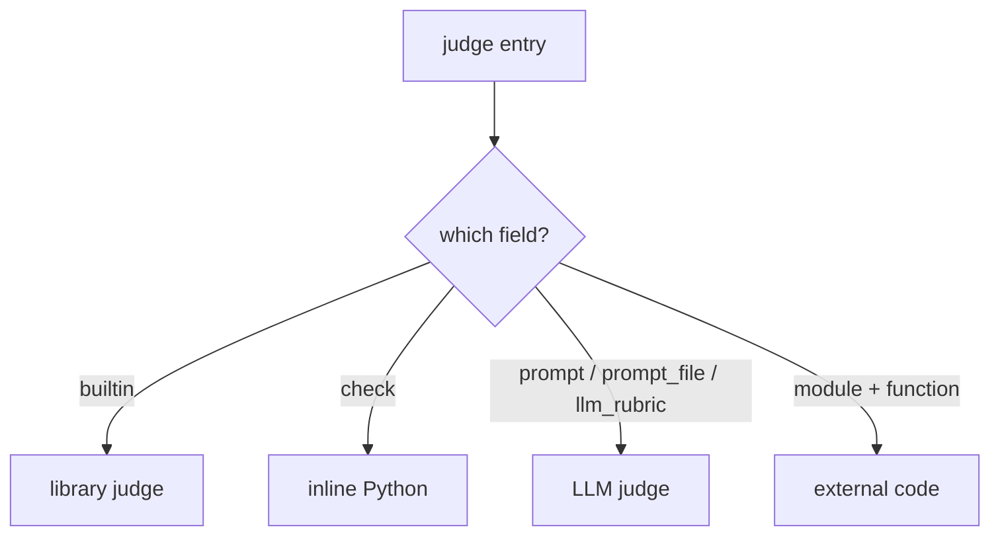

# Writing custom judges

Judges turn a case's collected outputs into a score. This page shows how to write each
of the four judge types by hand, which variables they receive, and how to parameterize
and conditionally skip them. For the conceptual overview see
[Judges](../concepts/judges.md); for every field, the
[judges reference](../reference/config/judges.md).

## The four types

A judge's *type* is inferred from which field you set — you never declare it.



| Field(s) | Type | Runs | Returns |
| --- | --- | --- | --- |
| `builtin` | Library judge | Deterministic Python | `(bool\|number, str)` |
| `check` | Inline Python | Deterministic | `(bool\|number, str)` |
| `prompt` / `prompt_file` / `llm_rubric` | LLM judge | An API call to `models.judge` | pass/fail or a 1–5 score |
| `module` + `function` | External code | Your imported callable | `(bool\|number, str)` |

!!! warning "One type per judge"
    The type fields are mutually exclusive. Setting `builtin` alongside any of
    `check` / `prompt` / `prompt_file` / `module` / `function` fails at config load.

Every judge — regardless of type — receives the same `outputs` record for the case: the
files it produced, its trace, metrics, annotations, and convenience keys. Numeric
(score) judges aggregate to a **mean**; boolean judges to a **pass rate**.

## Inline `check` judges

The most direct type: a snippet of Python whose body becomes a function. Two names are
in scope — `outputs` (the case record) and `arguments` (this judge's `arguments` dict,
`{}` if unset). Return a `(value, rationale)` tuple where `value` is a `bool` or a
number and `rationale` is a human-readable string shown in the report.

```yaml title="eval.yaml"
judges:
  - name: has_content
    description: Output is non-empty and substantial.
    check: |
      content = outputs.get("main_content", "")
      if len(content.strip()) < 100:
          return False, f"Output too short ({len(content.strip())} chars)"
      return True, f"Output has {len(content.strip())} chars"
```

!!! tip "Use `outputs.get(...)` with a default"
    A case that produced no artifacts won't have every convenience key. Reaching for a
    missing key with `outputs["main_content"]` raises `KeyError`, which the runner
    records as a judge *error* (no value) rather than a fail. `outputs.get("main_content", "")`
    degrades gracefully.

The record exposes far more than files. Common keys for `check` judges:

| Key | Contents |
| --- | --- |
| `outputs["files"]` | `{relative_path: text}` for every collected artifact |
| `outputs["<dir>_content"]` / `outputs["<dir>_file"]` | First file's text / path per `outputs[].path` dir |
| `outputs["tool_calls"]` | Tool calls matching an `outputs[].tool` pattern (`{"name", "input"}`) |
| `outputs["cost_usd"]`, `["num_turns"]`, `["duration_s"]`, `["token_usage"]`, `["exit_code"]` | Trace metrics (require `traces.metrics: true`) |
| `outputs["events"]` | Parsed event stream (require `traces.events: true`) |
| `outputs["conversation"]` | Root-level assistant text |
| `outputs["stdout"]`, `["stderr"]` | Captured logs (require `traces.stdout` / `stderr`) |
| `outputs["annotations"]` | Per-case metadata from `annotations.yaml` |

A metrics-driven check reads straight from the trace:

```yaml
judges:
  - name: cost_reasonable
    description: Cost per case stays under budget.
    check: |
      cost = outputs.get("cost_usd", 0) or 0
      if cost > arguments.get("max_usd", 0.50):
          return False, f"Cost ${cost:.2f} exceeds limit"
      return True, f"Cost ${cost:.2f}"
    arguments:
      max_usd: 0.50
```

## External `module` / `function` judges

When a check outgrows an inline snippet — it needs helpers, imports, or its own tests —
move it into a Python module in your project and point `module` + `function` at it. The
module is imported with your project root on `sys.path`. The function is called with the
record as the `outputs` keyword argument, and any `arguments` are spread in as
`**kwargs`, so mirror the builtin-judge signature:

```python title="eval/judges/schema_checks.py"
import json

def check_schema(outputs, **kwargs):
    required = kwargs.get("required_fields", [])
    raw = outputs.get("main_content", "")
    try:
        doc = json.loads(raw)
    except json.JSONDecodeError as e:
        return False, f"Invalid JSON: {e}"
    missing = [f for f in required if f not in doc]
    if missing:
        return False, f"Missing fields: {', '.join(missing)}"
    return True, "Schema valid"
```

```yaml title="eval.yaml"
judges:
  - name: schema_valid
    description: Output parses and has the required fields.
    module: eval.judges.schema_checks
    function: check_schema
    arguments:
      required_fields: [title, priority, labels]
```

!!! note "Return contract is shared"
    Builtin, `check`, and `module` judges all return the same shape: a
    `(value, rationale)` tuple (value = `bool` or number). Returning a bare value with no
    rationale works too, but the report shows an empty rationale. The library judge
    [`cost_budget`](https://github.com/opendatahub-io/agent-eval-harness/blob/main/agent_eval/judges/efficiency/cost_budget.py)
    is a minimal example of the same signature.

## LLM judges

For qualitative criteria, hand the case to a model. Choose one of three fields — they
all compile to the same Jinja2 template, then render against the case record:

=== "llm_rubric"

    Shortest form for a single criterion. If your text doesn't already reference
    `{{ conversation }}`, the agent's response is appended automatically.

    ```yaml
    judges:
      - name: cited_sources
        llm_rubric: "The agent cited relevant documentation sources."
    ```

=== "prompt"

    Full control over the template and placeholders.

    ```yaml
    judges:
      - name: output_quality
        description: Compare the output to the reference.
        prompt: |
          Compare the generated output against the reference for
          completeness, clarity, and accuracy.

          {{ inputs }}

          # Output
          {{ outputs }}
    ```

=== "prompt_file"

    Reuse a prompt across judges/configs. Path is relative to the project root.
    `context` files are appended to the prompt for shared rubrics.

    ```yaml
    judges:
      - name: detailed_quality
        prompt_file: eval/prompts/quality-judge.md
        context:
          - eval/prompts/scoring-rubric.md
    ```

### Available Jinja variables

The prompt is rendered with these variables:

| Variable | Value |
| --- | --- |
| `{{ outputs }}` | The record. Bare, it renders every artifact file as text; use `{{ outputs.files }}`, `{{ outputs.cost_usd }}`, etc. for structured access |
| `{{ conversation }}` | Root-level assistant text from the event stream |
| `{{ inputs }}` | The case's `input.yaml`, formatted as `**key**: value` |
| `{{ tool_trace }}` | Chronological trace of tool calls (Read, Bash, …) |
| `{{ evidence }}` | Summary of verifiable tool evidence (turns, cost, files read/written) — derived only if referenced |
| `{{ annotations }}` | Case annotations as formatted text; also `{{ annotations.get('category') }}` for values |
| `{{ annotations_text }}` | The annotation text alone |
| `{{ arguments }}` | This judge's `arguments` dict |

!!! tip "Score scale vs. pass/fail"
    By default an LLM judge returns an integer **1–5 score** (aggregated as a mean). Set
    `feedback_type: bool` to make it a **pass/fail** judge (aggregated as a pass rate).
    `{{ tool_trace }}` and `{{ evidence }}` need `traces.events: true`; `{{ conversation }}`
    falls back to `stdout.log` when no events were captured.

LLM judges are the only type that can be **sampled**. Set `samples: 3` to call the model
several times per case and reduce the noise (median for scores, majority vote for
booleans); the report flags cases where samples disagreed. `samples` on any other type is
ignored with a warning.

## `arguments`: parameterizing a judge

`arguments` is a plain dict, reused by every type — but consumed differently:

- **Python judges** (`builtin`, `check`, `module`) — spread in as `**kwargs` (`check`
  judges also see it as the `arguments` variable).
- **LLM judges** — exposed as `{{ arguments }}` inside the template.

This lets one judge implementation serve many thresholds without duplicating code — see
the `max_usd` and `required_fields` examples above.

## `if`: skipping a judge per case

Give a judge an `if:` expression to run it only on the cases where it's meaningful. The
expression is evaluated against `annotations` and `outputs`; when it's false the judge is
**skipped** — the case isn't counted in that judge's mean or pass rate.

```yaml title="eval.yaml"
judges:
  - name: dedup_correct
    if: "annotations.get('is_duplicate', False)"   # only duplicate cases
    prompt: "Did the agent correctly flag the input as a duplicate?"

  - name: output_quality
    if: "not annotations.get('skip_quality', False)"
    prompt: "Score the output 1-5 for completeness, clarity, and accuracy."
```

!!! warning "`if` runs in a restricted sandbox"
    The `if` expression is evaluated with **no builtins** — only `annotations` and
    `outputs` are in scope. Keep it to simple attribute/`.get()` lookups and boolean
    logic. Put anything heavier inside the judge body (`check`/`module`), which runs with
    full builtins.

## Where to go next

<div class="grid cards" markdown>

-   :material-book-open-variant: **Judge concepts**

    ---

    Judge types, aggregation, and how scoring fits the pipeline.

    [:octicons-arrow-right-24: Judges](../concepts/judges.md)

-   :material-format-list-bulleted: **Full field reference**

    ---

    Every judge field, precedence rule, and validation.

    [:octicons-arrow-right-24: judges config](../reference/config/judges.md)

-   :material-package-variant: **Builtin judges**

    ---

    Library judges you can reference by name before writing your own.

    [:octicons-arrow-right-24: Builtin judges](../reference/builtin-judges.md)

-   :material-dice-multiple: **Sampling & pairwise**

    ---

    Reduce judge noise and run A/B comparisons between runs.

    [:octicons-arrow-right-24: Pairwise & sampling](../concepts/pairwise-and-sampling.md)

</div>
