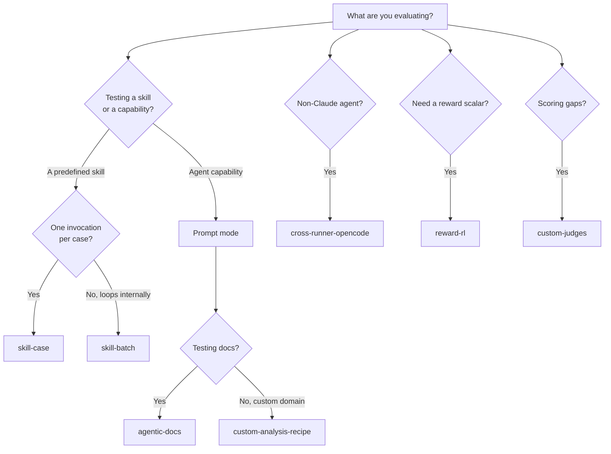

# Cookbook

Worked, copy-pasteable recipes for common evaluation scenarios. Each one is a full
`eval.yaml` plus the CLI commands to run it. Pick the card that matches what you're
testing.

!!! tip "Same config, any backend"
    Every recipe is an ordinary `eval.yaml`. The execution backend (Local, Harbor,
    EvalHub) is always the `--runner` flag — never a config key — so any recipe runs
    unchanged across all three. See [backends](../concepts/backends.md).

## Recipes

-   :material-play-box: **[Evaluate a skill (case mode)](skill-case.md)**

    ---

    When you have a skill and want one invocation per test case — the default flow.

-   :material-layers: **[Evaluate a skill (batch mode)](skill-batch.md)**

    ---

    When your skill loops over all cases internally in a single `batch.yaml` invocation.

-   :material-file-document-check: **[Agentic documentation testing](agentic-docs.md)**

    ---

    When you want to test whether agents can navigate and correctly use your docs.

-   :material-swap-horizontal: **[Cross-runner: OpenCode](cross-runner-opencode.md)**

    ---

    When the agent under test isn't Claude Code — drive it through the opaque `cli` runner.

-   :material-trophy: **[Reward shaping for RL](reward-rl.md)**

    ---

    When you need to collapse judges into a single `[0, 1]` scalar for GRPO-style training.

-   :material-file-edit: **[Write your own analysis recipe](custom-analysis-recipe.md)**

    ---

    When you want `/eval-analyze --prompt` to bootstrap configs for a new domain.

-   :material-gavel: **[Write custom judges](custom-judges.md)**

    ---

    When builtin judges aren't enough — author `check`, `module`, and LLM judges.

## Choosing a recipe

!!! note "Start from the walkthrough"
    New to the harness? Do [your first eval](../get-started/first-eval.md) end to end
    first, then come back here for the variant that fits your case. The full field
    reference lives in [the eval.yaml schema](../reference/eval-yaml.md).
