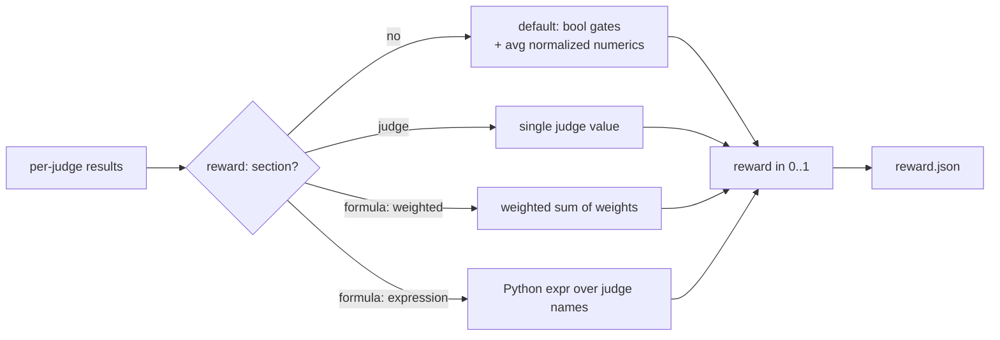
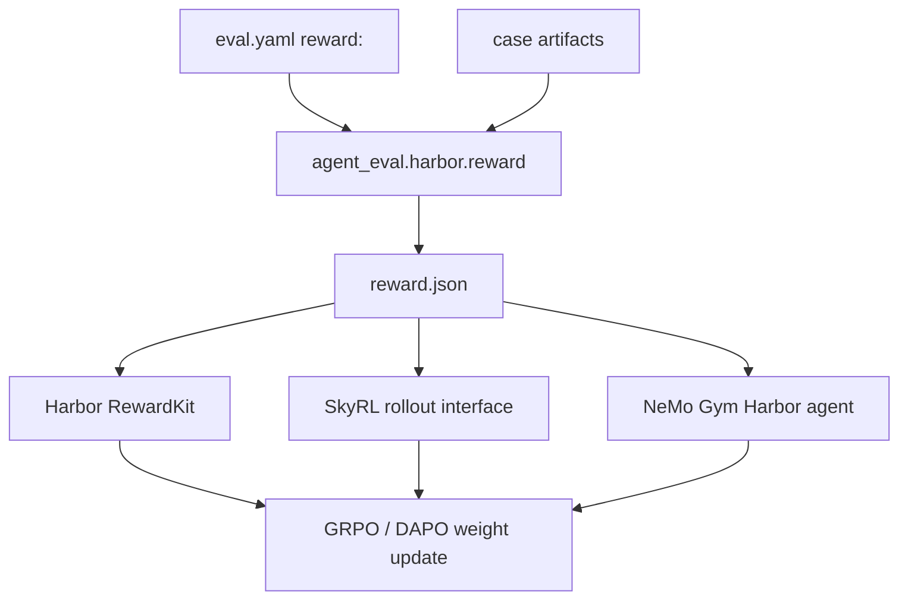

# Reward shaping for RL training

The same judges that grade an eval run can be collapsed into a single scalar
reward in `[0, 1]` for GRPO-style RL training. This page shows two concrete
`reward:` recipes — a **weighted** blend and an **expression formula** — and how
each becomes the `reward.json` that Harbor, SkyRL, and NeMo Gym read.

!!! info "Concept vs. cookbook"
    This page is task-oriented. For the full field reference and resolution
    rules, see [the Reward API concept](../concepts/reward-api.md) and the
    [`reward` config reference](../reference/config/reward.md).

## When you need a `reward:` section

The `reward:` block is **optional** and only matters when training. The normal
`/eval-run` report path never requires it.

Without a `reward:` section the composer falls back to a default: **boolean
judges gate** (any `false` → reward `0.0`), **numeric judges are normalized and
averaged**. Add a `reward:` section when you want explicit control over the
blend.



## Recipe 1 — Weighted blend

Blend two judges into one reward: an LLM `quality` judge scored `1-5`, and an
`efficiency` judge that already emits `[0, 1]`.

```yaml title="eval.yaml (excerpt)"
judges:
  - name: files_exist          # boolean check → gates
    check: |
      return ("artifacts/out.md" in outputs["files"]), "presence check"

  - name: quality              # LLM judge, scored 1-5
    prompt: "Score the output 1-5 for completeness, clarity, and accuracy."

  - name: efficiency           # already normalized to [0, 1]
    builtin: cost_budget

reward:
  formula: weighted            # weighted sum of the judges in `weights`
  weights:
    quality: 0.7
    efficiency: 0.3
  score_range: [1, 5]          # numeric range used to normalize judges to [0, 1]
  raw: [efficiency]            # judges already in [0, 1] — skip normalization
  gate: true                   # any boolean judge returning false zeros the reward
```

How the pieces interact:

| Field | Effect |
| --- | --- |
| `formula: weighted` | Reward = weighted sum of the judges named in `weights`, divided by the sum of the weights (result clamped to `[0, 1]`). |
| `weights` | The judges to blend and their relative weights. Judges missing from a case (value `None`) drop out of both sums. |
| `score_range` | The `[min, max]` used to normalize each numeric judge into `[0, 1]` before weighting. |
| `raw` | Judges already in `[0, 1]` — listed here they are clamped as-is instead of being re-normalized through `score_range`. |
| `gate: true` | Every boolean judge (e.g. `files_exist`) acts as a gate: any `false` zeros the reward, regardless of the weighted score. |

!!! warning "`gate` gates on *every* boolean judge"
    `gate: true` zeros the reward on **any** boolean judge that returns `false`,
    not just the ones in `weights`. That is exactly what you want for a
    structural check like `files_exist`, but see Recipe 2 for the case where a
    boolean is *inside* the formula.

## Recipe 2 — Expression formula (with `gate: false`)

Use a Python expression over judge names when a weighted sum isn't expressive
enough — for example, when a boolean judge should multiply the reward rather
than hard-gate it.

```yaml title="eval.yaml (excerpt)"
judges:
  - name: passed               # boolean gate expressed *inside* the formula
    check: |
      return outputs["exit_code"] == 0, "ran cleanly"

  - name: quality              # LLM judge, 1-5
    prompt: "Score the output 1-5 for overall quality."

reward:
  formula: "passed * quality"  # boolean (0/1) multiplies the normalized quality
  score_range: [1, 5]
  gate: false                  # do NOT double-gate: the formula already uses `passed`
```

In an expression each judge name is a variable already normalized to `[0, 1]`
(booleans become `0.0`/`1.0`). The final line is the reward; the result is
clamped to `[0, 1]`.

!!! danger "Set `gate: false` when a boolean is its own gate"
    `gate` defaults to gating on every boolean judge. If your formula *already*
    uses a boolean as a multiplier (`passed * quality`), leaving `gate: true`
    would gate **twice** — the formula multiplies by `passed`, and then the
    global gate zeros anything where `passed` is `false` anyway. Harmless for
    strict `0/1` gating, but it prevents partial-credit designs and hides the
    intent. Set `gate: false` so the formula is the single source of truth.

Allowed calls inside an expression: `min`, `max`, `abs`, `round`, `sum`, `len`,
`mean`. Multi-line expressions are allowed — the last line is the result.

```yaml
reward:
  formula: |
    base = 0.6 * quality + 0.4 * efficiency
    max(0.0, base - 0.1 * (1 - passed))
  gate: false
```

!!! note "Single-judge shortcut"
    If a learned reward model already emits a scalar, name it directly instead
    of writing a formula. `normalize: false` (the default) clamps its value to
    `[0, 1]` as-is; `normalize: true` maps it from `score_range`.

    ```yaml
    reward:
      judge: my_reward_model
      normalize: false
    ```

## From reward to `reward.json`

At scoring time inside a Harbor trial container, `agent_eval.harbor.reward`
runs the **same** judge engine as local `/eval-run`, applies your `reward:`
section, and writes Harbor's reward contract:

```bash
python3 -m agent_eval.harbor.reward --config eval.yaml --case-dir . \
    --out-dir /logs/verifier
```

It emits three files under the output dir (default `/logs/verifier`):

| File | Contents |
| --- | --- |
| `reward.json` | Flat `{reward, <judge>: <num>, ...}` — the file training frameworks read. |
| `reward.txt` | The scalar reward alone (Harbor's fallback). |
| `judges.json` | Full per-judge detail (value + rationale) sidecar for the report. |

```json title="reward.json"
{
  "reward": 0.875,
  "files_exist": 1.0,
  "quality": 4.0,
  "efficiency": 0.9
}
```

This one file is consumed by all three training paths — Harbor reads it
natively, SkyRL reads it via the Harbor rollout interface, and NeMo Gym reads it
via Harbor's agent server. No extra adapter needed.



!!! tip "Validated at load time"
    A malformed or unsafe formula fails at **config load**, not mid-run — a
    disallowed function, a `str` constant, or a formula that doesn't end in an
    expression is rejected immediately. Runtime errors (e.g. an undefined judge
    name in an expression) warn and degrade that case to reward `0.0`.

## Resolution order

The composer resolves in this order:

1. A `reward:` section, if present:
   - `judge:` mode when `judge` is set, otherwise
   - the `formula` / `weights` composition.
2. Otherwise the default: boolean judges gate, numeric judges are normalized and
   averaged.

`gate` is applied first in every mode: with `gate: true`, any boolean judge
returning `false` short-circuits the reward to `0.0` before the formula runs.

## Related

<div class="grid cards" markdown>

- [**Reward API**](../concepts/reward-api.md) — concepts and the full resolution model
- [**`reward` config reference**](../reference/config/reward.md) — every field
- [**Judges**](../concepts/judges.md) — the judge types you compose into a reward
- [**Harbor**](../guides/harbor.md) — containerized execution and the verifier bridge

</div>
