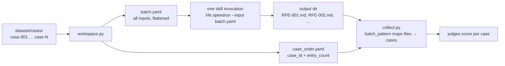

# Evaluate a skill (batch mode)

Batch mode runs your skill **once for all cases** instead of once per case. The
harness bundles every case's input into a single `batch.yaml`, the skill loops over
it internally, and the collector maps the resulting output files back to individual
cases for scoring. This walkthrough uses an RFE-Creator-style skill (`rfe.speedrun`)
that batch-creates and reviews a set of RFEs in one invocation.

!!! abstract "What you'll produce"
    An `eval.yaml` with `execution.mode: batch`, output directories keyed by a
    `batch_pattern`, tool interception, and judges — plus a scored HTML report under
    `eval/runs/<run-id>/`.

## Case mode vs batch mode

The choice is driven by the skill's **internal design**, not its CLI flags.

| Prefer **batch** when the skill… | Prefer **case** when the skill… |
| --- | --- |
| Iterates over a collection of inputs (batch file, ID list, array) | Processes exactly one input per run |
| Has batch-size / parallelism / concurrency controls | Has no internal iteration |
| Launches multiple sub-agents or sub-skills per item | Does one unit of work |
| Aggregates across items (summary tables, index files) | Produces one artifact |
| Examples: `rfe.speedrun`, `rfe.auto-fix --batch-size N` | Examples: `rfe.create "problem…"` |

!!! tip "The eval.yaml is the only thing that changes"
    Mode is a property of the *skill*, not the substrate. The same `eval.yaml` still
    runs unchanged Local, on [Harbor](../guides/harbor.md), or on
    [EvalHub](../guides/evalhub.md) — the backend is always a `--runner` flag. See
    [the execution model](../concepts/execution-model.md).

## How batch mode flows



The harness writes two files into the shared workspace:

- **`batch.yaml`** — every case's full `input.yaml` content, concatenated (list
  inputs are flattened into one flat list). This is what your skill reads.
- **`case_order.yaml`** — the positional map (`case_id` + `entry_count`) the
  collector uses to assign output files back to cases.

## Step 1 — Configure `execution` for batch

Point `arguments` at the generated `batch.yaml` and run the skill headlessly.

```yaml title="eval.yaml"
name: rfe-creator

execution:
  mode: batch                                  # one invocation for all cases
  skill: rfe.speedrun                          # the skill loops internally
  arguments: "--input batch.yaml --headless --dry-run"
  # → sends: /rfe.speedrun --input batch.yaml --headless --dry-run

models:
  skill: claude-opus-4-6
  judge: claude-opus-4-6
```

!!! warning "`parallelism` and per-case hooks don't apply in batch mode"
    `execution.parallelism` runs *cases* concurrently — it only takes effect in case
    mode. `hooks.before_each` / `hooks.after_each` are per-case and are **ignored in
    batch mode** (a load-time warning is emitted); use `before_all` / `after_all`
    instead. `dataset.workspace.files` is also ignored — batch mode uses a single
    shared workspace, not one per case.

## Step 2 — Map output files to cases with `batch_pattern`

Because the skill emits all outputs in one invocation, the collector needs to know
**which file belongs to which case**. Set `batch_pattern` on each output directory.
`{n}` is a **1-based index** expanded per case (respecting `case_order.yaml`); files
whose name **starts with** the expanded prefix are assigned to that case.

```yaml title="eval.yaml"
outputs:
  - path: artifacts/rfe-tasks
    batch_pattern: "RFE-{n:03d}"                # RFE-001, RFE-002, …
    schema: |
      One markdown file per case, named RFE-NNN-slug.md where NNN is the
      case number (001, 002, …). YAML frontmatter: rfe_id, title, priority,
      size, status. Skip files ending in -comments.md or -removed-context.md.
  - path: artifacts/rfe-reviews
    batch_pattern: "RFE-{n:03d}"                # review file shares the case prefix
    schema: |
      One review file per case, named RFE-NNN-slug-review.md. YAML frontmatter:
      score, pass, recommendation, feasibility, per-criterion scores.
```

| `batch_pattern` value | Behavior |
| --- | --- |
| `"RFE-{n:03d}"` | `{n}` expands to a zero-padded 1-based index; prefix-match assigns files |
| `"RFE-{n}"` | Same, without zero-padding (`RFE-1`, `RFE-2`, …) |
| `"*"` | **Shared** — every file in the directory is copied to *every* case |
| *(omitted)* | Auto-detect: the collector groups files by a `WORD-NNN` prefix, else distributes one file per case |

!!! note "Prefer an explicit `batch_pattern`"
    Auto-detection works when filenames carry a clean `WORD-NNN` prefix, but it's a
    heuristic. Declaring `batch_pattern` makes the file→case mapping deterministic and
    survives skills that number outputs differently.

!!! tip "`{n}` must line up with your dataset order"
    Cases are indexed by directory sort order (`case-001`, `case-002`, …). Case *k*'s
    output must be prefixed with index *k*. If a case contributes multiple batch
    entries, its `entry_count` advances `{n}` accordingly.

## Step 3 — Intercept external tools

Headless batch runs must not touch production systems. Describe what to intercept in
natural language under `inputs.tools` — `match` is *what* to intercept (not a regex),
`prompt` is *how* to handle it. See [tool interception](../concepts/tool-interception.md).

```yaml title="eval.yaml"
permissions:
  deny: ["mcp__atlassian__*"]        # block Jira write tools during eval

inputs:
  tools:
    - match: Questions asked to the user via AskUserQuestion.
      prompt: |
        Answer based on the test case. If asked about priority, say "Normal".
        If asked to confirm, say "yes".
    - match: |
        Any interaction with Jira — via MCP tools (mcp__atlassian__*) or
        scripts that import jira-python or call the Jira REST API.
      prompt: |
        Block production Jira. Only allow if JIRA_SERVER points to a test
        instance or jira-emulator.
```

## Step 4 — Score per case with judges

Judges run **per case** against the files the collector assigned to that case, so they
look identical to case-mode judges. Inline `check` judges read the `outputs` dict;
LLM judges use Jinja2 template variables. See [judges](../concepts/judges.md).

```yaml title="eval.yaml"
judges:
  - name: frontmatter_valid
    description: Each generated RFE has valid YAML frontmatter with required fields.
    check: |
      import yaml
      task = outputs["rfe-tasks_content"]
      if not task.startswith("---"):
          return False, "No YAML frontmatter"
      fm = yaml.safe_load(task.split("---", 2)[1])
      required = ["rfe_id", "title", "priority", "status"]
      missing = [f for f in required if f not in fm]
      if missing:
          return False, f"Missing: {', '.join(missing)}"
      return True, "All required fields present"

  - name: quality
    description: Evaluate the generated RFE against the reference.
    prompt_file: eval/prompts/quality-judge.md

thresholds:
  frontmatter_valid: { min_pass_rate: 1.0 }
  quality: { min_mean: 3.5 }
```

!!! tip "Access collected files by directory key"
    Files land in the `outputs` dict keyed by their output directory. For
    `path: artifacts/rfe-tasks`, the first assigned file's content is available as
    `outputs["rfe-tasks_content"]`, and all files as `outputs["files"]`. Match your
    judge keys to the directory name.

## Step 5 — Run and read the report

```bash
/eval-run --model opus
```

```text
eval/runs/<run-id>/report.html
```

The report shows per-judge pass rates and mean scores plus a per-case breakdown —
identical to case mode, because scoring happens per case regardless of how the skill
was invoked. [Reading the report](../get-started/reading-the-report.md) explains each
section.

## Where to go next

<div class="grid cards" markdown>

-   :material-numeric-1-box: **One invocation per case**

    ---

    Compare against the per-case workflow to decide which fits your skill.

    [:octicons-arrow-right-24: Skill (case mode)](skill-case.md)

-   :material-book-open-variant: **Field references**

    ---

    Every key used above, in detail.

    [:octicons-arrow-right-24: execution](../reference/config/execution.md) ·
    [outputs](../reference/config/outputs.md) ·
    [judges](../reference/config/judges.md)

-   :material-server: **Scale it out**

    ---

    Run the same config in containers or on the platform.

    [:octicons-arrow-right-24: Harbor](../guides/harbor.md) ·
    [EvalHub](../guides/evalhub.md)

</div>
