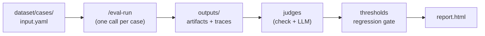

# Evaluate a skill (case mode)

A complete, copy-pasteable recipe for evaluating a predefined skill with **one
invocation per test case** — the default execution mode. It walks through an
`eval.yaml`, a couple of dataset cases, a deterministic check judge plus an LLM
quality judge, regression thresholds, and the run command.

!!! abstract "When to use case mode"
    Use `mode: case` when the skill under test is designed to process **one input
    per run** (e.g. `/rfe.create "problem..."`). The harness loops over your
    dataset and invokes the skill once per case. If the skill iterates over a
    collection internally, use [batch mode](skill-batch.md) instead.

## The pipeline at a glance



## 1. The `eval.yaml`

Place this in your project root. It mirrors the repository's canonical
[`eval.yaml`](https://github.com/opendatahub-io/agent-eval-harness/blob/main/eval.yaml),
trimmed to the essentials for a case-mode skill eval.

```yaml title="eval.yaml"
name: my-skill-eval
description: Evaluate the main skill pipeline

execution:
  mode: case              # one invocation per test case (default)
  skill: my-skill         # skill under test → invoked as /my-skill
  arguments: "{prompt}"   # resolved per case from input.yaml fields
  # timeout: 3600         # optional per-invocation wall-clock cap (seconds)
  # max_budget_usd: 5.0   # optional per-invocation cost cap
  # parallelism: 3        # optional: run up to N cases concurrently (case mode only)

runner:
  type: claude-code       # agent runtime discriminator

models:
  skill: claude-opus-4-6  # model for the skill under test (or pass --model)
  judge: claude-opus-4-6  # model for LLM judges

dataset:
  path: eval/dataset/cases
  schema: |
    Each case directory contains:
    - input.yaml: YAML with a 'prompt' field (the request sent to the skill).
    - reference.md: gold-standard output for comparison scoring.

outputs:
  - path: artifacts
    schema: |
      One markdown file per case, named NNN-slug.md.

traces:
  stdout: true
  stderr: true
  metrics: true           # exit code, tokens, cost, duration — used by judges

judges:
  - name: has_content
    description: Output is non-empty and substantial.
    check: |
      files = outputs.get("files", {})
      md = [v for k, v in files.items() if k.endswith(".md")]
      if not md:
          return False, "No markdown artifact produced"
      content = md[0]
      if len(content.strip()) < 100:
          return False, f"Output too short ({len(content.strip())} chars)"
      return True, f"Output has {len(content.strip())} chars"

  - name: output_quality
    description: Quality of the output versus the reference.
    prompt: |
      Compare the generated output against the reference.

      {{ outputs }}

      Consider completeness, clarity, accuracy, and relevance.
      Score 1-5 where:
      - 1: missing most requirements, major errors
      - 3: covers the basics but lacks depth or has minor errors
      - 5: comprehensive, accurate, well-written

thresholds:
  has_content:
    min_pass_rate: 1.0    # every case must pass this boolean judge
  output_quality:
    min_mean: 3.5         # mean LLM score must stay at or above 3.5
```

### What each block does

| Block | Role | Reference |
| --- | --- | --- |
| `execution` | `mode: case` + `skill` + `arguments` template — what to run, once per case | [execution](../reference/config/execution.md) |
| `runner` | Which agent runtime executes the skill | [runner](../reference/config/runner.md) |
| `models` | Model per role; CLI `--model` overrides `models.skill` | [models](../reference/config/models.md) |
| `dataset` | Where cases live + a natural-language `schema` | [dataset](../reference/config/dataset.md) |
| `outputs` | Directories (or tool calls) to collect after each run | [outputs](../reference/config/outputs.md) |
| `traces` | Which execution data to capture for judges | [traces](../reference/config/traces.md) |
| `judges` | How each case is scored (check + LLM here) | [judges](../reference/config/judges.md) |
| `thresholds` | Per-judge regression gate | [thresholds](../reference/config/thresholds.md) |

!!! tip "`arguments` is a template"
    `{prompt}` (and any other placeholder) is filled per case from that case's
    `input.yaml`. Both `{field}` and Jinja2 `{{ input.field }}` styles are
    accepted, e.g. `arguments: '--priority {{ input.priority }} "{{ input.prompt }}"'`.

## 2. The dataset

`dataset.path` holds one directory per case. Author them by hand, or generate a
starter set with [`/eval-dataset`](../guides/eval-dataset.md).

```text
eval/dataset/cases/
├── case-001-simple/
│   ├── input.yaml
│   └── reference.md
└── case-002-edge/
    ├── input.yaml
    ├── reference.md
    └── annotations.yaml    # optional metadata judges can read
```

=== "case-001-simple/input.yaml"

    ```yaml
    prompt: "Summarize the onboarding guide for a new backend engineer."
    ```

=== "case-002-edge/input.yaml"

    ```yaml
    prompt: "Summarize an empty document and note that it has no content."
    ```

=== "case-002-edge/annotations.yaml"

    ```yaml
    category: edge-case
    ```

!!! note "Schema fields are natural language"
    `dataset.schema` documents the case structure for the agents and judges —
    scripts operate on file *paths*, not a parsed spec. Describe real file and
    field names so judges know what to expect (see the
    [eval.yaml reference](../reference/eval-yaml.md)).

## 3. The judges

This recipe uses two of the [four judge types](../reference/config/judges.md):

| Judge | Type | What it verifies |
| --- | --- | --- |
| `has_content` | inline `check` (Python) | An artifact exists and is at least 100 chars — deterministic structure |
| `output_quality` | LLM `prompt` | Completeness/clarity/accuracy versus the reference — needs understanding |

!!! warning "Inside `check`, access data through `outputs`"
    Check judges run in the project root, not the per-case output directory. Read
    files via `outputs["files"]` (a `{path: content}` dict) — never `os.listdir()`
    or bare filesystem paths. Use `.get()` with defaults so a failed run returns
    `(False, "reason")` instead of raising.

!!! warning "LLM judges only see their template variables"
    An LLM judge sees nothing but its rendered prompt. Include `{{ outputs }}`
    (file artifacts), `{{ conversation }}` (agent text for stdout-only skills), or
    `{{ tool_trace }}` (to grade agent *behavior*). Omitting them leaves the judge
    with no output to score.

## 4. Thresholds

Thresholds turn scores into a pass/fail regression gate. The key must match the
judge name exactly.

| Judge kind | Valid threshold key | Meaning |
| --- | --- | --- |
| boolean (`check`, most `builtin`) | `min_pass_rate` | Minimum fraction of cases passing (0.0–1.0) |
| numeric (`llm`) | `min_mean` | Minimum average score across cases |
| pairwise | `min_win_rate` | Minimum win rate versus a baseline |

## 5. Run it

```bash
/eval-run --model opus
```

Or with the standalone CLI:

```bash
agent-eval run --model opus
```

Common flags:

| Flag | Effect |
| --- | --- |
| `--model <name>` | Model for the skill under test (overrides `models.skill`) |
| `--cases <ids>` | Run only specific cases |
| `--baseline <run-id>` | Add a pairwise A/B comparison against a prior run |
| `--no-llm-judges` | Skip LLM judges for a fast, cheap dry run |

`/eval-run` prepares an isolated workspace per case, executes the skill
headlessly, collects `outputs`, scores with your judges, checks thresholds, and
writes the report to `eval/runs/<run-id>/report.html`.

[Read the report :material-arrow-right:](../get-started/reading-the-report.md){ .md-button }

## Where to go next

<div class="grid cards" markdown>

-   :material-layers-triple: **Batch mode**

    ---

    The skill loops over all cases internally in one invocation.

    [:octicons-arrow-right-24: Evaluate a skill (batch)](skill-batch.md)

-   :material-scale-balance: **Add custom judges**

    ---

    Go beyond inline checks with reusable and external judges.

    [:octicons-arrow-right-24: Custom judges](custom-judges.md)

-   :material-tune: **Improve the skill**

    ---

    Feed results into human review or the automated optimization loop.

    [:octicons-arrow-right-24: /eval-review](../guides/eval-review.md) ·
    [/eval-optimize](../guides/eval-optimize.md)

</div>
