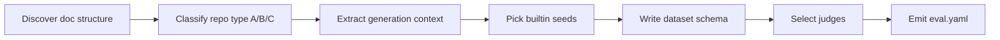

# Your first agentic-docs eval

This walkthrough uses **prompt mode** to test whether AI agents can actually
*use* your repository's agentic documentation (`CLAUDE.md`, `AGENTS.md`,
`ai-docs/`, …). It parallels the [skill-mode quickstart](first-eval.md) —
**analyze → dataset → run → report** — but there is no skill under test: the
agent is asked questions and must navigate the docs to answer them.

!!! abstract "What you'll produce"
    A prompt-mode `eval.yaml` with a `generation: synthetic` block, a dataset of
    documentation questions, and a scored report that shows whether agents found
    and read the right docs.

## What agentic documentation testing measures

Instead of scoring a skill's output, you score how well an agent can operate
*from your docs alone*:

| Capability | Question it answers | Builtin seed |
| --- | --- | --- |
| **Doc navigation** | Can the agent find the right file for a question? | `docs/navigation` |
| **Pattern application** | Can it create content following documented patterns? | `docs/authoring` |
| **Constraint compliance** | Does it reject approaches the docs forbid? | `docs/anti-pattern` |
| **API usage** | Can it explain an API/component with correct examples? | `docs/component-usage` |
| **Architecture** | Can it explain how components interact? | `docs/architecture` |

## Step 1 — Analyze the documentation

Point `/eval-analyze` at a *recipe* prompt instead of a skill. The bundled
OpenShift recipe (`examples/openshift-agentic-docs.md`) discovers your doc
structure, classifies the repo, and emits a prompt-mode `eval.yaml`:

```bash
/eval-analyze --prompt examples/openshift-agentic-docs.md
```

!!! tip "Adapt the recipe to your domain"
    The OpenShift recipe carries ecosystem terminology (CRDs, Operators, status
    conditions, MachineConfig). For other domains, copy it and swap the
    terminology — see [`examples/README.md`](https://github.com/opendatahub-io/agent-eval-harness/blob/main/examples/README.md).
    Then run `--prompt path/to/your-recipe.md`.

The recipe drives the agent through a fixed flow:



## Step 2 — The repo-type taxonomy

Analysis first classifies the repository, which decides the **test focus** and
which **seeds** get generated:

| Type | Repository kind | Test focus | Typical seeds |
| --- | --- | --- | --- |
| **A** — Enhancement/Design | RFCs, ADRs, enhancement proposals; process + constraints | Process adherence, constraint enforcement | `navigation`, `authoring`, `anti-pattern` |
| **B** — Component/Code | APIs, CRDs, libraries with usage examples | API usage, example accuracy, architecture | `navigation`, `component-usage`, `architecture` |
| **C** — General Docs | Pure documentation, no code or proposals | Information retrieval, navigation | `navigation` |

## Step 3 — The generated `generation: synthetic` block

Prompt-mode configs source their cases from **synthetic generation**: an LLM
authors cases from repository knowledge (`context`) using builtin generation
prompts (`seeds`). A Type A config looks like:

```yaml title="eval.yaml (generation block)"
generation:
  strategy: synthetic
  context:                       # repository knowledge injected into every prompt
    documentation_structure:
      entry_point: CLAUDE.md
      areas:
        - path: ai-docs/workflows/
          topics: [enhancement-process, testing-workflow]
    constraints:
      - rule: "New APIs must start with v1alpha1"
        documentation: ai-docs/practices/development/api-evolution.md
        wrong_approach: "Starting with v1 API for stability"
  seeds:
    - category: navigation
      builtin: docs/navigation
      count: 2
    - category: anti-pattern
      builtin: docs/anti-pattern
      count: 3               # one per major constraint
```

!!! note "`category` is derived, never declared"
    Each seed's `category` is stamped onto every generated case as
    `annotations.category`. The category list comes *from* the cases — you don't
    maintain a separate list. See the [generation reference](../reference/config/generation.md)
    and [builtin prompts](../reference/builtin-prompts.md).

The rest of the config is prompt mode rather than skill mode:

```yaml title="eval.yaml (execution + runner + dataset)"
execution:
  mode: case
  prompt: "{{ input.prompt }}"     # prompt mode: no skill wrapper

runner:
  type: claude-code
  workspace_mode: repo             # required — see below
  effort: medium

dataset:
  path: eval/dataset/cases
  schema: |
    Each case contains:
    - input.yaml with a 'prompt' field (the user's question)
    - annotations.yaml with 'expected_files' (doc paths) and 'expected_mentions'
```

!!! warning "`workspace_mode: repo` is required"
    Documentation navigation only works if the agent can see the whole
    repository tree at its real paths. The default isolated workspace provides
    only `input.yaml` plus symlinks to root-level files — it can't test
    `ai-docs/` navigation. Set `runner.workspace_mode: repo` for agentic-docs
    evals. Because the repo (including the answer key) is now visible, add
    `permissions.deny` rules for `eval/`, `eval.yaml`, `eval.md`, and `tmp/` to
    prevent test cheating.

    ```yaml
    permissions:
      deny:
        - "Read(eval/**)"
        - "Read(eval.yaml)"
        - "Read(eval.md)"
    ```

## Step 4 — The `consulted_docs` judge

The signature judge for navigation is the builtin `consulted_docs`. It extracts
`Read` (and optionally `Grep`) tool calls from the trace and checks coverage
against each case's `annotations.expected_files`:

```yaml title="eval.yaml (judges)"
judges:
  - name: docs_consultation
    builtin: consulted_docs
    description: Verifies the agent read the expected documentation files
    arguments:
      include_grep: true          # count Grep tool calls as file reads
      preloaded_files:            # files Claude Code auto-loads into context
        - CLAUDE.md
        - AGENTS.md
    if: "annotations.get('category') == 'navigation'"

  - name: navigation_success
    prompt: |
      Expected files: {{ annotations.expected_files }}
      Did the agent find and read the correct docs, or answer from memory?
      Tool usage trace:
      {{ tool_trace }}
    if: "annotations.get('category') == 'navigation'"
```

!!! tip "Pair a mechanical check with a semantic one"
    `consulted_docs` proves the agent *touched* the right files; the LLM judge
    proves it actually *navigated* rather than answering from training memory.
    Both reference the standard field `annotations.expected_files` — not
    `expected_paths` or other variants.

`preloaded_files` matters because Claude Code auto-loads `CLAUDE.md` on startup,
so it counts as "already consulted" without an explicit `Read` call. Use `if:`
conditions (where `annotations` is implicit) to scope category-specific judges.
See the [builtin judges reference](../reference/builtin-judges.md) and
[judges concept](../concepts/judges.md).

## Step 5 — Generate the dataset

`/eval-dataset` reads the `generation` block and has the LLM author cases per
seed, stamping `annotations.category` on each:

```bash
/eval-dataset
```

Each case is a directory with the question the agent will be asked plus the
answer key the judges read:

```text
eval/dataset/cases/
├── case-001-navigation/
│   ├── input.yaml          # { prompt: "How do I create an enhancement proposal?" }
│   └── annotations.yaml    # { category, expected_files, expected_mentions }
└── case-002-anti-pattern/
    ├── input.yaml
    └── annotations.yaml
```

## Step 6 — Run and read the report

```bash
/eval-run --model sonnet
```

The report shows, per case, whether the agent consulted the expected docs and
how the LLM judges rated its navigation and compliance.

```text
eval/runs/<run-id>/report.html
```

[Understand the report :material-arrow-right:](reading-the-report.md){ .md-button }

## Where to go next

<div class="grid cards" markdown>

-   :material-file-document-multiple: **Full recipe cookbook**

    ---

    A complete, worked agentic-docs config end to end.

    [:octicons-arrow-right-24: Agentic-docs cookbook](../cookbook/agentic-docs.md)

-   :material-compare: **Skill vs prompt mode**

    ---

    When to test a skill versus a raw capability.

    [:octicons-arrow-right-24: Skill vs prompt](../guides/skill-vs-prompt.md)

-   :material-database-cog: **Synthetic generation**

    ---

    How seeds, context, and builtin prompts drive `/eval-dataset`.

    [:octicons-arrow-right-24: generation](../reference/config/generation.md) ·
    [builtin prompts](../reference/builtin-prompts.md)

</div>
