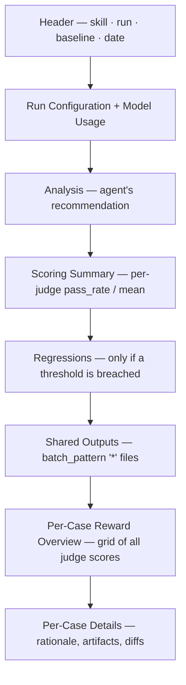

# Reading the report

Every `/eval-run` writes a single, self-contained `report.html` — no server, no
assets, no network. Open it in any browser and you get the scoring summary, each
judge's rationale per case, the artifacts the agent produced, and cost/token
metrics, all in one file you can commit, email, or attach to a PR.

!!! info "Where it lives"
    ```text
    $AGENT_EVAL_RUNS_DIR/<eval-name>/<run-id>/report.html
    ```
    `$AGENT_EVAL_RUNS_DIR` defaults to `eval/runs`, so a typical path is
    `eval/runs/my-skill-eval/2026-07-16-1200/report.html`. See the
    [runs directory reference](../reference/runs-directory.md) for the full layout.

## How it's built

`report.py` reads four files from the run directory (plus an optional baseline)
and emits one HTML document. It works with **any** skill — judges, thresholds,
and outputs are read from `eval.yaml` at render time, nothing is hardcoded.

| Input file | Provides |
| --- | --- |
| `summary.yaml` | Per-judge aggregates and per-case judge results |
| `run_result.json` | Execution metadata: model, cost, tokens, duration, exit code |
| `eval.yaml` | Judge definitions, thresholds, `outputs` types, reward config |
| `analysis.md` *(optional)* | The agent's written recommendation (from `/eval-run` or `/eval-review`) |
| `review.yaml` *(optional)* | Human feedback attached per case |

The report is regenerated automatically at the end of `/eval-run`. To rebuild it
by hand (for example after editing `analysis.md` or to add a baseline):

```bash
python3 skills/eval-run/scripts/report.py \
    --run-id <run-id> \
    --config eval.yaml \
    --baseline <baseline-run-id> \   # optional A/B comparison
    --open                           # optional: open in browser
```

## Anatomy of the page

The sections render top to bottom in this order (empty sections are omitted):



### Run configuration & model usage

The top card summarizes the run: model, subagent model, effort, agent + version,
duration, cost, turns, and exit code. Below it, a **Model Usage** table breaks
down token counts, cache hit rate, and derived efficiency metrics
(cost / turn, output tokens / turn, cost / Mtok) — one column per model, plus a
Total column for multi-model runs. A collapsible **Parameters** row shows the
exact invocation (execution mode, budget, timeout, and the resolved skill args).

### Scoring summary

One row per judge with its type, aggregated metric, and threshold status.

| Column | Meaning |
| --- | --- |
| Judge | Judge `name` from `eval.yaml` |
| Type | `check`, `llm (model)`, `builtin`, or `code` |
| Metric | `pass_rate` for boolean judges, `mean` for numeric judges |
| Value | The aggregate (e.g. `80%` or `3.75`) |
| Threshold | The gate from [`thresholds`](../concepts/thresholds.md) (`≥ …`) |
| Status | `PASS` / `FAIL` / `SKIP` / `ERROR` |

Boolean judges aggregate as a **pass rate** (fraction `True`); numeric judges
aggregate as a **mean**. A `SKIP` means the judge's `if` condition was false for
those cases; `ERROR` means the judge raised. When a [pairwise
baseline](../concepts/pairwise-and-sampling.md) is present, a final `pairwise`
row shows the `W / L / T` record.

!!! tip "Sampling stability"
    If you scored with `--samples N`, each row gets a small proportion bar
    (`3/5 · 3×`) showing how many cases gave a stable verdict across samples.
    Per-case rationale for each sample is available in tabs further down.

### Regressions

Rendered **only when a threshold is breached** — a compact table of every judge
that fell below its `min_pass_rate` or `min_mean`. If the section is absent, no
gate failed.

### Per-case reward overview

A dense grid: one row per case, a **Reward** column, then every judge score as a
color-coded cell. Judges are grouped into **Gate** (binary `check`), **LLM**
(scored), and **Other** columns. The reward is composed the same way the
[reward API](../concepts/reward-api.md) computes it for RL training, so what you
see is what you'd train on. The final row shows the average across scored cases.

### Per-case details

Each case is a collapsible panel, color-accented green/red by pass/fail (or by
pairwise winner). Inside:

- **Judge results table** — `Judge`, `Value`, and the full **Rationale**
  (Markdown-rendered) for every judge. Numeric scores are colored against their
  `score_range`; sampled judges show an ASCII histogram of the spread.
- **Human feedback** — from `review.yaml`, if `/eval-review` attached any.
- **Input** — the case's `input.yaml`.
- **Output files** — every artifact the skill produced (see rendering below).
- **Baseline diff** — a side-by-side, word-level diff against the `--baseline`
  run (text) or an image/diagram comparison (visual).

## Visual artifacts

The report inlines artifacts so nothing depends on external files. Rendering is
picked by file type and, for JSON, by the `types` map in
[`outputs`](../reference/config/outputs.md).

| Artifact | How it renders |
| --- | --- |
| `.png` `.jpg` `.gif` `.webp` `.svg` | Embedded inline as a base64 data URI |
| `.d2` | Rendered to SVG via `d2 --bundle --layout elk` (source in a collapsible) |
| `.drawio` | Rendered to SVG via the drawio CLI (skipped if a `.png`/`.svg` sibling exists) |
| `.html` | Rendered in a sandboxed `<iframe>` |
| JSON with `types: graph` | Converted to D2, then rendered to SVG |
| JSON with `types: metrics` | Rendered as a key/value table |
| everything else | Shown as text (truncated to 200 lines) |

!!! warning "Diagram rendering needs the CLIs"
    D2 and drawio artifacts render **only if** the `d2` / `drawio` binaries are on
    `PATH` where you run `report.py`. If a render fails, the report falls back to
    showing the source text — it never errors out over a missing renderer.

### Image comparison modes

When a case has a **gold standard** image (declared via `gold_diagram` in the
case's `annotations.yaml`) or you passed `--baseline`, matching images and
diagrams render in an interactive comparison widget with three tabs:

=== "Side by side"

    The two images laid out next to each other — the default view for spotting
    structural differences at a glance.

=== "Swipe"

    A single frame with a draggable divider that wipes between the two images —
    best for pixel-level alignment differences.

=== "Onion"

    The two images stacked with an opacity slider — best for detecting subtle
    shifts and additions.

## Dark mode

The report ships light and dark themes. A toggle button sits in the top-right
corner; the choice persists in `localStorage` and the initial theme follows your
OS `prefers-color-scheme`. Printing always forces the light theme.

## Where to go next

<div class="grid cards" markdown>

-   :material-book-open-variant: **How the report is assembled**

    ---

    The concept page behind this walkthrough — sections, data sources, and design.

    [:octicons-arrow-right-24: Report concept](../concepts/report.md)

-   :material-account-check: **Act on the results**

    ---

    Turn a report into changes via human review or the automated loop.

    [:octicons-arrow-right-24: /eval-review](../guides/eval-review.md)

-   :material-play-circle: **Rerun with a baseline**

    ---

    Add `--baseline <run-id>` to get pairwise verdicts and per-artifact diffs.

    [:octicons-arrow-right-24: /eval-run](../guides/eval-run.md)

</div>
