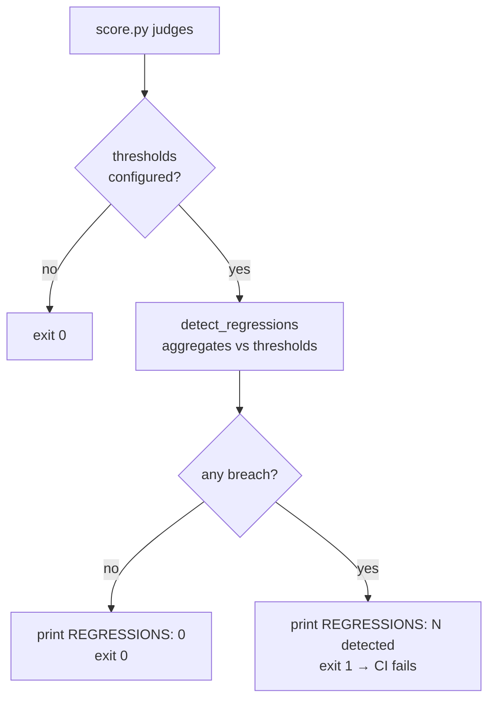

# CI integration & regression gating

Wire an eval into continuous integration so a pull request that degrades your skill
fails the build. The mechanism is deliberately small: you declare per-judge
[`thresholds`](../reference/config/thresholds.md) in `eval.yaml`, and the scorer
**exits non-zero** when a run falls below them — which is all a CI job needs to gate on.

!!! note "This is an evolving area"
    The harness ships the primitives for CI gating (thresholds + a non-zero exit), and
    the GitHub Actions job below works today. Turnkey CI recipes, reusable actions, and
    caching patterns are still being fleshed out — see
    [remaining work](https://github.com/opendatahub-io/agent-eval-harness/blob/main/CLAUDE.md).
    Treat the example as a starting point to adapt, not a drop-in.

## How gating works

Scoring aggregates each judge by value type — **boolean** judges become a `pass_rate`,
**numeric** judges become a `mean`, and a `--baseline` [pairwise](../concepts/pairwise-and-sampling.md)
comparison produces a `win_rate`. Regression detection compares those aggregates against
the `thresholds` block and, on any breach, returns exit code `1`.



## Thresholds

`thresholds` is a top-level map of **judge name → gate**. Each gate sets one or more of
three keys; a run regresses if the matching aggregate is below the floor.

| Key | Applies to | Aggregate compared | Passes when |
| --- | --- | --- | --- |
| `min_pass_rate` | boolean judges | `pass_rate` (fraction of cases that returned `True`) | `pass_rate >= min_pass_rate` |
| `min_mean` | numeric judges (e.g. 1–5 LLM scores) | `mean` (average value across cases) | `mean >= min_mean` |
| `min_win_rate` | a pairwise judge (needs `--baseline`) | `win_rate` | `win_rate >= min_win_rate` |

```yaml title="eval.yaml (excerpt)"
judges:
  - name: has_content          # boolean judge → pass_rate
    check: |
      content = outputs.get("main_content", "")
      return (len(content.strip()) >= 100,
              f"{len(content.strip())} chars")
  - name: output_quality       # numeric judge (1–5) → mean
    prompt: "Score the output 1-5 for completeness, clarity, and accuracy."

thresholds:
  has_content:    { min_pass_rate: 1.0 }   # every case must pass
  output_quality: { min_mean: 3.5 }        # average score must stay >= 3.5
```

!!! warning "An unavailable metric counts as a regression"
    If a threshold is set but its aggregate is `None`, that is reported as a regression,
    not silently skipped. This is almost always a config mistake — the judge was skipped
    for every case (its `if:` condition, or it errored), or the key targets the wrong
    judge type (e.g. `min_pass_rate` on a numeric judge, whose `pass_rate` is always
    `None`). Match the key to the judge's value type.

## Exit-code behavior

Two entry points enforce thresholds; **both `sys.exit(1)` on regression** so a CI runner
fails the step automatically.

=== "Inline (default)"

    `score.py judges` runs the judges and, if `thresholds` is set, checks them at the end
    of scoring — so a normal `/eval-run` already gates. It prints `REGRESSIONS: 0` or
    `REGRESSIONS: N detected` (one line per breach) before exiting.

    ```bash
    python3 skills/eval-run/scripts/score.py judges \
      --run-id "$RUN_ID" --config eval.yaml
    ```

=== "Standalone gate"

    `score.py regression` re-checks the thresholds against an already-scored run's
    `summary.yaml` (run the judges first). Useful as an explicit, self-documenting CI
    step separate from scoring.

    ```bash
    python3 skills/eval-run/scripts/score.py regression \
      --run-id "$RUN_ID" --config eval.yaml
    ```

Runs live under `$AGENT_EVAL_RUNS_DIR/<eval-name>/<run-id>/` (default `eval/runs/`), so
pass a stable `--run-id` (e.g. the commit SHA) to find the same directory later in the job.

## Comparing against a baseline

Beyond absolute floors, you can gate a run **relative to a previous one** with
`--baseline <run-id>`. The baseline must be a prior run under the same eval-name.

- **`/eval-run --baseline <run-id>`** adds a position-swapped pairwise judge on top of
  the regular judges. Each case is judged both A/B and B/A, and only a *consistent*
  preference counts as a win; `summary.yaml` gains a `pairwise` section (`wins_a`,
  `wins_b`, `ties`). Gate it with a `min_win_rate` threshold.
- **`score.py regression --baseline <run-id>`** also does a direct aggregate comparison:
  for `mean` and `pass_rate`, a current value more than `0.5` below the baseline is
  flagged as `Degraded vs baseline` — catching drift even where no absolute floor was
  crossed.

```bash
# Score this run with a pairwise comparison against last week's baseline,
# then gate both the absolute thresholds and the vs-baseline deltas.
python3 skills/eval-run/scripts/score.py pairwise \
  --run-id "$RUN_ID" --baseline 2026-07-09-opus --config eval.yaml
python3 skills/eval-run/scripts/score.py regression \
  --run-id "$RUN_ID" --baseline 2026-07-09-opus --config eval.yaml
```

!!! tip "Absolute vs relative gates"
    Use `min_mean` / `min_pass_rate` for a hard quality floor that must always hold, and
    `--baseline` for catch-any-drift protection between a known-good run and the PR under
    test. They compose — a run can pass its absolute floors yet still fail because it
    dropped sharply versus the baseline.

## A GitHub Actions job

This workflow runs the eval on every pull request and fails the check if any threshold
regresses. The `score.py regression` step is the gate: it returns `1`, which fails the
job.

```yaml title=".github/workflows/eval.yml"
name: skill-eval
on: [pull_request]

jobs:
  eval:
    runs-on: ubuntu-latest
    env:
      ANTHROPIC_API_KEY: ${{ secrets.ANTHROPIC_API_KEY }}
      AGENT_EVAL_RUNS_DIR: eval/runs
      RUN_ID: ci-${{ github.sha }}
    steps:
      - uses: actions/checkout@v4

      - uses: actions/setup-python@v5
        with:
          python-version: "3.11"

      - name: Install the harness
        run: pip install -e .

      # Produce a scored run. In CI this is typically Claude Code headless
      # driving /eval-run; see the headless guide. The run writes
      # eval/runs/<eval-name>/$RUN_ID/summary.yaml.
      - name: Run the eval
        run: |
          /eval-run --run-id "$RUN_ID" --model sonnet

      # Gate: exits 1 on any threshold breach, failing the job.
      - name: Check for regressions
        run: |
          python3 skills/eval-run/scripts/score.py regression \
            --run-id "$RUN_ID" --config eval.yaml

      - name: Upload report
        if: always()
        uses: actions/upload-artifact@v4
        with:
          name: eval-report
          path: eval/runs/**/report.html
```

!!! note "Driving the run in CI"
    Getting a skill to execute headlessly (auto-answering `AskUserQuestion`, gating
    external services) is covered in [running headless](headless.md). For heavier or
    containerized CI, run the same `eval.yaml` on [Harbor](harbor.md) with
    `--runner harbor` — the config is unchanged; only the substrate flag differs.

## Where to go next

<div class="grid cards" markdown>

-   :material-gate: **Threshold semantics**

    ---

    The full reference for `min_mean`, `min_pass_rate`, and `min_win_rate`.

    [:octicons-arrow-right-24: thresholds reference](../reference/config/thresholds.md)

-   :material-scale-balance: **Pairwise & sampling**

    ---

    How `--baseline` comparisons and repeated-sample stability work.

    [:octicons-arrow-right-24: pairwise & sampling](../concepts/pairwise-and-sampling.md)

-   :material-console: **Run headless**

    ---

    Auto-answer questions and gate external services for unattended runs.

    [:octicons-arrow-right-24: running headless](headless.md)

</div>
