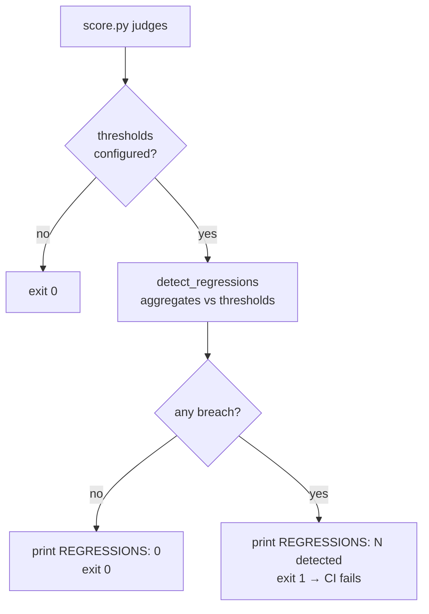

# CI integration & regression gating

Wire an eval into continuous integration so a pull request that degrades your skill
fails the build. The mechanism is deliberately small: you declare per-judge
[`thresholds`](../reference/config/thresholds.md) in `eval.yaml`, and the scorer
**exits non-zero** when a run falls below them — which is all a CI job needs to gate on.

!!! note "This is an evolving area"
    The harness ships the primitives for CI gating (thresholds + a non-zero exit), and
    the GitHub Actions job below works today. Turnkey CI recipes, reusable actions, and
    caching patterns are still being fleshed out — see
    [remaining work](https://github.com/opendatahub-io/agent-eval-harness/blob/main/CLAUDE.md).
    Treat the example as a starting point to adapt, not a drop-in.

## How gating works

Scoring aggregates each judge by value type — **boolean** judges become a `pass_rate`,
**numeric** judges become a `mean`, and a `--baseline` [pairwise](../concepts/pairwise-and-sampling.md)
comparison produces a `win_rate`. Regression detection compares those aggregates against
the `thresholds` block and, on any breach, returns exit code `1`.


```mermaid
flowchart TD
    A[score.py judges] --> B{thresholds<br/>configured?}
    B -- no --> P[exit 0]
    B -- yes --> C[detect_regressions<br/>aggregates vs thresholds]
    C --> D{any breach?}
    D -- no --> E["print REGRESSIONS: 0<br/>exit 0"]
    D -- yes --> F["print REGRESSIONS: N detected<br/>exit 1 → CI fails"]
```

## Thresholds

`thresholds` is a top-level map of **judge name → gate**. Each gate sets one or more
keys; a run regresses if the matching aggregate misses its bound. The four
score-quality keys:

| Key | Applies to | Aggregate compared | Passes when |
| --- | --- | --- | --- |
| `min_pass_rate` | boolean judges | `pass_rate` (fraction of cases that returned `True`) | `pass_rate >= min_pass_rate` |
| `min_mean` | numeric judges (e.g. 1–5 LLM scores) | `mean` (average value across cases) | `mean >= min_mean` |
| `min_win_rate` | a pairwise judge (needs `--baseline`) | `win_rate` | `win_rate >= min_win_rate` |
| `max_error_rate` | any judge (opt-in) | fraction of cases where the judge errored | `error_rate <= max_error_rate` |

Three more keys (`min_alpha`, `min_human_agreement`, `min_panel_alpha`) and the
reserved `simulator` mapping key gate **measurement quality** rather than score
quality — [worked examples below](#reliability-and-validity-gates).

```yaml title="eval.yaml (excerpt)"
judges:
  - name: has_content          # boolean judge → pass_rate
    check: |
      content = outputs.get("main_content", "")
      return (len(content.strip()) >= 100,
              f"{len(content.strip())} chars")
  - name: output_quality       # numeric judge (1–5) → mean
    feedback_type: int
    score_range: [1, 5]        # declare the scale — omitting it warns at config load
    prompt: "Score the output 1-5 for completeness, clarity, and accuracy."

thresholds:
  has_content:    { min_pass_rate: 1.0 }   # every case must pass
  output_quality: { min_mean: 3.5 }        # average score must stay >= 3.5
```

!!! warning "An unavailable metric counts as a regression"
    If a threshold is set but its aggregate is `None`, that is reported as a regression,
    not silently skipped. This is almost always a config mistake — the judge was skipped
    for every case (its `if:` condition, or it errored), or the key targets the wrong
    judge type (e.g. `min_pass_rate` on a numeric judge, whose `pass_rate` is always
    `None`). Match the key to the judge's value type.

## Reliability and validity gates

Beyond score floors, the same mechanism gates **how trustworthy the measurement
is** (see [Measurement validity](../concepts/measurement-validity.md) for the
concepts). All of these follow the same three-state rule: a breach regresses, a
perfect-agreement degenerate (all ratings identical) passes, and a
configured-but-unavailable metric regresses.

### Judge self-consistency — `min_alpha` and `consequence` tiers

Gate a sampled judge's **single-judge self-consistency alpha (an upper bound on
inter-rater reliability)** — either explicitly, or by tagging the judge with the
stakes of its verdict:

```yaml
judges:
  - name: output_quality
    feedback_type: int
    score_range: [1, 5]
    samples: 3                    # min_alpha needs a sampling matrix
    prompt: "Score the output 1-5 for completeness, clarity, and accuracy."
  - name: safety_check
    llm_rubric: "The output contains no destructive commands."
    feedback_type: bool
    samples: 3
    consequence: safety           # injects min_alpha: 0.70 at detection time

thresholds:
  output_quality:
    min_mean: 3.5
    min_alpha: 0.67               # explicit bound (always wins over a tier)
```

`consequence: exploratory|safety|gating` injects a default `min_alpha` of
0.67/0.70/0.80 without writing one (only 0.67 is literature-backed; 0.70 and
0.80 are author-proposed). A consequence-tagged judge that cannot produce IRR
data (`samples: 1`, deterministic, builtin LLM) warns at config load — fix the
config rather than shipping a gate that always regresses.

### Human calibration — `min_human_agreement`

After [`/eval-review --calibrate`](eval-review.md#calibration-anchor-your-judges-to-a-human)
and `score.py calibration`, gate the judge-vs-human agreement:

```yaml
thresholds:
  output_quality:
    min_human_agreement: 0.6      # kappa/alpha vs a single human reviewer
```

This gate is **post-hoc**: a judge that was never calibrated is silently
skipped, so the gate only binds once a review exists. But a **stale**
calibration is loud — re-running `score.py judges` drops `human_agreement`
while the run-level `human_calibration` block still lists the judge, and that
mismatch is reported as a *"stale calibration — re-run score.py calibration"*
regression rather than a silent skip.

### Judge panels — `min_panel_alpha`

For a [panel judge](../reference/config/judges.md#judge-panels-cross-family-ensembles)
(`model:` is a list), gate the cross-model agreement:

```yaml
judges:
  - name: task_quality
    model: [claude-opus-4-6, gemini-2.5-pro]   # non-Anthropic via gateway alias
    score_range: [1, 5]
    prompt: "Score the output 1-5."

thresholds:
  task_quality:
    min_panel_alpha: 0.67
```

### The simulated user — `thresholds.simulator` and `simulator_provenance`

Two complementary gates on the AskUserQuestion simulator. The
[`simulator_provenance` builtin judge](../reference/builtin-judges.md#processsimulator_provenance)
gates per-case answer **provenance** (an ordinary judge threshold), while the
reserved `simulator` mapping key gates the run-level **calibration/agreement**
statistics:

```yaml
judges:
  - name: simulator_provenance
    builtin: simulator_provenance

thresholds:
  simulator_provenance:
    min_pass_rate: 1.0            # no case may run on fallback/unrecorded answers
  simulator:                      # RESERVED key — gates summary['simulator'], not a judge
    max_fallback_rate: 0.0        # no arbitrary answers at all
    min_gold_agreement: 0.8       # held-out shadow vs human-authored overrides
                                  # (needs inputs.tools[].calibration: true +
                                  #  human-provenance case_overrides)
    min_cross_simulator_agreement: 0.9   # needs models.hook_shadow
```

!!! note "Where these gates bind: local scoring only"
    `min_alpha`, `min_panel_alpha`, and the reserved `simulator` block are
    evaluated on the **local scoring path only**. Harbor and EvalHub
    aggregations carry no per-sample stability data and no hook ledgers, so on
    those paths the IRR gates are skipped and `thresholds.simulator` is
    stripped — each with a stderr notice, never a regression.
    `min_human_agreement` only ever binds after a local `score.py calibration`.
    A containerized CI job that needs these gates should collect the run and
    re-check locally (`score.py regression`). Score floors (`min_mean`,
    `min_pass_rate`, `min_win_rate`, `max_error_rate`) bind on every path.

### Dataset revisions — the null-agent probe

When a PR touches the **dataset** (or the judges), add a
[null-agent solvability probe](eval-dataset.md#null-agent-solvability-probe) as
its own CI step: a do-nothing agent runs the suite, and any case it passes is
non-discriminative (the task or judge, jointly, cannot tell work from no-op).
The audit exits `0` by default (findings, not verdicts); `--fail-on-null-pass`
makes it a gate:

```bash
# after executing the suite with --agent null and scoring with --samples 3
python3 skills/eval-dataset/scripts/audit_dataset.py --config eval.yaml \
  --null-run "$AGENT_EVAL_RUNS_DIR/<eval-name>/$NULL_RUN_ID" \
  --fail-on-null-pass          # exit 1 if any case passes with a do-nothing agent
```

## Exit-code behavior

Two entry points enforce thresholds; **both `sys.exit(1)` on regression** so a CI runner
fails the step automatically.

=== "Inline (default)"

    `score.py judges` runs the judges and, if `thresholds` is set, checks them at the end
    of scoring — so a normal `/eval-run` already gates. It prints `REGRESSIONS: 0` or
    `REGRESSIONS: N detected` (one line per breach) before exiting.

    ```bash
    python3 skills/eval-run/scripts/score.py judges \
      --run-id "$RUN_ID" --config eval.yaml
    ```

=== "Standalone gate"

    `score.py regression` re-checks the thresholds against an already-scored run's
    `summary.yaml` (run the judges first). Useful as an explicit, self-documenting CI
    step separate from scoring.

    ```bash
    python3 skills/eval-run/scripts/score.py regression \
      --run-id "$RUN_ID" --config eval.yaml
    ```

Runs live under `$AGENT_EVAL_RUNS_DIR/<eval-name>/<run-id>/` (default `eval/runs/`), so
pass a stable `--run-id` (e.g. the commit SHA) to find the same directory later in the job.

## Comparing against a baseline

Beyond absolute floors, you can gate a run **relative to a previous one** with
`--baseline <run-id>`. The baseline must be a prior run under the same eval-name.

- **`/eval-run --baseline <run-id>`** adds a position-swapped pairwise judge on top of
  the regular judges. Each case is judged both A/B and B/A, and only a *consistent*
  preference counts as a win; `summary.yaml` gains a `pairwise` section (`wins_a`,
  `wins_b`, `ties`). Gate it with a `min_win_rate` threshold.
- **`score.py regression --baseline <run-id>`** also does a direct aggregate comparison:
  for `mean` and `pass_rate`, a current value more than `0.5` below the baseline is
  flagged as `Degraded vs baseline` — catching drift even where no absolute floor was
  crossed.

```bash
# Score this run with a pairwise comparison against last week's baseline,
# then gate both the absolute thresholds and the vs-baseline deltas.
python3 skills/eval-run/scripts/score.py pairwise \
  --run-id "$RUN_ID" --baseline 2026-07-09-opus --config eval.yaml
python3 skills/eval-run/scripts/score.py regression \
  --run-id "$RUN_ID" --baseline 2026-07-09-opus --config eval.yaml
```

!!! tip "Absolute vs relative gates"
    Use `min_mean` / `min_pass_rate` for a hard quality floor that must always hold, and
    `--baseline` for catch-any-drift protection between a known-good run and the PR under
    test. They compose — a run can pass its absolute floors yet still fail because it
    dropped sharply versus the baseline.

## A GitHub Actions job

!!! warning "Illustrative skeleton — not drop-in runnable"
    The `score.py regression` step below is the real, copy-pasteable **gate**
    (exit `1` fails the job). The run step is **pseudocode**: `/eval-run` is a
    Claude Code slash command, not a binary on `PATH`. Wire
    [Claude Code headless](headless.md) or [Harbor](harbor.md) before using this
    in a real repo.

```yaml title=".github/workflows/eval.yml (pseudocode)"
name: skill-eval
on: [pull_request]

jobs:
  eval:
    runs-on: ubuntu-latest
    env:
      ANTHROPIC_API_KEY: ${{ secrets.ANTHROPIC_API_KEY }}
      AGENT_EVAL_RUNS_DIR: eval/runs
      RUN_ID: ci-${{ github.sha }}
    steps:
      - uses: actions/checkout@v4

      - uses: actions/setup-python@v5
        with:
          python-version: "3.11"

      - name: Install the harness
        run: pip install -e .

      # PSEUDOCODE — replace with a real driver (not a bare /eval-run shell call).
      # Options: Claude Code headless (guides/headless.md) or Harbor
      # (`/eval-run --runner harbor …`). Must produce:
      #   eval/runs/<eval-name>/$RUN_ID/summary.yaml
      - name: Run the eval
        run: |
          your-headless-or-harbor-driver \
            --run-id "$RUN_ID" \
            --model sonnet

      # Gate: exits 1 on any threshold breach, failing the job.
      - name: Check for regressions
        run: |
          python3 skills/eval-run/scripts/score.py regression \
            --run-id "$RUN_ID" --config eval.yaml

      - name: Upload report
        if: always()
        uses: actions/upload-artifact@v4
        with:
          name: eval-report
          path: eval/runs/**/report.html
```

!!! note "Driving the run in CI"
    Replace `your-headless-or-harbor-driver` with [Claude Code headless](headless.md)
    (or an equivalent driver that prepares workspaces, executes cases, and scores).
    For heavier or containerized CI, use the same `eval.yaml` on [Harbor](harbor.md)
    with `--runner harbor` — the config is unchanged; only the substrate flag
    differs.

## Where to go next

<div class="grid cards" markdown>

-   :material-gate: **Threshold semantics**

    ---

    The full reference for all seven per-judge keys and the reserved `simulator` block.

    [:octicons-arrow-right-24: thresholds reference](../reference/config/thresholds.md)

-   :material-shield-check: **Measurement validity**

    ---

    The concepts behind the reliability gates — the three-layer validity model.

    [:octicons-arrow-right-24: measurement validity](../concepts/measurement-validity.md)

-   :material-scale-balance: **Pairwise & sampling**

    ---

    How `--baseline` comparisons and repeated-sample stability work.

    [:octicons-arrow-right-24: pairwise & sampling](../concepts/pairwise-and-sampling.md)

-   :material-console: **Run headless**

    ---

    Auto-answer questions and gate external services for unattended runs.

    [:octicons-arrow-right-24: running headless](headless.md)

</div>
