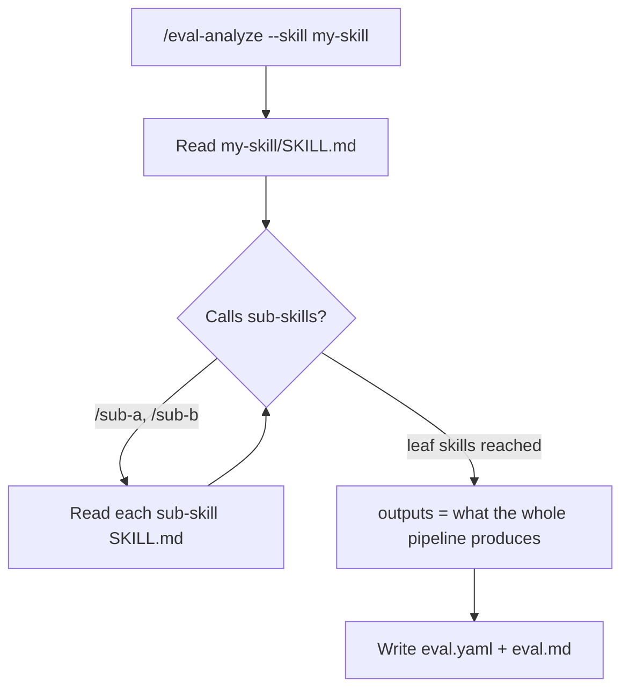
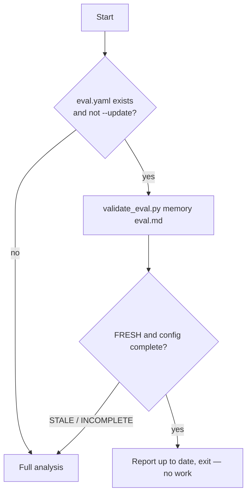

# Generate a config (/eval-analyze)

`/eval-analyze` reads what you want to evaluate — a skill's `SKILL.md` (following any
sub-skills it calls) or a custom analysis prompt — and writes a complete `eval.yaml`.
It caches its findings in an `eval.md` next to the config so re-runs are cheap.

!!! abstract "What it produces"
    - **`eval.yaml`** — the [config](../reference/eval-yaml.md) `/eval-run` needs: an
      `execution` block, a natural-language `dataset.schema`, `outputs`,
      [judges](../concepts/judges.md), `models`, and [thresholds](../concepts/thresholds.md).
    - **`eval.md`** — a cached narrative of the analysis with a `skill_hash` so the
      skill isn't re-read until it changes.

## Two modes

The analysis mode is decided by which flag you pass.

=== "Skill analysis (`--skill`)"

    Reads the skill deeply — `SKILL.md`, its scripts, and its sub-skill chain — then
    generates a config that tests the skill's outputs.

    ```bash
    /eval-analyze --skill my-skill
    /eval-analyze                     # auto-detect when there is a single skill
    ```

    Produces `execution.skill` (case or batch mode) plus judges that check output
    quality.

=== "Prompt analysis (`--prompt`)"

    Executes a custom analysis prompt that defines *what* to evaluate and *how* — used
    for non-skill evals such as [agentic documentation testing](../get-started/agentic-docs.md).

    ```bash
    /eval-analyze --prompt examples/openshift-agentic-docs.md
    ```

    Produces `execution.prompt` (case mode) plus capability-style rubric judges, and
    typically a [`generation`](../reference/config/generation.md) block for synthetic
    datasets. Prompt-mode configs often set `runner.workspace_mode: repo` and
    `permissions.deny` — see [Prompt-mode specifics](#prompt-mode-specifics).

| Aspect | Skill analysis | Prompt analysis |
| --- | --- | --- |
| **Flag** | `--skill my-skill` | `--prompt <path>` |
| **Analyzes** | `SKILL.md`, scripts, sub-skills | Docs, patterns, APIs (prompt-defined) |
| **Executes** | `execution.skill` | `execution.prompt` |
| **Mode** | `case` or `batch` | `case` only |
| **Dataset** | Schema-based (input/output fields) | Generated (`generation.strategy`) |
| **Judges** | Output-quality checks | Capability rubrics |
| **Question it answers** | Does my skill work? | Can agents use my docs? |

## Flags

| Flag | Required | Default | Description |
| --- | --- | --- | --- |
| `--skill <name>` | no | auto-detect | Which skill to analyze |
| `--config <path>` | no | auto-discover | Output path for the generated config |
| `--prompt <path>` | no | none | Custom analysis prompt (non-skill evals) |
| `--update` | no | `false` | Fill in missing sections only; preserve your edits |

```bash
# Explicit skill, custom output path
/eval-analyze --skill my-skill --config eval/my-skill/eval.yaml

# Refresh a config after the skill changed, keeping hand edits
/eval-analyze --skill my-skill --update
```

!!! note "Auto-triggered when the config is missing"
    You don't always call it directly. `/eval-run` invokes `/eval-analyze`
    automatically when no `eval.yaml` exists, so the pipeline bootstraps itself.

## The core principle: observe, don't assume

> Every field name, file pattern, and directory path in the generated `eval.yaml` must
> come from reading actual files. If you can't point to a specific file or field you
> observed, don't put it in the config.

This is why the analysis reads a **complete sample case** (every file in it) before
writing `dataset.schema`, and why the outputs section describes what the *pipeline*
actually produces rather than a placeholder. A vague schema (`"input files and
references"`) forces judges to guess; a specific one
(`"input.yaml with a 'prompt' field; reference.md gold output"`) lets them write
`outputs["..."]` knowing what to expect.

!!! tip "Mark external systems"
    Fields whose values must exist in an external system (Jira keys, repo URLs,
    channel IDs) should be tagged `[EXTERNAL: System]` in the schema. That tells
    `/eval-dataset` to emit `TODO_` placeholders instead of fabricating realistic but
    invalid values.

## Recursive sub-skill reading

Skill analysis follows the sub-skill chain — `Skill` tool calls and `/skill-name`
references — until it reaches the skills that produce the final artifacts. It reads
each sub-skill's `SKILL.md` to trace the full pipeline (typically 2–5 levels, capped
at 5 to avoid circular references).



The `outputs` block therefore describes what the entire pipeline emits, not just what
the top-level orchestrator returns.

!!! warning "The Skill tool needs explicit permission in headless mode"
    If the skill's `allowed-tools` frontmatter lists `Skill`, the analyzer adds
    `"Skill"` to `permissions.allow`. Without it, nested skill calls fail *silently*
    when `/eval-run` executes headlessly.

## eval.md caching and skill_hash freshness

The analysis is expensive, so it's cached. `eval.md` sits in the same directory as
`eval.yaml` and carries YAML frontmatter:

```yaml title="eval.md (frontmatter)"
---
skill: my-skill
analyzed_at: 2026-07-16T10:00:00Z
skill_hash: a1b2c3d4e5f6   # sha256 of SKILL.md, first 12 hex chars
---
```

Before doing any work, `/eval-analyze` checks freshness:



"Fresh **and** complete" means the `skill_hash` still matches the current `SKILL.md`
**and** the config has a non-empty `dataset.schema`, at least one `outputs` entry with
a schema, at least one judge, and `models.skill` set. If any of that is missing (for
example an older config predating a restructure), it re-analyzes even when the hash
matches.

!!! warning "The hash tracks only the top-level SKILL.md"
    If a **sub-skill** changes but `my-skill/SKILL.md` does not, the hash still matches
    and the cache is considered fresh. Run `/eval-analyze --skill my-skill --update` to
    force a refresh in that case.

## What `--update` preserves

`--update` is for regenerating without clobbering hand edits. It only adds top-level
keys that don't exist yet — it never rewrites your existing judges, schemas,
thresholds, or permissions.

| With `--update` | Behavior |
| --- | --- |
| Existing `judges`, `dataset.schema`, `thresholds` | **Kept as-is** |
| Missing top-level key (e.g. no `outputs`) | **Added** |
| `--skill` differs from the config's recorded skill | **Asks you** — never silently overwrites |

## Prompt-mode specifics

Prompt-mode configs use the same config surface (they still need `models`, `judges`,
and `thresholds`) with two additions the analyzer applies when the agent must navigate
the real repository:

```yaml
runner:
  workspace_mode: repo        # agent explores docs/ai-docs at real paths

permissions:
  deny:                       # test-cheating guard (prompt-mode only)
    - path: "eval/"
      tools: ["Read", "Edit", "Grep", "Glob"]
      reason: "Cases contain answer keys and prior run results"
    - path: "eval.yaml"
      tools: ["Read", "Edit", "Grep"]
    - path: "eval.md"
      tools: ["Read", "Edit", "Grep"]
    - path: "tmp/"
      tools: ["Read", "Edit", "Grep", "Glob"]
```

!!! note "Deny rules are prompt-mode only"
    Skill evals run in an isolated `/tmp` workspace, so they omit `permissions.deny`
    entirely. `deny` rules exist to stop a repo-navigating prompt-mode agent from
    reading its own answer key.

## After generation

The skill validates what it wrote, then reports next steps:

```bash
python3 scripts/validate_eval.py config eval.yaml
```

Errors (broken file references, absolute paths, missing modules) block; warnings (an
empty dataset you haven't populated yet, judges to add later) are surfaced but don't.

- **No test cases yet?** Run [`/eval-dataset`](eval-dataset.md) to generate them.
- **Cases exist?** Run [`/eval-run`](eval-run.md) to execute and score.

[Generate a dataset :material-arrow-right:](eval-dataset.md){ .md-button }

## See also

<div class="grid cards" markdown>

- [**The eval.yaml schema**](../reference/eval-yaml.md) — every field the analyzer writes
- [**Execution model**](../concepts/execution-model.md) — case vs batch, skill vs prompt
- [**Skill vs prompt mode**](skill-vs-prompt.md) — which mode fits your target
- [**The full pipeline**](pipeline.md) — where analyze fits end to end

</div>
