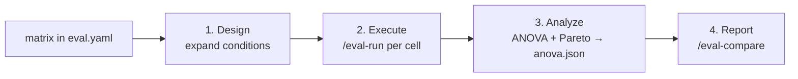

# Analyze variance across configs (/eval-anova)

`/eval-anova` runs a Design-of-Experiments (DoE) sweep over a **matrix** of
configurations — models, thinking-effort levels, prompts, tools — and tells you
whether the score differences between them are *statistically real* or just
run-to-run noise. It reports an ANOVA (F-statistic, p-value, effect size) plus a
cost-vs-quality Pareto frontier.

It is **not** its own executor. `/eval-anova` wraps [`/eval-run`](eval-run.md):
it expands the matrix into conditions, runs `/eval-run` once per matrix cell to
produce standard runs, computes statistics over those runs, and then hands them
to [`/eval-compare`](eval-compare.md) to render the report. Every artifact it
touches is a normal run — nothing bespoke — so the same directory of runs also
works with every other skill.

!!! abstract "What it produces"
    A set of standard `/eval-run` runs (one per matrix cell), an `anova.json`
    with the ANOVA verdict, per-condition means, and a cost/quality Pareto
    frontier, and a `/eval-compare` HTML report with a **Statistical
    Significance** section folded in automatically.

## When to use it

Reach for `/eval-anova` whenever you're comparing configurations rather than
scoring a single one — even if you never say "ANOVA" or "DoE":

- Compare **models** (Opus vs Sonnet vs Haiku) or **configs** on the same eval.
- Decide **which model or config is best** for a task, and by how much.
- **Sweep or grid** several factors at once (model × effort × prompt).
- Run **replications** to average out an agent's stochastic noise.
- Check whether a score difference is **statistically significant** (F, p,
  effect size) instead of eyeballing two averages.
- Any time an `eval.yaml` already carries a [`matrix:`](#design-the-matrix)
  block, or you want to fan an eval out across configurations.

For a plain-language tour of the statistics, see
[Analysis of variance](../concepts/anova.md).

## Install

The statistics live behind an optional extra (scipy, statsmodels, pandas,
pingouin):

```bash
pip install -e ".[anova]"        # or: uv pip install -e ".[anova]"
```

!!! note "Credentials"
    Both the agent runs and the LLM judges use your Claude credentials. For the
    direct API, set `ANTHROPIC_API_KEY=sk-…`. For Vertex AI, set
    `CLAUDE_CODE_USE_VERTEX=1`, `CLOUD_ML_REGION=global`, and
    `ANTHROPIC_VERTEX_PROJECT_ID=…`, then run `gcloud auth application-default
    login`.

## Design the matrix

The `matrix:` block is the one piece of config `/eval-anova` adds on top of a
normal `eval.yaml`. It lists the **factors** you want to vary and their
**levels**; the full-factorial expansion is the Cartesian product of every
factor's levels.

```yaml title="eval.yaml"
matrix:
  factors:
    model:
      - claude-opus-4-8
      - claude-sonnet-4-6
    effort:
      - low
      - high
  replications: 3        # optional, default 1
```

This is `2 × 2 = 4` conditions. With 3 replications over (say) 5 cases that's
`4 × 5 × 3 = 60` runs — **total work = conditions × cases × replications**.

`replications` repeats each condition × case combination to average out noise:
`1` is noisy screening, `3` is a decent default, `5+` buys high confidence at
linear cost.

!!! warning "Factor levels must be a YAML list"
    Each factor's levels must be a **non-empty list**. A bare scalar is rejected:

    ```yaml
    factors:
      model: claude-opus-4-8      # ✗ error — a scalar, not a list
      model: [claude-opus-4-8]    # ✓ a one-level list
    ```

    A scalar would otherwise be iterated character-by-character into a garbage
    design. `replications` must be an integer ≥ 1. A config with no `matrix:`
    section is rejected — `/eval-anova` needs one.

See [Analysis of variance](../concepts/anova.md) for factors, levels,
conditions, and replications explained in depth.

## Run it

```bash
/eval-anova                 # design → run → analyze → report over eval.yaml's matrix
```

Under the hood the skill drives `scripts/orchestrate.py` — the three modes you'll
use most:

```bash
python3 ${CLAUDE_SKILL_DIR}/scripts/orchestrate.py --config eval.yaml                 # run → analyze → report
python3 ${CLAUDE_SKILL_DIR}/scripts/orchestrate.py --config eval.yaml --dry-run       # design + cost estimate, no execution
python3 ${CLAUDE_SKILL_DIR}/scripts/orchestrate.py --config eval.yaml --analyze-only  # re-analyze existing runs + re-render
```

| Flag | Default | Effect |
| --- | --- | --- |
| `--config <path>` | — (required) | The `eval.yaml` carrying the `matrix:` block. |
| `--dry-run` | off | Print the grid + a cost estimate, then exit before creating dirs or executing. |
| `--analyze-only` | off | Re-analyze existing runs under the runs dir (recompute `anova.json`) and re-render; no execution. |
| `--cases <id…>` | all cases | Restrict execution to specific case ids. |
| `--avg-cost-per-run <float>` | unset | Per-run cost used by `--dry-run` for a point estimate. |
| `--output <path>` | default compare dir | Output dir for the `/eval-compare` report. |
| `--no-report` | off | Compute `anova.json` but skip rendering the report. |

!!! tip "Estimate cost before you commit"
    `--dry-run` prints the design and a cost line. It uses `--avg-cost-per-run`
    for a point estimate; failing that, `execution.max_budget_usd` as an
    **upper bound** (`≤ $X`); failing that, it tells you to supply one rather
    than silently printing `$0`.

!!! warning "`judges[].samples` multiplies judge cost across every cell"
    Matrix cells inherit `eval.yaml` unchanged, so a judge with `samples: k`
    (or a [panel](../reference/config/judges.md#judge-panels-cross-family-ensembles)
    of m models) pays k× (or k×m×) judge calls in **every**
    condition × replication — and the cost estimator does **not** model judge
    sampling. Budget for it separately.

## How it works



### Step 1 — Design

Read `matrix.factors` + `replications` and expand the full factorial into
conditions. `--dry-run` stops here and prints the grid plus the cost estimate.

### Step 2 — Execute

For each condition × replication, drive the full `/eval-run` pipeline (workspace
→ execute → collect → score). Each cell becomes one standard run with its own
`summary.yaml`, stamped with a `condition.json` recording its factor levels. How
a factor reaches the run depends on what kind it is:

| Factor (matrix key) | How it reaches the run |
| --- | --- |
| `model` | `--model <level>` on the runner (falls back to `models.skill` if a condition has no `model`). |
| `effort` | `--effort <level>` on the runner. |
| `subagent` / `subagent_model` | `--subagent-model <level>` (`subagent` wins if both are present). |
| any other factor | `--input-override <name>=<level>`, merged into the case's `input.yaml`. It only changes behaviour if the runner consumes it — as `{name}` in a `cli` command or `{{ input.name }}` in `execution.arguments` / `execution.prompt`. A factor nothing consumes still defines a distinct condition (and appears in ANOVA labels), it just won't alter the run. |

### Step 3 — Analyze

Compute the statistics over the runs' `summary.yaml` files and write
`anova.json`: a repeated-measures or mixed-effects ANOVA (chosen automatically
from how many factors actually vary), per-condition means, and a cost/quality
Pareto frontier. `--analyze-only` runs *just* this step.

### Step 4 — Report

Hand the runs to [`/eval-compare`](eval-compare.md), which renders the
cross-condition comparison and — because it finds `anova.json` — folds in the
Statistical Significance section. `--no-report` skips this.

## What you get

Everything lands under the runs directory, keyed by eval name:

```text
$AGENT_EVAL_RUNS_DIR/                 # default eval/runs
└── <eval-name>/
    ├── <date>-<model-slug>[-<factor>-<level>…][-r<n>]/   # one dir per condition × replication
    │   ├── summary.yaml              # standard /eval-run scores (per_case) — analyze reads this
    │   ├── run_result.json           # model + cost_usd
    │   ├── condition.json            # {condition_id, levels}
    │   └── …                         # the usual /eval-run artifacts
    ├── anova.json                    # the statistics artifact
    └── comparison-report/index.html  # the /eval-compare report (with the stats section)
```

There are **two** ways to read the results, both purely from on-disk artifacts —
neither re-runs the experiment:

```bash
# Comparison report — leaderboard + heatmap + the ANOVA/Pareto section when anova.json exists:
python3 ${CLAUDE_PLUGIN_ROOT}/skills/eval-compare/scripts/compare.py generate $AGENT_EVAL_RUNS_DIR/<eval-name>

# Stats-forward deep view for one experiment — condition means, F / p / η², per-case matrix:
python3 ${CLAUDE_SKILL_DIR}/scripts/report.py $AGENT_EVAL_RUNS_DIR/<eval-name>
```

## Re-analyze existing runs

Because analysis reads plain `summary.yaml` files, `--analyze-only` works over
**any** directory of standard runs — including runs a CI job or a manual fan-out
of `/eval-run` produced, with no `/eval-anova` involvement at execution time:

```bash
python3 ${CLAUDE_SKILL_DIR}/scripts/orchestrate.py --config eval.yaml --analyze-only
```

If the runs carry `condition.json` files, the ANOVA groups by those factor
levels; otherwise it falls back to grouping by model. This is the path the
downstream model-comparison CI uses: fan out `/eval-run`, then analyze + compare.

## Rules at a glance

!!! warning "Read this before trusting a result"
    - **Keep the case set fixed across conditions.** Repeated-measures ANOVA
      blocks on case difficulty — it assumes the *same cases* run under every
      condition. Only cases present under every condition are analyzed; the rest
      are excluded and recorded.
    - **Sanity-check scoring first.** If most cells are `0.0`, the judge or gate
      is probably misconfigured — fix that before reading any ANOVA output. A
      near-binary or fully-gated composite gives the F-test nothing to work with,
      so the ANOVA is skipped with a note (expected, not a bug).
    - **Small-N has low power.** More cases and replications buy sensitivity, but
      at multiplicative cost. Treat a single sweep as *screening*, not proof.
    - **Reliability gates run per cell, not per matrix.** A cell whose run trips
      [`min_alpha`](../reference/config/thresholds.md#min_alpha-the-reliability-gate)
      (or any threshold) still produces a full `summary.yaml` — the regression
      affects that `/eval-run`'s exit code, and `--analyze-only` aggregates the
      cell regardless. Per-judge reliability (`stability.irr`, `panel`,
      `human_agreement`) lives in each run's `summary.yaml`; a cross-replication
      ICC over the matrix is an explicitly deferred follow-up.

## Where to go next

<div class="grid cards" markdown>

-   :material-compare: **Render the comparison**

    ---

    `/eval-compare` turns the runs into one report and surfaces the stats section.

    [:octicons-arrow-right-24: /eval-compare](eval-compare.md)

-   :material-chart-bell-curve: **Understand the statistics**

    ---

    Factorial design, repeated-measures vs mixed-effects ANOVA, and the Pareto frontier.

    [:octicons-arrow-right-24: Analysis of variance](../concepts/anova.md)

-   :material-sigma: **Follow a worked recipe**

    ---

    A model × context A/B over real bugfix tasks, runnable offline.

    [:octicons-arrow-right-24: Comparing runs with ANOVA](../cookbook/anova.md)

</div>
