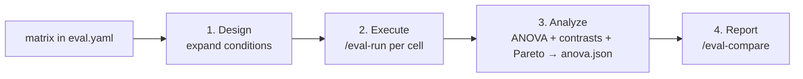

# Analyze variance across configs (/eval-anova)

`/eval-anova` runs a Design-of-Experiments (DoE) sweep over a **matrix** of
configurations — models, thinking-effort levels, prompts, tools — and tells you
whether the score differences between them are *statistically real* or just
run-to-run noise. It reports an ANOVA (raw and adjusted p-values per term —
plus F and effect size for a single-factor design), the **level contrasts**
that say which levels differ and by how much, and a cost-vs-quality Pareto
frontier.

It is **not** its own executor. `/eval-anova` wraps [`/eval-run`](eval-run.md):
it expands the matrix into conditions, runs `/eval-run` once per matrix cell to
produce standard runs, computes statistics over those runs, and then hands them
to [`/eval-compare`](eval-compare.md) to render the report. Every artifact it
touches is a normal run — nothing bespoke — so the same directory of runs also
works with every other skill.

!!! abstract "What it produces"
    A set of standard `/eval-run` runs (one per matrix cell); an `anova.json`
    with the ANOVA verdict, the post-hoc level contrasts per factor (estimate,
    SE, raw and adjusted p for every pair of levels), per-condition means, a
    cost/quality Pareto frontier, and — when enabled — a per-judge screening
    block; and a `/eval-compare` HTML report with a **Statistical
    Significance** section folded in automatically.

## When to use it

Reach for `/eval-anova` whenever you're comparing configurations rather than
scoring a single one — even if you never say "ANOVA" or "DoE":

- Compare **models** (Opus vs Sonnet vs Haiku) or **configs** on the same eval.
- Decide **which model or config is best** for a task, and by how much.
- **Sweep or grid** several factors at once (model × effort × prompt).
- Run **replications** to average out an agent's stochastic noise.
- Check whether a score difference is **statistically significant** (adjusted
  p per term; F and effect size for a single factor) — and *which* levels
  differ — instead of eyeballing two averages.
- Any time an `eval.yaml` already carries a [`matrix:`](#design-the-matrix)
  block, or you want to fan an eval out across configurations.

For a plain-language tour of the statistics, see
[Analysis of variance](../concepts/anova.md).

## Install

The statistics live behind an optional extra (scipy, statsmodels, pandas,
pingouin):

```bash
pip install -e ".[anova]"        # or: uv pip install -e ".[anova]"
```

!!! note "Credentials"
    Both the agent runs and the LLM judges use the credentials of the provider each role's
    model names — set them up once as described in
    [Installation → Provide model credentials](../get-started/installation.md#2-provide-model-credentials).
    Levels of the `model` factor may be provider URIs (`openrouter:/<author>/<slug>`),
    since each one is passed as `--model`; see [Model providers](../concepts/providers.md)
    and the pooling rules [below](#rules-at-a-glance).

## Design the matrix

The `matrix:` block is the one piece of config `/eval-anova` adds on top of a
normal `eval.yaml`. It lists the **factors** you want to vary and their
**levels**; the full-factorial expansion is the Cartesian product of every
factor's levels.

```yaml title="eval.yaml"
matrix:
  factors:
    model:
      - claude-opus-4-8
      - claude-sonnet-4-6
    effort:
      - low
      - high
  replications: 3        # optional, default 1
  analysis:              # optional
    correction: holm     # holm (default) | bh (alias fdr_bh) | none
    # per_judge: false  # opt-in per-judge screening; set true (or pass --per-judge) to enable
```

This is `2 × 2 = 4` conditions. With 3 replications over (say) 5 cases that's
`4 × 5 × 3 = 60` runs — **total work = conditions × cases × replications**.

`replications` repeats each condition × case combination to average out noise:
`1` is noisy screening, `3` is a decent default, `5+` buys high confidence at
linear cost.

!!! warning "Factor levels must be a YAML list"
    Each factor's levels must be a **non-empty list**. A bare scalar is rejected:

    ```yaml
    factors:
      model: claude-opus-4-8      # ✗ error — a scalar, not a list
      model: [claude-opus-4-8]    # ✓ a one-level list
    ```

    A scalar would otherwise be iterated character-by-character into a garbage
    design. `replications` must be an integer ≥ 1. A config with no `matrix:`
    section is rejected — `/eval-anova` needs one.

See [Analysis of variance](../concepts/anova.md) for factors, levels,
conditions, and replications explained in depth.

## Run it

```bash
/eval-anova                 # design → run → analyze → report over eval.yaml's matrix
```

Under the hood the skill drives `scripts/orchestrate.py` — the three modes you'll
use most:

```bash
python3 ${CLAUDE_SKILL_DIR}/scripts/orchestrate.py --config eval.yaml                 # run → analyze → report
python3 ${CLAUDE_SKILL_DIR}/scripts/orchestrate.py --config eval.yaml --dry-run       # design + cost estimate, no execution
python3 ${CLAUDE_SKILL_DIR}/scripts/orchestrate.py --config eval.yaml --analyze-only  # re-analyze existing runs + re-render
```

| Flag | Default | Effect |
| --- | --- | --- |
| `--config <path>` | — (required) | The `eval.yaml` carrying the `matrix:` block. |
| `--dry-run` | off | Print the grid + a cost estimate, then exit before creating dirs or executing. |
| `--analyze-only` | off | Re-analyze existing runs under the runs dir (recompute `anova.json`) and re-render; no execution. |
| `--cases <id…>` | all cases | Restrict execution to specific case ids. |
| `--avg-cost-per-run <float>` | unset | Per-run cost used by `--dry-run` for a point estimate. |
| `--output <path>` | default compare dir | Output dir for the `/eval-compare` report. |
| `--no-report` | off | Compute `anova.json` but skip rendering the report. |
| `--correction <method>` | unset | Multiple-comparison correction across the ANOVA term family (and within each factor's contrasts): `holm`, `bh` (alias `fdr_bh`), or `none`. Precedence: `--correction` > `matrix.analysis.correction` > `holm`. |
| `--per-judge` | off | Also run the ANOVA once per judge (screening), Benjamini–Hochberg-corrected across the whole judges×terms family. Same as `matrix.analysis.per_judge: true` — either one enables it; the flag cannot turn a config-enabled screen off. |

!!! tip "Estimate cost before you commit"
    `--dry-run` prints the design and a cost line. It uses `--avg-cost-per-run`
    for a point estimate; failing that, `execution.max_budget_usd` as an
    **upper bound** (`≤ $X`); failing that, it tells you to supply one rather
    than silently printing `$0`.

## How it works


```mermaid
flowchart LR
    M[matrix in eval.yaml] --> D[1. Design<br/>expand conditions]
    D --> X[2. Execute<br/>/eval-run per cell]
    X --> A[3. Analyze<br/>ANOVA + contrasts + Pareto → anova.json]
    A --> R[4. Report<br/>/eval-compare]
```

### Step 1 — Design

Read `matrix.factors` + `replications` and expand the full factorial into
conditions. `--dry-run` stops here and prints the grid plus the cost estimate.

### Step 2 — Execute

For each condition × replication, drive the full `/eval-run` pipeline (workspace
→ execute → collect → score). Each cell becomes one standard run with its own
`summary.yaml`, stamped with a `condition.json` recording its factor levels. How
a factor reaches the run depends on what kind it is:

| Factor (matrix key) | How it reaches the run |
| --- | --- |
| `model` | `--model <level>` on the runner (falls back to `models.skill` if a condition has no `model`). |
| `effort` | `--effort <level>` on the runner. |
| `subagent` / `subagent_model` | `--subagent-model <level>` (`subagent` wins if both are present). |
| any other factor | `--input-override <name>=<level>`, merged into the case's `input.yaml`. It only changes behaviour if the runner consumes it — as `{name}` in a `cli` command or `{{ input.name }}` in `execution.arguments` / `execution.prompt`. A factor nothing consumes still defines a distinct condition (and appears in ANOVA labels), it just won't alter the run. |

### Step 3 — Analyze

Compute the statistics over the runs' `summary.yaml` files and write
`anova.json`: a repeated-measures or mixed-effects ANOVA (chosen automatically
from how many factors actually vary), per-condition means, and a cost/quality
Pareto frontier. `--analyze-only` runs *just* this step.

Multi-factor designs report one **joint Wald test per model term** — every
main effect and every interaction — and correct the resulting p-value family
for multiple comparisons (**Holm** by default; `bh` or `none` via
`--correction` / `matrix.analysis.correction`). Raw and adjusted p-values are
both written to `anova.json`; significance is judged on the adjusted value.
Single-factor designs get a repeated-measures F with its effect size instead
(a family of one, so the correction is moot). See
[Analysis of variance](../concepts/anova.md#per-term-wald-tests-and-multiplicity-correction)
for the statistics.

**Which levels differ: contrasts.** The omnibus verdict is followed by
post-hoc **level contrasts** for every factor with two or more levels, written
under a top-level `contrasts` key: each pair of levels gets an `estimate`
(`a − b` on the composite scale), `se`, `p_raw`, `p_adjusted`, and
`significant`, corrected by the same method *within that factor*. They come
from the already-fitted mixed model (reference-cell contrasts when the model
has interactions — `contrast_type` says so) or from paired tests across cases
for a single factor, and are computed whether or not the omnibus was
significant. See [Level contrasts](../concepts/anova.md#level-contrasts-post-hoc).

With `--per-judge` (or `matrix.analysis.per_judge: true`), the same ANOVA also
runs **once per judge** over that judge's per-case values, with one
Benjamini–Hochberg family across all judges × terms — a screen for *which*
judge moves, while the composite stays the headline with its own correction
family. See [Per-judge screening](../concepts/anova.md#per-judge-screening-opt-in).

### Step 4 — Report

Hand the runs to [`/eval-compare`](eval-compare.md), which renders the
cross-condition comparison and — because it finds `anova.json` — folds in the
Statistical Significance section. `--no-report` skips this.

## What you get

Everything lands under the runs directory, keyed by eval name:

```text
$AGENT_EVAL_RUNS_DIR/                 # default eval/runs
└── <eval-name>/
    ├── <date>-<model-slug>[-<factor>-<level>…][-r<n>]/   # one dir per condition × replication
    │   ├── summary.yaml              # standard /eval-run scores (per_case) — analyze reads this
    │   ├── run_result.json           # model + cost_usd
    │   ├── condition.json            # {condition_id, levels}
    │   └── …                         # the usual /eval-run artifacts
    ├── anova.json                    # the statistics artifact
    └── comparison-report/index.html  # the /eval-compare report (with the stats section)
```

`anova.json` is one JSON object with these top-level keys:

| Key | What it holds |
| --- | --- |
| `anova` | The omnibus result: `method`, `correction`, `family_size`, `alpha`, `significant`; scalar `f_statistic` / `p_value` / `p_adjusted` (+ `details` with η² as `ng2`) for a single factor, or per-term `p_values` / `p_adjusted` / `significant` dicts (keys like `model`, `context`, `model:context`) for several; `excluded_terms` + `note` when a term was degenerate. |
| `contrasts` | One block per factor: `correction`, `family`, `family_size`, `contrast_type`, `omnibus_p_adjusted`, `note`, and `pairs[]` of `{a, b, estimate, se, p_raw, p_adjusted, significant}` (+ `reason` on a degenerate pair). |
| `condition_summaries` | Per condition: `levels`, `mean`, `std`, `min`, `max`, `n`, and `cost` when every run reported one. |
| `pareto_frontier` | The non-dominated conditions on (cost, mean) — all conditions when any cost is missing. |
| `design` | `factors` → observed levels, `n_cases`, `replications`, and `excluded_cases` when non-empty. |
| `per_case` | Composite per condition × case — the heatmap's data. |
| `excluded_cases` | Cases dropped because they were missing under some condition. |
| `per_judge` | Only with per-judge screening: `correction: bh`, `family_size`, `judges.<name>.terms.<term>` with `p_raw` / `p_adjusted` / `significant`, and `excluded[]` with a `reason` each. |
| `n_runs`, `n_conditions`, `generated_at` | Bookkeeping. |

A trimmed excerpt from the committed
[offline example](../cookbook/anova.md#reading-the-offline-example) (one
factor, `context`, so the term result is scalar — a grid would show
`p_adjusted: {"model": …, "context": …, "model:context": …}` instead):

```json
{
  "anova": {
    "method": "Repeated-measures ANOVA (pingouin rm_anova)",
    "factor": "context",
    "f_statistic": 3.947, "p_value": 0.1411, "p_adjusted": 0.1411,
    "significant": false, "correction": "holm", "family_size": 1
  },
  "contrasts": {
    "context": {
      "correction": "holm", "family_size": 1, "contrast_type": "paired",
      "omnibus_p_adjusted": 0.1411,
      "pairs": [
        {"a": "cognee", "b": "none", "estimate": 0.3125, "se": 0.1573,
         "p_raw": 0.1411, "p_adjusted": 0.1411, "significant": false}
      ]
    }
  },
  "per_judge": {
    "correction": "bh", "family_size": 1,
    "judges": {
      "tests_pass": {"terms": {"context": {"p_raw": 0.391, "p_adjusted": 0.391,
                                             "significant": false}}, "n_cases": 4}
    },
    "excluded": [{"judge": "solution_quality",
                  "reason": "Degenerate design — near-zero within-subject variance produced a non-finite F."}]
  }
}
```

There are **two** ways to read the results, both purely from on-disk artifacts —
neither re-runs the experiment:

```bash
# Comparison report — leaderboard + heatmap + the Statistical Significance section when anova.json exists:
python3 ${CLAUDE_PLUGIN_ROOT}/skills/eval-compare/scripts/compare.py generate $AGENT_EVAL_RUNS_DIR/<eval-name>

# Stats-forward deep view for one experiment (anova-report.html + anova-report.md next to anova.json):
python3 ${CLAUDE_SKILL_DIR}/scripts/report.py $AGENT_EVAL_RUNS_DIR/<eval-name>
```

The deep report opens with a headline badge — **SIGNIFICANT** / **not
significant** with the p it was judged on, labelled **adj. p** whenever a
correction ran — then the sections **Experiment**, **Condition means
(ranked)**, **ANOVA** (F / p / η² tiles and the per-term raw-vs-adjusted
table), **Pairwise contrasts (post-hoc)** (an A / B / estimate / SE / p table
per factor, with the family and correction named), **Per-judge effects
(screening)** when the artifact has a `per_judge` block (judge × term rows plus
the excluded judges and their reasons), and the **Per-case scores** matrix.

## Re-analyze existing runs

Because analysis reads plain `summary.yaml` files, `--analyze-only` works over
**any** directory of standard runs — including runs a CI job or a manual fan-out
of `/eval-run` produced, with no `/eval-anova` involvement at execution time:

```bash
python3 ${CLAUDE_SKILL_DIR}/scripts/orchestrate.py --config eval.yaml --analyze-only
```

If the runs carry `condition.json` files, the ANOVA groups by those factor
levels; otherwise it falls back to grouping by model. This is the path the
downstream model-comparison CI uses: fan out `/eval-run`, then analyze + compare
(and [gate on the result](ci.md#gating-a-model-or-config-comparison) with a
step of your own — the orchestrator exits `0` whether or not anything was
significant).

It is also the cheap way to change the statistics without re-running a single
cell. Switching the correction or turning on per-judge screening is a
re-analysis, not a re-execution:

```bash
python3 ${CLAUDE_SKILL_DIR}/scripts/orchestrate.py --config eval.yaml \
    --analyze-only --correction bh --per-judge
```

This rewrites `anova.json` (and re-renders the report) with Benjamini–Hochberg
across the term family and the per-judge block added; the runs on disk are
untouched. Both reports name the correction next to every adjusted value, so
the switch is visible in the output.

## Rules at a glance

!!! warning "Read this before trusting a result"
    - **Keep the case set fixed across conditions.** Repeated-measures ANOVA
      blocks on case difficulty — it assumes the *same cases* run under every
      condition. Only cases present under every condition are analyzed; the rest
      are excluded and recorded.
    - **Sanity-check scoring first.** If most cells are `0.0`, the judge or gate
      is probably misconfigured — fix that before reading any ANOVA output. A
      near-binary or fully-gated composite gives the F-test nothing to work with,
      so the ANOVA is skipped with a note (expected, not a bug).
    - **Small-N has low power.** More cases and replications buy sensitivity, but
      at multiplicative cost. Treat a single sweep as *screening*, not proof.
    - **Provider-routed runs are filtered, not footnoted.** A run whose routing audit is
      `degraded` (violations or unattributed generations under `policy: strict`) is
      skipped with a warning; so is a run whose `routing.enforcement` (`audit`,
      `key-guardrail`, or `none` — no plan, or a plan whose routing table declares nothing (no `order`, `only`, `ignore`, `allow_fallbacks` or `quantizations` on any key))
      differs from the first run of its condition — those are different factor levels, not replications. The
      `allow_unaudited` / `allow_mixed_enforcement` overrides exist only as parameters of
      `analyze_runs()`; `orchestrate.py` exposes no flag for them. A condition that pools
      `openrouter:*` billed costs with runner estimates is still analysed, with a warning
      that the costs are not comparable. See
      [Mixed providers and cost sources](eval-compare.md#mixed-providers-and-cost-sources)
      and [Model providers](../concepts/providers.md#cost-provenance-across-providers).

## Where to go next

<div class="grid cards" markdown>

-   :material-compare: **Render the comparison**

    ---

    `/eval-compare` turns the runs into one report and surfaces the stats section.

    [:octicons-arrow-right-24: /eval-compare](eval-compare.md)

-   :material-chart-bell-curve: **Understand the statistics**

    ---

    Factorial design, repeated-measures vs mixed-effects ANOVA, and the Pareto frontier.

    [:octicons-arrow-right-24: Analysis of variance](../concepts/anova.md)

-   :material-sigma: **Follow a worked recipe**

    ---

    A model × context A/B over real bugfix tasks, runnable offline.

    [:octicons-arrow-right-24: Comparing runs with ANOVA](../cookbook/anova.md)

</div>
