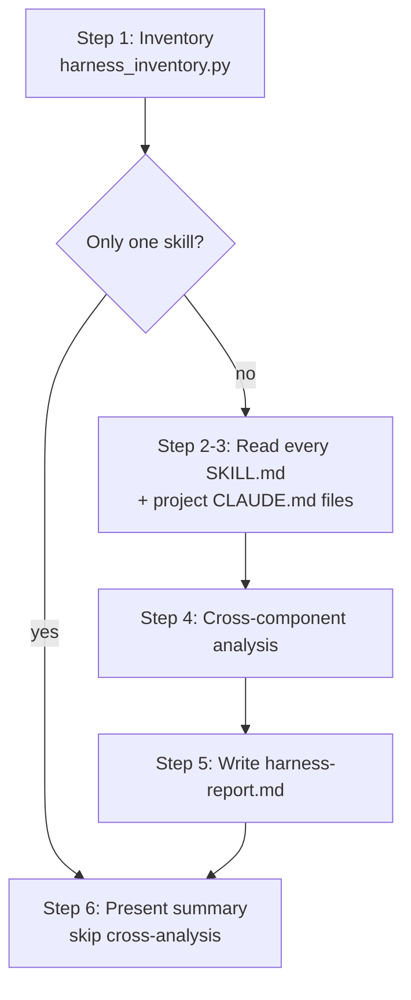

# Health-check the harness (/eval-check)

`/eval-check` is a read-only meta-analysis of your **whole** Claude Code configuration.
Instead of testing how well one skill executes (that's [`/eval-run`](eval-run.md)), it
looks at the *relationships between components* — skills, commands, `CLAUDE.md`, and
hooks — and flags redundancy, overlapping triggers, type misclassification, and
structural issues. Every finding is an informational suggestion; **it never modifies any
file** except the report it writes.

!!! abstract "What you'll produce"
    A `harness-report.md` with an inventory (component counts + approximate word
    counts), findings grouped by category, and a numbered list of concrete
    restructuring suggestions.

## When to use it

- Before diving into per-skill evaluation, to get a setup overview.
- When you suspect two skills overlap or a `CLAUDE.md` rule duplicates a skill.
- To spot components assigned to the wrong mechanism (a skill that should be a hook, a
  `CLAUDE.md` block that should be a skill, etc.).

## Run it

```bash
/eval-check
```

| Flag | Default | Effect |
| --- | --- | --- |
| `--output <path>` | `harness-report.md` | Where to write the report. Must resolve **inside** the project root — a `..` traversal or absolute external path is refused. |
| `--include-global` | off | Also scan `~/.claude/CLAUDE.md`. Opt-in because that file may hold personal preferences or credential references. |

!!! warning "User-global config is not scanned by default"
    Without `--include-global`, the report notes: *"User-global CLAUDE.md was not
    scanned."* Pass the flag only if you want your personal `~/.claude/CLAUDE.md`
    folded into the analysis.

## How it works



### Step 1 — Inventory

The skill first runs the inventory scanner:

```bash
python3 ${CLAUDE_SKILL_DIR}/scripts/harness_inventory.py --root .
```

It discovers artifacts and reports counts plus an approximate **word count** per
component (whitespace-split — a proxy for size, *not* a precise token count):

| Artifact | Where it's found |
| --- | --- |
| Skills | `.claude/skills/`, `skills/`, and any paths listed in `.claude-plugin/plugin.json` |
| Commands | `.claude/commands/`, `commands/` |
| `CLAUDE.md` | `./CLAUDE.md` or `./.claude/CLAUDE.md` (project-level) |
| Hooks | `hooks` entries in `.claude/settings.json` and `.claude-plugin/plugin.json` |

The scanner also emits structural warnings — e.g. no `CLAUDE.md` found, or a skill
missing a `description` in its frontmatter (which hurts trigger precision).

!!! tip "Machine-readable output"
    The scanner supports `--format yaml` (requires PyYAML) in addition to the default
    `text` output, if you want to consume the inventory programmatically.

!!! note "Single-skill shortcut"
    If the inventory finds **only one skill**, cross-component analysis is skipped —
    a single skill has no peers to overlap with. The report notes *"Single-skill
    configuration. Cross-component analysis is not applicable."*

### Steps 2–3 — Read components

For each skill, the checker reads the full `SKILL.md` and extracts the frontmatter
(`name`, `description`, `allowed-tools`), the body rules, and any references to other
skills. It then reads the project `CLAUDE.md` files (and `~/.claude/CLAUDE.md` only if
`--include-global` was passed).

### Step 4 — Cross-component analysis

Findings are grouped into five categories:

| Category | Flags when… |
| --- | --- |
| **Content overlap** | Two skills cover the same domain or duplicate rules; notes the approximate word cost of the duplication. |
| **Trigger overlap** | Two `description` fields would activate for the same task, or one is a subset of the other, causing simultaneous loading. |
| **CLAUDE.md duplication** | A skill's rule already lives in `CLAUDE.md` (so it loads every session anyway), or a skill contradicts a `CLAUDE.md` rule. |
| **Type misclassification** | A component is on the wrong mechanism — e.g. an always-on skill that belongs in `CLAUDE.md`/a hook, a workflow that should be a command, or a deterministic blocking check that should be a hook. |
| **Structural issues** | Missing frontmatter `description`, overly broad triggers, or custom commands that shadow built-in Claude Code commands. |

### Steps 5–6 — Report and summary

The report is written with the Write tool to `--output` (default `harness-report.md`),
then a brief terminal summary lists total components, findings per category, and the top
three most actionable suggestions.

## The report

```markdown title="harness-report.md (shape)"
# Harness Health Report

Generated: <date>

## Inventory
- Skills: N (total ~X words)
- Commands: N
- Hooks: N
- CLAUDE.md: Yes/No

### Skills by size
| Skill | Words | Description |

## Findings
### Content Overlap
### Trigger Overlap
### CLAUDE.md Duplication
### Type Misclassification
### Structural Issues

## Suggestions
1. What to do (merge / move / rename / narrow / remove), which components, and why.

## Notes
```

!!! warning "No false precision"
    Word counts are approximate and overlap detection is a **qualitative model
    judgment**, not a deterministic measurement. Treat every finding as a suggestion
    to review, not a verdict.

## Where to go next

Once you've reviewed the report, drill into individual components:

<div class="grid cards" markdown>

-   :material-magnify: **Analyze one skill**

    ---

    Understand a specific skill in depth and bootstrap its config.

    [:octicons-arrow-right-24: /eval-analyze](eval-analyze.md)

-   :material-play: **Test for real differences**

    ---

    Run an eval to see whether a skill produces measurably different output.

    [:octicons-arrow-right-24: /eval-run](eval-run.md)

-   :material-sitemap: **See the full pipeline**

    ---

    How the skills fit together end to end.

    [:octicons-arrow-right-24: The pipeline](pipeline.md)

</div>
