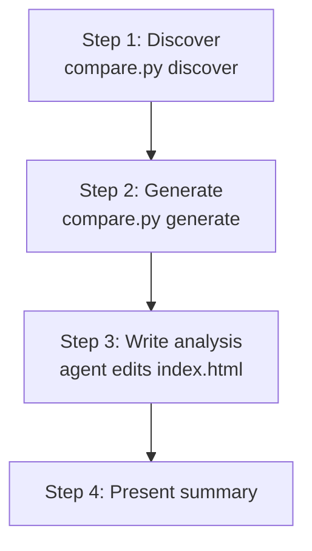

# Compare models and runs (/eval-compare)

`/eval-compare` takes a directory of eval run artifacts and produces a single,
self-contained HTML report that puts models (or repeated runs) side by side. It
does **not** run evaluations or modify your source data — it reads the outputs
you already have from [`/eval-run`](eval-run.md) (`summary.yaml`,
`run_result.json`, and each run's `report.html`) and turns them into one
comparison view with LLM-written analysis.

!!! abstract "What you'll produce"
    A self-contained `index.html` (plus copied per-run reports) with a
    **Comparison** tab — model cards, cost/efficiency and quality tables, and
    per-case breakdowns — and one tab per model embedding its original report.
    The agent then fills in the analysis sections (Bottom Line, Where Each Model
    Shined, Shared Weaknesses, Recommendations) and model-card badges.

## When to use it

- You ran the same eval on **multiple models** (e.g. Opus vs Sonnet) and want a
  cost-vs-quality verdict.
- You ran the **same model multiple times** and want to see variance across runs.
- You want a shareable, offline artifact that bundles every run's report behind
  one set of tabs.

## Run it

```bash
/eval-compare <input-dir>
```

| Flag | Default | Effect |
| --- | --- | --- |
| `<input-dir>` | — (required) | Scanned **recursively** for any subdirectory containing a `summary.yaml`. |
| `--output <path>` | `<input-dir>/comparison-report` | Where the report is written. |
| `--title <text>` | `Model Comparison` | Report title shown in the header. |
| `--overview <text>` | omitted | Optional context paragraph shown at the top. When absent, the section is omitted. |

!!! note "Read-only on your runs"
    `/eval-compare` never modifies input files. It only writes to the output
    directory (the `index.html` and copies of each run's `report.html`).

## How it works



### Step 1 — Discover runs

```bash
python3 ${CLAUDE_SKILL_DIR}/scripts/compare.py discover <input-dir>
```

The scanner walks `<input-dir>` recursively, treating **every directory that
contains a `summary.yaml`** as a run. It prints a JSON manifest with each run's
directory, resolved model, cost, judge scores, and whether an HTML report is
present. Runs are grouped by model (from `run_result.json`, falling back to the
`run_id`), so several runs of one model aggregate together.

The manifest also reports `"has_stats": true` when an `anova.json` (written by
[`/eval-anova`](eval-anova.md)) is found — at the input-dir root, or as a single
unambiguous match beneath it. When present, the generated report gains a
**Statistical Significance** section automatically; no extra flag or step is
needed, and `/eval-compare` works exactly the same with or without it.

### Step 2 — Generate the report

```bash
python3 ${CLAUDE_SKILL_DIR}/scripts/compare.py generate <input-dir> \
    --output <output-dir> --title "<title>"
```

This builds `index.html` and copies each run's `report.html` into a unique
per-run subdirectory for iframe embedding. Tables highlight the best value
green and the worst red per metric; when a model has more than one run, cells
show the average with its `(min–max)` range. The comparison tab picks the most
discriminating judges (highest variance across models) for the model cards.

### Step 3 — Write analysis sections

Using the discovery manifest and each run's `summary.yaml`, the agent replaces
the placeholders in `index.html`:

- **Bottom Line** — a 3-sentence verdict: which model to pick and the key
  tradeoff.
- **Where Each Model Shined** — per-model strengths.
- **Shared Weaknesses** — cross-cutting, skill-level issues (cases where every
  model struggled).
- **Recommendations** — actionable next steps.

It also adds model-card **badges** where they clearly apply:

| Badge | Meaning |
| --- | --- |
| **Best Value** | Best quality-for-cost, and consistent across runs. |
| **Highly Variable** | Multiple runs whose scores diverge significantly (disqualifies Best Value). |
| **Not Viable** | Fundamentally fails the task — very low scores or missing outputs. |

### Step 4 — Present summary

The skill reports how many runs were discovered (grouped by model), the best-value
model and why, and where the report was saved. Open it with:

```bash
open <output-dir>/index.html
```

## The report

- **Comparison tab** — an optional overview paragraph, the Bottom Line verdict,
  model cards (top judges + cost, wall clock, tokens, turns), a Cost &
  Efficiency table, a Quality Scores table, and per-case tables for judges that
  vary across models.
- **One tab per model** — embeds that run's original `report.html`; models with
  several runs get a sub-bar to switch between individual runs. A run missing its
  `report.html` shows a "No HTML report available" message instead of an iframe.
- **Statistical Significance (ANOVA)** — shown **only when an `anova.json` is
  present**. It renders the ANOVA verdict (**SIGNIFICANT** / **not significant**
  at your α), a per-factor **p-value** table with the overall **F** statistic,
  the design (`n_cases`, `replications`, any excluded conditions), and — when the
  artifact includes one — a **cost/quality Pareto frontier**. With no
  `anova.json`, this section is simply absent and the rest of the report is
  unchanged.
- **Light/dark theme** — a header toggle mirrors the per-run reports and
  remembers your choice.

!!! tip "Aggregating repeated models"
    When multiple runs share a model, the cards and tables show averages with
    `(min–max)` ranges, and each run still gets its own embedded report tab — so
    you can see both the aggregate and the individual runs.

!!! info "Statistics are read, never computed"
    `/eval-compare` stays standalone and dependency-free — it does **not** import
    `scipy`, `statsmodels`, or `pingouin`, and it never runs an ANOVA itself. It
    only *renders* the pre-computed numbers in `anova.json`. Produce that file
    first with [`/eval-anova`](eval-anova.md), pointing both skills at the same
    directory of runs.

## Where to go next

<div class="grid cards" markdown>

-   :material-play: **Produce runs to compare**

    ---

    Execute the suite on each model or run you want in the comparison.

    [:octicons-arrow-right-24: /eval-run](eval-run.md)

-   :material-account-check: **Review a single run**

    ---

    Dig into one run's outputs and give human feedback.

    [:octicons-arrow-right-24: /eval-review](eval-review.md)

-   :material-sitemap: **See the full pipeline**

    ---

    How the skills fit together end to end.

    [:octicons-arrow-right-24: The pipeline](pipeline.md)

-   :material-chart-bell-curve: **Add statistical significance**

    ---

    Run an ANOVA over the same runs to see which differences are real, then
    re-run `/eval-compare` to fold the results in.

    [:octicons-arrow-right-24: /eval-anova](eval-anova.md)

</div>
