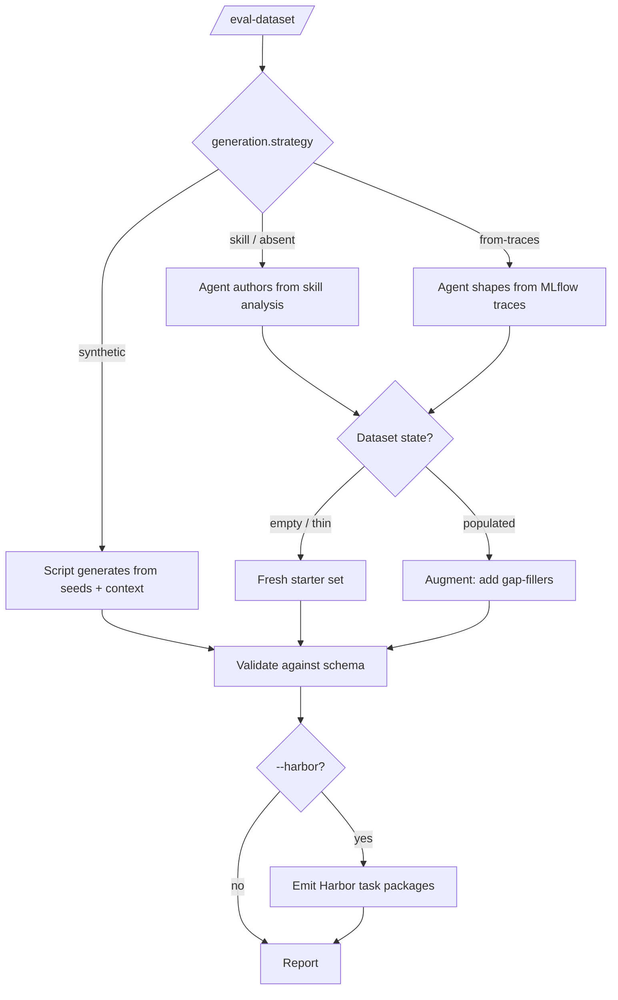

# Build a dataset (/eval-dataset)

`/eval-dataset` populates your `dataset.path` with test cases that match your
`dataset.schema`. Where those cases come from is decided by the config
(`generation.strategy`), not by a flag — and whether the skill *creates* a fresh
starter set or *augments* an existing one is derived from the current dataset state.

!!! abstract "What you'll produce"
    A directory of case folders under `dataset.path`, each with an `input.yaml`
    (what the agent sees) plus optional `annotations.yaml`, `answers.yaml`,
    companion files, and reference outputs — ready for [`/eval-run`](eval-run.md).

## Provenance comes from the config

Case **provenance** is set by `generation.strategy` in `eval.yaml`, so the same
command behaves differently depending on the config it reads. There is **no
`--strategy` flag**.

| `generation.strategy` | Who writes cases | Source of content |
| --- | --- | --- |
| `skill` *(default, absent → this)* | The agent authors them | The skill analysis in `eval.md` / `eval.yaml` |
| `synthetic` | A script (`generate_synthetic.py`) via the Claude API | `generation.seeds` + `generation.context` |
| `from-traces` | The agent shapes them | Real inputs extracted from MLflow production traces |



!!! tip "Fresh vs. augment is derived, not requested"
    The skill inspects the current dataset (Step 3): empty or thin → it builds a
    fresh starter set; already populated → it adds gap-fillers without duplicating,
    numbering new cases from the highest existing case number. You never pass a flag
    to choose.

See the [generation config reference](../reference/config/generation.md) and the
[datasets concept](../concepts/datasets.md) for the full field list.

## Usage

```bash
# Skill mode: after /eval-analyze --skill, with no dataset yet
/eval-dataset

# Add more cases later (augment is auto-detected from the populated dataset)
/eval-dataset --count 10

# Target the failures of a prior run when augmenting
/eval-dataset --run-id <run-id>

# Synthetic (prompt-mode) evals: counts come from the seeds, not --count
/eval-dataset

# Also emit containerized task packages for Harbor
/eval-dataset --harbor --image quay.io/example/agent-eval-harness:latest
```

## Flags

| Flag | Required | Default | Effect |
| --- | --- | --- | --- |
| `--config <path>` | no | auto-discover | Path to the eval config |
| `--count <N>` | no | `5` | Number of cases to generate. **Ignored for `synthetic`** |
| `--run-id <id>` | no | — | Prior run to learn from when augmenting (targets its failures) |
| `--harbor` | no | — | Also generate [Harbor](harbor.md) task packages |
| `--image <image>` | with `--harbor` | — | Container image baked into the task packages |

!!! warning "`--count` does not apply to synthetic generation"
    The `synthetic` strategy is fully declarative — the number of cases comes from
    each seed's `count` in `generation.seeds`. To resize a synthetic dataset, edit
    the seed counts in `eval.yaml` and re-run `/eval-dataset`, not `--count`.

## What a case looks like

Each case is a directory whose contents must satisfy `dataset.schema`:

```text
eval/dataset/cases/
├── case-001-simple-basic-input/
│   └── input.yaml            # what the agent sees (e.g. a 'prompt' field)
├── case-002-complex-multi-requirement/
│   ├── input.yaml
│   └── annotations.yaml      # metadata judges read via outputs["annotations"]
└── case-003-edge-empty-context/
    ├── input.yaml
    ├── answers.yaml          # guidance for AskUserQuestion interception
    └── reference.md          # optional gold output
```

Descriptive case names (`case-003-edge-empty-context`) beat bare numbers — the
name should say what scenario is being tested.

| File | When to include | Purpose |
| --- | --- | --- |
| `input.yaml` | always | The fields the agent receives. Every `{field}` in `execution.arguments` must exist here (case mode) |
| `annotations.yaml` | outcome-aware judges | Metadata judges read via `outputs["annotations"]`; drives judge `if` conditions |
| `answers.yaml` | interactive skills | Guidance for the LLM that answers `AskUserQuestion` prompts during execution |
| companion files | skill reads files at runtime | Files listed as `companion_files` in `eval.md` (e.g. `strategy.md`) |
| reference outputs | only if confidently correct | Gold outputs for reference-comparison judges |

!!! note "Only include references you trust"
    Don't fabricate gold outputs. A wrong reference is worse than none — it misleads
    judges. Leave it out and let the user generate one later with
    `/eval-run --gold`.

## Coverage design

For a **fresh** skill-authored set, the skill designs cases for breadth, then maps
the remainder onto your judges' concrete requirements:

<div class="grid cards" markdown>

-   **1 simple case**

    ---

    Straightforward input expected to pass every judge easily.

-   **1 complex case**

    ---

    Longer input with multiple requirements — exercises the skill's full capability.

-   **1 edge case**

    ---

    Unusual input that tests boundaries: very short, very long, ambiguous, or
    missing fields.

-   **One per judge requirement**

    ---

    Each remaining case targets a specific criterion the first three don't stress
    (e.g. a large input for a cost judge, a minimal input for a length check).

</div>

!!! tip "Cover both branches of conditional judges"
    If a judge has an `if` condition on annotations (e.g.
    `if: "annotations.get('dedup_is_duplicate')"`), generate cases that make the
    condition **true** for some and **false** for others. A dataset where every case
    shares the same annotation value leaves a conditional judge always-running or
    never-running — both are coverage gaps. Validation (Step 6) warns about this.

For **synthetic** generation, each case is stamped with `annotations.category`
matching its seed — this is how the category list is derived (never declared
separately) and how judges filter with
`if: "annotations.get('category') == 'navigation'"`.

## External-state placeholders

When `dataset.schema` marks a field as `[EXTERNAL: System]` — a value that must
reference a real resource in another system (a Jira project, a GitHub repo, an API
endpoint) — the skill does **not** invent a value. It writes a `TODO_` placeholder:

```yaml title="input.yaml"
project_key: "TODO_JIRA_PROJECT_KEY"   # replace with a real key, e.g. MYPROJECT
prompt: "Create an RFE for signature verification."
```

The placeholder form is `TODO_<SYSTEM>_<FIELD>`. The Step 7 report lists every
placeholder, which case it's in, and what value is needed.

!!! warning "Replace TODO_ placeholders before running"
    Fabricated external values cause **silent failures** — the skill queries the
    external system, gets zero results, and appears to "work" while testing nothing.
    Swap every `TODO_` value for a real one before `/eval-run`.

## Synthetic generation in detail

When `generation.strategy: synthetic` (typically produced by
`/eval-analyze --prompt`), a script generates cases directly — the agent does not
author them. Each entry in `generation.seeds` names a `category`, a `count`, and
exactly one **generation prompt** discriminator; `generation.context` (repository
knowledge) is injected into every prompt.

| Seed discriminator | Source |
| --- | --- |
| `builtin: docs/navigation` | A [builtin prompt](../reference/builtin-prompts.md) from `agent_eval/prompts/` |
| `prompt_file: ./path.md` | A project-specific prompt file |
| `prompt: \| ...` | An inline prompt |

List the available builtin prompts, and preview what would be generated without
spending API calls:

```bash
# Discover builtin generation prompts
python3 ${CLAUDE_SKILL_DIR}/scripts/list_prompts.py

# Dry run — print the plan without calling the API
python3 ${CLAUDE_SKILL_DIR}/scripts/generate_synthetic.py \
  --config eval.yaml --output eval/dataset/cases --dry-run
```

The generator uses `models.judge` (falling back to a default) and authenticates via
`ANTHROPIC_API_KEY` or `ANTHROPIC_VERTEX_PROJECT_ID`. It writes each case's
`input.yaml` (only what the agent sees) and `annotations.yaml` (all evaluation
metadata), auto-moving any `expected_*` fields the LLM misplaces into `input` back
into `annotations`.

See [Skill vs. prompt mode](skill-vs-prompt.md) and the
[agentic-docs walkthrough](../get-started/agentic-docs.md) for where synthetic
generation fits.

## After generation

These steps run for **every** provenance:

1. **Validate** — the skill reads a case back and checks it matches
   `dataset.schema`: required files present, every `{field}` placeholder covered,
   companion files present, no empty or placeholder-text files, and both branches
   of conditional judges covered.
2. **Report** — cases created, provenance (fresh vs. augment), coverage, what's
   still missing, and every `TODO_` placeholder to replace.
3. **Harbor packaging** *(if `--harbor`)* — emit self-contained task packages for
   containerized execution.

## Next steps

<div class="grid cards" markdown>

-   :material-play: **Run the eval**

    ---

    Execute the skill against your cases and score them.

    [:octicons-arrow-right-24: /eval-run](eval-run.md)

-   :material-database-cog: **Understand datasets**

    ---

    The full anatomy of cases, schemas, and workspace files.

    [:octicons-arrow-right-24: Datasets concept](../concepts/datasets.md)

-   :material-server: **Containerize it**

    ---

    Turn cases into Harbor task packages for isolated, parallel runs.

    [:octicons-arrow-right-24: Harbor](harbor.md)

</div>
