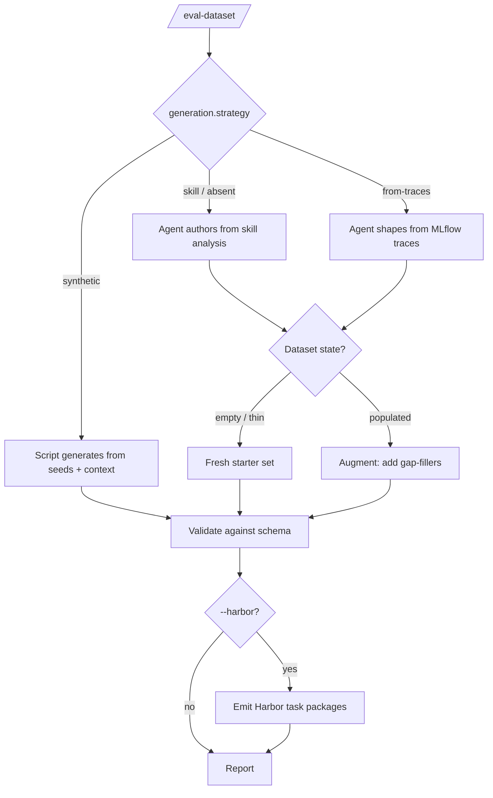

# Build a dataset (/eval-dataset)

`/eval-dataset` populates your `dataset.path` with test cases that match your
`dataset.schema`. Where those cases come from is decided by the config
(`generation.strategy`), not by a flag — and whether the skill *creates* a fresh
starter set or *augments* an existing one is derived from the current dataset state.

!!! abstract "What you'll produce"
    A directory of case folders under `dataset.path`, each with an `input.yaml`
    (what the agent sees) plus optional `annotations.yaml`, `answers.yaml`,
    companion files, and reference outputs — ready for [`/eval-run`](eval-run.md).

## Provenance comes from the config

Case **provenance** is set by `generation.strategy` in `eval.yaml`, so the same
command behaves differently depending on the config it reads. There is **no
`--strategy` flag**.

| `generation.strategy` | Who writes cases | Source of content |
| --- | --- | --- |
| `skill` *(default, absent → this)* | The agent authors them | The skill analysis in `eval.md` / `eval.yaml` |
| `synthetic` | A script (`generate_synthetic.py`) via the Claude API | `generation.seeds` + `generation.context` |
| `from-traces` | The agent shapes them | Real inputs extracted from MLflow production traces |


```mermaid
flowchart TD
    A[/eval-dataset/] --> B{generation.strategy}
    B -->|skill / absent| C[Agent authors from skill analysis]
    B -->|from-traces| D[Agent shapes from MLflow traces]
    B -->|synthetic| E[Script generates from seeds + context]
    C --> F{Dataset state?}
    D --> F
    F -->|empty / thin| G[Fresh starter set]
    F -->|populated| H[Augment: add gap-fillers]
    E --> V[Validate against schema]
    G --> V
    H --> V
    V --> I{--harbor?}
    I -->|yes| J[Emit Harbor task packages]
    I -->|no| K[Report]
    J --> K
```

!!! tip "Fresh vs. augment is derived, not requested"
    The skill inspects the current dataset (Step 3): empty or thin → it builds a
    fresh starter set; already populated → it adds gap-fillers without duplicating,
    numbering new cases from the highest existing case number. You never pass a flag
    to choose.

See the [generation config reference](../reference/config/generation.md) and the
[datasets concept](../concepts/datasets.md) for the full field list.

## Usage

```bash
# Skill mode: after /eval-analyze --skill, with no dataset yet
/eval-dataset

# Add more cases later (augment is auto-detected from the populated dataset)
/eval-dataset --count 10

# Target the failures of a prior run when augmenting
/eval-dataset --run-id <run-id>

# Synthetic (prompt-mode) evals: counts come from the seeds, not --count
/eval-dataset

# Also emit containerized task packages for Harbor
/eval-dataset --harbor --image quay.io/example/agent-eval-harness:latest
```

## Flags

| Flag | Required | Default | Effect |
| --- | --- | --- | --- |
| `--config <path>` | no | auto-discover | Path to the eval config |
| `--count <N>` | no | `5` | Number of cases to generate. **Ignored for `synthetic`** |
| `--run-id <id>` | no | — | Prior run to learn from when augmenting (targets its failures) |
| `--harbor` | no | — | Also generate [Harbor](harbor.md) task packages |
| `--image <image>` | with `--harbor` | — | Container image baked into the task packages |

!!! warning "`--count` does not apply to synthetic generation"
    The `synthetic` strategy is fully declarative — the number of cases comes from
    each seed's `count` in `generation.seeds`. To resize a synthetic dataset, edit
    the seed counts in `eval.yaml` and re-run `/eval-dataset`, not `--count`.
    Regeneration **replaces the whole `case-NNN` set** (numbering restarts at
    `case-001`), so the generation script refuses to overwrite existing generated
    cases unless it is re-run with `--force` — hand-edits such as `TODO_`
    replacements are lost and must be reapplied.

## What a case looks like

Each case is a directory whose contents must satisfy `dataset.schema`:

```text
eval/dataset/cases/
├── case-001-simple-basic-input/
│   └── input.yaml            # what the agent sees (e.g. a 'prompt' field)
├── case-002-complex-multi-requirement/
│   ├── input.yaml
│   └── annotations.yaml      # metadata judges read via outputs["annotations"]
└── case-003-edge-empty-context/
    ├── input.yaml
    ├── answers.yaml          # guidance for AskUserQuestion interception
    └── reference.md          # optional gold output
```

Descriptive case names (`case-003-edge-empty-context`) beat bare numbers — the
name should say what scenario is being tested.

| File | When to include | Purpose |
| --- | --- | --- |
| `input.yaml` | always | The fields the agent receives. Every `{field}` in `execution.arguments` must exist here (case mode) |
| `annotations.yaml` | outcome-aware judges | Metadata judges read via `outputs["annotations"]`; drives judge `if` conditions |
| `answers.yaml` | interactive skills | Guidance for the LLM that answers `AskUserQuestion` prompts during execution |
| companion files | skill reads files at runtime | Files listed as `companion_files` in `eval.md` (e.g. `strategy.md`) |
| reference outputs | only if confidently correct | Gold outputs for reference-comparison judges |

!!! note "Only include references you trust"
    Don't fabricate gold outputs. A wrong reference is worse than none — it misleads
    judges. Leave it out and let the user generate one later with
    `/eval-run --gold`.

## Coverage design

For a **fresh** skill-authored set, the skill designs cases for breadth, then maps
the remainder onto your judges' concrete requirements:

<div class="grid cards" markdown>

-   **1 simple case**

    ---

    Straightforward input expected to pass every judge easily.

-   **1 complex case**

    ---

    Longer input with multiple requirements — exercises the skill's full capability.

-   **1 edge case**

    ---

    Unusual input that tests boundaries: very short, very long, ambiguous, or
    missing fields.

-   **One per judge requirement**

    ---

    Each remaining case targets a specific criterion the first three don't stress
    (e.g. a large input for a cost judge, a minimal input for a length check).

</div>

!!! tip "Cover both branches of conditional judges"
    If a judge has an `if` condition on annotations (e.g.
    `if: "annotations.get('dedup_is_duplicate')"`), generate cases that make the
    condition **true** for some and **false** for others. A dataset where every case
    shares the same annotation value leaves a conditional judge always-running or
    never-running — both are coverage gaps. Validation (Step 6) warns about this.

For **synthetic** generation, each case is stamped with `annotations.category`
matching its seed — this is how the category list is derived (never declared
separately) and how judges filter with
`if: "annotations.get('category') == 'navigation'"`.

## External-state placeholders

When `dataset.schema` marks a field as `[EXTERNAL: System]` — a value that must
reference a real resource in another system (a Jira project, a GitHub repo, an API
endpoint) — the skill does **not** invent a value. It writes a `TODO_` placeholder:

```yaml title="input.yaml"
project_key: "TODO_JIRA_PROJECT_KEY"   # replace with a real key, e.g. MYPROJECT
prompt: "Create an RFE for signature verification."
```

The placeholder form is `TODO_<SYSTEM>_<FIELD>`. The Step 7 report lists every
placeholder, which case it's in, and what value is needed.

!!! warning "Replace TODO_ placeholders before running"
    Fabricated external values cause **silent failures** — the skill queries the
    external system, gets zero results, and appears to "work" while testing nothing.
    Swap every `TODO_` value for a real one before `/eval-run`.

## Synthetic generation in detail

When `generation.strategy: synthetic` (typically produced by
`/eval-analyze --prompt`), a script generates cases directly — the agent does not
author them. Each entry in `generation.seeds` names a `category`, a `count`, and
exactly one **generation prompt** discriminator; `generation.context` (repository
knowledge) is injected into every prompt.

| Seed discriminator | Source |
| --- | --- |
| `builtin: docs/navigation` | A [builtin prompt](../reference/builtin-prompts.md) from `agent_eval/prompts/` |
| `prompt_file: ./path.md` | A project-specific prompt file |
| `prompt: \| ...` | An inline prompt |

List the available builtin prompts, and preview what would be generated without
spending API calls:

```bash
# Discover builtin generation prompts
python3 ${CLAUDE_SKILL_DIR}/scripts/list_prompts.py

# Dry run — print the plan without calling the API
python3 ${CLAUDE_SKILL_DIR}/scripts/generate_synthetic.py \
  --config eval.yaml --output eval/dataset/cases --dry-run
```

The generator uses `models.judge` (falling back to a default) and authenticates via
`ANTHROPIC_API_KEY` or `ANTHROPIC_VERTEX_PROJECT_ID`. It writes each case's
`input.yaml` (only what the agent sees) and `annotations.yaml` (all evaluation
metadata), auto-moving any `expected_*` fields the LLM misplaces into `input` back
into `annotations`. It also persists a **`manifest.yaml`** at the dataset root —
generation provenance: the generator model and temperature, a sha256 of each seed's
resolved prompt and of `generation.context`, the realized per-seed case counts
(what the LLM returned vs. what validation kept), and per-case provenance. The
manifest is a root-level file, invisible to directory-only case discovery, and is
rewritten on every (`--force`) regeneration.

See [Skill vs. prompt mode](skill-vs-prompt.md) and the
[agentic-docs walkthrough](../get-started/agentic-docs.md) for where synthetic
generation fits.

## After generation

These steps run for **every** provenance:

1. **Audit + validate** — a deterministic audit script (`audit_dataset.py`) writes
   `dataset_audit.yaml` at the dataset root. It mechanizes the duplicate,
   contamination, composition, and conditional-judge branch-coverage checks (plus
   argument-field presence, structural issues, and reference resolution — the
   latter labeled *necessary, not sufficient*, for answerability). Conformance to
   the natural-language `dataset.schema` and companion-file review remain
   agent/human review. `/eval-run` warns before scoring when the audit is missing
   or stale (per-case content hashes).
2. **Report** — cases created, provenance (fresh vs. augment), the audit summary
   and artifact paths (`dataset_audit.yaml`, `manifest.yaml`), coverage, what's
   still missing, and every `TODO_` placeholder to replace.
3. **Harbor packaging** *(if `--harbor`)* — emit self-contained task packages for
   containerized execution.

## Null-agent solvability probe

An optional, once-per-dataset-revision check (SKILL.md Step 6.5): run the eval
pipeline with a **do-nothing agent** and see which cases the judges award anyway.
The statistic is labeled exactly:

> **null-pass rate (joint task/judge non-discriminativeness, upper-bounds 1−V1)**

Under LLM judges this is a **joint task/judge probe** — every null-pass means
either a degenerate case (answerable with no work) or a vacuous/lenient judge; the
judge's rationale string distinguishes which. It is *not* a pure task-validity
figure.

The probe reuses the unchanged eval-run pipeline against a throwaway run dir
(convention: `null-probe-<YYYYMMDD>`):

```bash
# 1. Workspace — interception/tool-handler resolution (eval-run Step 3a) is
#    skippable: the null runner never executes, so hooks never fire.
python3 skills/eval-run/scripts/workspace.py --config eval.yaml --run-id <null-run-id>

# 2. Execute with the null runner. --model is still required by execute.py
#    (any value works) but ignored by the null runner.
python3 skills/eval-run/scripts/execute.py --config eval.yaml \
  --workspace <workspace> --model sonnet --agent null \
  --output $AGENT_EVAL_RUNS_DIR/<eval-name>/<null-run-id> --run-id <null-run-id>

# 3. Collect (expect the normal "0 artifacts" warnings — nothing ran).
python3 skills/eval-run/scripts/collect.py --config eval.yaml \
  --workspace <workspace> --output $AGENT_EVAL_RUNS_DIR/<eval-name>/<null-run-id>

# 4. Score with --samples 3: stochastic (llm/agent) judges are majority-voted,
#    so a null-pass is not a one-off verdict (this triples judge-token cost;
#    agent cost is zero).
python3 skills/eval-run/scripts/score.py judges \
  --run-id <null-run-id> --config eval.yaml --samples 3

# 5. Audit the null run — merges a null_probe section into dataset_audit.yaml.
python3 skills/eval-dataset/scripts/audit_dataset.py --config eval.yaml \
  --null-run $AGENT_EVAL_RUNS_DIR/<eval-name>/<null-run-id> \
  [--reward-threshold 0.5] [--fail-on-null-pass]
```

A case **null-passes** when any bool judge passed the empty run, or when the
composite reward — recomputed from the per-judge records with the same
`compose_reward` the [reward API](../concepts/reward-api.md) uses — reaches
`--reward-threshold` (fixed default `0.5`). `if:`-skipped and errored judges never
count. Passes from unsampled stochastic judges are marked `low_confidence` rather
than trusted.

!!! tip "Triage: fix the case OR fix the judge"
    Example: a `consulted_docs` PASS with rationale "No expected_files specified —
    nothing to verify" on a case without `expected_files` is a
    judge/case-underspecification signal — add the annotation or condition the
    judge; the task itself may be fine.

!!! warning "Limitations"
    Batch-mode datasets are not supported: a null run produces zero artifacts, so
    batch collection creates no per-case run dirs and scoring exits before
    `per_case` exists — the audit then exits `2` with guidance. The probe exits `0`
    by default (findings, not verdicts); use `--fail-on-null-pass` to gate CI.
    The null runner is CLI-only: `runner.type: "null"` in `eval.yaml` is rejected
    at config load (see [runners](../concepts/runners.md#null-diagnostic-cli-only)).

## Next steps

<div class="grid cards" markdown>

-   :material-play: **Run the eval**

    ---

    Execute the skill against your cases and score them.

    [:octicons-arrow-right-24: /eval-run](eval-run.md)

-   :material-database-cog: **Understand datasets**

    ---

    The full anatomy of cases, schemas, and workspace files.

    [:octicons-arrow-right-24: Datasets concept](../concepts/datasets.md)

-   :material-server: **Containerize it**

    ---

    Turn cases into Harbor task packages for isolated, parallel runs.

    [:octicons-arrow-right-24: Harbor](harbor.md)

</div>
