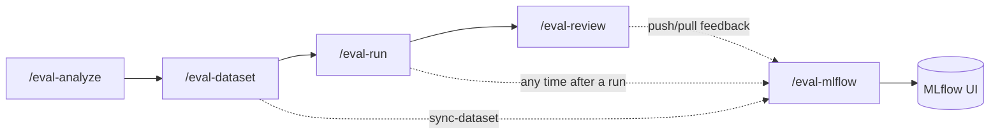

# Log to MLflow (/eval-mlflow)

`/eval-mlflow` bridges the harness's file-based pipeline with [MLflow](https://mlflow.org)
experiment tracking. It syncs your dataset to the MLflow dataset registry, logs a run's
params/metrics/artifacts/traces, and moves judge and human feedback in both directions
between the harness and MLflow traces.

!!! tip "MLflow is optional"
    Every other skill (`/eval-run`, `/eval-review`, `/eval-optimize`) works without
    MLflow. `/eval-mlflow` is purely additive — run it at **any point after a run** to
    push results into the MLflow UI. Configure tracking in
    [`mlflow`](../reference/config/mlflow.md); enable it once during
    [`/eval-setup`](../get-started/installation.md).

## Where it fits



## Actions

Select what to do with `--action`. It defaults to `all`, which runs sync, log, and push
in sequence.

| `--action` | What it does | Needs `--run-id`? | Reads |
| --- | --- | --- | --- |
| `sync-dataset` | Push test cases to the MLflow dataset registry | No | `dataset.path`, schema mapping |
| `log-results` | Log params, metrics, artifacts, per-case table, and traces to an MLflow run | **Yes** | `summary.yaml`, `run_result.json` |
| `push-feedback` | Attach judge + human feedback to execution traces | **Yes** | `summary.yaml`, `review.yaml` |
| `pull-feedback` | Pull UI-added annotations back into `review.yaml` | **Yes** | MLflow traces |
| `all` | `sync-dataset` + `log-results` + `push-feedback` | **Yes** | all of the above |

!!! note "`--run-id` is required for everything except `sync-dataset`"
    The dataset lives in `dataset.path` and is run-independent, so `sync-dataset` needs
    no run. Every other action operates on a specific run directory under
    `eval/runs/<eval-name>/<run-id>/`, so it needs `--run-id` — including `all`.

```bash
# Full push after a run
/eval-mlflow --run-id <id>                      # --action all (default)

# Just the dataset — no run needed
/eval-mlflow --action sync-dataset

# Just log one run's results
/eval-mlflow --action log-results --run-id <id>

# Bring UI annotations back for /eval-optimize
/eval-mlflow --action pull-feedback --run-id <id>
```

!!! tip "Config discovery"
    With multiple eval configs, pass `--config <path>` to pick one; otherwise the skill
    auto-discovers a single config. When a non-default config was used, carry
    `--config` through to the follow-up commands it suggests.

## Graceful degradation

MLflow being unreachable is **never a hard failure**. The underlying scripts import
MLflow lazily, resolve the tracking URI, and on any connectivity or import error they
log a warning and **exit 0** — the skill reports "MLflow not available, skipping" and
your pipeline continues.

!!! warning "Exit 0 on unreachable MLflow"
    Because degradation is silent by design, a green exit does **not** guarantee data
    landed in MLflow. If results don't appear in the UI, verify the server:

    ```bash
    PYTHONPATH=${CLAUDE_SKILL_DIR}/scripts python3 -c "
    from agent_eval.mlflow.experiment import ensure_server
    print('OK' if ensure_server() else 'not reachable')
    "
    ```

    The tracking URI resolves from `mlflow.tracking_uri` in `eval.yaml`, then the
    `MLFLOW_TRACKING_URI` env var, then defaults to `http://127.0.0.1:5000`. If a
    remote URI is set but unreachable, the scripts still proceed and handle the error
    cleanly.

## What each action writes

### sync-dataset

A two-phase process: the agent reads `dataset.schema` and a sample case to produce a
`schema_mapping.json`, then `sync_dataset.py` applies it deterministically. The mapping
routes source files/fields into MLflow record `inputs` (what the skill receives) and
`expectations` (reference/gold outputs):

```json title="tmp/schema_mapping.json"
{
  "inputs": {
    "prompt": "input.yaml:prompt",
    "context": "input.yaml:context.details"
  },
  "expectations": {
    "reference": "reference.md:__file__"
  }
}
```

| Mapping value | Meaning |
| --- | --- |
| `input.yaml:prompt` | Extract the `prompt` field from `input.yaml` |
| `input.yaml:context.details` | Extract a nested field path |
| `reference.md:__file__` | Use the entire file's content as the value |

The script prints a preview validated against the first case before syncing. Syncing is
idempotent — `merge_records` deduplicates, so it's safe to re-run.

### log-results

Logs a single MLflow run named after the `--run-id`:

- **Params** — `skill`, `eval_name`, `runner` (type), `model`, `run_id`, plus
  `subagent_model`/`agent` when present.
- **Metrics** — per-judge `{judge}/mean` and `{judge}/pass_rate`; execution
  `duration_s`, `cost_usd`, `num_turns`, `tokens/{input,output,cache_read,cache_create}`;
  and a per-model `model/<name>/...` cost + token breakdown.
- **Artifacts** — `summary.yaml`, plus per-case `input.yaml` files under `inputs/` (for
  later `from-traces` extraction).
- **Table** — `per_case_results.json` with `case_id`, `judge`, `value`, `rationale`.
- **Traces** — one per case (case/prompt mode), one per step (Harbor), or one for the
  run (batch), built from `stdout.log` and linked to the run.
- **Tags** — `regressions_detected` (`yes`/`no`, computed from
  [`thresholds`](../reference/config/thresholds.md)), `num_judges`, plus any
  `mlflow.tags` from `eval.yaml`.

`log-results` also attaches judge feedback to its traces as it builds them, so the
MLflow **Quality** tab is populated even without a separate `push-feedback`.

### push-feedback

Finds the run's execution traces and attaches feedback:

| Source | From | `source_type` | Assessment name |
| --- | --- | --- | --- |
| Judge results | `summary.yaml` | `CODE` | `{case_id}/{judge_name}` |
| Human review | `review.yaml` (if present) | `HUMAN` | `{case_id}/human_review` |

Use `--source judge`, `--source human`, or `--source all` to select what to push
(`all` is used by the `all` action).

!!! note "No traces? Still succeeds"
    Tracing is optional. If the run has no traces, `push-feedback` reports `0` and
    exits cleanly — traces are configured automatically by
    [`/eval-run`](eval-run.md) when enabled.

### pull-feedback

Reads annotations added through the MLflow UI and writes them back to `review.yaml`
under a separate `mlflow_feedback` section (feedback the harness pushed itself —
`source_id` `agent-eval`/`eval-review` — is skipped to avoid echo).
[`/eval-optimize`](eval-optimize.md) reads both the local `feedback` and
`mlflow_feedback` sections.

```yaml title="review.yaml (excerpt after pull)"
mlflow_feedback:
  case-001/clarity:
    value: 4
    rationale: "Clear but missing an example."
    source: "reviewer@example.com"
```

## Where to go next

<div class="grid cards" markdown>

- [**mlflow config**](../reference/config/mlflow.md) — `experiment`, `tracking_uri`, `tags`
- [**Tracing**](../concepts/tracing.md) — how execution traces are built and linked
- [**/eval-review**](eval-review.md) — collect human feedback to push
- [**/eval-optimize**](eval-optimize.md) — consume pulled annotations in the refinement loop
- [**Runs directory**](../reference/runs-directory.md) — what lives under `eval/runs/<id>/`

</div>
