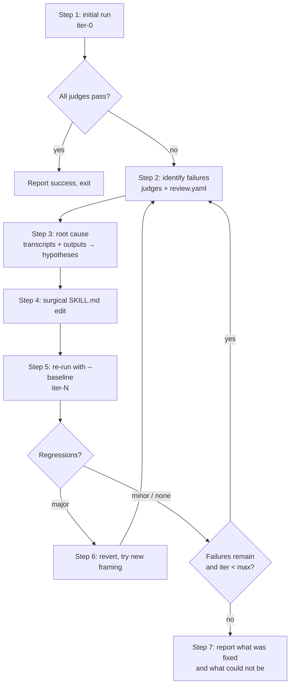

# Optimize a skill (/eval-optimize)

`/eval-optimize` is an autonomous refinement loop. It runs your eval, reads which
judges failed and why, forms evidence-grounded root-cause hypotheses, makes surgical
edits to the skill's `SKILL.md`, re-runs against a baseline to catch regressions, and
iterates until judges pass or it hits `--max-iterations`.

!!! abstract "What it changes — and what it never touches"
    It edits **only the artifact under test** (the skill's `SKILL.md`). It never edits
    judges, test cases, or `eval.yaml`. The eval harness is treated as ground truth: if
    a judge looks wrong, the loop reports it but leaves it alone.

## How it differs from /eval-review

Both consume eval results, but the control loop is different.

| | [`/eval-review`](eval-review.md) | `/eval-optimize` |
| --- | --- | --- |
| Who decides the fix | Human, per case | The agent, autonomously |
| Input | Results + your feedback | Judge rationale + transcripts + `review.yaml` |
| Output | Proposed changes for you to approve | Applied `SKILL.md` edits, verified |
| When to use | Nuanced calls, ambiguous cases | "Make it pass", auto-fix quality issues |

!!! tip "Run review first when you can"
    If a `review.yaml` exists from `/eval-review`, the loop reads its `feedback`
    (human notes) and `mlflow_feedback` (annotations pulled from the MLflow UI) and
    treats them as higher-signal than judge rationale. Human-flagged issues are
    prioritized.

## Flags

| Flag | Default | Description |
| --- | --- | --- |
| `--config <path>` | auto-discover | Path to the eval config |
| `--model <model>` | `models.skill` from `eval.yaml` | Model used for every eval run in the loop |
| `--max-iterations <N>` | `3` | Stop after N improvement cycles |
| `--run-id <id>` | auto-generated | Base run ID; iterations append `-iter-N` |
| `--target-judge <name>` | all judges | Focus only on one failing judge's failures |

!!! note "Run IDs are suffixed per iteration"
    The initial run is `<id>-iter-0`; each subsequent cycle is `<id>-iter-1`,
    `<id>-iter-2`, … Runs land under `$AGENT_EVAL_RUNS_DIR/<eval-name>/<id>-iter-N/`.
    The same `--model` is used across all iterations so scores stay comparable.

```bash
# Optimize the auto-discovered eval, up to 5 cycles, focused on one judge
/eval-optimize --model opus --max-iterations 5 --target-judge output_quality
```

## The loop



### Step 1 — Initial run

If no recent results exist, the loop runs the suite via the Skill tool:

```text
/eval-run --run-id <id>-iter-0 --config <config> [--model <model>]
```

If you just ran `/eval-run`, it reuses those results. If everything already passes, it
exits — nothing to improve.

### Step 2 — Identify failures

From `summary.yaml` it builds a failure map, recording each judge's `judge_type`, which
determines what the loop is allowed to do about it:

| `judge_type` | Source | What the loop does |
| --- | --- | --- |
| `builtin` | Shared, versioned judges in `agent_eval/judges/` | Never edits their code; suggests adjusting `arguments:` in `eval.yaml` (e.g. raising `max_cost_usd`) |
| `check` | Inline Python in `eval.yaml` | Reads the snippet — failures are deterministic and reproducible |
| `llm` | LLM prompt judge | Reads the prompt; the fault may be the skill output *or* an overly strict prompt |
| `code` | External Python `module`/`function` | Reads the function to understand the validation |

See [judges](../concepts/judges.md) for the full taxonomy.

### Step 3 — Root cause

For each failure pattern the loop reads the `SKILL.md`, then delegates to `Explore`
sub-agents to trace the causal chain (transcripts can be huge, so they stay out of the
main context). It distinguishes **systematic** failures (one judge fails everywhere)
from **input-dependent** ones (only specific cases), then forms a specific hypothesis
tied to a line in the `SKILL.md`, for example:

> The judge says the output is missing acceptance criteria. The transcript shows the
> skill skipped Step 4. Step 4 says "*optionally* add acceptance criteria" — the word
> "optionally" is the problem.

!!! note "Where transcripts live"
    In **case** mode each case has its own `cases/<case>/stdout.log`; in **batch** mode
    there is a single `stdout.log` at the run root. The loop checks `execution.mode`
    (and `run_result.json`) to know which to read.

### Step 4 — Edit the skill

Edits are shown before they are applied and follow four rules:

- **Grounded** — cite the judge, failing cases, and transcript evidence.
- **Surgical** — change the minimum; don't rewrite sections that work.
- **Explain the why** — tell the model why the change matters instead of adding rigid MUSTs.
- **Don't overfit** — a fix for 1 of 20 failing cases must not break the other 19.

### Step 5 — Re-run with a baseline

Verification always compares against the previous iteration so regressions surface:

```text
# Fast: only the cases that were failing
/eval-run --run-id <id>-iter-<N> --cases <failing-case-id> ... \
  --baseline <id>-iter-<N-1> --config <config> [--model <model>]

# Final: full run to confirm nothing else regressed
/eval-run --run-id <id>-iter-<N> --baseline <id>-iter-<N-1> \
  --config <config> [--model <model>]
```

!!! tip "Cheaper structural checks"
    Add `--no-llm-judges` to skip LLM API calls and run only deterministic judges
    (`check`, Python `builtin`) when you only need to verify a structural fix.

### Step 6 — Handle regressions

If a fix makes previously passing cases fail, the loop weighs severity: a minor
regression that's a net positive is kept; a major one is reverted and a *different
framing* is tried rather than piling on more rules.

### Step 7 — Iterate or report

The loop repeats from Step 2 until judges pass or `--max-iterations` is reached, then
reports which edits fixed which failures and how many iterations it took. On persistent
failures it explains what it tried and suggests next steps:

- [`/eval-review --run-id <final-id>`](eval-review.md) — human assessment of the tricky cases
- [`/eval-dataset`](eval-dataset.md) — add cases if failures suggest missing coverage
- [`/eval-mlflow --run-id <final-id>`](eval-mlflow.md) — log the optimization results for tracking

## Prompt-mode evals

For evals created with `/eval-analyze --prompt` there is no skill. The artifact under
test is the documentation or prompt template the eval exercises (e.g. `CLAUDE.md`,
`ai-docs/`, or the prompt itself). The same read → hypothesize → edit → re-run loop
applies to *that* artifact instead of a `SKILL.md`. See
[skill vs prompt mode](skill-vs-prompt.md).

## Rules at a glance

!!! warning "Guardrails the loop will not cross"
    - Every edit must be grounded in a specific failure with judge + transcript evidence — no broad, generic rewrites.
    - Check for regressions after every edit; a fix that breaks other cases is not a fix.
    - Never modify test cases, judges, or `eval.yaml` — suggest those changes to you instead.
    - Never edit builtin judge code; suggest changing its `arguments:` in `eval.yaml`.
    - Stop after `--max-iterations`; if the same kind of edit fails twice, try a fundamentally different framing.

## See also

<div class="grid cards" markdown>

-   :material-account-check: **Human review**

    ---

    Collect targeted feedback before (or instead of) auto-optimizing.

    [:octicons-arrow-right-24: /eval-review](eval-review.md)

-   :material-play: **Run an eval**

    ---

    The command the loop drives on every iteration.

    [:octicons-arrow-right-24: /eval-run](eval-run.md)

-   :material-gavel: **Judges**

    ---

    Judge types and what each failure means.

    [:octicons-arrow-right-24: Judges](../concepts/judges.md)

</div>
