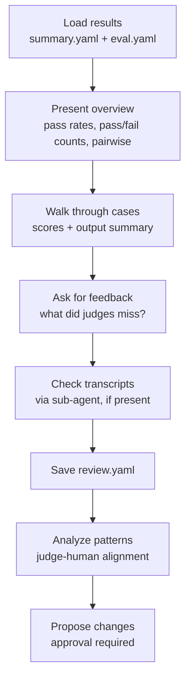

# Review results (/eval-review)

`/eval-review` is the human-in-the-loop step. It presents judge scores and output
summaries for a completed run, collects the qualitative feedback that judges miss
(tone, intent, user experience), and — with your approval — proposes targeted edits
to the artifact under test. It complements [`/eval-optimize`](eval-optimize.md)
(automated) by catching what automation can't.

!!! abstract "What you'll produce"
    A `review.yaml` file under the run directory, keyed by case, plus (optionally)
    approved edits to the skill's `SKILL.md` or to your eval's judges.

## When to use it

Reach for `/eval-review` after an [`/eval-run`](eval-run.md) when you want to look at
what actually came out — not just the pass/fail numbers. Typical prompts that trigger
it: *"how did my skill do"*, *"what failed"*, *"look at the eval results"*,
*"review the run"*.

```bash
/eval-review --run-id <id>
```

## Flags

| Flag | Required | Default | Description |
| --- | --- | --- | --- |
| `--run-id <id>` | **yes** | — | Which eval run to review |
| `--config <path>` | no | auto-discover | Path to the eval config |
| `--cases <name> [<name> ...]` | no | all | Exact case directory names to review |

!!! note "Config auto-discovery"
    With no `--config`, the skill discovers configs automatically. One config is
    selected for you; multiple configs prompt you to choose; none errors and suggests
    running [`/eval-analyze`](eval-analyze.md) first. The selected config's `skill`
    field becomes the `<eval-name>` used in run paths
    (`$AGENT_EVAL_RUNS_DIR/<eval-name>/<id>/`).

## What it does



### 1–2. Load and present

The skill reads `summary.yaml`, the per-case results, and your `eval.yaml` (to learn
the artifact under test, the dataset schema, and the configured judges). If an
`analysis.md` or `report.html` exists in the run directory, it surfaces those first —
if you just ran `/eval-run` (which opens the report), it skips straight to asking
which cases you want to discuss.

!!! tip "Judge types matter when reading scores"
    Builtin-Python and inline `check` judges are **deterministic** (structural
    failures); LLM `prompt`/`llm_rubric` judges are **qualitative** (judgment-based).
    The `judge_type` field in the results tells you which is which — a failing LLM
    judge is a different signal than a failing structural check. See
    [judges](../concepts/judges.md).

### 3. Walk through cases

For each case, the skill shows judge scores with rationale, any pairwise
win/loss/tie result from a `--baseline` comparison, and a **summary** of the output
files (not a full dump — you can ask to see specifics). Then it asks *"Anything the
judges missed?"* Empty feedback means the case is acceptable.

### 4. Transcripts (if available)

Large execution transcripts are analyzed by a delegated sub-agent, never loaded into
the main context. The transcript location depends on
[execution mode](../concepts/execution-model.md):

| Mode | Transcript path |
| --- | --- |
| `case` | `$AGENT_EVAL_RUNS_DIR/<eval-name>/<id>/cases/<case>/stdout.log` |
| `batch` | `$AGENT_EVAL_RUNS_DIR/<eval-name>/<id>/stdout.log` |

The sub-agent reports process signals — retries, roundabout tool use, error recovery,
turn count — which can reveal unclear instructions even when the output looks fine.

## review.yaml

Feedback is persisted so it survives the conversation and can be consumed by
[`/eval-optimize`](eval-optimize.md) and [`/eval-mlflow`](eval-mlflow.md):

```yaml title="$AGENT_EVAL_RUNS_DIR/<eval-name>/<id>/review.yaml"
run_id: "<id>"
reviewed_cases: 3
feedback_cases: 2
reviewer: "human"
feedback:
  case-001-simple-null-pointer-fix: "User's comment about this case"
  case-002-complex-refactor: "Another comment"
  case-003-edge-case: ""  # empty = acceptable
```

!!! warning "Keys must match case directory names exactly"
    The `feedback` keys are the **exact case directory names** — the same values
    accepted by `--cases`. `/eval-optimize` looks up which cases had human feedback by
    these keys, so a mismatch silently drops the feedback. The file is written
    directly (not via `state.py`, which produces a different format).

## Analyze patterns, then propose changes

Once feedback is collected, the skill looks for patterns before touching anything:

| Signal | Meaning |
| --- | --- |
| Complaint correlates with a judge failure | Judges are working (alignment) |
| User flagged something no judge checks | Judge coverage gap → candidate new judge |
| Judge failed but user said it's fine | Possible false positive — judge too strict |
| Same complaint across many cases | Systematic (skill-level) issue, not an edge case |

It then proposes specific edits as **before/after diffs**, each grounded in the case
IDs and feedback that motivate it — and asks for approval.

!!! warning "Approval required — the skill proposes, it does not impose"
    `/eval-review` never edits `SKILL.md` (or adds judges to `eval.yaml`) without your
    explicit approval. When it suggests new judges, it prefers
    [builtins](../reference/builtin-judges.md) with `arguments:` over inline code.

### Prompt-mode targets the docs, not a skill

Proposing `SKILL.md` changes assumes a skill under test (`execution.skill`). For
**prompt-mode** evals (`execution.prompt`, from `/eval-analyze --prompt`) there is no
skill — the artifact under test is the documentation or analysis prompt.

=== "Skill mode"

    `execution.skill` set. Proposed edits target the skill's `SKILL.md`.

=== "Prompt mode"

    `execution.prompt` set. Proposed edits target the documentation or prompt under
    test (e.g. `CLAUDE.md`, `ai-docs/`). See
    [skill vs prompt](skill-vs-prompt.md).

## Next steps

After applying approved changes, common follow-ups are:

```bash
/eval-run --model <model> --baseline <run-id>   # re-run and compare
/eval-optimize --model <model>                  # automated iteration from here
/eval-dataset                                   # add cases for coverage gaps
/eval-mlflow --run-id <run-id> --action push-feedback  # push feedback to traces
```

!!! tip "Non-default config"
    If you reviewed with an explicit `--config`, pass the same `--config <path>` to the
    follow-up commands.

<div class="grid cards" markdown>

-   :material-robot: **Automate the loop**

    ---

    Let the harness iterate on the skill without a human in the loop.

    [:octicons-arrow-right-24: /eval-optimize](eval-optimize.md)

-   :material-database-arrow-up: **Push feedback upstream**

    ---

    Sync review feedback and results to MLflow traces.

    [:octicons-arrow-right-24: /eval-mlflow](eval-mlflow.md)

-   :material-gavel: **Tune your judges**

    ---

    Turn coverage gaps into new judges.

    [:octicons-arrow-right-24: Judges](../concepts/judges.md) ·
    [Builtin judges](../reference/builtin-judges.md)

</div>
