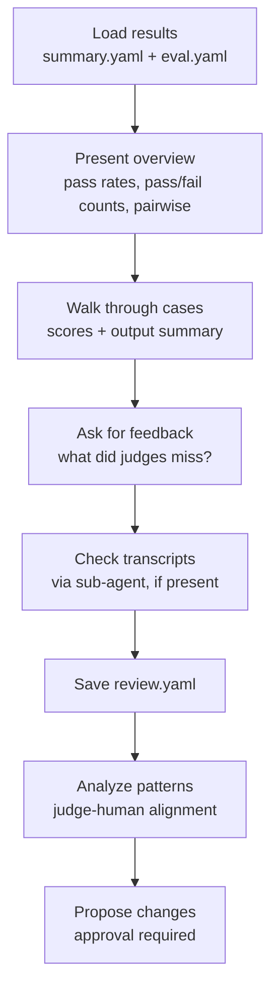

# Review results (/eval-review)

`/eval-review` is the human-in-the-loop step. It presents judge scores and output
summaries for a completed run, collects the qualitative feedback that judges miss
(tone, intent, user experience), and — with your approval — proposes targeted edits
to the artifact under test. It complements [`/eval-optimize`](eval-optimize.md)
(automated) by catching what automation can't.

!!! abstract "What you'll produce"
    A `review.yaml` file under the run directory, keyed by case, plus (optionally)
    approved edits to the skill's `SKILL.md` or to your eval's judges.

## When to use it

Reach for `/eval-review` after an [`/eval-run`](eval-run.md) when you want to look at
what actually came out — not just the pass/fail numbers. Typical prompts that trigger
it: *"how did my skill do"*, *"what failed"*, *"look at the eval results"*,
*"review the run"*.

```bash
/eval-review --run-id <id>
```

## Flags

| Flag | Required | Default | Description |
| --- | --- | --- | --- |
| `--run-id <id>` | **yes** | — | Which eval run to review |
| `--config <path>` | no | auto-discover | Path to the eval config |
| `--cases <name> [<name> ...]` | no | all | Exact case directory names to review |

!!! note "Config auto-discovery"
    With no `--config`, the skill discovers configs automatically. One config is
    selected for you; multiple configs prompt you to choose; none errors and suggests
    running [`/eval-analyze`](eval-analyze.md) first. The selected config's `skill`
    field becomes the `<eval-name>` used in run paths
    (`$AGENT_EVAL_RUNS_DIR/<eval-name>/<id>/`).

## What it does


```mermaid
flowchart TD
    A[Load results<br/>summary.yaml + eval.yaml] --> B[Present overview<br/>pass rates, pass/fail counts, pairwise]
    B --> C[Walk through cases<br/>scores + output summary]
    C --> D[Ask for feedback<br/>what did judges miss?]
    D --> E[Check transcripts<br/>via sub-agent, if present]
    E --> F[Save review.yaml]
    F --> G[Analyze patterns<br/>judge-human alignment]
    G --> H[Propose changes<br/>approval required]
```

### 1–2. Load and present

The skill reads `summary.yaml`, the per-case results, and your `eval.yaml` (to learn
the artifact under test, the dataset schema, and the configured judges). If an
`analysis.md` or `report.html` exists in the run directory, it surfaces those first —
if you just ran `/eval-run` (which opens the report), it skips straight to asking
which cases you want to discuss.

!!! tip "Judge types matter when reading scores"
    Builtin-Python and inline `check` judges are **deterministic** (structural
    failures); LLM `prompt`/`llm_rubric` judges are **qualitative** (judgment-based).
    The `judge_type` field in the results tells you which is which — a failing LLM
    judge is a different signal than a failing structural check. See
    [judges](../concepts/judges.md).

### 3. Walk through cases

For each case, the skill shows judge scores with rationale, any pairwise
win/loss/tie result from a `--baseline` comparison, and a **summary** of the output
files (not a full dump — you can ask to see specifics). Then it asks *"Anything the
judges missed?"* Empty feedback means the case is acceptable.

### 4. Transcripts (if available)

Large execution transcripts are analyzed by a delegated sub-agent, never loaded into
the main context. The transcript location depends on
[execution mode](../concepts/execution-model.md):

| Mode | Transcript path |
| --- | --- |
| `case` | `$AGENT_EVAL_RUNS_DIR/<eval-name>/<id>/cases/<case>/stdout.log` |
| `batch` | `$AGENT_EVAL_RUNS_DIR/<eval-name>/<id>/stdout.log` |

The sub-agent reports process signals — retries, roundabout tool use, error recovery,
turn count — which can reveal unclear instructions even when the output looks fine.

## review.yaml

Feedback is persisted so it survives the conversation and can be consumed by
[`/eval-optimize`](eval-optimize.md), [`/eval-mlflow`](eval-mlflow.md), and — as
calibration anchors — by your LLM judges (see
[Turn labels into calibration](#turn-labels-into-calibration)). `/eval-review` writes the
flat `feedback` map:

```yaml title="$AGENT_EVAL_RUNS_DIR/<eval-name>/<id>/review.yaml"
run_id: "<id>"
reviewed_cases: 3
feedback_cases: 2
reviewer: "human"
feedback:
  case-001-simple-null-pointer-fix: "User's comment about this case"
  case-002-complex-refactor: "Another comment"
  case-003-edge-case: ""  # empty = acceptable
```

The file can carry two more sections, each written by a different hand:

| Section | Shape | Written by | Read by |
| --- | --- | --- | --- |
| `feedback` | `{case: comment}` — a non-empty comment means *flagged*, an empty one *acceptable* | `/eval-review` | `/eval-optimize`, `/eval-mlflow push-feedback`, `judges[].examples` |
| `verdicts` | `{case: {judge: true / false / <score>}}` — your own verdict per judge, on that judge's scale | **You, by hand** — no skill writes it today | `judges[].examples` |
| `mlflow_feedback` | `{case/judge: {value, rationale, source}}` | `/eval-mlflow --action pull-feedback` | `/eval-optimize` |

A hand-authored `verdicts` map refines a case-level comment into per-judge labels — useful
when a case is fine for one judge and wrong for another:

```yaml
verdicts:
  case-002-complex-refactor:
    covers_all_inputs: false   # boolean judge → true / false
    completeness: 2            # numeric judge → a value on its score_range
```

Where both sections label the same case, the per-judge verdict wins for that judge;
judges without an entry fall back to the flat comment.

!!! warning "Keys must match case directory names exactly"
    The `feedback` (and `verdicts`) keys are the **exact case directory names** — the
    same values accepted by `--cases`. `/eval-optimize` looks up which cases had human
    feedback by these keys, so a mismatch silently drops the feedback. The file is written
    directly (not via `state.py`, which produces a different format).

## Analyze patterns, then propose changes

Once feedback is collected, the skill looks for patterns before touching anything:

| Signal | Meaning |
| --- | --- |
| Complaint correlates with a judge failure | Judges are working (alignment) |
| User flagged something no judge checks | Judge coverage gap → candidate new judge |
| Judge failed but user said it's fine | Possible false positive — judge too strict |
| Same complaint across many cases | Systematic (skill-level) issue, not an edge case |

It then proposes specific edits as **before/after diffs**, each grounded in the case
IDs and feedback that motivate it — and asks for approval.

!!! warning "Approval required — the skill proposes, it does not impose"
    `/eval-review` never edits `SKILL.md` (or adds judges to `eval.yaml`) without your
    explicit approval. When it suggests new judges it walks the selection ladder —
    [builtin](../reference/builtin-judges.md) with `arguments:` → inline `check` →
    boolean LLM judge → numeric LLM judge — one failure mode per judge, and writes LLM
    prompts from the
    [judge-prompt template](../cookbook/custom-judges.md#authoring-an-llm-judge-prompt),
    using the run you just reviewed to fill its PASS/FAIL/borderline example slots.

### Prompt-mode targets the docs, not a skill

Proposing `SKILL.md` changes assumes a skill under test (`execution.skill`). For
**prompt-mode** evals (`execution.prompt`, from `/eval-analyze --prompt`) there is no
skill — the artifact under test is the documentation or analysis prompt.

=== "Skill mode"

    `execution.skill` set. Proposed edits target the skill's `SKILL.md`.

=== "Prompt mode"

    `execution.prompt` set. Proposed edits target the documentation or prompt under
    test (e.g. `CLAUDE.md`, `ai-docs/`). See
    [skill vs prompt](skill-vs-prompt.md).

## When a judge and a human disagree

Two rows of the pattern table are disagreements — *judge failed, you said fine* and *you
flagged, judge passed*. Most of them are not judge bugs, so the skill triages in a fixed
order (from its
[analysis framework](https://github.com/opendatahub-io/agent-eval-harness/blob/main/skills/eval-review/prompts/review-results.md)):

1. **Underspecified skill prompt.** Is the skill's `SKILL.md` (or spec) silent about the
   thing being disputed? If the expectation was never written down, fix the prompt first
   and keep the judge only as a regression guard for the now-explicit rule. Rewriting the
   judge to encode an unwritten expectation hides the real gap.
2. **Bad case.** Is the test case ambiguous, self-contradictory, or testing something the
   skill was never asked to do? Fix or drop the case.
3. **Miscalibrated judge.** Only once prompt and case are sound: tighten the judge's
   PASS/FAIL definitions and add the disputed case as a labeled *borderline* example in
   the judge prompt — the
   [prompt skeleton](../cookbook/custom-judges.md#authoring-an-llm-judge-prompt) has a
   slot for exactly this.

!!! warning "Downgrade a judge's model only after alignment is confirmed"
    Moving a judge to a cheaper model is a step for **after** it agrees with your labels
    on the current model — a cheaper judge that was never aligned just disagrees more
    quietly. Alignment doesn't transfer across models either: after switching, re-run the
    same disagreement and borderline cases on the target model and keep the downgrade
    only if they still pass.

## Turn labels into calibration

The labels in `review.yaml` can feed straight back into the judges. Declare an
`examples:` block on an LLM (or agent) judge and, on the next run, the harness injects a
few human-labeled cases from **prior runs** into its prompt as calibration anchors — the
judge sees what a human actually accepted and rejected on this eval instead of inferring
the bar from the rubric alone:

```yaml title="eval.yaml"
judges:
  - name: covers_all_inputs
    feedback_type: bool
    prompt_file: eval/prompts/covers-all-inputs.md
    examples:
      source: reviews        # prior runs' review.yaml — the only source today
      count: 3               # at most 3 exemplars per case
      mix: [pass, fail]      # drawn round-robin: pass, fail, pass
```

How anchors are chosen:

- **Clear verdicts only.** A boolean verdict is always clear. A numeric verdict anchors
  only from the **top quarter** of the judge's `score_range` (a pass) or the **bottom
  quarter** (a fail); mid-scale and off-scale values are never used. With the flat
  `feedback` map alone, a non-empty comment is a fail anchor and an empty one a pass
  anchor.
- **Prior runs only — never the case itself.** The run being scored is excluded from
  harvesting, and the case under judgment is never one of its own anchors: an exemplar
  must not leak a human verdict on the very case being graded.
- **Deterministic.** Within a class, the most substantive comment wins, then the newest
  run — the same labels always produce the same exemplars.

These **harvested examples** complement the static **in-prompt examples** you write into
the PASS/FAIL/borderline slots: the slots fix the boundary once; `examples:` keeps the
judge anchored to real verdicts as the dataset and the skill evolve.

The loop, end to end:

```bash
/eval-review --run-id run-1                     # label cases → review.yaml
# add examples: to the disputed judge in eval.yaml
/eval-run --run-id run-2 --baseline run-1       # re-score with anchors, compare to run-1
/eval-review --run-id run-2 --cases <disputed>  # did the disagreements close?
```

Field defaults, load-time validation, and the shape of the injected block are in the
[judges reference](../reference/config/judges.md#few-shot-examples-from-human-reviews-examples);
where the block lands in the assembled prompt is in
[Judges & scoring](../concepts/judges.md#how-the-judge-prompt-is-assembled).

## Next steps

After applying approved changes, common follow-ups are:

```bash
/eval-run --model <model> --baseline <run-id>   # re-run and compare
/eval-optimize --model <model>                  # automated iteration from here
/eval-dataset                                   # add cases for coverage gaps
/eval-mlflow --run-id <run-id> --action push-feedback  # push feedback to traces
```

!!! tip "Non-default config"
    If you reviewed with an explicit `--config`, pass the same `--config <path>` to the
    follow-up commands.

<div class="grid cards" markdown>

-   :material-robot: **Automate the loop**

    ---

    Let the harness iterate on the skill without a human in the loop.

    [:octicons-arrow-right-24: /eval-optimize](eval-optimize.md)

-   :material-database-arrow-up: **Push feedback upstream**

    ---

    Sync review feedback and results to MLflow traces.

    [:octicons-arrow-right-24: /eval-mlflow](eval-mlflow.md)

-   :material-gavel: **Tune your judges**

    ---

    Turn coverage gaps into new judges, and labels into calibration anchors.

    [:octicons-arrow-right-24: Judges](../concepts/judges.md) ·
    [Writing custom judges](../cookbook/custom-judges.md#authoring-an-llm-judge-prompt) ·
    [Builtin judges](../reference/builtin-judges.md)

</div>
