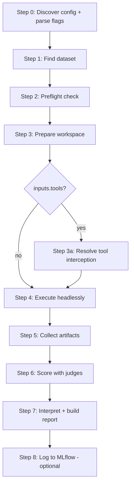

# Run an eval (/eval-run)

`/eval-run` is the execution engine of the harness. It takes an `eval.yaml` (produced
by [`/eval-analyze`](eval-analyze.md)) plus a dataset, runs the skill or prompt
headlessly against every case, scores the outputs with your [judges](../concepts/judges.md),
and writes a scored HTML report under `$AGENT_EVAL_RUNS_DIR/<eval-name>/<run-id>/`.

!!! abstract "What it produces"
    A per-run directory containing `run_result.json`, `collection.json`, `summary.yaml`,
    an `analysis.md`, and a `report.html` — plus per-case artifacts, logs, and traces.

## The pipeline

The local runner walks a fixed sequence of steps. Each step is a script the skill
orchestrates — it never duplicates their work.



| Step | Script | What happens |
| --- | --- | --- |
| 0 Discover | `discover.py` | Auto-find `eval.yaml` (or use `--config`); parse flags; read the skill/prompt, runner, judges, models |
| 1 Dataset | — | Read `dataset.path`; verify at least one case directory exists |
| 2 Preflight | `preflight.py` | Check for stale artifacts and run-id / baseline collisions |
| 3 Workspace | `workspace.py` | Build an isolated per-case (or batch) workspace with symlinked project resources |
| 3a Interception | `workspace.py` | If `inputs.tools` is set, resolve `tool_handlers.yaml` into concrete runtime checks |
| 4 Execute | `execute.py` | Invoke the agent headlessly, capture stdout/stderr, write `run_result.json` |
| 5 Collect | `collect.py` | Distribute workspace outputs into per-case dirs; detect in-place edits via git diff |
| 6 Score | `score.py` | Run judges (and pairwise, if `--baseline`); write `summary.yaml` |
| 7 Report | `report.py` | Write `analysis.md` and `report.html` |
| 8 MLflow | `/eval-mlflow` | Log params, metrics, and artifacts (only if `mlflow.experiment` is set) |

!!! tip "Usually you just run one command"
    In practice you invoke the skill and it drives all of the above:

    ```bash
    /eval-run --model opus
    ```

    The step-level scripts are worth knowing when a run fails partway and you need to
    resume from a specific stage.

## Case vs batch

`execute.py` auto-detects the execution mode from `execution.mode` in `eval.yaml` — there
is no CLI flag for it.

=== "case (default)"

    One invocation **per test case**. The harness loops over cases; each gets its own
    workspace, `stdout.log`, and subagent transcripts.

    ```yaml
    execution:
      mode: case
      skill: my-skill
      arguments: "{prompt}"      # resolved per case from input.yaml
      parallelism: 4             # optional: run cases concurrently
    ```

    - Cases run concurrently when `execution.parallelism > 1` (or `--parallelism`), via a
      thread pool. Each case gets a log prefix like `eval:case-003`.
    - `run_result.json` records `execution_mode: "case"`, a `per_case` breakdown,
      `duration_s` (sum of per-case durations), and `wall_clock_s` (actual elapsed time).

=== "batch"

    One invocation for **all cases** via `batch.yaml`. The skill/agent loops internally.

    ```yaml
    execution:
      mode: batch
      skill: my-skill
      arguments: "--input batch.yaml --headless"
    ```

    - `workspace.py` builds `batch.yaml` — one entry per case, each the full parsed input
      file — and `case_order.yaml` mapping position → case ID.
    - Collection maps output files back to cases by detected prefix or by position; set
      `outputs[].batch_pattern` (with `{n}`, 1-based) when files are named by index.

See [the execution model](../concepts/execution-model.md) for the full case-vs-batch and
skill-vs-prompt matrix.

## Flags

Parsed from `$ARGUMENTS` at Step 0. CLI flags override the corresponding `eval.yaml` keys.

| Flag | Default | Effect |
| --- | --- | --- |
| `--config <path>` | auto-discover | Path to the eval config |
| `--model <model>` | `models.skill` | Model for the skill/agent under test. **Required if `models.skill` is unset.** |
| `--subagent-model <model>` | `models.subagent` → falls back to `--model` | Model for subagents (e.g. sonnet subagents under an opus main) |
| `--skill <name>` | from config | Override the skill being tested |
| `--run-id <id>` | `YYYY-MM-DD-<model>` | Identifier for this run (names the output directory) |
| `--cases <id> [<id> …]` | all cases | Run only the listed case IDs |
| `--baseline <run-id>` | — | Add a pairwise A/B comparison against a prior run under the same eval-name |
| `--no-llm-judges` | false | Skip LLM judges (`prompt`, `prompt_file`, `llm_rubric`, LLM builtins); run only deterministic judges |
| `--gold` | false | After scoring, save collected artifacts back to the dataset cases as gold references |
| `--effort <level>` | `runner.effort` | Claude Code reasoning effort (`low`…`max`). Claude Code only — ignored by other runners |
| `--runner <type>` | `local` | `local` (default pipeline), `harbor` (containerized), or `evalhub` (platform) |
| `--env <name>` | `kubernetes` | Harbor execution environment: `podman`, `kubernetes`, `openshift` (only with `--runner harbor`) |

!!! note "`--no-llm-judges` is your fast, cheap dry run"
    It exercises the full execute → collect → score pipeline while skipping every judge
    that makes an API call. Deterministic `check` scripts, Python builtins, and external
    `module`/`function` judges still run.

## Preflight: run-id and baseline collisions

Skills write to the **project directory** (not just the workspace), so stale artifacts
from a previous run can contaminate results — wrong IDs, stale reports, inflated file
counts. Step 2 guards against this and against overwriting prior runs.

`preflight.py` inspects `tmp/` state files, checks whether
`$AGENT_EVAL_RUNS_DIR/<eval-name>/<run-id>` already has results, and (with `--baseline`)
verifies the baseline run-id exists.

| Result | Meaning | What to do |
| --- | --- | --- |
| `CLEAN` | No stale artifacts, no collision | Proceed to workspace setup |
| `DIRTY` | Stale artifacts, or the run-id already has results | Force-clean, pick a new run-id, or abort (see below) |
| `MISSING_BASELINE` (exit 2) | The `--baseline` run-id wasn't found | The script lists nearby run-ids; confirm the correct one (typo? different date/variant?) |

When a run is `DIRTY`, the three resolutions are:

=== "Force clean"

    Delete all stale artifacts, then proceed.

    ```bash
    python3 preflight.py --config eval.yaml --clean --force
    ```

=== "Change run-id"

    Keep the previous results by choosing a fresh id (e.g. a version suffix), then
    re-check. This still requires cleaning project artifacts, so re-run preflight with
    `--clean` and the new id.

    ```bash
    /eval-run --run-id 2026-04-11-opus-v2
    ```

=== "Abort"

    Stop and clean up manually.

!!! warning "A colliding run-id overwrites the previous run"
    The default run-id is `YYYY-MM-DD-<model>`, so two runs of the same model on the same
    day collide. Preflight will flag it — pick a distinct `--run-id` (a `-v2` suffix is the
    convention) whenever you want to keep both.

## Tool interception

If `eval.yaml` has `inputs.tools` entries, Step 3a is **mandatory**. `workspace.py` emits a
skeleton `tool_handlers.yaml`; you must resolve each handler's natural-language `prompt`
into concrete runtime checks (`input_filters` for Bash, `env_checks` for services,
`case_overrides` for deterministic answers) before execution. The workspace is rebuilt
fresh every run, so this happens even when `eval.yaml` is unchanged.

!!! warning "Headless runs can hang without interception"
    A skill that calls `AskUserQuestion` or hits an external API in headless mode will
    block forever unless the tool is intercepted. If a tool the skill uses isn't covered,
    the run stalls. See [tool interception](../concepts/tool-interception.md).

## Scoring: what judges see

`score.py` loads every case's collected outputs into a record dict and hands it to each
judge. The same record drives inline `check` scripts (as `outputs`), and its fields are
exposed to LLM judges as Jinja2 template variables.

| Record key / variable | Contents |
| --- | --- |
| `outputs["files"]`, `outputs["<dir>_content"]` | Collected artifact file contents (incl. `_modified/` in-place edits) |
| `outputs["conversation"]` / `{{ conversation }}` | Root-level assistant text from the event stream |
| `outputs["events"]` | Flat list of typed events (if `traces.events`) |
| `outputs["tool_calls"]` | Tool calls matching `outputs[].tool` patterns |
| `outputs["exit_code"]`, `["duration_s"]`, `["cost_usd"]`, `["num_turns"]`, `["token_usage"]` | Execution metadata (if `traces.metrics`) |
| `outputs["stdout"]`, `outputs["stderr"]` | Raw logs (if `traces.stdout`/`stderr`) |
| `outputs["annotations"]` / `{{ annotations }}` | Parsed `annotations.yaml` from the dataset case — for outcome-aware scoring |
| `{{ inputs }}`, `{{ evidence }}`, `{{ tool_trace }}`, `{{ arguments }}` | Case inputs, a verifiable-action summary, a chronological tool trace, and judge `arguments:` |

Aggregation is by value type: **boolean** judges become a `pass_rate` (fraction True),
**numeric** judges become a `mean`. Results land in `summary.yaml` under `aggregated` and
`per_case`. LLM judges can be sampled `N` times (`samples:`) — bool judges reduce by
majority vote, numeric by median. See [pairwise & sampling](../concepts/pairwise-and-sampling.md).

!!! tip "Baseline → pairwise comparison"
    `--baseline <run-id>` triggers a **position-swapped** pairwise judge on top of the
    regular judges: each case is judged both A/B and B/A, and only a consistent preference
    counts as a win. `summary.yaml` gains a `pairwise` section with `wins_a`, `wins_b`, and
    `ties`. Gate on it with a `min_win_rate` [threshold](../concepts/thresholds.md).

## Reading the results

The run directory (`$AGENT_EVAL_RUNS_DIR/<eval-name>/<run-id>/`) contains:

```text
run_result.json     # exit_code, durations, token usage, cost, per_case breakdown
collection.json     # per-case artifact counts
summary.yaml        # judges (mean/pass_rate), per_case, pairwise
analysis.md         # LLM interpretation, leading with a Recommendation
report.html         # scoring summary, per-case detail, diffs, cost/tokens
cases/<case-id>/    # per-case artifacts, logs, and traces
```

Open `report.html` first; it renders the whole run. To understand each panel, see
[reading the report](../get-started/reading-the-report.md).

## Other backends

The same `eval.yaml` runs unchanged across substrates — the backend is only ever a flag.

<div class="grid cards" markdown>

-   :material-docker: **Harbor** (`--runner harbor`)

    ---

    Containerized execution. Steps 2–6 collapse into one `run.py` call over
    self-contained task packages. Environments: Podman, Kubernetes, OpenShift.

    [:octicons-arrow-right-24: Harbor guide](harbor.md)

-   :material-server-network: **EvalHub** (`--runner evalhub`)

    ---

    Platform-triggered, in-process execution inside an EvalHub Job pod.

    [:octicons-arrow-right-24: EvalHub guide](evalhub.md)

</div>

## Where to go next

<div class="grid cards" markdown>

-   :material-account-check: **Review the results**

    ---

    Interactive human feedback that can propose config and prompt changes.

    [:octicons-arrow-right-24: /eval-review](eval-review.md)

-   :material-tune: **Optimize automatically**

    ---

    Iterate on the skill using failures as the signal.

    [:octicons-arrow-right-24: /eval-optimize](eval-optimize.md)

-   :material-database-export: **Log to MLflow**

    ---

    Sync the dataset and push run metrics, params, and artifacts.

    [:octicons-arrow-right-24: /eval-mlflow](eval-mlflow.md)

</div>
