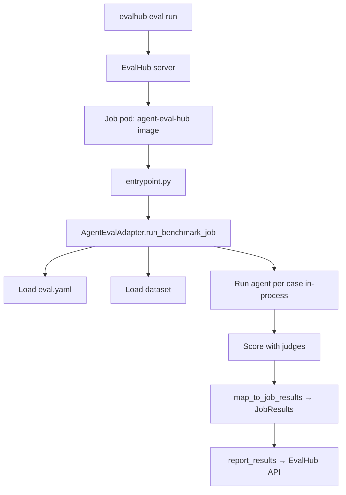

# Running on EvalHub

Run the same `eval.yaml` as a **platform-triggered** job on Red Hat OpenShift AI.
EvalHub (a TrustyAI component) creates a Job pod; the harness ships a
`FrameworkAdapter` that runs the whole evaluation **in-process** inside that pod —
no sub-pods, no Harbor.

!!! tip "Same config, different substrate"
    The execution backend is always a CLI flag (`--runner`), never a config key.
    Nothing in `eval.yaml` changes between [Local](eval-run.md),
    [Harbor](harbor.md), and EvalHub.

## The in-process model

EvalHub's architecture expects adapter pods to be **execution-only**: they don't
spawn sub-pods or call out to a container orchestrator. The
`AgentEvalAdapter.run_benchmark_job` method therefore drives the full loop itself
using the runner named by `runner.type` in `eval.yaml` (`claude-code`, `cli`,
`responses-api`) — the exact same `ClaudeCodeRunner` used locally. Concurrency
comes from `execution.parallelism`, in-process, within the one pod.



Compared with the other substrates:

| | Local | Harbor | EvalHub |
| --- | --- | --- | --- |
| Trigger | `agent-eval run` / `/eval-run` | `harbor run` / `--runner harbor` | `evalhub eval run` (platform) |
| Executes agent | in-process | one container per trial | **in-process (single Job pod)** |
| Creates sub-pods | no | yes (Harbor) | **no** |
| Parallelism | `execution.parallelism` | Harbor trials | `execution.parallelism` |

## Resource delivery priority

The adapter resolves each resource (eval.yaml, dataset, project files) from the
first source available, in this order:

| Priority | Source | How it's selected |
| --- | --- | --- |
| 1 | **ConfigMap** | Job `parameters`: `eval_configmap`, `dataset_configmap`, `project_configmap` name ConfigMaps read via the K8s API |
| 2 | **Filesystem** | `eval.yaml` baked/mounted at `/app/eval-config/eval.yaml`; dataset resolved relative to it via `dataset.path` |
| 3 | **S3** | Job `parameters`: `s3_bucket` + `s3_prefix` (EvalHub's standard dataset delivery) |

!!! note "ConfigMap key encoding"
    ConfigMaps can't hold `/` in keys, so nested paths are encoded with `--`
    (produced by `agent_eval.harbor.k8s_resources`) and restored to directories
    on the pod. This lets `--runner evalhub` ship project-specific content
    **without rebuilding the image**. Both the ConfigMap and S3 paths are guarded
    against path traversal.

### S3 dataset layout

When cases come from S3, the layout under `{s3_prefix}` is one directory per
case, each holding that case's files:

```text
s3://{s3_bucket}/{s3_prefix}/
├── case-001/
│   └── input.yaml
├── case-002/
│   ├── input.yaml
│   └── annotations.yaml
└── case-003/
    └── input.yaml
```

`download_dataset` pages through `list_objects_v2`, groups objects by case id,
and materializes them to `{dest}/{case_id}/{file}`. `boto3` is required — install
with `pip install agent-eval-harness[evalhub]`.

## Building the provider image

The provider ships as the `agent-eval-hub` image (`FROM agent-eval-harness` +
`eval-hub-sdk`). See [container images](../reference/container-images.md).

```bash
podman build --platform linux/amd64 \
  -f deploy/evalhub/Containerfile \
  -t quay.io/rhoai/agent-eval-hub:latest .
```

Push to the internal OpenShift registry (create the ImageStream first):

```bash
oc create imagestream agent-eval-hub -n <namespace>

podman tag quay.io/rhoai/agent-eval-hub:latest \
  image-registry.openshift-image-registry.svc:5000/<namespace>/agent-eval-hub:latest
podman push \
  image-registry.openshift-image-registry.svc:5000/<namespace>/agent-eval-hub:latest
```

## Registering the provider

Providers are registered via a ConfigMap in the **TrustyAI operator namespace**
(typically `redhat-ods-applications`), *not* the EvalHub CR namespace. EvalHub
discovers providers via two labels: `trustyai.opendatahub.io/evalhub-provider-type`
and `trustyai.opendatahub.io/evalhub-provider-name`.

```bash
oc apply -f - <<EOF
apiVersion: v1
kind: ConfigMap
metadata:
  name: evalhub-provider-agent-eval
  namespace: redhat-ods-applications
  labels:
    app.kubernetes.io/part-of: trustyai
    app.opendatahub.io/trustyai: "true"
    trustyai.opendatahub.io/evalhub-provider-type: system
    trustyai.opendatahub.io/evalhub-provider-name: agent-eval
    opendatahub.io/managed: "true"
data:
  provider.yaml: |
    $(cat deploy/evalhub/provider.yaml | sed 's/^/    /')
EOF
```

After applying it, add `agent-eval` to the EvalHub CR `spec.providers[]` list and
restart the EvalHub pod.

The [`provider.yaml`](https://github.com/opendatahub-io/agent-eval-harness/blob/main/deploy/evalhub/provider.yaml)
declares the `skill-eval` benchmark, its parameters (`s3_bucket`, `s3_prefix`,
`eval_config`), the reported metrics, and the K8s runtime (image, entrypoint,
resource requests/limits).

## Submitting a job

=== "Platform-native (evalhub CLI)"

    Author a job config, then submit it. `parameters` selects the resource
    delivery source (here, S3):

    ```yaml title="job-config.yaml"
    name: skill-eval-demo
    model:
      url: "vertex-ai"
      name: "claude-sonnet-4-6"
    benchmarks:
      - provider_id: "agent-eval"
        id: "skill-eval"
        parameters:
          s3_bucket: "my-eval-bucket"
          s3_prefix: "datasets/my-skill/cases/"
    experiment:
      name: "skill-eval-demo"
    ```

    ```bash
    evalhub eval run --config job-config.yaml
    ```

    The pod needs `ANTHROPIC_API_KEY` or Vertex AI credentials as environment
    variables (see [environment variables](../reference/environment-variables.md)).

=== "Client-side (/eval-run --runner evalhub)"

    From a project checkout, `/eval-run --runner evalhub` wraps the whole flow —
    it creates the ConfigMaps, submits the job, polls to completion, and maps
    results back into the harness-native `summary.yaml` + `report.html`:

    ```bash
    /eval-run --runner evalhub --model claude-sonnet-4-6
    ```

    Under the hood it invokes:

    ```bash
    python3 -m agent_eval.evalhub.runner \
        --config eval.yaml --model claude-sonnet-4-6 \
        --output $AGENT_EVAL_RUNS_DIR/<eval-name>/<run-id> \
        [--evalhub-url <url>] [--namespace <ns>] [--project-dir <path>]
    ```

    Connection defaults come from `EVALHUB_URL`, `EVALHUB_TOKEN`, and
    `AGENT_EVAL_K8S_NAMESPACE`. Requires `pip install eval-hub-sdk`. No image
    rebuild — project content ships as ConfigMaps.

## Results mapping

`map_to_job_results` turns the harness `RunResult` plus judge scores into
EvalHub's `JobResults`. Each entry is an `EvaluationResult` with a `metric_type`:

| Metric | Type | Source |
| --- | --- | --- |
| `exit_code` | `status` | aggregated run result |
| `duration_seconds` | `performance` | wall-clock of the whole job |
| `cost_usd` | `cost` | summed across cases (if available) |
| `num_turns` | `usage` | summed across cases (if available) |
| `num_examples_evaluated` | `count` | number of cases |
| *(one per judge)* | `judge_score` | judge `mean`, with `pass_rate` in metadata |

!!! warning "`overall_score` is intentionally `None`"
    The adapter does **not** synthesize a single `overall_score`. Averaging
    boolean judges (0–1) with numeric judges (0–10) would be meaningless, so the
    field is left `None` until a proper scoring model exists. Consume the
    per-judge `judge_score` metrics (and each judge's `pass_rate` metadata)
    instead. If you need one scalar — e.g. for RL — define it explicitly with the
    [reward API](../concepts/reward-api.md).

## See also

<div class="grid cards" markdown>

- [**Harbor**](harbor.md) — the containerized substrate (one container per trial)
- [**eval-run**](eval-run.md) — the local runner and `--runner` flag
- [**Container images**](../reference/container-images.md) — `agent-eval-harness` vs `agent-eval-hub`
- [**Environment variables**](../reference/environment-variables.md) — API keys, `EVALHUB_URL`, namespace
- [**Reward API**](../concepts/reward-api.md) — collapse judges into one scalar

</div>
