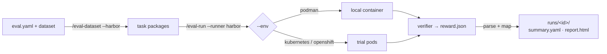

# Running on Harbor (containers)

Run the same `eval.yaml` unchanged in containers. [Harbor](https://github.com/laude-institute/harbor)
is the execution substrate (Podman locally, Kubernetes/OpenShift on a cluster) and the
agent zoo; agent-eval-harness stays the authoring + judgment layer on top. The execution
substrate is a CLI flag, never part of the eval config.

!!! abstract "What Harbor buys you"
    Sandboxed, isolated per-case containers, cluster-scale concurrency, and Harbor's stock
    agents (`claude-code`, `opencode`, `codex`, …) — while keeping your judges, thresholds,
    MLflow logging, and the same `runs/<id>/` report layout as a local run.

## How it fits together

Harbor runs **self-contained task packages**. `/eval-dataset` emits one package per case;
each carries everything Harbor needs, so no custom agent wrapper is required.



A task package looks like this:

```text
eval/harbor-tasks/case-001-.../
├── task.toml                 # runtime image ref + timeouts
├── instruction.md            # resolved skill command + input context (agent prompt)
├── tests/
│   ├── test.sh               # verifier: runs the reward bridge → reward.json
│   └── eval.yaml             # bundled judge config
└── environment/              # auto-uploaded to /workspace by Harbor
    ├── input.yaml            # case input
    ├── tool_handlers.yaml    # resolved tool interception handlers
    ├── hooks/tools.py        # interceptor script
    └── .claude/settings.json # PreToolUse hooks (Claude Code)
```

!!! note "Per-case vs suite-level judging"
    Per-case judging happens **in-container** — the reward bridge runs as the Harbor
    verifier and writes `reward.json` (boolean judges gate; numeric LLM judges average).
    Pairwise comparison and [regression thresholds](../concepts/thresholds.md) stay
    **suite-level** on top of Harbor, applied when results are mapped back.

## Quick start (orchestrated run)

`/eval-run --runner harbor` wraps the whole flow: reuse (or generate) task packages,
call `harbor run`, parse the job dir, generate the report, and check regressions.

=== "Kubernetes / OpenShift (default)"

    ```bash
    /eval-run --runner harbor --model <model> -n 10
    ```

=== "Podman (local)"

    ```bash
    /eval-run --runner harbor --env podman --model <model>
    ```

| Flag | Effect |
| --- | --- |
| `--runner harbor` | Use the Harbor execution path instead of local subprocess |
| `--env <name>` | Execution environment: `kubernetes` (default), `podman`, `openshift`, `k8s` |
| `--model <name>` | Model passed to the Harbor agent (`harbor run -m`) |
| `-n <n>` | Parallelism — concurrent trial pods/containers |

The output is the same `eval/runs/<id>/` layout as a local run (`summary.yaml`,
`report.html`, per-case artifacts), so `/eval-review` and `/eval-mlflow` work unchanged.

!!! tip "eval.yaml portability"
    `eval.yaml` describes **what** to evaluate (agent, dataset, judges, thresholds) — not
    **where** it runs. The same file works locally, on Podman, on Kubernetes, and on
    [EvalHub](evalhub.md). See [Backends](../concepts/backends.md).

## Generating task packages

Task packages are generated once from your `eval.yaml` and dataset:

```bash
/eval-dataset --harbor --image <registry>/<project>-eval:latest
```

`/eval-run --runner harbor` reuses pre-generated packages when `--tasks-dir` already
contains them, and only regenerates when you pass `--image` (one-shot convenience) or
`--regenerate`.

## Podman (local)

The Podman environment runs each trial in a single container via the `podman` CLI. Build
the base image once, then run:

```bash
# 1. Build the base image (once)
podman build -f deploy/Containerfile -t localhost/agent-eval-harness:latest .

# 2. Run — stock Harbor agent, our Podman environment
PYTHONPATH="$(pwd)" harbor run -p eval/harbor-tasks \
    --agent claude-code -m <model> \
    --environment-import-path agent_eval.harbor.podman:PodmanEnvironment \
    -n 1 -o eval/harbor-jobs
```

!!! warning "Credentials are forwarded from the host"
    The container runs on your machine (no security boundary), so provider config **and**
    API keys are copied from the host env into the container automatically —
    `ANTHROPIC_API_KEY`, `ANTHROPIC_AUTH_TOKEN`, `ANTHROPIC_BASE_URL`,
    `AWS_ACCESS_KEY_ID`, and friends. Nothing to configure. Vertex AI needs a credentials
    file, so set `AGENT_EVAL_PODMAN_GCP_CREDENTIALS_FILE=/path/to/sa-key.json` (mounted
    read-only).

Project resources (skills, scripts, `.context`, `CLAUDE.md`) can be **bind-mounted** from
a host directory instead of baked into an image:

```bash
AGENT_EVAL_PODMAN_PROJECT_DIR=. harbor run -p eval/harbor-tasks --agent claude-code ...
```

| Variable | Description |
| --- | --- |
| `AGENT_EVAL_PODMAN_PROJECT_DIR` | Bind-mount project resources (no project image needed) |
| `AGENT_EVAL_PODMAN_GCP_CREDENTIALS_FILE` | GCP service-account key (read-only mount) |
| `AGENT_EVAL_PODMAN_KEEP_RUN` | `1` keeps the container after the trial for debugging |

!!! note "PYTHONPATH"
    `PYTHONPATH` must include this repo so Harbor can import the environment plug-in —
    unnecessary if agent-eval-harness is pip-installed.

## Kubernetes / OpenShift

The Kubernetes `BaseEnvironment` runs the same task images as pods, using the **Kubernetes
Python client** (not the `oc` CLI). It calls `load_incluster_config()` when running inside
a pod (using the pod's ServiceAccount) and falls back to your local kubeconfig otherwise.
Install the extras with `/eval-setup --harbor` or `pip install agent-eval-harness[harbor]`.

```bash
PYTHONPATH="$(pwd)" harbor run -p eval/harbor-tasks \
    --agent claude-code -m <model> \
    --environment-import-path agent_eval.harbor.kubernetes:KubernetesEnvironment \
    -n 5 -o eval/harbor-jobs
```

!!! warning "restricted-v2 SCC — the image must be group-0 writable"
    Pods run non-root under the `restricted-v2` SCC with an arbitrary assigned UID. The
    task image must be **group-0 writable** or the agent can't write to its workspace.
    Also set `AGENT_EVAL_K8S_INSTALL_PACKAGES` only if you need the agent install step —
    it defaults to skipping it, assuming a **prebuilt image**.

### Credentials (from the cluster, never copied from the host)

Unlike Podman, nothing is forwarded from your host. Credentials come from the cluster:

=== "API keys / Bedrock (Secret)"

    Env vars injected via `envFrom`:

    ```python
    from agent_eval.harbor.k8s_resources import create_env_secret
    create_env_secret({"ANTHROPIC_API_KEY": "sk-..."}, "model-keys", "<ns>")
    # then: AGENT_EVAL_K8S_CREDENTIALS_SECRET=model-keys
    ```

=== "Vertex AI (Secret file)"

    Service-account key mounted as a file:

    ```python
    from agent_eval.harbor.k8s_resources import create_creds_secret
    create_creds_secret("/path/to/sa-key.json", "vertex-creds", "<ns>")
    # then: AGENT_EVAL_K8S_GCP_CREDENTIALS_SECRET=vertex-creds
    ```

=== "Vertex AI (Workload Identity)"

    No stored key — the pod runs as an SA federated to GCP (preferred):

    ```bash
    AGENT_EVAL_K8S_SERVICE_ACCOUNT=<sa>
    ```

### Project resources via ConfigMap

Deliver project resources from a **ConfigMap** rather than baking a project-specific image —
the generic base image plus a ConfigMap covers any project:

```python
from agent_eval.harbor.k8s_resources import create_project_configmap
create_project_configmap("/path/to/project", "my-project", "<ns>")
# then: AGENT_EVAL_K8S_PROJECT_CONFIGMAP=my-project
```

The mount is read-only (`defaultMode 0755` so scripts stay executable); the agent copies
what it needs into `/workspace` at runtime.

!!! tip "Large project resources"
    A ConfigMap must stay under ~1 MB. If your `.context/` is too large, build a
    project-specific image instead: `FROM <base>` + `COPY project/` (see
    [Container images](../reference/container-images.md)).

### Environment variables

| Variable | Description |
| --- | --- |
| `AGENT_EVAL_K8S_NAMESPACE` | Target namespace |
| `AGENT_EVAL_K8S_CREDENTIALS_SECRET` | Secret with API keys (injected via `envFrom`) |
| `AGENT_EVAL_K8S_GCP_CREDENTIALS_SECRET` | Secret with GCP SA key (file mount) |
| `AGENT_EVAL_K8S_SERVICE_ACCOUNT` | Pod ServiceAccount (Workload Identity) |
| `AGENT_EVAL_K8S_PROJECT_CONFIGMAP` | ConfigMap with project resources (< 1 MB) |
| `AGENT_EVAL_K8S_INSTALL_PACKAGES` | `1` to run the agent install (default: skip for prebuilt images) |
| `AGENT_EVAL_K8S_KEEP_RUN` | `1` keeps the pod after the trial for debugging |
| `AGENT_EVAL_K8S_CPU` / `AGENT_EVAL_K8S_MEMORY` | Resource requests (default: `1` / `2Gi`) |

Cluster config can also live in a `.env` file at the project root — `/eval-run --runner
harbor` loads it automatically:

```bash title=".env"
AGENT_EVAL_K8S_NAMESPACE=<namespace>
AGENT_EVAL_K8S_CREDENTIALS_SECRET=<secret-name>
```

### Cleanup

All K8s resources are labeled `app.kubernetes.io/managed-by: agent-eval-harness`:

```python
from agent_eval.harbor.k8s_resources import cleanup
cleanup("<ns>")  # deletes all ConfigMaps + Secrets created by agent-eval-harness
```

## Debugging a run

By default the environment deletes its container/pod after each trial. Keep it alive for
inspection:

=== "Podman"

    ```bash
    AGENT_EVAL_PODMAN_KEEP_RUN=1 ...
    # podman logs <name> ; podman exec -it <name> /bin/sh
    ```

=== "OpenShift"

    ```bash
    AGENT_EVAL_K8S_KEEP_RUN=1 ...
    # oc logs <pod> -n <ns> ; oc exec -it <pod> -n <ns> -- /bin/sh
    ```

The kept container/pod name is logged at the end of the run.

!!! warning "Kept resources accumulate"
    Each trial uses a unique name, so kept containers/pods pile up. Prune afterwards with
    `podman rm -f <name>` or
    `oc delete pod -l app.kubernetes.io/managed-by=agent-eval-harness -n <ns>`.

Even without keeping the container, Harbor captures the transcripts and verifier output
into the job dir before deletion:

| File | Contents |
| --- | --- |
| `agent/claude-code.txt` | Agent transcript (stream-json) |
| `agent/trajectory.json` | ATIF trajectory |
| `verifier/reward.json` | Per-case scalar reward |
| `verifier/judges.json` | Per-judge results |
| `verifier/test-stdout.txt` | Verifier stdout |

## Suite-level regression check

After mapping the Harbor job back into the run dir, `/eval-run --runner harbor` runs the
**same** regression detection as a local run — comparing per-judge means and pass rates
against your [`thresholds`](../reference/config/thresholds.md). If any threshold is
violated, the command **exits non-zero** (useful in [CI](ci.md)):

```text
REGRESSIONS: 1 detected
  [output_quality] min_mean: 3.5 -> 3.1
```

Harbor infra errors (transient pod/exec failures with no reward) and trial errors (pods
that never became Ready) are surfaced separately — infra errors are excluded from judge
means rather than scored `0`.

## Where to go next

<div class="grid cards" markdown>

-   :material-layers: **Backends & execution paths**

    ---

    How local, Harbor, and EvalHub relate — and why one `eval.yaml` covers all three.

    [:octicons-arrow-right-24: Backends](../concepts/backends.md)

-   :material-server-network: **Run on the platform**

    ---

    In-process, platform-triggered runs via the EvalHub adapter.

    [:octicons-arrow-right-24: EvalHub](evalhub.md)

-   :material-package-variant: **Container images**

    ---

    The base and provider images, and how project resources get delivered.

    [:octicons-arrow-right-24: Container images](../reference/container-images.md)

</div>
