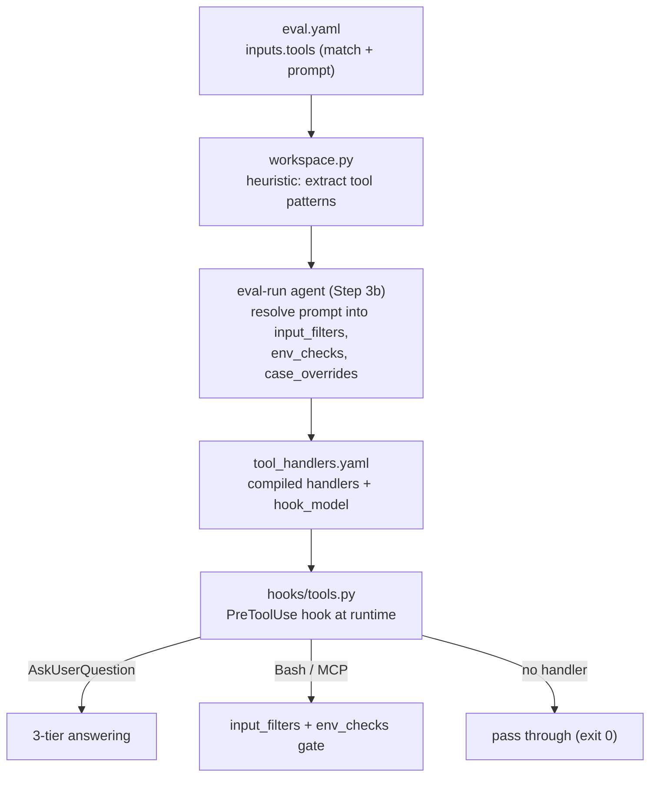
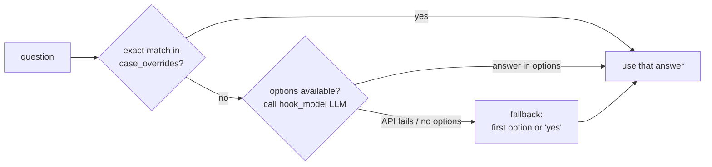

# Running headless (tool interception)

Evals run **unattended** — `/eval-run` invokes the skill or agent with no human at
the keyboard. Any skill that pauses for input (`AskUserQuestion`) or reaches out to a
real external service (Jira, Slack, an MCP server) will otherwise hang or mutate
production. `inputs.tools` handlers intercept those tool calls at runtime and either
answer them, gate them, or deny them — so the same skill that is interactive for a
human runs deterministically in CI.

!!! abstract "How it fits together"
    You author handlers in **natural language** in `eval.yaml`. `/eval-analyze` and
    `/eval-run` compile them into a `tool_handlers.yaml` and wire a Claude Code
    **PreToolUse** hook (`hooks/tools.py`) that runs before every matched tool call.

## Why interception is needed

| Without interception | Symptom |
| --- | --- |
| Skill calls `AskUserQuestion` | Run blocks forever waiting for a human |
| Skill calls a real Jira/Slack API | Test data is written to production |
| Skill uses an MCP tool | Unbounded side effects, non-reproducible runs |

Interception makes these calls **auto-answered** or **denied** according to rules you
declare once.

## Authoring `inputs.tools`

Each handler has two fields you write, both **natural language** — not regex or glob:

- `match` — *what* to intercept.
- `prompt` — *how* to handle it.

```yaml title="eval.yaml"
inputs:
  tools:
    # Auto-answer interactive questions
    - match: Questions asked to the user via AskUserQuestion.
      prompt: |
        Answer based on the test case context in input.yaml and answers.yaml.
        Use answers.yaml guidance for domain-specific decisions.
        Default: pick the first option or answer "yes" for confirmations.

    # Gate an external service (MCP tools AND scripts)
    - match: |
        Any interaction with Jira — whether via MCP tools
        or Bash scripts calling the Jira API.
      prompt: Only allow if targeting a test instance or emulator.
```

!!! note "`match` and `prompt` are compiled, not matched literally"
    At workspace-setup time the LLM agent reads your `match`/`prompt` text and compiles
    it into concrete `patterns`, `input_filters`, `env_checks`, and (optionally)
    `case_overrides` in `tool_handlers.yaml`. `hooks/tools.py` then executes those
    compiled fields deterministically at runtime — the natural-language text is not
    re-interpreted per call (except for `prompt`, which is passed to the LLM answerer
    for `AskUserQuestion`).

### From natural language to runtime checks



### `tool_handlers.yaml` fields

| Field | Set by | Used by | Purpose |
| --- | --- | --- | --- |
| `match` | `workspace.py` (from eval.yaml) | eval-run agent | NL description of what to intercept |
| `patterns` | `workspace.py` (heuristic) | `tools.py` | Tool name patterns, exact or `*` glob (e.g. `mcp__atlassian__*`) |
| `input_filters` | eval-run agent (Step 3b) | `tools.py` | Regex patterns matched against the Bash command string |
| `env_checks` | eval-run agent (Step 3b) | `tools.py` | Per-var `must_contain` substring validation |
| `prompt` | `workspace.py` (from eval.yaml) | eval-run agent, `tools.py` | NL instruction; also LLM-answerer context for `AskUserQuestion` |
| `hook_model` | `workspace.py` (from `models.hook`) | `tools.py` | Model for LLM answering (default `claude-haiku-4-5-20251001`) |
| `case_overrides` | eval-run agent (optional) | `tools.py` | Exact question→answer map, checked before the LLM tier |

## AskUserQuestion: 3-tier answering

For each question, `hooks/tools.py` resolves an answer in order and stops at the first
hit:



1. **Exact match** — look up the question text in `case_overrides`. Use this only for
   answers that must be deterministic.
2. **LLM call** — call `hook_model` with the question, its options, the handler
   `prompt`, and case context (`input.yaml` + `answers.yaml` from the case directory).
   The reply must resolve to one of the option labels (an exact or case-insensitive
   fuzzy match).
3. **Fallback** — the first option's label, or `"yes"` if there are no options.

!!! tip "Prefer `answers.yaml` over `case_overrides`"
    Ship per-case `answers.yaml` files with guidance the LLM answerer reads at
    runtime — you don't need to enumerate every question in `case_overrides`. Reserve
    `case_overrides` for the handful of questions that need a fixed, deterministic
    answer.

## Gating Bash and MCP tools

Non-question handlers **allow or deny** a tool call; there is no auto-answer.

=== "MCP tools"

    Matched by glob pattern (`mcp__atlassian__*` matches any tool whose name starts
    with `mcp__atlassian__`).

    - `env_checks` present → all vars must pass, else **deny** with a reason.
    - no `env_checks` → **deny by default** (matched but no check defined).

=== "Bash commands"

    A Bash handler matches only when **both** hold:

    1. `Bash` is in `patterns`, **and**
    2. the command string matches at least one `input_filters` regex (case-insensitive).

    So `ls -la` won't trip a Jira handler even with `Bash` in `patterns`. If matched
    and `env_checks` are present, the same env validation applies.

`env_checks` validates environment variables by required substrings:

```yaml
env_checks:
  JIRA_SERVER:
    must_contain: ["localhost", "emulator", "127.0.0.1", "test", "staging"]
```

The check passes only if `JIRA_SERVER`'s (lowercased) value contains **at least one**
listed substring — a simple guard that a destructive call targets a test instance, not
production. Tools with **no matching handler pass through** untouched (`exit 0`).

!!! danger "The misconfigured-Bash footgun"
    A handler with `Bash` in `patterns` but **no `input_filters`** would match *every*
    Bash call and send them all into the default-deny path — the skill couldn't run at
    all. To prevent this, `hooks/tools.py` treats such a handler as **misconfigured**:
    it logs a stderr warning and **skips it (pass-through)** rather than denying
    everything. Always resolve `input_filters` (eval-run Step 3b does this) before
    relying on a Bash handler.

## Permissions (allow / deny)

`inputs.tools` intercepts specific calls; `permissions` sets the coarse allow/deny
policy Claude Code enforces in headless (`--print`) mode. The two are complementary.

```yaml title="eval.yaml"
permissions:
  allow:
    - "Skill"                 # nested sub-skills silently fail without this
    - "Write(artifacts/**)"
  deny:
    - "mcp__*"                # block all MCP tools during the eval
```

!!! warning "Add `Skill` if the skill under test calls sub-skills"
    The `Skill` tool requires explicit permission in `--print` mode. If the skill's
    `allowed-tools` frontmatter lists `Skill`, add `"Skill"` to `permissions.allow` —
    otherwise nested skill calls silently fail.

Path-scoped deny rules (`Read`, `Edit`, `Grep`, `Glob`) are compiled by the harness
(`agent_eval/tools/permissions.py`) so a directory like `eval/` is denied recursively.
Key constraints:

- **Deny rules are for prompt mode** (`workspace_mode: repo`), where the agent runs in
  the real repo and must not read the answer key. Skill-based evals run in an isolated
  workspace — **omit deny rules** there.
- **Don't list `Bash`** in path denies. Claude Code Bash rules match the command
  string, not file paths, so `Bash(eval/**)` is a no-op. Recognized file commands
  (`cat`/`head`/`tail`/`sed`) are already covered by the `Read`/`Edit` deny.
- Deny rules do **not** stop arbitrary subprocess reads (e.g. `python3 -c
  "open('eval/x')"`, `awk`). For a hard boundary use OS sandboxing
  (`sandbox.filesystem.denyRead`), not `permissions.deny`.

See the [permissions reference](../reference/config/permissions.md) for the full
pattern grammar.

## PII and secrets warning

!!! danger "Case files are sent to the model API"
    The Tier-2 LLM answerer sends the handler `prompt`, the question, its options, and
    the case context — the raw contents of `input.yaml` and `answers.yaml` — to the
    `hook_model`. **Do not put secrets, credentials, or PII in `input.yaml` or
    `answers.yaml`.** Use test/emulator values and `TODO_<SYSTEM>_<FIELD>`
    placeholders, and gate real endpoints with `env_checks`.

## See also

<div class="grid cards" markdown>

- [**Tool interception concept**](../concepts/tool-interception.md) — the model behind handlers and hooks
- [**inputs.tools reference**](../reference/config/inputs-tools.md) — every field, precisely
- [**permissions reference**](../reference/config/permissions.md) — allow/deny grammar and the path compiler
- [**models reference**](../reference/config/models.md) — the `hook` role that answers questions
- [**Lifecycle hooks**](../concepts/lifecycle-hooks.md) — shell hooks around the run
- [**Running the suite**](eval-run.md) — the full `/eval-run` flow

</div>
