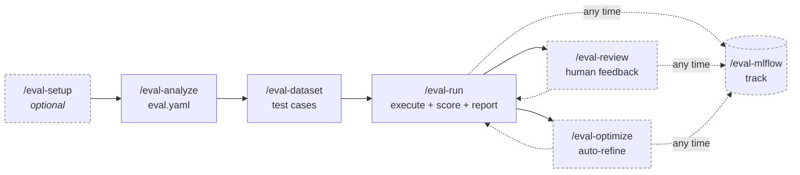

# The eval pipeline at a glance

The harness is a set of composable skills that hand off to each other in order:
**setup → analyze → dataset → run → review / optimize**, with **mlflow** available at
any point once a run exists. Each skill reads the same `eval.yaml` and writes to the
same runs directory, so you can stop, edit, and resume anywhere.

## The steps

| Order | Skill | Does | Required? |
| --- | --- | --- | --- |
| 0 | `/eval-setup` | Installs deps, configures MLflow, verifies API keys, sets the runs dir | Optional — deps auto-install via the SessionStart hook |
| 1 | [`/eval-analyze`](eval-analyze.md) | Reads a skill (or your docs) and generates `eval.yaml` + `eval.md` | Required — produces the config everything else reads |
| 2 | [`/eval-dataset`](eval-dataset.md) | Populates `dataset.path` with test cases matching your `schema` | Required — unless you already have cases |
| 3 | [`/eval-run`](eval-run.md) | Prepares workspaces, executes headlessly, collects, scores, reports | Required — the core loop |
| 4a | [`/eval-review`](eval-review.md) | Interactive human review of results; proposes config/skill changes | Optional |
| 4b | [`/eval-optimize`](eval-optimize.md) | Automated refine-and-rerun loop (composes with `/eval-run`) | Optional |
| ⟳ | [`/eval-mlflow`](eval-mlflow.md) | Sync dataset, log run results, push/pull trace feedback | Optional — any time **after** a run |
| ✓ | [`/eval-check`](eval-check.md) | Whole-harness health check (overlap between skills, hooks, CLAUDE.md) | Optional |

!!! note "`/eval-setup` is genuinely optional"
    Dependencies live in an isolated venv that the plugin's SessionStart hook creates
    automatically, and `agent_eval` is exposed to scripts via symlinks. Reach for
    `/eval-setup` when you want to configure MLflow tracking, point at a remote server,
    troubleshoot a `ModuleNotFoundError`, or change the runs directory.

## The flow



The dashed loops back to `/eval-run` are the improvement cycle: review or optimize a run,
change the skill or config, then re-run to measure the delta (often against the prior run
with `--baseline <run-id>`).

## Skills auto-invoke and compose

The skills are not just a checklist — they call each other through the `Skill` tool when a
prerequisite is missing:

- **`/eval-run` bootstraps `/eval-analyze`.** If no `eval.yaml` is found during config
  discovery, `/eval-run` detects what's available (skills in `skills/`, or docs for prompt
  mode) and invokes `/eval-analyze` for you before continuing.
- **`/eval-run` chains into `/eval-mlflow`.** When `mlflow.experiment` is set in
  `eval.yaml`, `/eval-run` logs the run automatically as its final step.
- **`/eval-optimize` drives `/eval-run`.** The optimization loop composes with `/eval-run`
  via the `Skill` tool on each iteration.
- **`/eval-run` prompts for `/eval-dataset`.** If `dataset.path` has no cases, it stops and
  suggests generating them.

!!! tip "The backend is a flag, not a step"
    Local, [Harbor](harbor.md) (containers), and [EvalHub](evalhub.md) are selected with
    `/eval-run --runner <local|harbor|evalhub>` — the *same* `eval.yaml` runs unchanged on
    all three. The execution substrate never lives in the config.

## Where results land

Each run writes to `$AGENT_EVAL_RUNS_DIR/<eval-name>/<run-id>/`, where:

- `AGENT_EVAL_RUNS_DIR` defaults to `eval/runs` (configure it via `/eval-setup` or the
  [environment variable](../reference/environment-variables.md)).
- `<eval-name>` comes from the config, so runs for different suites never collide.
- `<run-id>` defaults to `YYYY-MM-DD-<model>` (override with `--run-id`; append a suffix
  like `-v2` to keep a previous run's results).

```text
$AGENT_EVAL_RUNS_DIR/
└── <eval-name>/
    └── <run-id>/
        ├── run_result.json     # exit_code, duration_s, token usage, cost_usd
        ├── stdout.log          # full skill stdout (stream-json)
        ├── stderr.log
        ├── collection.json     # per-case artifact counts
        ├── summary.yaml        # judges, per_case, and pairwise sections
        ├── analysis.md         # interpreted results (Recommendation first)
        ├── report.html         # the scored HTML report
        ├── hooks/              # lifecycle hook logs (if hooks: configured)
        └── cases/
            └── <case-id>/
                ├── stdout.log      # per-case log (case mode)
                ├── artifacts/      # files matching outputs[].path
                └── _modified/      # in-place file edits (auto-detected via git diff)
```

!!! warning "Clean artifacts between runs"
    Skills write to the *project* directory, not the workspace, so stale artifacts can
    contaminate results. `/eval-run` runs a preflight check and reports `DIRTY` when it
    finds leftovers or an existing `<run-id>` — clean them or pick a new run-id before
    proceeding.

See the [runs directory reference](../reference/runs-directory.md) for the full artifact
layout and [`summary.yaml`](../concepts/report.md) fields.

## Where to go next

<div class="grid cards" markdown>

-   :material-play-circle: **Run it end to end**

    ---

    Walk the skill-mode pipeline from analyze to report on a real skill.

    [:octicons-arrow-right-24: Your first eval](../get-started/first-eval.md)

-   :material-cog: **Understand each step**

    ---

    Deep dives on the individual skills and what they configure.

    [:octicons-arrow-right-24: eval-analyze](eval-analyze.md) ·
    [eval-dataset](eval-dataset.md) ·
    [eval-run](eval-run.md)

-   :material-file-tree: **Read the config**

    ---

    Every key that these skills read from and write to `eval.yaml`.

    [:octicons-arrow-right-24: eval.yaml reference](../reference/eval-yaml.md)

-   :material-tune: **Improve a skill**

    ---

    Feed a run into human review or the automated optimization loop.

    [:octicons-arrow-right-24: eval-review](eval-review.md) ·
    [eval-optimize](eval-optimize.md)

</div>
