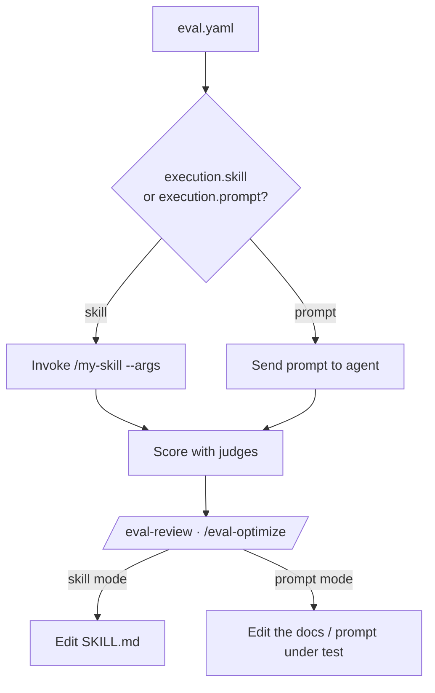

# Skill mode vs prompt mode

The harness has two flavors that share one config surface. **Skill mode** tests a
predefined skill (`/my-skill --args`); **prompt mode** tests an agent capability
directly by sending a prompt with no skill wrapper. You pick one by setting either
`execution.skill` or `execution.prompt` — never both.

!!! abstract "The one distinction"
    `execution.skill` invokes a `SKILL.md` implementation. `execution.prompt` sends a
    raw prompt to the agent. Everything downstream — dataset, judges, thresholds,
    tool interception, reward — is identical. This is orthogonal to
    [`execution.mode`](../concepts/execution-model.md) (`case` vs `batch`), which
    only controls *how many* invocations run.

## Which one do I want?

| You want to evaluate… | Use | Because |
| --- | --- | --- |
| A skill's correctness, quality, cost | **skill mode** (`execution.skill`) | The skill under test *is* the artifact you iterate on |
| Whether agents can navigate/apply your docs | **prompt mode** (`execution.prompt`) | The docs (not a skill) are the artifact under test |
| An agent capability (code gen, API usage, reasoning) | **prompt mode** | No skill wrapper exists — you probe the model directly |
| A guardrail / constraint your `CLAUDE.md` documents | **prompt mode** | You test whether the agent respects documented rules |

## The two configs, side by side

Both minimal configs below differ in exactly one key.

=== "Skill mode"

    ```yaml title="eval.yaml"
    name: my-skill-eval

    execution:
      mode: case
      skill: my-skill          # the artifact under test
      arguments: "{prompt}"    # resolved per case from input.yaml

    dataset:
      path: eval/dataset/cases
      schema: "Each case has an input.yaml with a 'prompt' field."

    judges:
      - name: output_quality
        prompt: "Score the output 1-5 for completeness and accuracy."
    ```

=== "Prompt mode"

    ```yaml title="eval.yaml"
    name: docs-navigation-eval

    execution:
      mode: case
      prompt: "{{ input.prompt }}"   # sent directly to the agent

    runner:
      workspace_mode: repo           # navigate the real repository

    dataset:
      path: eval/dataset/cases
      schema: "Each case has an input.yaml with a 'prompt' field."

    judges:
      - name: used_docs
        builtin: consulted_docs
    ```

!!! warning "Mutually exclusive — enforced at load time"
    Setting both `execution.skill` and `execution.prompt` raises a `ValueError` when
    the config is parsed, not mid-run:

    ```text
    execution.skill and execution.prompt are mutually exclusive.
    ```

    A top-level `skill:` is still accepted but **deprecated** — it is auto-normalized
    into `execution.skill` with a warning. Author new configs with `execution.skill`.

## What differs downstream

Almost nothing. The two flavors share the same `dataset`, `judges`, `thresholds`,
`inputs.tools`, `outputs`, `traces`, and `reward` blocks. The differences are:

| Aspect | Skill mode | Prompt mode |
| --- | --- | --- |
| `execution.*` key | `skill` (+ `arguments`) | `prompt` |
| Analyze with | `/eval-analyze --skill my-skill` | `/eval-analyze --prompt <analysis.md>` |
| Default dataset provenance | `generation.strategy: skill` (agent authors from skill analysis) | often `synthetic` (LLM generates from seeds) |
| Run name derives from | the skill name | `name` / config path |
| **Artifact you iterate on** | the skill's `SKILL.md` | the docs / prompt under test |
| `is_prompt_mode()` returns | `False` | `True` |

!!! note "How the harness decides"
    The runner resolves the target through `EvalConfig.resolve_skill()` — which
    prefers `execution.skill`, falls back to the deprecated top-level `skill`, and
    returns `None` for prompt mode. `EvalConfig.is_prompt_mode()` is `True` only when
    `execution.prompt` is set. All execution substrates (local, Harbor, EvalHub) go
    through this method, so an `execution.skill`-only config runs the skill rather
    than silently degrading to prompt mode.

## The review/optimize target is the key difference

The scoring pipeline is identical, but what you *change* in response to the scores is
not. That target flows straight into
[`/eval-review`](eval-review.md) and [`/eval-optimize`](eval-optimize.md).



- **Skill mode:** low scores point at the skill implementation. Review and optimize
  edit the skill's `SKILL.md` (and its scripts/sub-skills).
- **Prompt mode:** low scores point at the *documentation or prompt* the agent
  consulted. Review and optimize edit the docs under test — the model itself is fixed,
  so you improve what the agent reads.

## Workflow shortcuts

=== "Skill mode"

    ```bash
    /eval-setup
    /eval-analyze --skill my-skill      # reads SKILL.md, writes eval.yaml
    /eval-dataset
    /eval-run --model opus
    /eval-review --run-id <id>          # feedback → edit SKILL.md
    /eval-optimize --model opus
    ```

=== "Prompt mode"

    ```bash
    /eval-setup
    /eval-analyze --prompt examples/openshift-agentic-docs.md
    /eval-dataset                       # synthetic cases from seeds
    /eval-run --model sonnet
    /eval-review --run-id <id>          # feedback → edit the docs under test
    ```

## Where to go next

<div class="grid cards" markdown>

-   :material-cog: **The execution model**

    ---

    How `mode` (case/batch) composes with skill/prompt, in depth.

    [:octicons-arrow-right-24: Execution model](../concepts/execution-model.md)

-   :material-file-document: **Agentic-docs eval**

    ---

    The flagship prompt-mode flavor: test whether agents can use your docs.

    [:octicons-arrow-right-24: Agentic docs](../get-started/agentic-docs.md)

-   :material-book-open-variant: **Config reference**

    ---

    Every `execution.*` key, with defaults and validation rules.

    [:octicons-arrow-right-24: execution](../reference/config/execution.md) ·
    [eval.yaml](../reference/eval-yaml.md)

</div>
