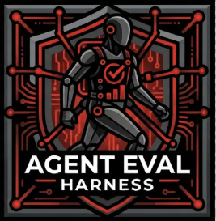

---
hide:
  - navigation
  - toc
---

<div class="aeh-hero" markdown>

<p class="aeh-hero-logo">

</p>

# Make agent performance measurable — and improvable

Evaluate skills and agent capabilities with one declarative
`eval.yaml`: analyze, generate cases, run, judge, compare, trace in MLflow,
then optimize. Same config on your laptop, Harbor containers, or EvalHub.

<p class="aeh-cta" markdown>
[Get started :material-arrow-right:](get-started/index.md){ .md-button .md-button--primary }
[eval.yaml reference :material-arrow-right:](reference/eval-yaml.md){ .md-button }
</p>

<p class="aeh-badges" markdown>


</p>

<p class="aeh-made-at">
  <span class="aeh-made-at__label">Made at</span>
  <span class="aeh-made-at__logos">
    
    <span class="aeh-made-at__name">Red Hat</span>
  </span>
</p>

</div>

---

## How the loop works

<div class="loop-diagram"></div>

<div class="grid cards" markdown>

-   **[1 · Analyze](guides/eval-analyze.md)**

    ---

    Point `/eval-analyze` at a skill or a prompt brief. The harness writes
    `eval.yaml` with judges, schema, and thresholds.

-   **[2 · Dataset](guides/eval-dataset.md)**

    ---

    `/eval-dataset` fills cases from your schema — or bring your own
    `cases/` tree with gold references.

-   **[3 · Run & judge](guides/eval-run.md)**

    ---

    `/eval-run` executes on Claude Code (or another runner), scores with
    LLM + code judges, and emits a rich HTML report.

-   **[4 · Review](guides/eval-review.md)**

    ---

    Optional `/eval-review` captures human feedback on scored cases before
    you change the skill or config.

-   **[5 · Trace](guides/eval-mlflow.md)**

    ---

    Optional `/eval-mlflow` syncs metrics, artifacts, and hierarchical
    GenAI traces for every case.

-   **[6 · Optimize](guides/eval-optimize.md)**

    ---

    `/eval-optimize` proposes skill fixes from failures and re-runs so
    you keep only real gains.

-   **[↻ · Compare](guides/eval-compare.md)**

    ---

    Close the loop with evidence: `/eval-compare` lines runs up side by
    side, and [`/eval-anova`](guides/eval-anova.md) tells you whether a
    model or config difference is statistically real before you keep it.

</div>

[See the full pipeline guide :material-arrow-right:](guides/pipeline.md)

---

## What you get

<div class="grid cards" markdown>

-   :material-file-cog: **Skill or prompt mode**

    ---

    Test a packaged skill (`execution.skill`) or agent capability directly
    (`execution.prompt`) — including agentic documentation checks.

    [:octicons-arrow-right-24: Execution model](concepts/execution-model.md)

-   :material-gavel: **LLM + code judges**

    ---

    Built-in judges, inline Python checks, rubrics, pairwise A/B, and
    N-sample stability — all in one config. LLM judges reason before they
    rule, read graded material fenced as untrusted (prompt-injection
    mitigation), and calibrate on few-shot anchors harvested from your
    `/eval-review` labels.

    [:octicons-arrow-right-24: Judges & scoring](concepts/judges.md)

-   :material-sigma: **Is the difference real?**

    ---

    `/eval-compare` puts runs side by side; `/eval-anova` sweeps a model ×
    config matrix and answers statistically — per-term Wald tests with
    Holm/Benjamini–Hochberg correction, post-hoc level contrasts, per-judge
    screening, and a cost/quality Pareto frontier.

    [:octicons-arrow-right-24: Analysis of variance](concepts/anova.md)

-   :material-server-network: **One config, three backends**

    ---

    Local subprocess, Harbor (Podman / OpenShift), or EvalHub — backend is
    a CLI flag, never baked into `eval.yaml`.

    [:octicons-arrow-right-24: Execution backends](concepts/backends.md)

-   :material-robot-happy: **Any agent runtime**

    ---

    Claude Code out of the box; bring OpenCode or a custom CLI / Responses
    API runner when you need it.

    [:octicons-arrow-right-24: Runners](concepts/runners.md)

-   :material-cloud-outline: **Any model provider**

    ---

    Claude on Anthropic or Vertex by default; open-weights models through
    OpenRouter on the agent and judge roles with `openrouter:/<author>/<slug>`;
    OpenAI-compatible judges.

    [:octicons-arrow-right-24: Model providers](concepts/providers.md)

-   :material-trophy: **Reward API for RL**

    ---

    Collapse judges into a `[0, 1]` reward for GRPO-style training via
    Harbor / NeMo Gym / SkyRL.

    [:octicons-arrow-right-24: Reward API](concepts/reward-api.md)

-   :material-chart-timeline: **MLflow-native**

    ---

    Experiments, datasets, hierarchical traces, and feedback sync — opt in
    with one `mlflow:` block.

    [:octicons-arrow-right-24: Tracing](concepts/tracing.md)

</div>

---

## Choose your path

| Path | Use it when | Start |
|---|---|---|
| **Claude Code plugin** | You want slash commands in an existing project | `claude plugin install agent-eval-harness@opendatahub-skills` |
| **Local clone** | You are hacking on the harness itself | `git clone https://github.com/opendatahub-io/agent-eval-harness` |
| **Harbor / OpenShift** | You need containerized, reproducible trials | [Running on Harbor](guides/harbor.md) |

```bash
claude plugin install agent-eval-harness@opendatahub-skills
/eval-setup
/eval-analyze --skill my-skill
/eval-dataset
/eval-run --model opus
```

---

## Explore the docs

<div class="grid cards" markdown>

-   :material-school: **Get Started**

    ---

    Install and run your first evaluation end to end.

    [:octicons-arrow-right-24: Get Started](get-started/index.md)

-   :material-book-open-variant: **Guides**

    ---

    Task-oriented how-tos for every skill and backend.

    [:octicons-arrow-right-24: Guides](guides/index.md)

-   :material-lightbulb-on: **Concepts**

    ---

    Execution model, judges, rewards, and tracing.

    [:octicons-arrow-right-24: Concepts](concepts/index.md)

-   :material-chef-hat: **Cookbook**

    ---

    Worked configs for common evaluation scenarios.

    [:octicons-arrow-right-24: Cookbook](cookbook/index.md)

-   :material-file-document: **Reference**

    ---

    eval.yaml schema, CLI, config fields, and glossary.

    [:octicons-arrow-right-24: Reference](reference/index.md)

</div>
