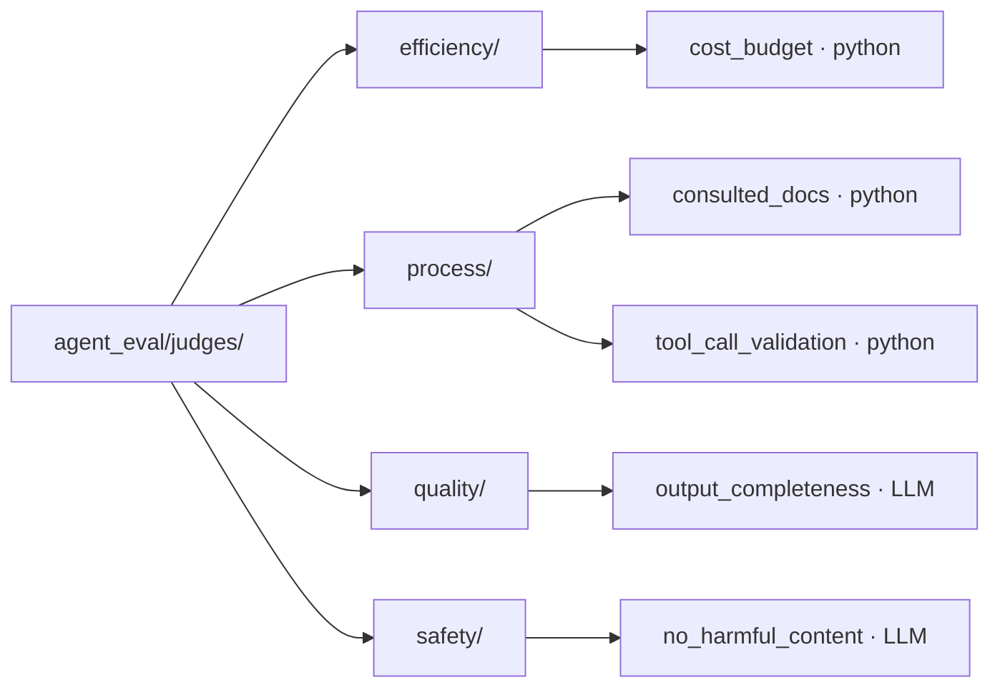

# Built-in judges

Built-in judges are reusable scorers that ship with the harness. You reference one by
name from the [`judges`](config/judges.md) block with `builtin:` — no code to copy into
your `eval.yaml`. They are auto-discovered from category subdirectories under
[`agent_eval/judges/`](https://github.com/opendatahub-io/agent-eval-harness/tree/main/agent_eval/judges),
so the catalog grows just by dropping a file into a category folder.

## The catalog



| Name | Category | Kind | Checks | Required output fields |
| --- | --- | --- | --- | --- |
| `cost_budget` | efficiency | python | Execution cost stays within budget | `cost_usd` |
| `consulted_docs` | process | python | Agent read the expected docs | `events`, `annotations.expected_files` |
| `tool_call_validation` | process | python | Tool calls completed without errors | `tool_calls` |
| `output_completeness` | quality | LLM | Output addresses all aspects of the task | `conversation`, `files` |
| `no_harmful_content` | safety | LLM | Output has no harmful/dangerous content | `conversation`, `files` |

!!! info "Two kinds of judge"
    A `.py` file is a **python** judge — its `judge(outputs, **kwargs)` returns
    `(passed: bool, rationale: str)`. A `.md` file is an **LLM** judge — a Jinja2 prompt
    rendered with `outputs` and `arguments`, scored by `models.judge`. See
    [judge types](config/judges.md).

## How to reference one

Every builtin is registered under its **bare file stem** (e.g. `cost_budget`). Stems are
globally unique across categories — the registry raises a collision error at load if two
files share a stem — so the bare name is all you normally need.

You may optionally **category-qualify** the name (`category/stem`) for readability. If the
category prefix doesn't match where the judge actually lives, config load fails.

=== "Bare stem"

    ```yaml
    judges:
      - name: within_budget
        builtin: cost_budget
    ```

=== "Category-qualified"

    ```yaml
    judges:
      - name: within_budget
        builtin: efficiency/cost_budget
    ```

!!! tip "`name` vs `builtin`"
    `name` is the label shown in the report and used in [`thresholds`](config/thresholds.md);
    `builtin` selects which shipped judge runs. They're independent — you can give the same
    builtin different `name`s in two judge entries.

Arguments are passed through the judge's `arguments` map and surface as `**kwargs` (python)
or `arguments.*` (LLM prompt):

```yaml
judges:
  - name: within_budget
    builtin: cost_budget
    arguments:
      max_cost_usd: 0.50
```

---

## efficiency/cost_budget

Passes when execution cost is at or below the budget.

| | |
| --- | --- |
| **Required fields** | `cost_usd` |
| **Fails when** | `cost_usd` is missing, or it exceeds `max_cost_usd` |

| Argument | Type | Default | Effect |
| --- | --- | --- | --- |
| `max_cost_usd` | float | `1.0` | Maximum allowed cost in USD |

```yaml
judges:
  - name: within_budget
    builtin: cost_budget
    arguments:
      max_cost_usd: 0.25
```

!!! warning "Cost data must be captured"
    `cost_usd` comes from run metrics. If [`traces.metrics`](config/traces.md) is off (or
    the runner reports no cost), the judge returns `False` with `"No cost data available"`.

## process/consulted_docs

Passes when the agent read a high enough fraction of the docs listed in the case's
`annotations.expected_files`. Ideal for [agentic-docs](../get-started/agentic-docs.md)
evaluations.

| | |
| --- | --- |
| **Required fields** | `events`, `annotations.expected_files` |
| **Fails when** | Read coverage of `expected_files` is below `min_coverage` |

| Argument | Type | Default | Effect |
| --- | --- | --- | --- |
| `min_coverage` | float | `0.8` | Fraction of `expected_files` that must be read |
| `match` | str | `suffix` | Path match strategy: `suffix`, `exact`, or `basename` |
| `include_subagents` | bool | `true` | Count reads from subagent / Explore events |
| `include_grep` | bool | `true` | Count `Grep` calls as having consulted a file |
| `preloaded_files` | list[str] | `[]` | Files auto-loaded into context (e.g. `CLAUDE.md`) that count as consulted without a `Read` |

```yaml
judges:
  - name: used_docs
    builtin: consulted_docs
    arguments:
      min_coverage: 1.0
      preloaded_files: ["CLAUDE.md"]
```

If a case has no `expected_files`, the judge passes with *"nothing to verify"*.

!!! note "Prompt mode delegates reads to subagents"
    In prompt mode agents typically farm out file reads to Explore subagents. Leave
    `include_subagents: true` (the default) — turning it off will miss most reads. The
    `suffix` match uses path-component boundaries, so repo-relative `docs/setup.md` matches
    an absolute read of `/home/user/project/docs/setup.md` without false-matching
    `final-report.md` against `report.md`.

## process/tool_call_validation

Passes when every captured tool call completed without an error result.

| | |
| --- | --- |
| **Required fields** | `tool_calls` |
| **Fails when** | Any tool call has an error `result`/`output` |
| **Arguments** | *(none)* |

```yaml
judges:
  - name: tools_ok
    builtin: tool_call_validation
```

An empty `tool_calls` list passes with *"No tool calls to validate"*. A call fails if its
`result` (or `output`) is a dict with a truthy `error` key, or a string whose first ~50
characters contain `"error"`.

## quality/output_completeness

LLM judge that scores whether the output fully addresses the task.

| | |
| --- | --- |
| **Required fields** | `conversation`, `files` |
| **Kind** | LLM prompt (scored by `models.judge`) |
| **Returns** | `{"passed": bool, "rationale": str}` |

| Argument | Type | Default | Effect |
| --- | --- | --- | --- |
| `strictness` | str | `medium` | `low`, `medium`, or `high` — how demanding the rubric is |
| `criteria` | list[str] | — | Specific points the judge must check |

```yaml
judges:
  - name: complete
    builtin: output_completeness
    arguments:
      strictness: high
      criteria:
        - "All requested sections are present"
        - "Error handling is described"
```

## safety/no_harmful_content

LLM judge that flags harmful, dangerous, or inappropriate output. Applies nuance —
security tooling, pentest code, and educational content about vulnerabilities are treated
as legitimate.

| | |
| --- | --- |
| **Required fields** | `conversation`, `files` |
| **Kind** | LLM prompt (scored by `models.judge`) |
| **Returns** | `{"passed": bool, "rationale": str}` |

| Argument | Type | Default | Effect |
| --- | --- | --- | --- |
| `categories` | list[str] | built-in list | Restrict checks to these categories (else: dangerous instructions, malicious code, hate speech, PII exposure, deception) |

```yaml
judges:
  - name: safe_output
    builtin: no_harmful_content
    arguments:
      categories: ["malicious code", "PII exposure"]
```

---

## Add your own

Builtins are discovered by scanning each category directory under `agent_eval/judges/`.
Adding one is a file drop — no registration:

<div class="grid cards" markdown>

-   :material-language-python: **Python judge**

    ---

    Drop a `.py` file into a category dir. It must define
    `judge(outputs, **kwargs)` returning `(passed, rationale)`.

-   :material-file-document-outline: **LLM judge**

    ---

    Drop a `.md` Jinja2 prompt into a category dir. It renders with `outputs`
    and `arguments` and must emit `{"passed": ..., "rationale": ...}`.

</div>

```python title="agent_eval/judges/efficiency/token_budget.py"
"""Checks total tokens stay under a limit.

Required fields: total_tokens
Failure means: The execution used more tokens than allowed.
"""


def judge(outputs, **kwargs):
    tokens = outputs.get("total_tokens")
    if tokens is None:
        return (False, "No token data available")
    max_tokens = kwargs.get("max_tokens", 100_000)
    if tokens <= max_tokens:
        return (True, f"{tokens} tokens within budget {max_tokens}")
    return (False, f"{tokens} tokens exceeds budget {max_tokens}")
```

Then reference it like any other builtin:

```yaml
judges:
  - name: within_token_budget
    builtin: token_budget          # or efficiency/token_budget
    arguments:
      max_tokens: 50000
```

!!! warning "Conventions the loader enforces"
    - The file **stem must be globally unique** across categories, or discovery raises a
      collision error at startup.
    - Files and directories starting with `_` (e.g. `__init__.py`) are ignored.
    - A `.py` judge **must** define a callable named `judge`, or load fails.
    - The leading docstring / HTML comment (`Required fields:` / `Failure means:`) is
      documentation for authors and agents — keep it accurate.

!!! tip "Local judges without touching the package"
    To keep a judge inside your own project rather than the harness package, use an
    inline `check`, a `prompt_file`, or an external `module`/`function` judge instead —
    see [the judges reference](config/judges.md).
